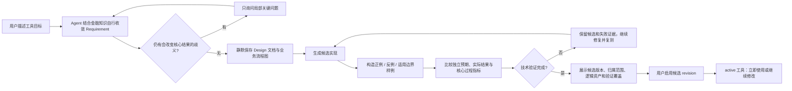

# Fin Agent 自定义工具开发上下文

> 更新时间：2026-09-06
> 作用：切换上下文时的最小交接说明。本文只覆盖“自定义工具开发流程与工具运行效率”，不接管主框架、Skill 体系或回测体系。

## 1. 方向定位

Fin Agent 当前分为四个相对独立的开发方向：

1. **主框架**：DSH-opt/Codex 串联、理解问答、上下文、前后端交互和全局运行稳定性；CC 只保留显式回滚路径。
2. **自定义工具**：工具的 Requirement → Design → Coding → Test → Activate 流程，以及工具调用、批量数据获取和运行效率。**本文负责这一方向。**
3. **Skill 体系**：Skill 的制定、优化、测试、发布和管理。
4. **回测体系**：回测运行、历史仿真、回测数据和回测工具。

边界原则：自定义工具可以消费主框架能力、由 Skill 提供业务方法，也可以声明回测兼容性，但不应把主框架路由、Skill 管理或回测引擎重新实现到工具模块中。

## 2. 核心目标

让用户能够用自然语言稳定完成下面的闭环：

`提出工具需求 → Agent 自行收敛 → 静默保存逻辑与流程 → 生成实现并自行验证 → 查看当前资产与证据 → 确认启用 → 在问答中调用或继续修改`

这个方向的核心不是增加更多协议，而是同时保证：

- **便利性**：用户只描述业务目标，不需要理解并发、分片、数据源调用等内部实现。
- **稳定性**：候选版本、所有权、输入输出契约、测试门禁和启用动作明确可控。
- **清晰性**：用户默认只看当前有效逻辑、实现结果和验证范围；完整 Design、流程、修订和证据仍作为资产保留并可按需展开。
- **效率**：个股、基金等 subject 默认使用列表输入；同一数据主题尽量只批量查询一次，再在内存中逐标的计算。
- **可追踪**：系统保存设计、反馈、修订、测试证据和运行诊断；业务结果不混入调试噪音。

## 3. 必须遵守的设计原则

### SOFT → HARD → SOFT

- 自然语言负责理解需求、反馈和业务语义。
- HARD 协议只保存跨阶段必需的事实：工具身份、所有者、修订号、输入输出 Schema、生命周期和测试证据。
- 最终展示由场景化 UI/自然语言负责，不为展示方便扩张底层协议。

### 系统与模型的职责

- 系统保存完整 Design、用户反馈、修订历史和权限事实；不要要求模型重复输出。
- 模型只输出本轮新增的设计或实现贡献。
- 只有解析失败、关键结构错误、权限/归属、版本冲突、执行安全和确定性主线错误才应硬拒绝。
- 不为假想风险增加状态、validator、错误码或新的协议层。

### 工具数据与执行约定

- 工具入口保持 JSON 可序列化的 `run(inputs)`。
- 金融数据通过运行时提供的 `custom_tool_sdk.finance_query` 获取。
- 多标的需求默认使用 list；单个标的只是长度为 1 的 list，不让用户选择“单个还是批量”。
- 对完整目标列表按数据主题查询一次，然后索引结果并用简单循环/纯函数完成逐标的计算。
- 调试日志走独立通道；正式工具输出只保留业务结果。
- 候选修订必须按明确 revision 测试，不能误跑当前 active revision。

## 4. 当前主流程

### 创建

- 用户通过 `/custom_tool create` 或自然语言进入工具开发。
- 默认由 DSH-opt 负责 Requirement、Design、flow、资产查看和已有工具运行；flow 通过既有 Schema 保存后，父进程直接把权威资产交给 Codex 实现与验证。DSH 子进程不拥有源码写入能力。
- Requirement 阶段由 Agent 结合用户上下文、金融知识和常用可说明默认值主动收敛。只有不同理解会改变核心用途或计算结果、且没有可靠默认时，才产生局部问题；问题为空时不渲染确认卡。
- Design 与流程图继续生成、版本化保存并作为 Coding 的权威资产，但不再作为用户必须确认的中间关卡。默认首屏不平铺全文，最终工具卡可查看业务主流程和完整逻辑依据。
- 清晰需求在同一轮连续执行 `requirement → design → flow → implementation → verification`。只有用户明确要求“只做设计”或属于禁止执行的 action 工具时才停在设计资产。
- Coding 生成不可变候选修订，并自行构造最小充分样例执行验证；验证证据保留独立预期、预期依据、实际结果和 `key_process_info`。
- 候选修订通过技术执行和输出契约后，用户才能确认启用。



这张图是当前生产主线的说明资产，不是新增状态机。Requirement、Design、flow、实现 revision、测试证据、owner/visibility 分别继续由现有资产和系统事实承载。

### 修改

- `/custom_tool edit <tool_name> <要求>` 修改当前用户拥有的工具。
- 局部、明确的实现修改可走较短路径；契约变化或较大的策略变化仍回到 Design-first。
- 修改只产生候选修订，用户确认前不能替换 active revision。

### 调用与提交

- `/custom_tool commit` 或确认按钮启用已通过测试的候选版本。
- 普通启用不改变可见性；公开发布需要独立权限和动作。
- 工具调用要执行所有者/可见性检查，并返回结构化业务结果和独立诊断。

## 5. 当前实现入口

| 层次 | 主要入口 | 职责 |
|---|---|---|
| 流程编排 | `src/services/custom_tool_service.py` / `CustomToolAgentService` | 创建、编辑、自行收敛、Design/Coding/Test、确认动作 |
| DSH-opt 控制器 | `src/scenarios/custom_tool/dsh_service.py` / `dsh_loop_policy.mjs` | 会话、分阶段 Skill 注入、预算、终止边界和旁路指标 |
| DSH MCP 桥 | `src/scenarios/custom_tool/dsh_mcp_server.py` | 复用现有系统工具；只暴露读/存资产、运行和交互，不暴露 Coding |
| 运行时 | `CustomToolRuntimeService` | 加载 bundle、运行 `run(inputs)`、金融查询桥接和诊断 |
| 精确修订测试 | `CustomToolRuntimeService.run_revision` | 按不可变 revision 测试候选版本 |
| 持久化 | `src/services/database_custom_tool_store_service.py` | 工具身份、修订、激活和所有权 |
| 设计协议 | `src/services/custom_tool_design_protocol_service.py` | Design 修订和反馈衔接 |
| 上下文 bundle | `src/services/custom_tool_context_bundle_service.py` | 向 Design/Coding 提供固定的运行契约与参考资产 |
| Agent 工具 | `src/services/finance_cc_system_tools.py` | Provider 中立的工具开发动作；历史类名保留兼容，DSH 与 CC 共用同一 Schema/handler |
| 流式入口 | `POST /api/custom_tool/stream/start` | 启动工具开发流 |
| 交互测试 API | `POST /api/custom-tools/<tool_name>/test` | 所有者范围内测试指定修订，不启用工具 |
| Coding 展示 | `frontend/src/components/renderers/ToolIdentityArtifact.tsx` | 展示工具身份、归属范围、当前逻辑与流程、实现概览和测试入口 |
| 验证证据展示 | `frontend/src/components/BlockRenderer.tsx` | 展示样例的独立预期依据、预期/实际对照和核心过程指标 |
| 测试台 | `frontend/src/components/renderers/CustomToolTestWorkbench.tsx` | Schema 表单、JSON 输入、过程、结果和诊断 |

存储事实以数据库动态资产为准：稳定工具身份与生命周期、不可变实现修订、自动测试证据分开保存。生命周期保持简单的 `draft → active`；业务结果是否符合用户意图主要通过测试结果让用户判断，不扩张系统业务 validator。

## 6. 已完成的关键能力

- 创建、编辑、自动形成设计资产、生成候选修订、测试、启用和调用的主流程已经存在。
- 自定义工具默认使用 DSH-opt + Codex：DSH 负责语义编排和设计资产，Codex 负责实现、编辑规划、测试规划与验证；`CUSTOM_TOOL_ORCHESTRATOR=cc` 只作为显式回滚开关。
- 候选修订和 active revision 分离，编辑不会未经确认覆盖线上版本。
- 已实现 Schema 驱动的交互测试台：
  - 自动生成列表、日期、数字、枚举、布尔等标准输入控件；
  - 支持生成样例、浏览器本地草稿和原始 JSON；
  - 开放式 JSON Schema 仍可测试；
  - 固定候选 revision，测试不会启用或修改工具；
  - 展示输入校验、运行、业务结果、输出 Schema 四层状态；
  - 展示中间事件、耗时、金融查询次数、桥接轮次、后端和运行 ID；
  - 本地草稿保存失败不会把真实测试误报为失败。
- 交互测试 API 会检查 owner、输入 Schema 和输出 Schema，并对返回诊断脱敏。

### 2026-09-06 主线交互调整

- DSH-opt 总提示与 Requirement Skill 均采用主动自我收敛：技术实现细节、单/批量形式、数据接口和展示偏好不再变成阻断问题。
- 空问题的 `request_user_interaction` 会被系统抑制；存在真正核心歧义时，仍保留局部选择与自然语言回答，提交后自动继续实现。
- Requirement 无问题时由系统把当前修订标记为已解决，复用既有修订事实，不新增业务状态；Design 和 flow 可在同一回合保存。
- Design Renderer 的确认动作在新 DSH-opt 主线中关闭；设计正文和流程图仍保留在候选工具资产，不因减少交互而丢失。
- 候选工具卡明确显示“候选版本”、版本号和“仅本人可见/公开可见”；业务流程与完整逻辑依据可稳定查看。
- Coding Skill 现在要求按场景构造最小充分样例，通常覆盖正例、反例和适用的边界/数据不足场景；不能用实际输出反填预期。
- 系统保留并展示多条 Coding 样例的 `expected_basis / expected / actual / key_process_info`，同时单独做正式运行包装器兼容性验证。
- 验证文案明确为“技术验证完成”或具体覆盖范围；功能样例不被表述为策略具有投资收益。

本轮聚焦回归：自定义工具、DSH/CC 兼容、候选修订、编辑、历史回放、Surface 与数据库 Store 相关后端测试 260 passed；入口/上下文协议相关回归另有 43 passed；前端全量 111 passed，TypeScript/Vite 构建通过。这里是协议和隔离运行验证，不替代真实金融 API 的全链路拟真测试。

### 2026-09-06 DSH-opt + Codex 切换

- 应用默认 `CUSTOM_TOOL_ORCHESTRATOR=dsh_opt`；本地运行配置已关闭 CC 工具开发并启用 2 个隔离 DSH worker。
- 自然语言进入自定义工具前先经过独立的轻量 DSH intent router；一旦判定为工具生命周期，本轮直接绕过旧的普通 LLM 上下文/意图预处理。路由器同样使用 DashScope DS V4 Flash，单次真实分类样本为 354 token。
- 新建自定义工具会话的标题直接使用确定性摘要，不再为了标题额外调用普通 LLM Client。
- 自定义工具 DSH 端点对 DashScope fail-closed，只读取 `DASHSCOPE_API_KEY`；DeepSeek 官方 `LLM_ENDPOINT/LLM_KEY` 不再是该链路的兜底。当前本地 `LLM_BASE_URL` 和 `DASHSCOPE_BASE_URL` 均指向阿里云 MaaS。
- `FINANCE_CC_SHADOW_ENABLED=0`、`FINANCE_CC_TOOL_DEVELOPMENT_ENABLED=0`；Claude/CC 仅保留代码级显式回滚兼容，不会收到当前自定义工具流量。
- DSH 使用独立 `sdk-minimal` profile，Shell、编辑器、开放网络均关闭；MCP 只暴露 6 个受控工具。`implement_dynamic_tool` 不进入子进程，避免复制 Codex、Store 和权限上下文。
- 每个阶段直接注入现有 Requirement/Design/Flowchart Skill 全文，并记录 system、policy、Skill 的 SHA-256；阶段预算和 `businessHint` 可单独配置、评测和回滚，不改变资产协议。
- 同轮重复的同类资产只合并最后一份模型贡献；真实交互和 flow 保存使用 DSH 原生 terminal boundary。provider 在资产保存后的异常只进入诊断，不丢弃已验证资产。
- 清晰样本“60 日 MA5/MA20 金叉”：23.5 秒，3 次模型调用，3 类资产、0 个问题，provider token 7,477、cache read 9,472，并正确发出 Codex 交接信号。
- 切换至 DashScope 后再次真实执行同类样本：42.0 秒，Requirement/Design/Flow 三资产完整、0 追问、正确交接 Codex；本次为 5 次模型调用、provider total 37,703（含 cache read 26,624），作为后续 MaaS 延迟与缓存优化的新基线。
- 核心歧义样本“绝对收益或相对沪深300超额收益”：34.6 秒，只保存 1 份 Requirement、只产生 1 个问题/交互，不进入 Design/Codex；provider token 5,832、cache read 37,504。此前 `high` 配置失败样本的 provider token 为 18,409，改为阶段化 `low/off` 后下降约 68%。
- 详细审计、设计图、替换矩阵和测试记录见 `docs/development_tasks/custom_tool_dsh_opt_migration_20260906.md`。

历史（2026-08-19）测试台实现验收记录：后端相关回归 46 passed，前端聚焦测试 11 passed，TypeScript、生产构建和 `git diff --check` 通过；桌面与 390×844 移动端页面无控制台错误。它仅保留作历史基线，当前结果以上面的 2026-09-06 回归为准。

## 7. 尚未完成与下一步优先级

### P0：真实批量效率基线

- 选择一个不依赖分钟 K 的简单工具。
- 使用上证 50/100 或某个板块的数百只成分股作为 list 输入。
- 记录总耗时、金融查询次数、每个数据主题的查询次数、返回行数、桥接轮次、计算耗时和结果规模。
- 验证“一个数据主题一次批量查询”确实发生，而不是在隐藏层退化为逐标的 N 次查询。

### P0：历史行情数据量与索引诊断

- 历史行情慢不能只看最终返回条数；可能返回几万行，也可能扫描/排序远多于返回行数。
- 先记录真实 SQL、时间范围、标的数、返回行数和耗时。
- 使用 `EXPLAIN ANALYZE` 检查扫描、排序、窗口函数和索引命中后，再决定是否增加或调整索引。
- 在没有真实执行计划证据前，不直接提交索引迁移。

### P1：把交互测试升级为可复用回归资产

- 当前测试台适合单次验收；手工输入只保存在浏览器本地。
- 后续可增加“保存为回归用例”、预期断言、批量重跑和修订间结果对比。
- 自动 Coding 测试已有持久化证据，但手工测试台尚未形成服务端可复用测试套件。

### P1：完成后的“运行—纠正—沉淀”交互

- 候选完成后默认先呈现当前逻辑、自动验证范围和可编辑测试输入，用户无需回看 Requirement/Design 历史。
- 最终启用仍保留一次明确动作，因为它改变 active revision；启用后提供“立即使用”，不再增加语义确认。
- 下一步应让用户从某个实际值直接发起“解释/这里不对”，把反馈绑定到精确工具修订和运行，并可保存为回归样例。
- 需要统一自然语言调用与测试台对同一候选 revision 的执行、运行记录和结果引用；这属于后续执行交互建设，不能只靠文案模拟。

### P1：长任务的实时反馈

- 当前测试台在执行结束后统一返回过程事件。
- 如果批量工具耗时明显，应复用现有流式框架提供实时过程，而不是另建状态机。

### P2：分钟 K 专项回归

- 分钟 K 的并行/数据获取实现曾调整，但不应和本轮简单批量基线混测。
- 先把非分钟 K 的批量路径量化，再单独测试分钟 K 的并发、数据覆盖和超时行为。

## 8. 下一上下文建议从这里开始

1. 先读本文和 `AGENTS.md`，保持四个开发方向的边界。
2. 检查工作区状态，不覆盖其他并行改动。
3. 阅读：
   - `src/services/custom_tool_service.py`
   - `src/services/database_custom_tool_store_service.py`
   - `src/services/custom_tool_context_bundle_service.py`
   - `src/web/flask_app.py` 中 custom tool 路由
   - `frontend/src/components/renderers/CustomToolTestWorkbench.tsx`
4. 先复跑聚焦回归，再做 P0 的非分钟 K 批量实测。
5. 性能结论必须区分：代码设计、测试替身、真实 API/数据库运行；阻塞的数据库验证不能表述为端到端成功。

常用聚焦验证：

```bash
PYTHONPATH=. pytest -q \
  tests/test_custom_tool_service.py \
  tests/test_custom_tool_candidate_revision_store.py \
  tests/test_custom_tool_test_workbench_api.py

cd frontend
npm test -- --run \
  src/apiCustomToolTest.test.ts \
  src/components/renderers/ToolIdentityArtifact.test.tsx
npm run typecheck
npm run build
```

## 9. 明确不要做的事

- 不把自定义工具方向扩张成主框架重构、Skill 管理或回测引擎开发。
- 不把线程池、并发、分片等运行细节暴露为用户必填业务字段。
- 不要求模型重复系统已保存的 Design、反馈和修订事实。
- 不因单个 Case 失败堆叠关键词、状态、校验器或提示词补丁。
- 不在未校验 owner、revision 和 active/candidate 关系时执行或启用工具。
- 不在没有真实 SQL 执行计划时臆测历史行情索引问题。
