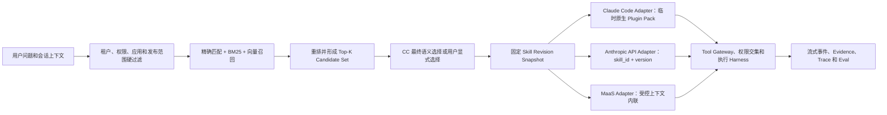

# Fin Agent 集中式 Skill Registry、检索与 CC 运行时物化方案

> 状态：Proposed
>
> 日期：2026-08-18
>
> 适用范围：集中式、多租户 Fin Agent 后台中的 Skill 发现、检索、加载、缓存和 Provider 适配。
>
> 上位设计：[Fin Agent Skill System V2](./skill_system_v2_architecture.md)

## 0. 结论先行

Claude Code 并不是统一依靠 `grep`、`find` 或向量 RAG 选择上下文、Tool 和 Skill。它采用的是多种机制的组合：

- `CLAUDE.md` 和 Rules 由目录层级确定性发现，并根据作用域加载；
- 工作区文件由 `Glob`、`Grep`、`Read` 等工具检索；
- Skill 先由文件系统或插件发现，再把 `name + description + when_to_use` 暴露给模型，由模型进行语义选择，完整正文只在调用后加载；
- Tool Search 可使用 Regex 或 BM25 搜索 Tool catalog，并按需把完整 Tool definition 加入上下文；
- Claude Code 默认 Memory 仍然以文件为载体，不是内置向量 RAG。

因此 Fin Agent 不应把大量 Skill 目录部署到每台 Agent Server，再依赖 Claude Code 或 shell 每轮扫描。推荐采用：

> **DB revision 保存 Skill 的权威语义，集中式索引缩小候选，Claude 进行最终语义选择，Provider Adapter 将固定 revision 编译为对应运行格式。**

其中：

- `skill_markdown` 仍是 Skill revision 内的业务语义主体；
- 数据库 revision 是线上权威，不以服务器上的 `SKILL.md` 文件为权威；
- `SKILL.md` 和目录结构保留为 CC-compatible 的导入导出及运行时 ABI；
- 文件物化只发生在少量已选 Skill 上，并通过 revision hash 缓存；
- Skill catalog 检索不依赖递归目录扫描；
- `Grep` 继续服务于代码、数据和被选 Skill 的按需参考资料，不承担全局 Skill 路由。

## 1. Claude Code 当前的发现与选择机制

### 1.1 上下文不是统一通过 Grep 获取

Claude Code 的上下文来源具有不同生命周期：

| 对象 | 发现方式 | 进入上下文的时机 | 主要选择者 |
|---|---|---|---|
| 根级 `CLAUDE.md` | 沿工作目录及父目录发现 | 会话启动 | 系统确定性加载 |
| 子目录 Rules / Memory | 路径作用域或文件访问触发 | 进入相关目录或按需读取 | 系统作用域 + Agent |
| 工作区文件 | `Glob`、`Grep`、`Read`，必要时 Bash | Agent 认为任务需要时 | Agent |
| Skill metadata | Skill 目录、插件或设置来源 | Skill listing 构建时 | 系统发现 |
| Skill body | 已发现 Skill 的正文 | Skill 被调用后 | Agent 语义选择或用户显式调用 |
| Tool definition | 直接加载或 Tool Search 延迟加载 | Tool 候选被发现后 | Tool Search + Agent |

`Glob/Grep/Read` 是工作文件检索能力，不是所有上下文的统一路由器。允许 Bash 时，Agent 也可能调用 `find`、`rg` 等系统命令，但这属于任务执行策略，而不是 Claude Code 的 Skill catalog 协议。

### 1.2 Skill 选择主要依靠 metadata 和模型语义

Claude Code Skill 的原生流程是：

1. 从用户目录、项目目录、附加目录或插件中发现 Skill；
2. 构建包含 Skill 名称和描述的 listing；
3. 模型根据用户问题与 `description / when_to_use` 判断是否调用；
4. 调用后加载完整 Skill body；
5. Skill 引用的 supporting files 再按需读取。

这是一种 progressive disclosure，但不是“对所有 Skill 正文执行 RAG”。官方文档还说明：Skill listing 有上下文预算，Skill 很多时描述可能被截断或降为 name-only，因此不能把一个无限增长的集中式 Skill 库直接暴露给单个 CC 会话。

### 1.3 Tool Search 接近信息检索，但不等于 Skill RAG

Anthropic Tool Search 当前提供两种服务器端检索：

- Regex：Claude 构造 Python `re.search()` pattern；
- BM25：Claude 构造自然语言查询。

搜索范围包括 Tool name、description、argument name 和 argument description，结果通常只加载少量 Tool definitions。

它解决的是 Tool definition 占用上下文和 Tool 选择准确率问题，不是 Skill 知识检索。并且即使 Tool 设置了 `defer_loading`，完整 definition 仍需随 API request 提交给 Anthropic 服务端。因此，它不能直接替代 Fin Agent 的多租户权限过滤、集中目录、跨 Provider 检索和发布管理。

Anthropic 允许实现 embedding-based custom Tool Search，但 Skill 检索仍应由 Fin Agent 自己控制，因为 Skill 的权限、版本、owner、运行时和评测状态都是本系统事实。

### 1.4 Claude 原生 Skills API 不能作为唯一 Registry

Anthropic Messages API 已支持 Custom Skills CRUD、版本和 container 运行。它可以作为 Anthropic Provider 的一个部署目标，但不适合作为 Fin Agent 的权威来源：

- API Skills、Claude Code Skills 和 claude.ai Skills 不会自动跨 surface 同步；
- Custom Skill 绑定 Anthropic workspace，不能直接服务 DashScope、DeepSeek 等 Provider；
- API request 同时可指定的 Skill 数量有限；
- 使用情况和业务审计仍需应用自己记录；
- Claude Code Agent SDK 的原生 Skill 仍使用文件或插件发现机制。

因此 Provider 平台只保存部署副本，Fin Agent Skill Registry 保存权威 revision 和 Provider 映射。

## 2. 对集中式后台约束的判断

### 2.1 应当消除的文件系统行为

- 每个请求递归扫描完整 Skill 根目录；
- 通过目录名推导租户、权限、发布状态或当前版本；
- 每台 Server 保存独立的 mutable Skill 副本；
- 用 `grep` 代替结构化 catalog、授权过滤和版本寻址；
- 修改 canonical 文件后让长会话隐式切换 Skill 版本；
- 将文件更新时间当作发布或缓存失效协议。

### 2.2 不应消除的能力

- `skill_markdown` 作为模型友好、可审阅的自然语言主体；
- 标准 `SKILL.md` 的导入导出兼容；
- Claude Code 原生 Skill 的自动触发和按需正文加载；
- `Grep/Read` 对代码、数据和 supporting resources 的任务内检索；
- revision 的文本 diff、人工审核和离线归档。

核心问题不是 Markdown，而是把 Markdown 目录当成分布式线上数据库。文件格式可以保留，文件系统权威必须取消。

## 3. 目标架构



架构分为五个清晰职责：

1. **Skill Registry**：身份、owner、revision、发布指针、权限、资源和 Provider 映射；
2. **Skill Retrieval**：在已授权范围内形成少量候选；
3. **Skill Resolver**：固定 revision，返回与存储介质无关的逻辑 Skill；
4. **Runtime Adapter**：转换为 CC Plugin、Anthropic Skill 或 MaaS inline context；
5. **Execution Harness**：执行 Tool 权限、会话、流式事件、Evidence 和审计。

## 4. Skill Registry 的最小 HARD 协议

本方案不新增业务细节字段树。Skill 的专业方法仍保存在完整自然语言主体中，系统只持有跨模块必须稳定消费的事实。

### 4.1 逻辑 Skill

```text
Skill
├── skill_id
├── owner_id / tenant_id
├── name
├── visibility
├── active_revision_no
└── created_at / updated_at
```

### 4.2 不可变 revision

```text
SkillRevision
├── revision_no
├── description
├── when_to_use
├── skill_markdown
├── control_manifest
├── resource_manifest
├── content_hash
├── authoring_evidence
└── created_by / created_at
```

职责边界：

- `skill_markdown`：SOFT，保存专业方法、步骤、判断逻辑、边界和质量要求；
- `description / when_to_use`：SOFT 语义，但为了稳定索引和 CC listing 保持少量顶层字段；
- `control_manifest`：HARD，只保存 Tool capability、运行依赖和必要的 provider compatibility；
- `resource_manifest`：HARD，只保存资源 ID、类型、hash 和用途说明，不依赖目录路径寻址；
- `content_hash`：HARD，用于不可变发布、缓存、物化和审计；
- 当前发布 revision 由系统指针持有，模型不重复输出。

生命周期只复用 V2 已经需要的 candidate、tested evidence、active revision 和 retirement 语义，不为检索过程新增大量状态枚举。

## 5. Skill 检索与选择

### 5.1 检索边界

检索系统只负责发现 candidate，不负责：

- 授予 Tool 权限；
- 修改当前发布版本；
- 把低置信度候选强制解释为已选择 Skill；
- 根据 Skill 正文绕过 owner、tenant 或 application scope；
- 把检索分数写成业务结论。

权限过滤必须发生在召回之前。未授权 Skill 不进入 lexical index 结果、vector result、rerank prompt 或 trace 明文。

### 5.2 推荐检索流水线

#### 第一级：确定性命中

以下输入优先于语义检索：

- 用户显式选择的 `skill_id / name`；
- 当前会话已经 pin 的 Skill revision；
- Application 配置的 mandatory / base Skill；
- 当前任务从已保存资产继续执行时携带的 Skill reference。

#### 第二级：HARD 过滤

按 tenant、owner、visibility、application、active revision、运行时兼容性和可用 Tool capability 过滤。

#### 第三级：混合召回

对以下文本建立索引：

```text
name + description + when_to_use + representative positive queries
```

同时运行：

- 名称、别名和关键词精确匹配；
- BM25 lexical retrieval；
- embedding semantic retrieval。

不建议直接对完整 `skill_markdown` 做主路由 embedding。正文包含大量执行细节，容易让相同工具、相同金融名词的 Skill 互相误召回。完整正文可以作为 rerank 的受限补充，但 routing profile 应保持短、明确、贴近用户表达。

#### 第四级：语义重排

对合并后的少量候选，根据当前问题、必要会话上下文和 candidate routing profile 重排，输出：

- candidate Skill ID 和 revision；
- 相关理由；
- 触发证据；
- 冲突或歧义说明；
- 检索分数仅用于系统观察。

#### 第五级：CC 最终选择

默认将 Top 3-8 的紧凑 `name + description + when_to_use` 交给 CC：

- 用户明确选择时直接使用；
- 高置信度且无竞争者时可直接物化；
- 多个相近候选时由 CC 基于完整任务语义选零个、一个或少量并列 Skill；
- 真正影响业务目标的歧义才询问用户；
- 没有合适 Skill 时继续普通问答，不强制匹配。

这保留了 CC 擅长的语义判断，同时避免让全部 Skill listing 占用主上下文。

## 6. Provider Runtime Adapter

### 6.1 Claude Code Agent SDK

Claude Code 仍要求原生 Skill entrypoint，因此 Adapter 根据已选 revision 编译最小 runtime pack：

```text
runtime-pack/{pack_hash}/
├── .claude-plugin/plugin.json
└── skills/
    ├── selected-skill-a/SKILL.md
    └── selected-skill-b/SKILL.md
```

约束：

- runtime pack 只包含当前 Application 基础 Skill 和本次候选集；
- pack 由 revision hash 生成且只读；
- 相同 pack hash 在 worker 内复用；
- 优先使用 tmpfs 或受控临时目录；
- 物化不改变 DB revision；
- Server 不对全局 Skill 库执行递归搜索；
- `setting_sources` 保持收敛，避免意外加载 Server 用户目录中的 Skill；
- Tool 权限仍由 Agent SDK query options、permission callback 和 Tool Gateway 控制。

长会话不应每轮替换 plugin pack。会话启动时 pin 基础 pack 和 revision；中途需要新 Skill 时，可以：

1. 通过 Registry fallback Tool 找到候选；
2. 在隔离的 worker / sub-session 中运行新 Skill；或
3. 在明确需要时重建会话，并携带受控的会话摘要与新 pack。

不要因为一次检索结果变化，就让运行中的会话隐式切换 Skill revision。

### 6.2 Anthropic Messages API

发布编译器可把 active revision 同步到 Anthropic Custom Skills，并保存：

```text
provider = anthropic
provider_skill_id
provider_version
source_content_hash
sync_status / sync_evidence
```

运行时固定具体 provider version，生产环境不默认使用 `latest`。Anthropic 副本只是部署产物；删除、失败或跨 surface 不一致都不影响 Fin Registry 中的权威 revision。

### 6.3 DashScope、DeepSeek 和其他 MaaS

如果 Provider 不支持原生 Skill：

- 将已选 Skill 的正文放入受控的 Skill context block；
- 显式标记 Skill ID 和 revision，供 trace 使用；
- output schema、Tool policy 和用户问题分通道传递；
- 不把 Skill 文本拼成 Tool 权限；
- supporting resources 通过统一 Resource Resolver 按需提供；
- Harness 统一输出流式事件和 Evidence。

Provider 差异停留在 Adapter，不修改 Skill 的业务语义，也不伪造为完全相同的原生行为。

## 7. 内存化与缓存

“内存化”不等于把全部 Skill 正文放进单台 Server RAM，更不等于让内存副本成为权威。推荐分层：

| 层级 | 保存内容 | 一致性要求 |
|---|---|---|
| PostgreSQL | Skill、不可变 revision、active pointer、owner、权限、发布证据 | 权威 |
| Object Storage | reference、script、template、example 等较大资源 | 按 hash 不可变 |
| Search Index | routing profile 的 BM25 / vector index | 可重建 |
| Redis | catalog metadata、检索结果、revision descriptor、pack manifest | 可失效 |
| Process LRU | 热门 descriptor、正文、权限过滤结果 | 短 TTL、非权威 |
| tmpfs Runtime Pack | 当前 worker 使用的已编译 CC Skill | 按 pack hash 只读 |
| Session Snapshot | 当前会话 pin 的 Skill ID、revision、pack hash | 会话内稳定 |

发布流程以 outbox/event 驱动索引和缓存更新。索引暂时滞后时，显式 Skill ID 仍应从权威 DB 读取；语义检索可短暂看不到新版本，但不得读到越权或未发布版本。

缓存 key 至少包含：

```text
tenant_scope + skill_id + revision_no + content_hash + runtime_target
```

权限结果不能只按 `skill_id` 缓存，避免不同 owner 或 tenant 之间复用授权判断。

## 8. Tool Search 与 Skill Search 的关系

两个检索层必须分开：

```text
用户问题
  ↓
Skill Search：选择专业方法
  ↓
Skill Revision：声明候选能力和分析步骤
  ↓
Tool Search：在权限交集内选择本步骤的真实数据/动作工具
  ↓
Tool Execution：确定性调用、Evidence 与审计
```

Skill Search 的目标是“应该采用哪套专业方法”；Tool Search 的目标是“当前步骤需要调用哪个可执行能力”。不能因为两者都能使用 BM25 或 embedding，就合并为一个 catalog 或一个分数。

推荐 Tool Search 先经过系统硬过滤：

```text
Agent available tools
∩ Application tool policy
∩ User entitlement
∩ Skill requested capabilities
∩ Current environment availability
```

过滤后的 Tool definitions 数量较少时直接提供；数量仍大时，再使用 Claude Tool Search 或 Fin Agent 自己的 BM25 / embedding Tool Search。

## 9. 安全、权限和可观察性

### 9.1 Skill 是受审查的指令资产，不是权限主体

Skill 可以建议使用 Web Search、行情、财务或自定义 Tool，但不能自行授权。实际权限由系统交集、Agent SDK 回调和 Tool Gateway 执行。

发布前至少检查：

- 隐藏行为、绕过系统要求或覆盖权限的指令；
- 任意脚本和网络访问；
- 硬编码 secret；
- 越界路径和不受控动态命令；
- 未声明 MCP / Tool dependency；
- 与现有 Skill 的触发冲突。

### 9.2 Trace 与业务结果分离

独立 trace 记录：

- 权限过滤前后的 candidate 数量，但不泄露未授权名称；
- lexical / vector / rerank 命中的 Skill ID；
- 最终选中的 revision；
- runtime target、pack hash 或 provider version；
- Tool 权限交集和拒绝原因；
- 检索、物化、首次输出和完整运行耗时；
- token、缓存命中和失败阶段。

正式业务回答不携带内部评分、原始 prompt 或未选择 Skill 的敏感 catalog 信息。

## 10. 与当前代码的衔接

本方案不要求建立第二套 SkillRunner，而是在现有 V2 主线上调整权威方向和增加适配边界。

### 10.1 `CapabilitySearchService`

当前 `src/services/capability_search_service.py` 已有 capability embedding 和 rerank 基础，但 Skill catalog 路径主动关闭。后续应改为读取 owner / tenant 授权后的 active Skill registry，并使用精确匹配、BM25 和向量的混合召回。

不要恢复对磁盘目录的全量扫描，也不要把所有 Skill 正文直接塞入 rerank prompt。

### 10.2 `RuntimeArtifactService` 与 Skill Hub

当前通用 runtime artifact 已能承载 artifact、revision 和关系。目标权威方向应为：

```text
DB immutable revision
  → publish pointer
  → search index
  → provider deployment / runtime pack
```

而不是：

```text
mutable filesystem
  → 扫描
  → 同步 DB
```

现有 V2 candidate revision 可以继续复用，无需为检索单独增加一套资产表。

### 10.3 `SkillRunner` 与 `SkillResolver`

Legacy `SkillRunner` 目前按路径读取文件。迁移期可在其前面增加存储无关的 `SkillResolver`：

```text
resolve(skill_id, revision_no, owner_context)
  → ResolvedSkill
```

`ResolvedSkill` 提供正文、manifest、resources 和 content hash。Finance CC 主线消费同一 resolver，Legacy 路径只作为兼容 adapter，不继续扩展其文件协议。

### 10.4 Claude Provider 与 Finance Session

现有 Claude Provider 已具备原生 Skill 与非 Anthropic Provider 内联的分流基础；Finance CC 也已通过本地 plugin 加载业务 Skill。它们应演化为正式 Runtime Adapter 和 Runtime Pack Compiler，而不是在调用处继续拼接路径条件。

长会话 fingerprint 应包含 active revision / pack hash，使发布后的新会话稳定使用新版本，旧会话仍可追溯原 revision。

## 11. 实施顺序

### Phase 1：统一 Resolver，不改变现有运行效果

- 定义内部 `ResolvedSkill`；
- candidate、active revision 和现有文件 Skill 通过 adapter 返回同一对象；
- trace 增加 Skill ID、revision 和 content hash；
- 不启用自动 Skill 检索。

### Phase 2：DB 成为发布权威

- 发布先创建不可变 DB revision 并原子切换 active pointer；
- 从 revision 编译现有 CC plugin snapshot；
- 运行时不再扫描完整 Skill 根目录；
- 支持标准 `SKILL.md` bundle 的导入和导出。

### Phase 3：集中式混合检索

- 建立 routing profile 索引；
- 权限前置过滤；
- 精确匹配 + BM25 + vector recall + rerank；
- 只向 CC 提供 Top-K listing；
- 无匹配时稳定回到普通问答。

### Phase 4：Provider 部署适配

- Claude Code Runtime Pack；
- Anthropic Custom Skills version mapping；
- DashScope / DeepSeek inline adapter；
- 对不同 Provider 做同 revision 的行为对比评测。

### Phase 5：性能和长期会话优化

- Redis / process LRU；
- content-addressed tmpfs pack；
- session pin 与中途 Skill fallback；
- 检索、物化、Tool Search 和首 token 延迟监控。

## 12. 最小验收标准

### 功能

- 显式 Skill 可按 ID 和固定 revision 执行；
- 自然语言问题只暴露少量授权 candidate；
- 无匹配时不强制调用 Skill；
- Claude Code 使用原生 Skill，MaaS 使用同 revision 的 adapter；
- supporting resources 可按 ID 加载，不依赖 canonical 目录路径；
- Skill 发布不会让进行中的会话隐式漂移。

### 性能

- 每次请求不递归扫描全局 Skill 目录；
- runtime pack 按 hash 复用；
- catalog 增长不会线性增加 CC 主上下文中的 Skill listing；
- 可分别观测检索、物化和 Agent 首 token 延迟。

### 安全

- tenant / owner 过滤发生在召回和 rerank 之前；
- Skill 正文不能扩大 Tool 权限；
- 未发布 revision 不进入生产检索；
- resource、pack 和 provider deployment 可通过 content hash 追溯；
- trace 不泄露未授权 Skill metadata 或 secret。

### 评测

每个 Skill 至少具备：

- 应触发问题；
- 不应触发问题；
- 与相近 Skill 冲突的 hard negative；
- 明确指定 Skill 的测试；
- 无 Skill 的对照测试；
- 不同 Provider 的 instruction-following 对比；
- Tool 越权、资源缺失和版本回滚测试。

核心指标包括 Recall@K、最终选择准确率、误触发率、无 Skill 正确率、Tool 越权阻止率、首 token 延迟和上下文 token 成本。

## 13. 最终架构原则

1. **Skill 是专业方法，不是 RAG 文档，也不是 Tool。**
2. **DB revision 是线上权威，`skill_markdown` 是 revision 内的语义主体。**
3. **文件目录是 CC 运行 ABI 和导入导出格式，不是集中式管理方式。**
4. **检索负责缩小候选，CC 负责最终语义判断。**
5. **权限在检索前过滤，在 Tool Gateway 强制执行。**
6. **Provider 差异由 Adapter 承担，不污染 Skill 业务语义。**
7. **缓存和索引可以丢失并重建，发布 revision 和运行证据必须可追溯。**
8. **保留任务内 `Grep/Read`，消除全局 Skill catalog 的运行时目录扫描。**

## 14. 主要参考资料

- [Claude Code：Extend Claude with skills](https://code.claude.com/docs/en/skills)
- [Claude Code：Manage Claude's memory](https://code.claude.com/docs/en/memory)
- [Claude Agent SDK：Tool search](https://code.claude.com/docs/en/agent-sdk/tool-search)
- [Claude API：Tool search tool](https://platform.claude.com/docs/en/agents-and-tools/tool-use/tool-search-tool)
- [Claude API：Using Agent Skills with the API](https://platform.claude.com/docs/en/build-with-claude/skills-guide)
- [Claude API：Skills for enterprise](https://platform.claude.com/docs/en/agents-and-tools/agent-skills/enterprise)
