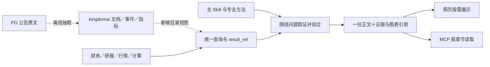

# 公告结构化与研究链路优化设计

后续细化：[公告分类、ignore 与补正文方案](classification_and_extraction_plan.md)、[86 个源类型研究对照](type_mapping_review.md)、[共用逻辑表草案](logical_tables.md)。

**2026-10-02 后续进展：**经用户明确授权，已在 `kingdomai` 创建四张 `notice_*` 表并写入 13 类、每类 5 份，共 65 份人工式试验样本。之后已实现独立 Python + LLM 流程，完成多轮抽取及问答验证，新增独立原生抽取批次。见 [首批结果](pilot_results.md)、[原生流程复核](native_review.md)、[使用说明](../../notice_pipeline.md)、[实际 DDL](pilot_schema.sql)。尚未接入生产聊天。下文“未写入/未建表”描述的是最初只读调研阶段，不能作为当前入库状态。

2026-10-02；基于 `d4b354bbe8f7f623f4c67e086f64b18cb04554a1` 的代码及本次只读数据库调查。本文是实施设计，不是已上线能力声明。PG、MySQL 均未写入，未建表、未部署。数据库地址、凭据和公告完整正文不进入本文。

## 1. 先修正数据判断

经营指标并不都应依靠研报。按“事实的原始产生者”选来源，而不是按“哪个工具容易查到”选来源。

| 需求 | 首选证据 | 研报的作用与边界 |
| --- | --- | --- |
| 晶圆厂利用率、出货、资本开支 | 公司季度业绩材料、经营披露、年报/中报；资本开支注明计划或实际、币种和期间 | 解释产能爬坡、产品组合、折旧与盈利传导，补充预测；不同会计准则披露不能直接混算 |
| ASP | 公司明确披露的口径；未披露时，可用可比收入与出货推算，但需单独标为计算估计 | 研究员估计不能转成公司披露事实；产品组合变化不等于单品提价 |
| 月度销量、出口/海外销量 | 公司产销快报和定期报告 | 解释车型、区域、价格、渠道变化；出口量、海外交付量、海外零售量不能换名混用 |
| 白酒批价、渠道库存、动销 | 有日期、产品规格、地区与采样口径的渠道调查或专业价格来源 | 是重要来源，但仍是调查证据；报表存货、合同负债不是渠道库存、终端动销的直接替代 |

例如中芯的[季度业绩原始披露](https://www1.hkexnews.hk/listedco/listconews/sehk/2026/0813/2026081300353.pdf)有利用率、出货和资本开支等经营信息。这类事实并不需要等券商写研报后才可用。

结论：研报扩充应继续做；公告抓取、正文解析、公司身份映射与聊天可达性也必须补齐。即使底层字段齐全，时间、期间、单位、样本范围和事实/预测属性丢失，回答仍然可能错误。

## 2. 公告库实查结果

源表为 PostgreSQL `public.news_notice`，统计估计约 193,606 行，不是精确总数。非空发布时间范围为 2025-12-19 至 2026-10-01。现有字段：

- 文档：`id/url/title/summary/content/html/attachment_size/language/web_name`；
- 对象与分类：`stk_code/notice_type/notice_type_new/site_id`；
- 时间与采集：`pub_time/insert_time/created_at/updated_at/sync_time/status`。

`url` 有唯一索引；`id` 只有普通索引，不能把注释中的“主键”直接当数据库唯一约束。`notice_type` 注释为源一级类型，`notice_type_new` 为源新版类型；在可见的表名称与字段注释中未找到类型字典，不能凭数字猜编码含义。`status` 抽样均为 0，正文有无皆存在，不能据此认定解析完成。

### 有链接不等于有正文

以下为定界抽样，每组 1,000 条，排序固定为 `pub_time DESC,id DESC,url DESC`。SQL、时间和基准 commit 保存在 [source_audit.json](source_audit.json)。初查仅按发布时间排序，同一时间并列记录的选择不同；下面以固定排序复查为准。不是全库覆盖率，也不是随机样本。

| 样本时间范围 | 正文为空 | 新版类型为空 | 链接为空 |
| --- | ---: | ---: | ---: |
| 9/30 下午—10/1 | 579 / 1,000 | 350 / 1,000 | 0 |
| 9/25—9/28 | 380 / 1,000 | 66 / 1,000 | 0 |
| 8/31 | 731 / 1,000 | 671 / 1,000 | 0 |
| 6/30 | 395 / 1,000 | 101 / 1,000 | 0 |

2026-07-01 至 2026-10-02（不含），按原始 A 股代码精确过滤：

| 公司 | 公告记录 | 正文为空 |
| --- | ---: | ---: |
| 比亚迪 002594 | 36 | 31 |
| 宁德时代 300750 | 63 | 42 |
| 贵州茅台 600519 | 7 | 1 |
| 中芯国际 688981 | 20 | 12 |

这不是各公司的完整公告总量：未合并所有 A/H 股及来源别名。已经看到 `A01578` 等带前缀代码；中芯港股材料也会挂在 A 股代码下。保留源代码，并通过现有证券身份体系映射，不能按字符串长度猜市场。

与已测问题直接相关的样本：

| 源 ID | 材料 | 本次观察 |
| --- | --- | --- |
| 96262453 | 比亚迪 2026 年 8 月产销快报 | 链接存在，正文和类型为空 |
| 95493208 | 比亚迪 2026 年 7 月产销快报 | 999 字正文；产量/销量、当月/累计/同期并列；另有出口数字 |
| 95732338 | 中芯截至 2026/6/30 三个月业绩公布 | 链接存在，正文为空；这是有价值的补解析对象 |
| 96103682 / 96314940 | 中芯 A 股半年报 / 中期报告 | 正文存在，但不能因同一公司与期间就假定币种、准则和字段相同 |
| 96877131 | 江瀚新材现金管理赎回 | 正文有历史授权、本次赎回、两笔产品明细，需区分背景和新增事项 |

正文质量也需检查：PDF 表格目前常被压成连续行，仍可读，但多层表头与数值对应不能靠猜。部分长文的页码与段落黏连。首版可以用原文片段及字符定位溯源；没有可靠页码就不生成虚构页码。正文缺失的材料只入文档索引，不生成“已读全文”的事件与指标。

### 现有聊天的可达性

- 旧 `stock_announcement_query` 读取 MySQL `kingdomai.kcrp_news_info`，并非这张 PG 表。
- 金融 DSH 的 `_EXPOSED_TOOLS` 不包含该旧工具，当前补充工具是搜索和 K 线视觉分析。工具在仓库注册不等于已进入金融聊天链路。
- 当前目录未提供新 PG 公告的统一视图。不能把 `.env` 新增配置理解为已接入。
- 研报当前是 `reports + metric_fact + metric_def`；实查指标为 `DECIMAL(24,8)`、年度、`actual/forecast`、原值/单位、来源定位与冲突信息。该设计可借鉴，但年度指标模型装不下公告的月度经营、时间点余额和事件进展。

## 3. 建议标准：文档、事件、指标事实三层

目的不是为所有公告设计一张几百列的宽表，也不是把全文拆成巨大的 JSON 树。三个粒度都有真实用途：找到原文；了解发生了什么；检索与计算可比指标。一篇公告可以没有可提取指标，也可以包含多个事件。

建议 kingdomai 新建三张独立表，暂不改写 `kcrp_news_info` 或挤入研报 `metric_fact`。下面是字段契约草案；正式 DDL 应在离线样本验证后确定长度、索引与映射。

### A. `announcement_documents`：系统保存的文档与版本

| 字段组 | 建议字段 | 生成者与用途 |
| --- | --- | --- |
| 身份 | `document_key, version_id, source_system, source_doc_id, source_url` | 系统；`document_key` 由来源命名空间＋完整 URL 确定，版本另算；源 ID 不当唯一键 |
| 原始元信息 | `title, issuer_name, security_code_raw, security_code, market, language, source_name` | 直接复制或现有身份服务映射；不能映射就保留原值，不让模型编证券代码 |
| 源类型 | `notice_type_raw, notice_type_new_raw` | 原样保存，不冒充标准分类 |
| 时间 | `published_at_raw, published_at, source_updated_at, observed_at, structured_at` | 系统；原始时间保留，归一时间仅在时区明确时生成；来源只有日期时不伪装精确首发时刻 |
| 正文与可复现性 | `content_text, content_hash, source_meta, extraction_model, extraction_version` | 系统；正文和清洗规则版本绑定；模型、提示词、schema 版本记录在 extraction version 对应配置中 |
| 内容摘要 | `summary, extraction_notes` | 模型只生成新摘要和实际缺口，例如表格错位、只取得附件摘要；不复制所有元数据 |

`source_meta` 为源端原样元信息，不成为业务必填 JSON 树。`version_id` 由文档身份、原始内容/元信息快照和抽取版本决定，同一输入重跑幂等；修改内容、模型或抽取规则产生新版本，不覆盖旧证据。元数据不变的空正文也能入索引，后续正文填充会形成新快照。

### B. `announcement_events`：可检索的事情，语义主体保持自然语言

| 字段组 | 建议字段 | 用途 |
| --- | --- | --- |
| 归属 | `document_version_id, event_no` | 定位本版本中的事项；序号由系统生成，不要求跨模型重跑保持不变 |
| 分类 | `event_type` | 可选、粗粒度、可扩展的检索标签；保留源类型，缺字典不阻断抽取，不用枚举控制 Agent 生命周期 |
| 核心内容 | `event_title, event_summary` | 谁在何时做什么、对象/金额、条件、已到哪一步、关键风险；自然语言，不把参与方/条件拆成十几种子表 |
| 日期 | `event_date` | 仅明确日期才填；发生时间不是公告时间；多日期及不确定时间保留在摘要中 |
| 定位 | `source_quote, source_locator` | 原文依据＋字符区间，页码/章节仅有可靠来源时附带 |
| 关联 | `related_document_keys` | 可选的明确引用关系；更正、进展、终止关联原公告；不让模型凭相似标题自动覆盖旧结论 |

首批粗分类建议覆盖：定期财务与业绩、经营数据、分红与回购、股东/股份变动、融资与资本安排、投资/并购/重大合同、治理、诉讼处罚与经营风险。它们是检索标签，不是八套解析器。公司章程修订、聘任等仍能用同一自然语言事件结构表达；不强求每条都是股价催化。

不要离线固化“利好/利空、影响分、上涨概率、重要性排名”。公司描述的影响可以保留为公司表述；真正的投资影响依赖估值、预期、期限和用户目标，属于在线 Skill。

### C. `announcement_metric_facts`：确实需要筛选和计算的量

| 字段组 | 建议字段 | 用途 |
| --- | --- | --- |
| 归属 | `document_version_id, fact_no, event_no` | 系统定位；`event_no` 可空，不能为了挂事件强行生成分类 |
| 名称 | `metric_code, metric_name` | 名称保留；语义吻合时复用现有 `metric_def`，不在模型侧临时发明正式指标编码；新经营指标经定义后入字典 |
| 数值 | `value_num, value_lower, value_upper, value_raw` | Decimal；单值、区间及原始表达；“不超过”不变成已完成数值；原值与归一值并存 |
| 单位 | `unit_code, unit_raw, currency` | 元/万元/亿元、辆、股、片、百分比、百分点分清；币种不默认为人民币 |
| 期间 | `period_start, period_end, period_label, as_of_date` | 月/季/半年/年及累计，时间点余额与期间流量区别；不只存 year |
| 可比性 | `scope, basis, value_type` | 自然语言保留主体/产品/地区及口径；复用研报 actual/forecast 约定，计划等限定仍写 basis；不能判定时空置，不新增状态枚举 |
| 证据 | `source_quote, source_locator, extraction_notes` | 含足以确认单位/表头/期间的上下文；不能定位的候选保留为未核实说明，不能进入自动聚合事实 |

这些字段供下游程序按期间取数、换算和筛选，有拆分必要。业务解释、原因、条件仍放摘要；不要求“每个业务概念必须有一列”。`metric_code` 没映射时可以检索原始名称并阅读原文，不应当成统一跨公司指标聚合。

例如“2026 年 7 月出口新能源汽车合计 180,538 辆”（库中 95493208）：指标名为**新能源汽车出口量**，当月期间，单位辆，实际但未经审核，来源是该句；不改成“海外销量”。同篇表格中的 419,211 是新能源汽车销量候选，420,249 是产量候选，需连同表头复核后才能进入正式数值事实。这里只演示抽取映射，尚未逐一与原 PDF 复核。

现金管理赎回的“收回本金”与“实际收益”分开；历史授权额度只保留为背景或带其原日期的指标，不能作为本次新增投资金额。更正公告保留新旧披露与关联，不覆盖历史时点可见事实。

## 4. 离线流程：一个作业，不另造 Agent 工作流平台

1. **取快照。** 只读 PG，复制文档元信息和正文，确定内容 hash 与源观察时间。增量不能只按最大 ID：旧记录会补正文。用源更新时间/采集更新时间及有界回看，先核实更新语义和索引；目前未见 `updated_at` 索引，正式扫描策略需和采集侧确认。
2. **检查可读性。** 空正文只保留索引并进入现有解析作业的待处理清单。长文按原章节与段落分块；重复页眉可清理，但保留清洗前后定位和表头。不能固定截前 5,000 字后宣称全文结构化。
3. **同一抽取规约。** 向模型提供正文和必要上下文，输出本轮摘要、事件、指标。源类型只是提示。先覆盖公司披露事实，不要求估值分析、股价因果和通用投资建议。
4. **最小验证。** 结构可解析、文档归属合法、日期/数值类型正确、数值证据可定位；只对可直接执行的关键事实做核验。表格错位、范围或单位不清的局部指标不用于聚合，文档与可读摘要仍可保留。没有指标不等于失败，原文内部矛盾不由模型改正。
5. **事务发布到 kingdomai。** 文档版本及其事件/指标一起入库，成功提交后才被查询读取；失败保留上个可用版本并记作业日志。读取视图选择对应源快照的权威版本，不能简单按最后一次模型运行时间让旧材料覆盖新材料。
6. **持续检查。** 记录发现公告数、正文可读数、结构化数、关键指标抽取正确数、查询可达数；这些分母分别展示。模型费用、耗时、失败与重跑走现有日志，不新增业务状态机。自动校验通过不等于经营指标抽取正确，须固定样本人工验收。

首轮建议 60 份离线金标：20 份定期/经营披露、20 份不同事件、20 份正文缺失/多层表格/修订/AH/币种与期间混合的边界材料。再按公司、类型、月份扩样。最低验收：关键数字、单位、期间和实际/预测属性可逐项回指；缺正文不造数；同输入重跑不重复；更正不篡改历史；查询能找到用户问题对应记录。未做到这些，不以总量或抽取成功率代替质量。

## 5. 接入聊天：沿现有数据协议，不旁挂新的公告 Agent

建议在现有目录下提供 `stock.announcement`、`stock.announcement_event`、`stock.announcement_metric` 三个业务视图（名称待实现时核对目录约定）。通过原有 `read_finance_catalog → finance_query → result_ref → load_finance_result` 查询与补读，统一 MCP 与聊天权限、覆盖信息和引用。阶段一可以只上线文档检索和正文补读，事件与指标验收后再增加对应视图。

公告目录必须描述真实覆盖、正文有无、发布时间口径和结果截断；“找到标题”“读到正文”“取得指标”不能在输出中混为一谈。现有 `row_count/sample_complete/result_ref` 已能承载分页与明细，不必新造平行查询协议。源库缺失与权限/服务失败要沿现有错误语义返回，不能都表现为零条公告。

推荐关系如下；虚线部分为待实施的公告链路，其余复用现有体系：

研究主线按问题组合公告、财务、研报、行情与计算。公告提供公司披露；研报提供机构解释/预期；计算工具处理确定性指标；Skill 决定如何形成结论。公告事件解释可先作为现有研究/业绩/事件 Skill 的方法参考，不因多一个数据源就再注册一个全能 Skill。

## 6. Skill 和执行层怎样体系化提升

现有系统已有动态组合、结果共享、预算提示、可选补读及提前结束，不应推倒重建或强制多 Agent。

| 层级 | 负责什么 | 本轮判断与措施 |
| --- | --- | --- |
| 数据与计算 | 身份、原始披露、指标定义、日期/单位、完整结果与计算 | 优先补公告解析与可达性；数值计算走现有工具，不让模型凭心算或概念相似替换 |
| Skill | 决策问题、方法、解释、反证、下一步验证 | 沿现有 stock-research 主方法＋专业分支；校正来源政策；不按股票名或行业关键词加 if/else |
| 执行框架 | 权限、调用、证据引用、预算、流式输出和会话事实 | 继续复用目录与结果；根据真实剩余额度收尾；不增加“证据齐全分”或新审查阶段 |
| 表达与 UI | 判断、图表、引用、交互和按需展开 | 一份权威报告，多种展示；不再让模型生成第二份平行 UI 结论 |
| 评测 | 发现回归与业务改进 | 固定问题/截止日/数据快照/模型配置，分别检查数据可达、方法正确、交付完成和体验；不压成一个掩盖问题的总分 |

共享的研究方式是“本次要回答的判断 → 最少的区分性证据 → 支持与反证如何改变判断 → 必要补证或收尾”。这是 SOFT 方法，不是四个新的系统状态。每个分支复用相同对象、截止日、已有事实和原始用户要求，贡献方法和新证据，不各写一份互相重复的小报告。

收尾并不意味着必须得到肯定答案：缺关键经营证据时，可以交付可确认的经营/估值观察，但不能说“缺口不影响结论方向”。同样，达到用户要求即结束，增加 turn 上限不要求多跑。现有 DSH 测试已覆盖高上限不续跑、低额度可见与继续收尾；这不是所有线上业务问题都已验证的证明。

本轮仅在共享交付提示中补清“请求与实际覆盖的差异、可比性、证据约束结论”，在研究来源参考中校正原始经营披露与外部数据的用途；不增加新 validator、枚举或每家公司专属流程。

下一轮公平评测应保留已有 C12/C13/C18/C21/C22/C25/C26/C27/C28/C29 的问题与原回答，重新绑定当前 ref 和数据时间运行；旧结果只能作基线，不能证明本次提示修改有效。重点判据如下：

- 同区间、同证券集合、同价格/财务口径是否真正可比；
- 能否完成用户限定数量、筛选次序和追问，而非只返回一堆数据；
- 直接经营证据不足时是否克制，以及得到新证据后是否修订原结论；
- 来源原文、计算与判断能否追溯；
- 失败能否给出真实的部分交付，不把技术中断包装成完成；
- 额外调用是否增加有效证据，成本/耗时是否与用户要求相称。

## 7. UI 单独改进：结构稳定，内容自适应

已有 `build_report` 从 Markdown 投影章节/图像，网页 FinancialReport 与 MCP 共用。这是合适的骨架。保留少量可寻址章节和证据 ID，章节内容、顺序、篇幅与图表选择交给 Skill；不能针对每种公司做一套页面或要求所有回答填齐固定字段。

| 用户任务 | 模型选择的表达 | 通用界面能力 |
| --- | --- | --- |
| 快速判断/追问 | 短结论、变化原因、边界 | 普通正文，不强制报告导航或重复全套背景 |
| 深度个股分析 | 主命题、驱动、估值、风险等实际有用章节 | 自动目录、就近图文、证据引用、同源导出 |
| 多公司比较/筛选 | 可比维度、结果及排除原因 | 表格滚动、列口径、来源展开、结果数量可见 |
| 公告/事件研究 | 时间顺序、新增事实、条件及变化 | 首期用表格/正文；有实际结构化事件后复用通用时间轴，不从正文猜事件 |
| 后续互动 | 能补不确定性或改变判断的少量问题 | 复用现有追问按钮；保留对象、期间和已有证据，而非重启完整报告 |

建议统一三层信息：首屏给结论和重要限制；正文放支撑分析的图表；原始资料和方法细节按需展开。对结论有决定性影响的缺口不能全部藏入折叠区。过程面板只说明执行进度、失败与结果导航，不承担第二份报告。

可借鉴问财的地方是紧凑结论、靠近数字的引用、适合当前问题的表格/图和自然追问；不应复制其部分样本中的范围混淆、过强安全承诺或未完成计算时继续推介追问。双方都需改善历史回答的时点冻结、口径可见性以及“证据不足究竟影响哪个判断”。

本轮已落实两个通用修复：

1. Markdown 单个 `~` 保留为区间符号，显式 `~~删除~~` 继续支持；避免数字语义在渲染时改变。
2. 已完成的历史对话恢复时，运行摘要来自运行状态，完整结果保留在主对话；不把报告正文当状态描述重复显示，历史错误提示仍保留。

其余 UI 建议的实施顺序：先处理窄屏下侧栏挤压阅读区；再增强现有引用卡片的原文定位与时间口径；然后用已验收的数据支持事件时间轴、同源指标趋势及有上下文的交互。不先扩展复杂 Output Schema 或新图表生成平台。

## 8. 本轮交付与验证边界

本轮完成：PG 只读结构/索引/样本检查，MySQL 研报与旧公告结构核对，三层字段设计、离线与接入路径、框架职责及 UI 方案，小范围提示/来源规约和两个通用渲染问题修复。

本地针对性回归：前端历史会话、Markdown、报告、运行面板和 Surface 共 34 项通过；Skill 目录与参考检查 15 项通过；DSH 调用/预算/上下文策略 72 项通过。TypeScript 检查通过。这些测试验证局部行为和既有协议，未运行全量仓库测试，也不能证明模型业务效果提高。

尚未执行：公告类型字典确认、原 PDF 逐项验真、全库统计、离线模型抽取、kingdomai 建表与写入、公告查询视图接入、生产发布、固定业务问题在线重跑。不得把设计或单元测试称为这些能力已就绪。运行效果与生产可用性仍为 `NOT_READY`。

待采集侧确认的只有源契约：两套类型字典与版本、`A` 前缀等证券编码规则、无时区发布时间的口径、`updated_at/sync_time` 是否随正文补齐可靠更新、是否能提供页/表结构。不需要先把这些变成聊天用户的交互负担。
