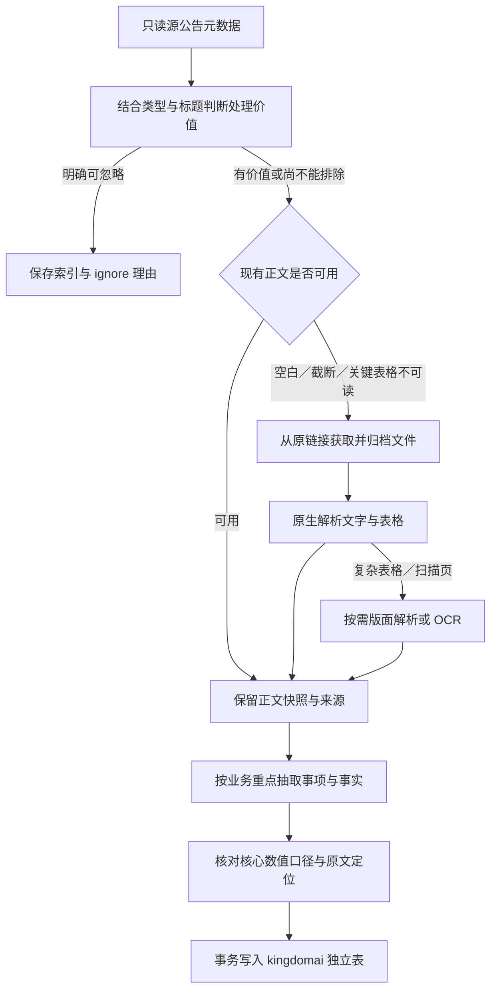

# 公告分类、价值筛选与离线结构化方案

2026-10-02。本轮按用户要求先分析，不开发处理程序、不生成或执行 DDL、不回写源库、不启动下载或模型批量任务。以本文件细化前一份 [总体设计](README.md)；分类与字段是研究建议，尚未作为生产路由启用。

## 1. 结论与研究范围

财报属于公告资料的重要组成部分，但“财报、业绩预告、业绩快报、业绩说明会通知”不能当成相同材料。建议采用：

**源类型作为分类线索 → 业务内容确定抽取重点 → 共用文档/事项/指标/参与方结构 → 在线 Skill 解释投资意义。**

保留一份原始材料，按其实际内容抽取多项事实。担保暨关联交易、收购暨增发不能只选一个标签就丢掉其他内容，也不能因多标签重复累计金额。一份董事会决议可能涉及几个不同议案，只有具体事项及议案通过情况可用，不能把“董事会召开了”作为全部结果。

研究依据：

- `fin_agent` 基准 commit `d4b354bbe8f7f623f4c67e086f64b18cb04554a1`；保留上一轮已有本地改动，本轮未修改应用代码。
- `huarun_poc` 基准 commit `4827b6f2bdcaf87d1a59c4b94049e137b90fbf38` 的公告调查、关系抽取、原件归档、解析与真实材料验证记录；历史运行成绩不能直接代表当前 Fin Agent 效果。
- 当前 PG 只读统计：2026-07-01 至 2026-10-02（不含），124,127 条源记录、85 种非空新版类型、638 种旧/新类型组合；46,809 条缺新版类型，71,024 条正文为 SQL NULL。对应 37.71%、57.22%。非 NULL 不等于正文完整或可用，数量也未做跨来源语义去重。
- 全历史另查出一种类型 `1030302`，样本为配股说明书，共 4 条；全表可见非空新版类型共 86 种。季度窗口不能用于判断年度报告或低频重大事件的总体重要性。
- [上交所公告筛选目录](https://www.sse.com.cn/disclosure/listedinfo/announcement/index.shtml?productId=600745)区分定期报告、业绩预告/快报、利润分配、担保、重组、回购、诉讼等；本库数字编码与该目录的对应关系没有获得权威字典确认。

可复查材料：[类型分布与 SQL](type_distribution.json)、[各类型最多四条近期标题样本](type_samples.json)、[86 类编码逐项归纳](type_mapping_review.md)。标题样本是定向观察，不是随机准确率评估；表中推定含义不是源端官方命名。

## 2. 华润项目哪些经验可以复用

| 现有工作 | 值得复用 | Fin Agent 需要调整的地方 |
| --- | --- | --- |
| [公告调查](../../../../huarun_poc/research/notice_audit/README.md) | 源只读；URL 唯一不等于事件唯一；正文缺失需补原件；披露日期与入库日期不同 | 最新覆盖重新统计；不沿用 9 月的覆盖数字 |
| [近三个月批处理](../../../../huarun_poc/docs/2026-09-14_近三个月公告批处理.md) | 先筛价值再调用模型，缓存与断点续跑，保存缺正文清单 | 风险/供需目的的标题筛选曾排除定期报告、常规决议、说明书及意见书，不能照搬成综合金融问答的 ignore 规则 |
| [供需抽取 V2](../../../../huarun_poc/knowledge_pipeline/supply/README.md) | 核心事实先保留，产品/金额等细节缺失不阻断关系；匿名主体保留原称 | 本次还要支持经营指标、资本动作与股东权利，不能只抽“公司与公司”的关系 |
| [六份真实公告复核](../../../../huarun_poc/docs/2026-09-14_六份公告供需抽取实测.md) | 发现“多家公司合计金额分配给每家公司”“中标当签约”“招标代理当客户”等真实错误 | 将主体归属、金额范围和进展条件放入共用事实口径；不为每个案例增加程序分支 |
| [真实公告接入](../../../../huarun_poc/docs/2026-09-26_真实公告接入与数据边界.md) | 原件 hash、版本、页号、引用；借款人/保证人、受托人/受益人分开；原库不改 | 人工确认的 8 份 PDF 不是任意公告自动解析质量证明；不复制信托 POC 的 Neo4j、人工发布流程及大量状态 |
| [解析试验](../../../../huarun_poc/docs/2026-09-12_MinerU抽样与补充披露渠道.md) | 普通 PDF 原生解析，复杂页再 OCR/版面解析；保留表头、跨页和页码 | MinerU 有跨页表被挂到第一页的实测问题；不能把“解析退出码 0”当作数值与定位正确 |

还需修正一处边界：`announcement_relations.py` 是关系抽取专用路由，不是通用类型字典。它将 `10212` 的任职类材料限制为 CONTROLS，将 `10218` 按经营许可方向提示；本次样本却有“离职高管诉讼进展”“银行账户资金被冻结”。**任职不等于控制，账户冻结不是销售许可**，因此不能直接复用其编码到谓词的强约束。

## 3. 先分清材料形态与业务主题

源 type 往往把两种维度混在一起：

- **材料形态**：正式报告、摘要、方案、决议、进展、更正、审计/评估/法律意见、通知。
- **业务主题**：经营、业绩、分红、股权、融资、担保、投资、合同、监管、诉讼等。

“法律意见书”并不能回答是否有价值；要看它针对什么事项、是否提供新的关键事实。“更正”也不是独立业务主题，应挂回被更正的财务、销量或交易事项。分类只服务查找和抽取，不成为新的 Agent 阶段或固定状态机。

同一公告的类型与标题只提供先验。正文现成时结合正文判断；正文缺失且标题不能排除价值时，保守保留下载资格。类型未知不等于无价值。本窗口双类型均空的 46,809 条中有 46,807 条正文为 NULL；样本包含补助、收购等材料，不能整体忽略。

## 4. 建议业务大类与最值得抽取的内容

下表是研究目录，不是 13 个独立程序或物理表。具体字段只在原文确有披露时提取；结构化不会增加原文没有的信息。

| 业务大类 | 常见源编码线索（非官方定义） | 最核心、最有价值的信息 | 能回答什么 |
| --- | --- | --- | --- |
| **1 定期财务与财务质量** | 10101–10104、10107、10109；部分 10605 | 报告期、合并/单体、准则与币种；关键财务与分部指标；经营变化及原因；现金流、应收/存货/减值；审计意见与持续经营疑虑；重大或有义务 | 盈利质量如何，哪个业务在增长，利润为何未转成现金 |
| **2 业绩预告、快报与更正** | 10105、10106、10108 | 目标期间；收入/归母/扣非等原文给出的金额与上下限；同比区间及基数；变动原因；未经审计等性质；修正前后值与对应来源 | 预增还是减亏，修正幅度多大，预告与正式结果差在哪 |
| **3 经营数据与业务进展** | 10217；部分 10218、10608 | 按月/季销量、产量、订单、交付、产能、利用率、价格等；产品/地区口径；新增产线或停复产；研发/注册/销售许可等里程碑及条件 | 核心经营是否改善，增长来自量还是价，进展是否真正落地 |
| **4 分红、转增与回购** | 1020101、1020102、10405 | 分配基数、每股/每十股金额、币种税前口径、现金总额、送转比例；登记/除权/发放日期；回购目的、计划上下限、价格上限、实际金额/数量和完成进度 | 分红方案与到账日期，回购兑现多少，是否注销 |
| **5 股东、控制权与股份流通** | 10401–10404 及子类、1040201；部分 1020504 | 实际交易或计划主体、一致行动关系；增减持数量、价格/金额、前后持股及比例；控制权前后变化；解禁数量/对象/上市流通日；质押冻结新增/解除与余额 | 谁在减持，解禁规模，控制权是否改变，质押压力多大 |
| **6 融资、债务、担保与现金安排** | 10209–10211、1020201、10301/10302/10303/10304 及子类、1020603 | 发行/借款/担保等参与方角色；计划额度、已用金额、余额分开；利率、期限、用途、到期/兑付日；募资用途变化；逾期/展期及清偿；债券评级与机构 | 是否融资到账，何时偿债，谁为谁担保，有无稀释或流动性压力 |
| **7 投资、并购、重组与资产处置** | 10202、1020501–1020504、1020601/02；部分增发类 | 交易各方与标的、股权比例、对价及支付方式、估值口径、资金来源；审批/签署/交割事实；业绩承诺与关键条件；并表范围变化 | 收购什么、花多少钱、交易到了哪一步、可能改变什么业务 |
| **8 合同、合作与关联交易** | 10204、10207、1020701；部分经营类 | 合同各方及买卖/服务角色；产品/项目；金额、含税口径、履行期间；框架/中标/正式合同区别；关联性质与定价依据；日常预计额度与实际发生额 | 订单是否可确认，客户是谁，合作是意向还是履约，关联交易是否增加 |
| **9 监管、诉讼与经营风险** | 10213–10216、1030407、10607；部分 10218 | 责任主体及角色；调查/裁判/处罚/执行等已披露进展；案由、金额、期限、冻结资产；整改、恢复与解除；涉及的实际影响及不确定条件 | 谁受影响、损失是否已确认、风险恶化还是缓解 |
| **10 上市交易状态与澄清** | 105 系列；部分 10608 | 停复牌生效日期、原因、风险警示/退市事项及依据；异常波动区间；公司确认或否认的具体事项；后续期限 | 能否交易、为何异动、传闻是否得到证实 |
| **11 治理、人事与激励** | 10212、10203、1060201/02、10603、10606 | 关键任免与生效时间；影响控制或经营的治理变化；激励数量、授予/行权价格、对象范围、考核指标与期间、归属/回购注销；审计机构更换及理由 | 管理层/激励是否变化，考核怎样影响未来经营要求 |
| **12 补助、税收与会计政策** | 10208、10604；部分 10608 | 补助金额、到账/获批、用途与确认期间；税收资格及有效期；会计政策/估计变更、追溯调整与已量化影响 | 利润是否受一次性因素影响，会计口径能否比较 |
| **13 信息沟通与程序材料** | 10601、10602、10603、10605、10608 混杂 | 对有用材料提取披露日程、管理层新增表述、议案结果、专业意见中的关键限制；纯程序材料只留索引 | 什么时候说明业绩、某议案是否获批、哪里能读原文 |

IPO 招股说明书、债券募集说明书具有商业模式、客户集中度、债务条款等高价值内容；即使是长文，也不应列为默认 ignore。先按融资或业务背景处理相关章节。上述分类重点覆盖当前公司/发行人公告库，不宣称已完成基金、REITs等独立产品披露的字段体系。

### 财报为什么需要保留不同披露性质

年报/中报/季报为定期报告；预告是公司预计，快报是先行披露的业绩数据，正式报告另有完整报表、附注与相应审计信息；业绩说明会**通知**主要是日程，问答记录则可能有新的经营解释。[上交所信息披露入口](https://one.sse.com.cn/onething/xxpl/)也分别提供相关办理项目。分类依据材料性质，不用标题中的“业绩”二字统一抽取。

可将财务材料统一成同一指标事实结构，但必须能区分披露性质、期间、主体与版本。快报“未经审计”不等于未来预测，半年累计也不等于二季度单季。更正后值形成新披露，历史时点仍保留旧版本。

现有三大报表数据已具备的标准项目优先复用或核对；离线 LLM 优先补经营指标、分部、变化解释、附注与特定风险。不让 LLM 每次重新抽取全套已存在财务字段，再无提示地覆盖原数据。季度报告通常也不具备年报完整附注，未披露项目留空。

## 5. 用统一结构承接各类信息

建议首期采用四张业务逻辑表，详见 [表结构草案](logical_tables.md)：

1. **公告文档**：来源、身份、原始 type、内容版本、摘要及是否跳过默认处理。
2. **公告事项**：此次发生了什么、进展与条件、重要日期、原文证据、与前次披露的关系。
3. **公告指标事实**：期间、指标、数值/区间、单位、范围、实际/预测及出处。
4. **事项参与方**：公司/个人/机构在某一事项里的角色；存在直接按参与方查担保、借贷、客户和收购的需求，值得独立结构化。

每类的差异体现在**抽取重点与小范围业务字段规约**，不是各建一张含大量空列的表。分红日程、解禁日、债务到期日用事项的命名日期；金额、数量、比例与考核指标统一落指标事实。摘要、原因、条款解释和不确定条件保持自然语言。

对于系统已有的指标，定义匹配才复用 `metric_def`。新指标须区分月度/累计、公司/分部、产品/区域等业务定义，不让模型通过给名称换一个说法临时生成正式编码。未匹配指标仍保留原文和原名，不能直接加入跨公司统计。

初期不增加每个类别一张专表，也不增加“万能任意属性事实表”。若实际查询证明某类稳定且复杂的数据被频繁计算，例如可转债完整条款或多层股权快照，再单独扩展；此前先用现有事项、指标、参与方和少量命名日期。分红/经营/诉讼等可以先形成查询视图，而不复制底层事实。

### 几个样例检验能否承载

| 材料 | 核心结构化结果 | 必须保留的边界 |
| --- | --- | --- |
| 比亚迪 7 月产销快报 | 文档＋经营披露事项＋产量/销量/出口量的月度和累计事实 | 出口不能改称海外零售；表头核对后再分配数字；不因未经审核丢掉事实 |
| 四家子公司合计中标 | 一个合计中标事项，多家投标主体，合计金额事实 | 不能把总额各复制四遍，不能把汇总产品分配给每家公司；尚未签约不当成收入 |
| 向关联方借款及担保 | 同一文档的借款与担保事项；出借人、借款人、保证人各有角色 | 控股股东/披露主体不自动是借款人；担保额度不等于已承担代偿 |
| 分红实施公告 | 分红事项＋分配基数/金额事实＋登记、除权、发放日 | 不把预案当已实施，不把每十股现金当每股现金 |
| 中报与修正公告 | 同一公司/期间的原值及新披露，关联被修订来源 | 不用后来的更正篡改历史可得信息；不以文件抓取时间替代披露时间 |
| 法律意见书附带关键交易限制 | 关联主交易，保留限制、日期及证据 | 类型看似辅助，但具体内容决定取舍；没有投资建议也有事实价值 |

## 6. 哪些公告可以 ignore

这里的 `ignore=true` 定义为：**不进入默认批量下载、重解析和语义抽取**。源记录、标题、链接、类型、忽略理由、判断所依据的范围与规则版本仍保留。不是删除，也不表示对任何未来问题永久无价值；指定文档或专项需求可重新纳入。

| 材料情形 | 建议处理 | 不能忽略的例外 |
| --- | --- | --- |
| 纯格式性通知、仅提示已披露全文的位置、重复投票方式/联系方式 | 识别到明确程序性质且无新增实质事项时可 ignore | 延期、取消、日期/议案/条件变化，重大事项通知，正文中有新增事实 |
| 同一原件的多链接镜像、不同抓取批次 | 复用 hash 与现成解析/抽取，跳过重复计算；源链接全部留存 | 更正版、修订版、不同附件及正文内容变化。重复计算跳过不等于把披露记录删除 |
| 正文已完整处理的报告摘要 | 确认正文对应同一版本且事实已覆盖后，可忽略重复抽取 | 全文缺失/未解析、摘要含新增日期或更正、原文不同版本 |
| 普通章程、制度、议事规则的完整重发 | 仅确认是无实质变化或已有同版本内容时可 ignore；无法确认先低优先级 | 分红政策、表决权、治理权限、资本与控制安排有实质变化 |
| 常规会议召开通知、会议信息 | 默认保留索引；已知纯日程且无关注需求时可不做深抽 | 董事会/股东会决议确认关键议案；调整融资、交易、分红或重大事项 |
| 标准法律意见、保荐核查和附件清单 | 相关主材料已覆盖且没有新增判断/限制时，可不重复深抽 | 专项审计、评估、重大保留意见、问询回复、非标审计、交易前提 |
| 常规工商地址、联系人、证券事务代表等更新 | 一般低优先级，明确不影响目标问题时可 ignore | 实控人/法定代表人等关键主体变化，注册资本或经营范围实质变化、退市后身份承接 |

以下**不能整类 ignore**：定期报告、预告/快报及更正、经营数据、分红/回购进展、债务/担保、交易与监管风险、招股/募集说明书、交易所问询回复、未知 type，以及大杂项 `10608`、专业附件 `10605`。

常规月度回购/债券付息/股份变动虽重复出现，却可能回答“兑现多少、是否兑付、稀释多少”，不是噪声。也不能以“负面不明显”“没提及关注公司”“没有两家具名公司”认定对金融问答无价值。

**控制误忽略比最大化节省比例更重要。** 当前还不能给出可信的可忽略百分比：类型混杂且很多缺正文。正式启用前，应分别评测“误忽略关键事实”与“多处理了低价值材料”，成本权重不同。首轮只启用高确定性的忽略；模糊材料保留。低优先级不等于永久跳过，不新增复杂生命周期。

分类建议随政策版本保存；相同内容在同一政策版本下复用判断，政策修改后可重评先前忽略项。缺 type、分类冲突或正文不足不产生自动 ignore 的理由。

## 7. 有价值但缺 content：下载解析的处理路径

你的方案可行。源 PG 的 `content` 即使为空也保持原样，所有补充材料进入独立原件/解析归档与 kingdomai 结构化结果。

这张图表达处理次序，不要求增加图中同名状态字段。

**先用已有正文，必要时取原件。** 判断依据包括正文与标题/公司是否匹配、是否仅摘要、是否截断、关键表格与单位能否定位。长度达标本身不证明可用。有价值且正文缺失的先下载；已有正文可用的直接复用，需精确表格/页码的再补原件，不统一重复跑重解析。

**下载后保留原件。** 存原始 URL、实际响应 URL、文件 hash、抓取时间和与源记录的关系。按同一 hash 复用解析结果，不仅按 URL 缓存；同 URL 的更正文件可以形成新版本。部分源链接为 HTTP，应按已核实的来源规则处理或取得对应 HTTPS 原件，不能简单改协议后假定相同文件，也不能套用华润“仅 HTTPS”后静默漏掉这批材料。

**先轻解析，再按需升级。** 普通文本 PDF 复用原生解析方法；关键表格保留行列、单位和跨页表头。扫描或严重错位页再用 OCR/版面模型，尽量只处理相关页。华润已证明这些组件可用，但未证明全量财务表格准确；其“全部含表格页均待复核”的规则若原样照搬会阻塞大量财报，应聚焦本次要抽取的核心字段及对应单元格。

**保留真实覆盖。** 下载失败保留原因和后续重试入口；缺关键表格时可发布有依据的摘要或其他事实，并标明该指标未取得。正文仅覆盖部分章节时不宣称已结构化全文；单元格有歧义时不把数字放入自动聚合，不因一个局部字段问题丢掉整篇有效材料。

**保持资源可控。** 批量下载、OCR 和 LLM 都在离线作业，有文件大小/超时/并发预算、退避和缓存；不把重任务放进每次聊天请求。仅从公告来源获取文件，核对响应确实是原件，不执行文档指令；抓取错误页或验证页不能当正文。复用华润的归档、下载和解析组件思路，不复制整套风险图谱平台或部署服务。

## 8. 首轮验证与推进顺序

先做小规模人工分析集，再设计可执行 DDL 和处理程序。本轮没有运行新的下载/解析/LLM实验，以下是后续验收建议。

建议首批 **120 份**：60 份覆盖上述业务类别的正常材料（包含至少 10 份定期报告/预告/快报/更正）；30 份低价值与高价值混杂边界（会议、章程、意见书、通知、摘要）；30 份缺 type/缺正文/跨页表格/多主体合计/AH币种等困难材料。允许业务特征交叉，但样本 ID 不重复。年度报告需从上半年补样，不能只用三季度窗口。

逐篇人工标注：是否进入默认处理及理由、核心事实、关键数值/单位/期间/范围、日期、参与方角色、引用，以及哪些内容不应推断。类型字典和采集代码规则由采集侧确认后加入对照，不倒推官方名称。

验收分开看：

- 筛选：多少重要材料被误 ignore；哪些类别仍需保守处理；不能只看省掉多少调用。
- 补正文：下载可达率、可用正文覆盖、关键表格可读性；PDF HTTP 200 不算完整成功。
- 抽取：核心事实召回、指标口径正确、主体角色正确、引用能定位；不能把 JSON 合法率当业务准确率。
- 版本：同输入重跑不重复，更正不覆盖历史，跨镜像不重复累计同一事项。
- 业务查询：实际能回答“最新月销量”“分红何时到账”“担保对象和额度”“回购完成多少”“财报修正了什么”，并正确说明缺失。
- 成本：按来源、材料形态、页数和解析方式记录费用/耗时；不从华润 3 份 MinerU 小样本外推全量成本。

人工样本验证后确定字段与首批 ignore，再小批抽取写入测试库，最后通过现有金融数据目录接入。源 PG 始终只读。全库覆盖、批量结构化准确率和生产可用性当前均未验证。
