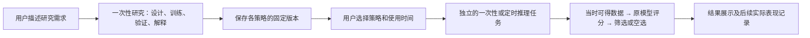

# 用户任务与股票 AutoML：开发交接（2026-10-03）

本交接对应实现提交 `828a6af`，分支 `agent/financial-tool-design-protocol`，远端为 `git@github.com:cyrishe/fin_agent.git`。后续本次交接提交只补文档，没有改变执行代码。换环境后先读本文件和根目录 `AGENTS.md`，再继续开发。

## 已对齐的产品目标

普通用户通过自然语言提出自己的研究角度、目标和约束，系统在预算内自主规划、训练并交付多种策略及证据。用户要的是能开展个性化研究的工具；没有信号、策略未达标也可以是诚实的研究结果。

**训练是一次性任务；每日使用已训练模型是另一项推理任务。**



- 研究可以包含多个方向；方向内比较候选，方向之间并列交付，不根据最终测试选全局赢家。
- 选股优先精确率和误选损失，允许低召回、少出手和长期空选；每日 Top K 是上限，不要求凑数。全市场、行业或局部单股研究均可由需求决定。
- 日常推理加载原有预处理、模型、校准器和门槛，不重新拟合、调参或选择门槛。效果跟踪不隐式改写模型。
- 重训由另一次研究任务产生新版本，是否替换正在使用的版本另行决定。
- 14:55 使用的模型只能由当时可得输入训练。当前模型使用 15:10 收盘后口径，不能直接提前运行；“14:30—14:55 行情预测次日高开”的特征窗口和目标仍未实现。

当前只实现了图中的一次性研究、策略保存和 Python 推理复用。**自然语言创建定时模型推理任务，以及持续表现跟踪，尚未接通。** 通用任务系统支持周期执行，不代表已经实现该业务能力；不能重复调度 `stock_automl_research` 来代替每日推理。

## 当前实现与代码入口

| 范围 | 已实现内容 | 入口 |
|---|---|---|
| 通用用户任务 | 自然语言提交、一次性/预约/周期安排、独立 worker、多步执行、归属、取消、恢复、进度和产物 | [运行文档](../scheduled_task_runtime.md)、[原始设计](general_task_runtime_automl_20261003.md) |
| 需求与多方向研究 | 原始需求保留，共同约束，方向假设，整个任务共享候选预算，独立结果 | [planning.py](../../src/quant_research/automl/planning.py)、[study.py](../../src/quant_research/automl/study.py) |
| 数据与样本 | 默认研究区间有效全池；仅显式 `max_symbols` 限制公司数；批量查询和独立市场日历 | [data.py](../../src/quant_research/automl/data.py)、[features.py](../../src/quant_research/automl/features.py) |
| 模型与评估 | 分类/回归，多算法族，时间/公司留出，重叠标签隔离，独立校准和门槛选择，成本回测 | [runner.py](../../src/quant_research/automl/runner.py)、[decision.py](../../src/quant_research/automl/decision.py) |
| 解释与复用 | 实际系数/树路径等结构解释进入 LLM 评审；固定模型推理 | [assets.py](../../src/quant_research/automl/assets.py)、[inference.py](../../src/quant_research/automl/inference.py) |
| 业务接入 | AutoML 通过授权后台工具接入原任务系统；ML 栈独立安装 | [训练工具](../../src/tools/stock_automl_research_tool.py)、[模块说明](../../src/quant_research/automl/README.md) |

执行和领域口径的权威说明在 [股票 AutoML 文档](../stock_automl.md)。当前收益目标为 `open[t+h+1] / open[t+1] - 1`；不能把它解释为次日开盘相对今日收盘的高开幅度。总行情行数、有效标签数、场景筛选数、拟合预算、校准/门槛段和测试数各不相同，报告须分别展示。

保持 `SOFT → HARD → SOFT`：自然语言承担研究语义，系统持有稳定身份、版本、约束和状态。业务规划留在独立 AutoML 模块，通用调度器不解释金融目标；不新增 ML 专属任务状态机或复杂表单。

## 已验证的进展及其边界

最近真实前端验收记录在 [20261003_user_research](../stock_automl_runs/20261003_user_research/README.md)，含截图、聚合检查和实现文件哈希。历史原型与交互记录在 [任务前端验收](../user_task_runs/20261003_frontend/README.md) 和 [简化任务卡片](../user_task_runs/20261003_simple/README.md)，它们是历史快照，不能覆盖最新口径。

最终一次 Run 为 `run_4e14beb462ca40b1b2553d2e055e056f`，Task 为 `sch_52bdaec61c91414caec3532f8f11c0b8`：

- 真实 KingdomAI 只读数据、真实 LLM、本地隔离认证/SQLite；42 家银行、485 日、20,370 条日行情、19,362 条有效 3 日标签。
- 两个研究方向各 2 次候选，总计 4 次；最终均为逻辑回归。拟合分别 3,555/994 行，校准 924/372 行，门槛选择 1,510/366 行。
- 方向一开发期达标，后续原公司/新公司精确率为 25%/0%；方向二开发期未达标，后续为 41.38%/38.10%。这次验收证明工作流可完成，没有证明策略可用于日常选股。
- 真实模型解释进入 LLM 评审；27 份公开产物下载成功且哈希一致。禁止相关 `fit/fit_transform` 后推理仍成功，分数和筛选结果与冻结规则一致，模型文件哈希未变。
- 测试窗口已在开发中反复使用，不能当作从未揭盲的新投资验证。没有测试自然语言定时推理链路。

此前三次界面运行遇到的能力误述、sampler 公式被猜错及自然语言配置中的非空参数被 `null` 覆盖，均保留失败证据。修复集中在准确能力说明、共享 [数据契约提示](../../src/quant_research/automl/prompts/data_contract.md)、SOFT 配置补丁继承；显式配置不静默修复，失败报告不改写成成功。详细过程见验收记录。

实现提交前完成的检查：

| 检查 | 结果 |
|---|---|
| AutoML、回测、任务服务/工具/runtime 的定向 Pytest | 216 passed，1 条既有弃用提示 |
| 前端 Vitest | 29 文件、179 项通过 |
| TypeScript / Vite build | 通过，既有 chunk size 提示 |
| CLI 合成数据 smoke | 完成 |

以上不是本次文档交接重新运行的结果。未做整仓全量测试、全市场百万样本性能、生产认证、真实 MySQL 任务迁移或生产长稳验收。当前分批读取后仍使用内存 DataFrame。自动事后剪枝并重新验证、任意生成新因子公式、实盘交易也未实现。

研究思考入口：[高精确率与事件样本审计](automl_precision_event_review_20261003.md)、[可解释策略与公开研究参考](automl_interpretable_strategy_references_20261003.md)。其中的建议和外部方法不表示均已实现。

## 换环境继续开发

```bash
git clone --branch agent/financial-tool-design-protocol git@github.com:cyrishe/fin_agent.git
cd fin_agent
python3 -m venv .venv-automl
.venv-automl/bin/python -m pip install -r requirements.txt -r requirements-automl.txt
cd frontend
npm ci
cd ..
```

安装命令是仓库依赖入口，本次没有在空白机器重做安装。当前验证环境实测为 Python 3.13.5、numpy 2.3.2、pandas 2.3.2、scikit-learn 1.7.1、joblib 1.5.1、Flask 3.1.3、pytest 9.0.3；部分版本与根 requirements 的固定版本不同，不能把上面的安装命令视为旧环境的完整锁文件。若续用旧 joblib，应匹配其依赖版本并重新验证，不能只安装范围内最新版本就认定兼容。

根据 [.env.example](../../.env.example) 单独配置当前开发者有权使用的凭据，不从 Git 获取本机 `.env`：

- 数据源：`KINGDOMAI_DB_URL`，后备为 `BI_DB_URL` / `BUSINESS_DB_URL`；CLI 可显式 `--db-env NAME`。当前 loader 使用所选同一连接，不自动切换其他数据库凭据寻找分钟表。
- 语言模型：`LLM_BASE_URL` / `LLM_ENDPOINT`，`LLM_API_KEY` / `LLM_KEY` / `DASHSCOPE_API_KEY`，`LLM_DEFAULT_MODEL`。
- 完整应用的账户和其他能力按各自文档配置。任务 SQLite 不替代应用所有其他存储或认证需求。

### 最小流程检查和隔离 UI

不依赖真实行情或 LLM 的命令：

```bash
OMP_NUM_THREADS=1 OPENBLAS_NUM_THREADS=1 .venv-automl/bin/python -m src.quant_research.automl --demo --max-trials 4
OMP_NUM_THREADS=1 OPENBLAS_NUM_THREADS=1 .venv-automl/bin/python -m pytest tests/automl tests/test_backtest_core.py tests/test_scheduled_tasks.py tests/test_user_task_tools.py tests/test_user_task_runtime.py -q
```

在仓库根目录创建新的隔离任务演示服务（脚本先执行本地合成用例，再提供 API 与内置测试 worker）：

```bash
OMP_NUM_THREADS=1 OPENBLAS_NUM_THREADS=1 .venv-automl/bin/python scripts/eval_user_task_runtime.py --output outputs/task_ui_eval/handoff --serve 22153 --ui-origin http://127.0.0.1:22154
```

另一个终端：

```bash
cd frontend
VITE_API_TARGET=http://127.0.0.1:22153 npm run dev -- --port 22154
```

访问 `http://127.0.0.1:22154/?view=tasks`。该服务仅监听 loopback，使用测试身份；不代表生产登录已验证。交互中自然语言规划和真实训练仍需对应 LLM/数据库配置。脚本会在 `--output` 下创建时间戳子目录；`--serve-existing` 必须指向实际含 `tasks.sqlite3` 的子目录，clone 后不能直接使用旧机器的参数。

### 完整应用与独立 worker

在根目录为 Web 和 worker 分别设置同样的绝对路径，然后启动：

```bash
export TASK_SQLITE_PATH="$PWD/outputs/user_tasks/tasks.sqlite"
export TASK_ARTIFACT_ROOT="$PWD/outputs/user_tasks/artifacts"
FIN_AGENT_PORT=22053 .venv-automl/bin/python -m src.web.flask_app
```

另一个终端回到同一仓库根目录：

```bash
export TASK_SQLITE_PATH="$PWD/outputs/user_tasks/tasks.sqlite"
export TASK_ARTIFACT_ROOT="$PWD/outputs/user_tasks/artifacts"
PYTHONPATH=. .venv-automl/bin/python scripts/run_scheduled_task_worker.py --lease-seconds 60
```

前端在 `frontend` 目录执行 `npm run dev`，默认 22054 代理 22053。没有 worker，任务只会排队。未设置 `TASK_SQLITE_PATH` 会走系统 MySQL；当前 MySQL 迁移/联调为 `NOT_READY`，不要把生产迁移当成本地初始化步骤。`scripts/restart_local_services.sh` 不启动任务 worker，并会停止占用目标端口的进程。

## Git 搬迁范围与本地资产

Git 已保存代码、配置示例、设计/分析、历史原型、精选报告、截图和聚合验证证据。**不包含 `.env`、虚拟环境、`node_modules`、`outputs`、原始行情/训练矩阵、逐行预测、模型二进制和本地任务 SQLite。** clone 可以继续开发代码，但不会恢复原来的任务列表、旧 Run URL 或已训练模型。

旧机器上的状态入口如下，列路径只用于定位，不表示已上传：

- `outputs/task_ui_eval/20261003_frontend/tasks.sqlite3`：本次 UI 的任务记录。
- `outputs/task_ui_eval/20261003_frontend/artifacts/run_4e14beb462ca40b1b2553d2e055e056f/`：最终一次运行的各方向模型、冻结数据和检查点。
- `outputs/task_ui_eval/20261003_research_study/`：本地详细审计及失败复查材料；Git 内的精选聚合对应物见最新验收目录。

如需在新机器继续使用同一个模型或任务历史，需要另行安全迁移可信运行资产及依赖环境。数据库中的产物引用使用绝对路径，单独复制 SQLite 不能保证下载或恢复可用。原目录格式兼容也不意味着可以跨实现版本恢复训练：恢复会检查冻结计划和实现指纹。不要重训一个新模型后把它标作旧模型，也不要为方便迁移关闭指纹或归属检查。

## 下一步应从哪里继续

1. **接通独立推理工具。** 从 [predict_strategy](../../src/quant_research/automl/inference.py) 和 [resolve_strategy_directory](../../src/quant_research/automl/assets.py) 出发，按现有 [registry](../../src/tools/registry.py) / tool definition 方式注册。复用 [task_artifacts](../../src/services/task_artifacts.py) 的归属边界，补足跨任务引用固定策略版本的最小事实与 owner 校验；不能让用户输入任意本地模型路径。
2. **接通自然语言安排。** 使用现有 [任务编译器](../../src/services/scheduled_task_compiler.py) 和 [提示词](../../src/prompts/system/assistant.scheduled_task_compile.system.md)，将“每天用策略 X 选股”落到推理工具。训练与推理各自形成清楚的任务卡，沿用 [任务中心](../../frontend/src/components/TaskCenterPanel.tsx) 和 [运行详情](../../frontend/src/components/TaskRunDetail.tsx)，不另建生命周期。
3. **实现用户明确要求的信息时点与目标。** 尾盘输入和隔夜高开是独立待做能力，先明确截止时点、历史分钟数据和标签，再训练新版本。现有 cron 按普通日历规则调度，不识别交易日历；实际执行需识别交易日和数据是否已到齐，缺数/无信号应清晰反馈，不能用未来数据补齐。
4. **再做完整验收。** 从 UI 提交一次训练，选择保存的策略，提交一次或定时推理，检查没有 `fit`、模型哈希不变、输入时点正确、结果可空选且可追溯。验证跨用户不可访问模型。持续表现记录单独引用原预测和后续行情，重训仍是新任务。

下一位开发者可以直接从“接通独立推理工具”开始；不要将本轮历史回测数字作为新策略效果承诺，也不要把每日使用模型误实现成每日训练。
