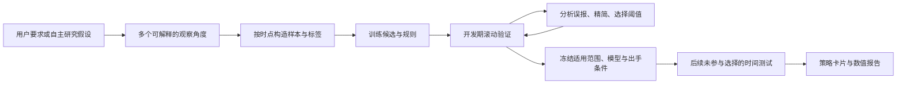

# 可解释局部选股：项目与研究方法取舍

调研日期：2026-10-03。结合用户确认的目标：允许低召回、低覆盖和长期不出手，重视选中事件的 precision、误选下跌的损失，以及一个研究角度的可解释性。

本次阅读官方仓库、文档和原始论文；没有安装这些依赖、复现其 benchmark、训练新股票模型或将下述设计接入执行器。公开项目的存在、论文中的特定实验结果均不能替代 KingdomAI 数据上的验证。当前代码与数据差距见[前次复核](automl_precision_event_review_20261003.md)。

## 产品与研究定位

核心产物是若干可解释、适用范围明确、允许拒绝出手的局部策略。一个“维度”可以是多项特征共同表达的现象，不必等于一个指标、一只股票或一条硬编码公式。

研究角度可以由用户指定、由 LLM 提出或由训练中的特征交互发现。适用范围可以是广泛市场、行业、某类量价场景或单股；范围和规则只在开发数据上发现和选择。不要把“动量/反转/放量”这几个例子写成穷尽性的业务枚举。

“尾盘表现相对行业更强、此前波动收敛时，次日高开事件更集中”是一个假设示例，不是已发现的有效规律。模型学习其中的组合与边界，再用后续数据验证。

## 值得借鉴的项目

| 项目 | 对我们的用途 | 取舍 |
|---|---|---|
| [Microsoft Qlib](https://github.com/microsoft/qlib) | 组织数据、模型、时间窗口、实验产物和滚动研究 | 借鉴流程与证据管理，保持现有独立模块及通用用户任务系统；不整体迁移 |
| [imodels](https://github.com/csinva/imodels) | RuleFit、FIGS、规则集与树的精简 | 作为可解释候选方法来源，外层统一时间验证和 precision 选优 |
| [InterpretML](https://github.com/interpretml/interpret) | Explainable Boosting Machine，解释非线性的单特征及少量交互作用 | 允许连续、柔性的判分方式，不把每个策略强制变成几条硬阈值 |
| [Alphalens-reloaded](https://github.com/stefan-jansen/alphalens-reloaded) | 观察单个因子或模型得分的收益分层、行业差异、换手与信号前后路径 | 借鉴诊断报告；绝对上涨 precision 与实际成交收益仍由我们的标签及回测口径单独计算 |

### Qlib：可复现的滚动研究

`RollingGen` 提供扩展和滑动窗口生成；记录层将预测、信号分析、组合分析分开保存。可复用这种分工，继续用我们已有任务 ID 和资产关联运行，不新增第二套任务中心。[滚动源码](https://github.com/microsoft/qlib/blob/main/qlib/workflow/task/gen.py)、[报告记录源码](https://github.com/microsoft/qlib/blob/main/qlib/workflow/record_temp.py)

需要辨别默认目标：Alpha158 handler 的默认标签是两个未来收盘价之间的收益，并对学习标签做每日截面标准化；LightGBM 示例用 MSE 和 Top50 策略。因此其分数不能直接解释成绝对上涨概率，也不是允许空选的高 precision 策略。[数据 handler](https://github.com/microsoft/qlib/blob/main/qlib/contrib/data/handler.py)、[示例配置](https://github.com/microsoft/qlib/blob/main/examples/benchmarks/LightGBM/workflow_config_lightgbm_Alpha158.yaml)

### imodels：规则本身来自训练

RuleFit 将树产生的条件规则与线性项组合，再用稀疏化保留少量贡献；FIGS 用受总分裂数约束的小树之和表达交互。适合比较解释复杂度与预测效果，而不只是展示一张特征重要性图。[RuleFit 实现](https://csinva.io/imodels/rule_set/rule_fit.html)、[FIGS 与模型目录](https://github.com/csinva/imodels)

SkopeRules 有 precision/recall 的规则筛选门槛，但其内部随机抽样和 OOB 评估不是未来时间验证。训练块内部抽样可以合法使用；规则最终是否有用，必须在之后的时间块重新评价。不能把库中的 `precision_min` 参数当成样本外精确率保证。[官方实现](https://csinva.io/imodels/rule_set/skope_rules.html)

### InterpretML：保持解释而不过度离散化

EBM 是可解释的加性模型，可展示每个变量及交互项如何改变预测。它适合“一个研究角度包含多项连续变量”的情况。解释必须对应模型真实贡献及最终校准；分数贡献不是直接的概率百分点，也不是因果证明。[EBM 官方文档](https://interpret.ml/docs/ebm.html)

### Alphalens：观察有效范围和失效范围

分数分层、按行业/月份观察及换手诊断，有助于发现高分区间是否集中出现优势。它的相对收益、多空口径不能代替绝对上涨标签。官方 API 特别指出用未来收益做 `filter_zscore` 过滤会带来前视偏差，本任务不应靠删除极端亏损样本改善结果。[仓库](https://github.com/stefan-jansen/alphalens-reloaded)、[API 与参数说明](https://alphalens.ml4trading.io/api-reference.html)

## 理论与经验：采用什么，不外推什么

| 方法与原始来源 | 对当前需求的含义 | 边界 |
|---|---|---|
| [Selective Classification，JMLR 2010](https://www.jmlr.org/papers/v11/el-yaniv10a.html) | 模型可以拒绝预测，在错误风险与覆盖率间选择 | 论文无噪声理论不能直接成为相关、漂移的股票数据上的保证；我们关心正信号 precision |
| [Trading via Selective Classification](https://arxiv.org/abs/2110.14914) | 已有研究将拒绝出手与 walk-forward 训练验证测试结合到交易 | 该文交易实验是商品期货；不证明 A 股隔夜有效 |
| [Rule Ensembles，Friedman 与 Popescu，2008](https://doi.org/10.1214/07-AOAS148) | 用少量可读条件组合表达预测关系和局部作用 | 易解释不等于经济因果，也不自动防过拟合 |
| [Gu、Kelly、Xiu：Empirical Asset Pricing via Machine Learning](https://www.nber.org/papers/w25398) | 金融预测值得比较非线性特征交互与线性基线 | 其资产风险溢价研究不是 A 股隔夜高 precision 验证，不直接移植论文收益 |
| [Meta-labeling，López de Prado 本人定义](https://www.quantresearch.org/Innovations.htm) | 可以对第一层策略的候选信号做第二层成功概率筛选 | 可选而非必经步骤；第一层样本外输出才能用来构造可信的第二层开发数据 |
| [Deflated Sharpe Ratio，原论文](https://www.davidhbailey.com/dhbpapers/deflated-sharpe.pdf) | 大量尝试后选冠军会有选择偏差，要记录完整尝试历史 | 修正的是 Sharpe 推断，不是直接证明 precision；相关试验的有效次数也需估计 |

时间净化验证的工程参考：[skfolio CombinatorialPurgedCV](https://skfolio.org/generated/skfolio.model_selection.CombinatorialPurgedCV.html)。其 purge/embargo 参数默认 0，按观测行计数，不能直接用于长表股票日面板后声称已经防泄漏。本项目先保持按交易日期整体分组的 walk-forward，并按真实标签结束时间剔除跨界样本；CPCV 属于可选补充，不能替代未来时间测试。

## 修订后的研究闭环

开发循环受实验预算约束；所有范围、参数、规则剪枝和门槛尝试都记录。最终测试后有新的想法，作为新研究版本进入开发，不能将同一个测试窗口继续作为新盲测。推演、特征生成、校准与筛选都遵循当时可得信息。

保留多个策略时，先独立验证，再检查信号重合、同日集中和联合风险。两个策略同时命中不表示两份独立证据；简单取并集也可能降低整体 precision。组合政策需要另外冻结与评价。

## 模型与解释的实施顺序

1. 先修正样本范围、目标时间口径、precision/覆盖/误报损失、开发期出手门槛和最终冻结评估。否则换算法无法解决目标偏差。
2. 用现有稀疏线性模型、浅树及树剪枝建立可解释基线，允许全市场和局部时间研究。
3. 将 RuleFit/FIGS 与 EBM 作为有限的新增候选方向，按本项目数据测试后再决定依赖。它们不必全部进入每次任务。
4. 只有单层策略的错误分析显示有可验证的过滤信息时，再比较 meta-labeling。第二层仍需可解释或明确说明解释方式；不把“加一层模型”当作必然提升。

LLM 可以提出角度、解释真实规则与误报、建议下一轮试验；不得改写数值证据或把相关性叙述成原因。原生可解释模型应优先读取实际系数、规则和贡献。若用黑盒加代理解释，分别检验代理对原模型的保真度和代理自身的样本外效果，不能将两者混为一项。

## 用户应看到的策略卡片

这些是报告表达，不新增外层任务状态或强制的多层 JSON：

- **它观察什么**：一段自然语言研究假设；区分用户提出和训练发现。
- **何时适用、何时空选**：实际范围和冻结条件，允许随研究版本变化。
- **为何选中**：真实触发规则或特征贡献，提供完整模型解释入口。
- **有什么证据**：选中/命中/下跌数量、precision、同范围同期基率、覆盖率、出手日期数、损失与成本后收益。
- **哪些地方不可靠**：样本少、集中时期、失效范围与未验证数据。

系统允许“一个角度有效、其他角度没有结果”，也允许一次研究没有合格策略。解释性、预测能力和可交易收益分别举证，不将其中一项替代另外两项。
