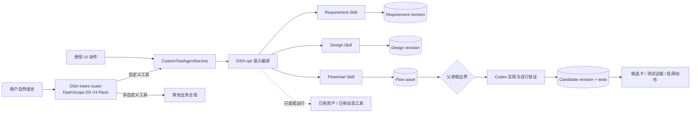

# 自定义个性化工具 DSH-opt + Codex 切换审计与首轮落地

日期：2026-09-06

范围：只覆盖个性化自定义金融工具的创建、设计、修改衔接、测试规划、资产查看和执行交互；不替换金融问答、回测或 Skill 管理主线。

## 结论

可以切换，且默认主链路已经使用 DashScope MaaS 上的 DSH-opt + Codex。替换不是把 CC 的进程名换成 DSH，而是重新划清职责：

DSH 子进程不具备源码编辑、Shell 或 Codex 调用能力。这样 DSH 可以自由优化 prompt、阶段预算、工具可见面和 loop 策略，而代码、测试、权限、版本和激活仍只有一套权威实现。

## 替换前职责与处理

| 原 CC 职责 | DSH-opt + Codex 处理 | 是否改变 HARD 协议 |
|---|---|---|
| 持久会话和多轮理解 | DSH worker 与 session affinity | 否 |
| Requirement/Design/Flow Skill 调用 | DSH `agent/pre-step` 按阶段注入现有 Skill 全文 | 否 |
| 读取/保存资产 | stdio MCP 复用 `FinanceCcSystemTools` 的同一 schema/handler | 否 |
| 必要问题交互 | `request_user_interaction` 原生结束 DSH turn | 否 |
| flow 后启动 Coding | DSH 只返回 `implementation_requested`；父进程调用既有 Codex runner | 否 |
| Coding 过程和验证 | 原 Codex harness、Context Bundle、Store、测试回收保持不变 | 否 |
| 运行已有工具 | DSH 通过受控 `run_dynamic_tool`，继续执行 owner/visibility 检查 | 否 |
| 流式展示 | DSH 工具调用投影为原有 progress/Surface，原始事件进入 trace | 否 |

## 已完成的代码切换

1. 新增自定义工具专用 DSH `sdk-minimal` profile，禁用 Bash、PowerShell 和编辑器。
2. 新增 MCP bridge，只暴露 `finance_query`、`load_result`、`read_finance_asset`、`request_user_interaction`、`save_finance_artifact`、`run_dynamic_tool`；明确不暴露 `implement_dynamic_tool`。
3. 新增 DSH loop policy：
   - Requirement、Design、Flow、Direct 分阶段注入；
   - Requirement/Design 使用 `low`，Flow 使用 `off`；
   - 完全相同调用有界；
   - 带问题的 Requirement 保存后只提交一次交互；
   - flow 和真实交互使用原生 terminal boundary；
   - system、policy 和三份 Skill 都保存 hash 证据。
4. `CustomToolAgentService` 改为 provider-neutral orchestrator，保留旧 `finance_cc_service` 名称作为兼容别名。
5. flow 成功后在父进程调用 Codex；DSH 返回后先合并资产，再把同一权威 state 传给 Coding。
6. 应用默认 `CUSTOM_TOOL_ORCHESTRATOR=dsh_opt`；局部编辑规划、测试规划和 Coding 均由 Codex 承担。CC 只保留显式回滚开关，不自动 failover。
7. 本机 `.env` 已完成切换，并配置本地 DSH 源码、SDK 与 Node 路径；`.env.example` 提供可部署配置。
8. 新增独立 DSH intent router 处理自然语言入口和必要指代恢复；命中自定义工具后跳过旧的直接 LLM conversation preprocess。
9. 自定义工具 DSH 和入口路由只接受 DashScope 域名并只读取 `DASHSCOPE_API_KEY`，不会回退到个人 DeepSeek 官方端点。CC shadow 与工具开发开关均关闭。
10. 命中自定义工具的新会话使用确定性标题摘要，不再产生独立的普通 LLM 标题调用。

## 为什么不把 Codex 放进 DSH MCP 子进程

`FinanceCcSystemTools.implement_dynamic_tool` 依赖父进程中的实现回调、事件流、当前 Store 和运行上下文。把它复制进 stdio 子进程会造成第二套 Coding 生命周期、丢失实时事件，且文件存储部署可能观察不到同一内存状态。

因此 flow 是稳定的 HARD 边界：DSH 负责产生并保存 flow，父进程确认资产存在后调用 Codex。该边界既能资产化设计，也使 DSH 策略可以独立调整。

## 测试样本与结果

### 样本 A：明确需求应直达实现

需求：输入一组 A 股，判断最近 60 个交易日内 MA5 是否上穿 MA20，返回最近金叉日期、均线值和命中状态。

预期依据：对象、窗口、公式方向和输出均已明确；单/批量由既有列表规则处理，不应追问。应保存 Requirement、Design、Flow 三类资产并请求父进程进入 Codex。

真实结果：

| 指标 | 结果 |
|---|---:|
| 完成 | 是 |
| DSH 模型调用 | 3 |
| 用户问题 / 交互 | 0 / 0 |
| 资产 | Requirement、Design、Flow 各 1 |
| Design / Flow 字符数 | 1,364 / 561 |
| Codex 交接信号 | 是 |
| 端到端 DSH 时长 | 约 23.5 秒 |
| Provider prompt / completion / total | 5,157 / 2,320 / 7,477 |
| Cache read | 9,472 |
| Reasoning / 可见 completion | 366 / 1,954 |

### 样本 B：核心分叉应只问一次

需求：收益达标提醒，但用户明确尚未决定按持仓绝对收益还是相对沪深300超额收益。

预期依据：两种口径需要不同数据、公式和结论，且用户明确未选择；这是会改变核心结果、没有可靠默认的真实阻断问题。

真实结果：

| 指标 | 结果 |
|---|---:|
| 完成 | 是，停在必要交互 |
| Requirement 资产 | 1 |
| 问题 / 交互 | 1 / 1 |
| Design / Flow / Codex | 0 / 0 / 未触发 |
| 问题质量 | 解释绝对、超额和两种都支持的业务影响 |
| 端到端 DSH 时长 | 约 34.6 秒 |
| Provider prompt / completion / total | 1,979 / 3,853 / 5,832 |
| Cache read | 37,504 |
| Reasoning / 可见 completion | 2,168 / 1,685 |

同一样本在旧 `requirement=high` 配置下 3 次调用全部未保存资产，reasoning 为 9,514/9,686 completion token，provider total 18,409。改为 `low` 并修复 terminal 参数解析后，provider total 下降约 68%，同时取得正确交互结果。该证据支持当前阶段预算，而不是凭主观认为“高推理一定更好”。

## 自动验证

- Python 聚焦：MaaS/DSH 新增链路与既有金融 DSH 联合回归 59 passed；自定义工具、DSH/CC 兼容、候选修订、编辑、历史回放、Surface 与数据库 Store 的扩大回归 260 passed；入口/上下文协议另有 43 passed。
- Node 聚焦：25 passed，包含 5 个自定义工具 DSH policy 测试和 20 个既有金融 DSH policy 测试；覆盖阶段推导、完整 Skill 注入、预算、原生终止、重复调用和旧策略不回归。
- 前端：Vitest 全量 111 passed；TypeScript 检查和 Vite production build 通过。
- Python 编译检查通过。

### DashScope 切换后的真实烟测

- MaaS 模型名 `deepseek-v4-flash` 与 `deepseek-v4-flash-0731` 均通过 OpenAI-compatible 端点预检。
- DSH intent router：创建工具判定为 true，普通行情问题判定为 false；每次 1 个模型调用、354 token，复用同一 Harness client。
- DSH 工具链：明确的 MA5/MA20 样本保存 Requirement、Design、Flow，0 次交互并产生 Codex 交接；42.0 秒、5 次调用、provider total 37,703，cache read 26,624。

## 仍需继续验证

1. 通过真实 Chat/SSE API 跑完整 DSH→Codex→候选 revision→自动样例→启用前卡片链路；本轮真实样本刻意停在 Codex 调用之前，避免烟测写入正式工具资产。
2. 用同一 DSH session 提交样本 B 的选择，核对 Requirement 只增加一个新 revision，并继续 Design/Flow/Codex。
3. 跑已有 20+ 自定义工具对话集，对比 CC 基线的无必要追问率、三资产完成率、端到端 P50/P95、provider token、cache read 和失败分布。
4. 分别验证已有工具的查看、运行、局部修改、失败修复与复测交互。局部编辑当前直接由 Codex planner/coder 处理，不应为了“所有步骤都经过 DSH”增加一次无意义模型调用。

这些是效果与发布验证，不是切换的协议阻点。若 DSH 失败，主线返回真实错误并保留已保存资产；不会静默切回 CC 造成重复实现。
