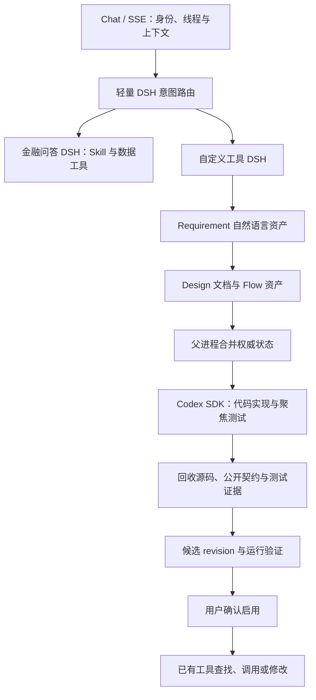

# DSH + Codex 自定义工具生产故障排查（2026-09-10）

## 当前架构与开发断点

用户入口为 `https://ai-agent.kingdomai.com/fin_agent/assistant`，Web 使用 22056，金融数据 REST/MCP 使用 22054。排查开始时服务器为 `f0b7f6e`，本地为 `511041e`。本地新增的三次提交针对金融问答读取与展示，本次涉及的自定义工具文件在两版本之间没有差异。

- `src/web/flask_app.py`：HTTP/SSE、身份、线程、结果持久化与 Surface。
- `src/scenarios/custom_tool/dsh_intent_router.py`：工具生命周期语义路由。
- `dsh_service.py`、`dsh_loop_policy.mjs`、`dsh_mcp_server.py`：需求/设计/流程阶段及七个受控工具（实现调用仅记录父进程交接）；Coding 不在 DSH 子进程中执行。
- `src/services/custom_tool_service.py`：父进程接手实现、候选与启用动作。
- `codex_exec_skill_harness.py`、`custom_tool_context_bundle_service.py`：Codex Python SDK、隔离上下文、模块源码与样例证据回收。
- `database_custom_tool_store_service.py`：工具身份、所有者、不可变 revision、测试与激活。
- `CustomToolRuntimeService` / `custom_tool_sdk.finance_query`：动态执行与金融数据接入。

9 月 6 日迁移文档明确记录：真实 DSH 样本当时停在交接 Codex 前，完整 Chat/SSE → Codex → 候选保存仍待验证。近期主线集中在金融问答和 DSH 效率；不能把这部分成功或服务健康检查当成工具创建闭环已通过。

## 运行时与现场证据

服务器 SSH、两个服务和金融 API 健康检查正常。Codex 配置为 SDK 0.147.0、runtime override 0.153.4、`gpt-6-astra`、CRS API key。未读取或输出密钥内容。

下午截图对应 `thread=4371 / turn=2263 / run=53b11e031d45450bb2bee664f66f93ee`，开始 14:52:54，结束 15:00:08。Codex 实际执行约 383 秒，生成 11,372 字符源码与 8 组样例证据，然后保存失败。当天 12:00–18:00 的当前系统对话表中，已定位到的自定义工具失败就是这一条；不把一般金融问答或其他评测请求计为工具创建失败。

本轮先通过现网 Chat/SSE API 执行简单区间涨跌幅工具，`run=955a645a4e254ca19b69a11cb226223c / thread=4375 / turn=2271`，再次复现同一错误。Codex 能读取参考资料、写代码、执行样例并返回最终结果，约 230 秒生成 4,580 字符源码与 10 组样例。因此当前远端 Codex 可执行，问题位于后续协议接收。

详细原始 trace 保存在本机忽略目录 `outputs/custom_tool_recovery_20260910/`；不提交原始用户日志、Cookie 或工作区产物。

## 已证实的根因与修复

1. **Output Schema 未构成可靠的模型上下文。** SDK 传入了 `output_schema`，但真实结果仍出现结构偏离。源码与 trace 能证明“请求带 Schema、结果未遵循”，不能据此断言一定是某个代理内部实现丢弃了 Schema。本次将同一份 Schema 同时放入单个 TextInput 的最终输出说明，初次和恢复轮都使用单一来源，保留 SDK 原有结构化输出参数。
2. **接收端丢失兼容契约。** 红利低波返回 `name / input_schema / output_schema`；本轮简单工具返回 `name / inputs / outputs`，后两者为完整 JSON Schema。旧适配只读取 `tool_name` 和字段列表，最终成为空名称与空输入输出。修复在既有 bundle 适配中保留完整 Schema、嵌套约束和可空字段，兼容标准字段列表，不扩张模型必填字段或状态。
3. **错误越过可恢复边界。** 空名称直到 Store 才抛出异常，整轮变成 `run_failed`。现在在 bundle 形成时检查缺失身份与确定性的结构错误，走已有 `coding_bundle_invalid` 返回，保留 Design、revision 与 Codex 恢复会话。
4. **过程展示提前宣称全链路完成。** 原 Coding 完成卡显示“实现与验证已完成”，此时尚未保存候选及正式运行。改为“代码实现已完成”，后续保存/运行结果另行反映真实结论。

5. **合成测试被误当作真实行情调用。** 修复保存后，指标和红利低波均进入了原先未跑到的真实验证分支。旧逻辑拿第一个合成测试的输入调用生产行情，再把真实结果与合成价格比较；红利低波的首例甚至是内部计算函数参数。现在回收已有 `sample_input`，仅用独立公开入口输入做正式运行；各合成样例的预期只与自身记录的实际结果匹配。缺少真实输入时保留候选、完整样例和可恢复反馈。约定集中在 `CODING_WORKSPACE.md`，Skill 只引用，不增加 Output Schema 必填字段。
6. **DSH 缺少已有候选的修复交接。** 迁移只在新保存 flow 后触发父进程 Codex；DSH 删除了实现工具，已有失败候选只能查看或运行。现在复用原 `implement_dynamic_tool` 输入和已有前置校验，在 DSH 中只记录自然语言实现请求，结束该轮后由父进程调用原 Codex runner。已有 active 工具使用原 `start_edit` 生命周期保留启用版本，不添加状态机。

7. **Codex 恢复轮遗漏变化后的实现地址。** 首轮工作文件为 `001_custom_tool.py`，持久化候选再物化后为 `001_main.py`；恢复提示省略了当前模块映射，模型继续按历史允许路径修改，并指出回收目标与编辑范围不一致。恢复轮现在只传当前 `manifest_ref / module_files` 引用与反馈，不重复源码或设计，让编辑目标与系统回收目标一致。

8. **金融查询绑定说明不完整，具体错误被吞掉。** 红利低波把 `$stock_codes` 嵌入 quoted filter，实际运行只绑定完整参数，抛出 `unused finance query bindings`。SDK 说明原先只举 `codes` 用法，而公司行为等 filter-only 方法并不声明该参数。现有协议不变：说明同时给出完整 `filter = $selection_filter` 的绑定方式；运行桥保留 `ValueError` 的协议反馈，未知 provider 异常仍用原安全错误。服务器金融 API 单独查询三只股票一年内已实施分红成功，返回 6 条，排除了分红数据缺失。

9. **Direct 缺少当前工具身份，失败状态卡误报完成。** 日涨跌幅直接调用的 trace 显示：权威 state 中有 `ct_a_share_daily_price_change`，但 DSH 提示没有提供该标识，模型用展示名称读取契约并猜测参数，实际返回未找到工具，最终还耗尽输出预算。现在由适配层提供当前准确标识，资产读取工具说明可省略名称读取当前工具；不替模型猜参数或将错误名称强行改写。DSH 过程卡也识别现有 compact result 的 `status=error`，不会因缺少 error 字段而显示执行完成。

10. **业务设计混用了现金与复权价格。** 红利低波技术运行通过后，实际 `reference_price` 为后复权价格（例如茅台 9900.6301），现金分红除以该值产生失真股息率。这属于 SOFT 业务设计问题：Design Skill 补充金额/价格的单位与份额基准一致原则，当前候选通过自然语言反馈同时修正设计和代码；不扩展核心 Output Schema 或新增业务 validator。技术检查通过不等于本项金融口径正确。

## 验证记录（持续更新）

所有执行测试均在服务器进行；实际模型链路通过服务器 HTTP API。未在本地执行测试。

- 现网基线：简单工具通过真实 Codex 执行后复现保存错误。
- 服务器隔离目录：`/home/che/cyris/fin_agent_deploy/custom-tool-recovery-20260910`。
- 协议回归：已覆盖标准字段列表、完整 Schema 及失败恢复；最初批次 139 passed，1 deselected，覆盖标准字段列表、两种完整 Schema 形式、保存/加载/执行、无副作用归一化、真正缺失名称或不可执行结构时保留恢复上下文，以及初次/恢复轮 Schema 传递。
- 排除项 `test_coding_subject_asset_expands_method_contracts` 仍查找旧 `stock.quote` 名称；在独立、未修改的服务器 `f0b7f6e` archive 中复现相同 KeyError。未把该失败改成通过，不能宣称全套默认门禁全绿。
- 候选服务器 API 使用 127.0.0.1:22156；复用生产 Python 依赖和配置，代码与运行目录独立。首次启动缺 `.venv` 链接导致 launcher 落入服务器非 CPython 的 `python3`，已补齐隔离目录的解释器链接后重跑；这是候选环境准备问题，未改变现网。
- 编辑、候选、Surface 和系统工具补充回归：50 passed；当时 Python 合计 189 passed，后续新增空参数、模块引用与绑定错误测试。
- 最终聚焦 Python 回归：195 passed，1 deselected（上述既存旧接口测试）；无本地测试。
- DSH loop policy：6 passed，包含实现交接结束 DSH 轮次。
- 前端：服务器 TypeScript 与 Vite build 通过；另有既存大 chunk 提示。
- 第三版候选服务器 API 为 127.0.0.1:22158；新建指标 run `a9094762c0fa4f549b7d1a0af8a75dcd` / thread 4380 / turn 2276 已成功：10 个合成样例 + 1 个真实行情调用全部通过，一次查询两只股票、14 条日线，首末价涨跌幅算术复核一致。
- 启用指标 run `9b853b0b6c674b9ca30a1ab94a1fb90f` 成功；测试脚本曾漏传 interaction_id/action，服务正确拒绝，补齐 UI 原字段后通过。随后该访客达到三次配额，后续调用未执行，未修改额度/权限。
- 已有红利低波恢复 run `c0b6e4ac38364b4a91d17148037721bf` 揭示恢复模块映射遗漏，记录上述第 7 项修复。
- 日涨跌幅工具创建 run `7c33c798038d4498841e58c0b4053b13` / thread 4381 / turn 2278 成功，15 个合成样例 + 1 个真实行情运行全部通过；随后自然语言修改精度 run `2d250443db144405a9f06c233cd04ccd` 成功：原 Codex 会话写入 revision 2，14 个合成样例 + 1 个真实调用通过；实际 change_pct 从 -1.41 变为 -1.4069，证明恢复路径修改被正确回收并执行。
- 金融 API 数据源验证 `fq_a74889303e0d4a04864953356dfcbccc` 成功，DSH 使用公司行为查询返回真实分红。
- 红利低波创建 run `7a82066562a54a558947ebe59f5ffc77` / thread 4382 / turn 2280：17 项技术验证通过，但人工业务复核识别后复权价格误用，未启用。
- 红利低波修正 run `166efe80453147ef9bac15b15177fa77`：DSH 保存新的 design 与 flow，Codex 恢复到同一会话生成 revision 2；22 个合成样例 + 1 个真实调用全部通过。两次批量查询读取 753 条价格与 100 条历史分红。
- 独立金融 API `fq_b0f8ea74a7cf4996b223fecb55d96920` 提供原始收盘价，配合前述分红 API 的 6 条已实施记录重算股息率：600519.SH 为 4.0268057449%，000858.SZ 为 7.2480118044%，601398.SH 为 3.87875%，与修正后工具逐项相符。
- 全新候选进程 127.0.0.1:22163 的 Direct 调用 run `0c4fb18c8dc44a6595d4896ec9732ec9` 成功：从数据库恢复当前工具身份与契约，正确传入三只股票和截止日，返回实际明细与排序；未重新设计或调用 Codex，revision 保持 2。
- 生产部署与重启：尚未执行，待候选 API 验证完成后按根 AGENTS.md 人工 Gate 操作。

本次局部协议与真实 API 证据不替代全量评测、并发压测或恢复演练，不将生产可信运行三维标成 READY。
