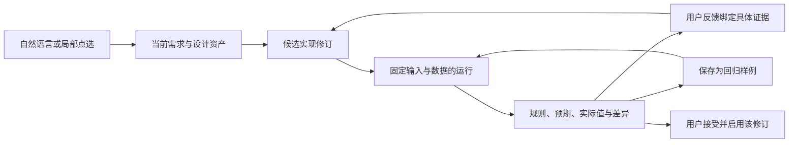

# 自定义工具与策略：进展审阅、交互与正确性规划初稿

日期：2026-09-05。代码基线：`5238804`；与上次需求交互文档提交 `dd0e39a`（2026-08-18）比较。

本文面向自定义工具方向的产品和工程决策。范围覆盖需求、设计、实现、局部修改、测试、启用，以及金融数据和回测模块与本方向的衔接。本轮完成代码审阅、只读数据库核对、隔离诊断、聚焦回归和开源官方资料调研；本文提出的产品改动尚未实施。

## 1. 核心判断

当前已经具备一个可以生成、保存、修改和运行工具的工程基础。下一阶段最有价值的目标是：让用户与 Agent 共同维护一份“逻辑明确、修改可控、证据可复核”的工具资产。

用户的日常操作应该围绕以下问题展开：

- “你准备怎么算？”——查看需求与关键口径。
- “这只为什么没有入选？”——定位某次运行中的数据、指标和规则。
- “把这个条件放宽，其他不变。”——形成基于当前候选的局部修订。
- “和原来相比变了什么？”——在相同输入、相同数据上比较两个版本。
- “这次结果对了，以后别改错。”——将具体样例保存为持续回归的依据。
- “我接受这个版本。”——启用与已展示证据一致的修订。

现在最主要的断点位于这些操作之间：测试入口已经存在，但运行成功仍被表达为业务通过；候选版本能够保存，但对话测试和继续修改并未一致使用候选修订；用户反馈能够触发修改，但尚未稳定变成可复用的验收样例。

推荐继续沿用现有 CC/Codex、动态工具 Runtime、不可变修订和 Surface/Renderer，优先接通这些环节。新增的 HARD 内容应限于程序真正需要消费的版本、运行、样例和数据引用；解释、业务判断和提问继续交给 SOFT。

## 2. 这段时间实际进展到哪里

### 2.1 不能把当前已有能力全部算作最近新增

`dd0e39a..5238804` 的净变化覆盖 125 个文件，约新增 19,987 行、删除 2,376 行。较大变化集中在金融 API、Catalog、参数机械校验、财报 Provider、金融问答 DeepSeek 运行时、部署与 Codex 接入。

直接核对 Git 历史后，`custom_tool_service.py`、交互测试台、Requirement Skill 等核心文件的最后变更仍来自 8 月 16 日的集成提交。8 月 19 日新增的 [custom_tools.md](../../custom_tools.md) 是交接说明，不能据此认定它描述的全部功能都在 8 月 19 日之后实现。

自定义工具方向最近明确受益的代码改动包括：Coding Context Bundle 改为读取统一 Catalog 源、加载更有针对性的 API guidance，以及 Codex 认证和执行接入的调整。上次讨论的双层需求共识稿仍主要存在于 [需求交互设计文档](../custom_tool_requirement_interaction_design_20260818.md)，没有完整落到 Requirement Skill 和专用展示上。

### 2.2 当前能力盘点

| 能力 | 当前实现 | 尚未接通或不足 |
|---|---|---|
| 自然语言需求与选择题 | `requirement_brief / notice / questions`，选项与自由输入共存 | 共识稿阅读层次、局部纠错与反馈后的变化展示仍弱 |
| Design 与流程图 | 自然语言设计、单独 flow 资产、确认后 Coding | 图和文档容易重复；计算口径没有形成统一的可核算展示 |
| 多目标输入 | 默认列表、批量取数后逐目标计算；区分独立目标与全体排名 | 真实批量耗时和底层查询次数仍需建立基线 |
| Coding | 隔离 Context Bundle、模块回收、编译、功能测试、过程日志 | 证据主要由同一次 Coding 生成，缺少独立预期对照 |
| 局部修改 | EditPlanner、精确 Design replacement、局部 Coder、候选修订 | 连续修改候选时的基础版本读取不一致；缺少结果差异比较 |
| 版本管理 | 候选与 active 分离，所有权、基线冲突检查、原子切换 | 首次创建与编辑的启用门禁不同；测试证据与修订绑定不统一 |
| 交互测试台 | Schema 表单、JSON、固定 revision、输入输出校验、过程与诊断 | 同步请求、结果一次返回、本地输入草稿、无服务端用例集合 |
| 自然语言测试 | 主会话有运行工具；代码中有 Test Skill 及测试循环 | 当前主会话运行工具不接受 revision；独立测试循环未找到生产调用点 |
| 回测衔接 | 策略 companion、修订冻结、历史 Runtime Host、回测桥接 | Host 是内部切片；只覆盖有限历史数据 API，未成为通用产品入口 |

关键入口：[流程编排](../../src/services/custom_tool_service.py)、[数据库修订存储](../../src/services/database_custom_tool_store_service.py)、[交互测试台](../../frontend/src/components/renderers/CustomToolTestWorkbench.tsx)、[编辑摘要](../../frontend/src/components/renderers/EditSummaryArtifact.tsx)、[历史运行 Host](../../src/services/custom_tool_historical_replay_host.py)。

### 2.3 当前证据的范围

本轮只读连接本机 `.env` 指向的系统数据库，观察到：

- 自定义工具资产 81 个，其中 active 19、draft 62。
- 持久化测试 46 条：sample_smoke 成功 35、失败 6，real_data 成功 5。
- 8 月 18 日以来，自定义工具资产没有新的更新时间，测试表没有新增记录；最新资产/测试时间为 8 月 11 日。

这些数字只描述这一个配置库；其他部署环境或未持久化的测试可能不在其中。尤其手工测试 API 当前不写入测试表，因此不能从“没有新增记录”推断无人测试过。

本轮实际回归结果：后端 99 passed；前端 6 个文件、29 passed。它们支持版本、接口和渲染的工程判断，不证明生成策略的金融公式正确，也不等价于真实用户全链路验收。本轮没有新增真实 LLM 生成会话，没有启动全量市场扫描，没有做浏览器视觉验收。

## 3. 当前最影响体验和可信度的具体问题

### 3.1 “业务通过”的依据过弱，构成明确的产品误导

交互测试 API 中：

```python
business_ok = runtime_ok and business_result.get("ok") is not False
passed = runtime_ok and business_ok and output_error is None
```

前端据此显示“测试通过”和“业务通过”。这里检查的是工具有没有自报错误，没有检查计算是否满足用户要求。[测试 API](../../src/web/flask_app.py:4773)、[结果展示](../../frontend/src/components/renderers/CustomToolTestWorkbench.tsx:244)。

本轮使用 Flask test client 和受控运行替身复现：输入 `[1,2,3]`，独立预期为 `6`，替身返回符合输出 Schema 的 `999`，接口仍返回 `status=passed`、`business_ok=true`。这是对测试接口语义的诊断，不是某个真实金融工具算错的实测记录。

方案：展示“运行完成”“输入/输出格式正确”“已核对哪些计算”“哪些证据还没有”。只有运行器实际执行了具体断言，才能给该断言显示通过。用户确认代表接受业务口径和当前版本，不能代替系统做算术和规则核验。

### 3.2 创建和编辑的启用条件不一致

编辑候选路径在 `continue_flow_action` 中检查候选的 `last_test.execution_ok`；首次创建直接走 `commit()`，没有等价检查。前端的 `candidate_can_activate = not edit_summary or ...` 同样仅限制编辑候选。[确认动作](../../src/services/custom_tool_service.py:2396)、[创建提交](../../src/services/database_custom_tool_store_service.py:590)、[按钮生成](../../src/web/flask_app.py:1369)。

本轮在临时文件系统 Store 中实际复现：`last_test={}` 的新草稿通过 `commit()` 变为 active。数据库 Store 的同名方法也只更新 active 状态；本轮没有对数据库做启用操作。

另一个语义问题是，名称/说明修改的 hash 不变检查也被写为 `execution_ok=true`，即使本轮没有执行代码。[非代码编辑](../../src/services/custom_tool_service.py:3263)。

方案：让所有启用入口使用同一个、与修订绑定的技术资格判断。纯说明修改可继承匹配的代码与契约证据，但应显示“实现未变，沿用某次验证”；不能制造新的运行成功。已知失败版本保持草稿；缺少证据时说明缺哪项并提供对应测试入口。无需新增业务确认状态机。

### 3.3 候选版本存在，但“继续改这个版本”未稳定贯通

`_confirm_and_code()` 读取 `current_implementation` 时使用 `store.load(tool_name)`，没有按 `state.implementation_revision` 读取候选。编辑后 active 指针保持旧版，这是正确的生命周期设计，但上述读取会再次把旧版源码作为本轮基础。[Coding 上下文](../../src/services/custom_tool_service.py:2710)。

风险场景：用户先把量比阈值从 1.5 改为 2，得到未启用候选；再说“EMA 偏离改为 3%，刚才的量比修改保留”。系统必须明确是在第一个候选之上继续修改。当前读取方式不能仅靠模型会话记忆来保证这一点。

本轮确认的是版本读取代码不一致；连续自然语言两轮修改的真实表现尚未重跑。建议把它列为第一批专项验收，而不是直接宣称所有连续修改都会丢失。

方案：系统区分“本轮编辑基础修订”和“预期的启用指针”。前者供 Coder 读取，后者用于最终并发冲突校验；二者都是已有版本事实的明确使用，不是新的工作流状态。

### 3.4 “测试这个候选”在对话和测试台中可能指向不同版本

测试台通过 `run_revision()` 固定修订，这部分方向正确。主会话的 `run_dynamic_tool` 只有 `tool_name` 和 `arguments`，调用 `runtime.run()`，默认从当前工具指针读取，不接受候选 revision。[主会话工具](../../src/services/finance_cc_system_tools.py:450)。

仓库中的 `_run_existing_test()` 也使用 `store.load()` 和 `runtime.run()`；全仓搜索只找到其定义，没有找到生产调用点。因此不能因为有 Test Skill 文件，就认定自然语言测试循环已经接入主线。[独立测试循环](../../src/services/custom_tool_service.py:2926)。

方案：按钮、表单和自然语言测试都汇入同一个按修订运行的入口。用户从候选卡片说“拿茅台测一下”，系统自动携带该卡片的工具和修订引用；只有确有多个候选可指时才询问。每次结果明确显示“测试版本”和“当前启用版本”。

### 3.5 测试过程缺少独立预期，断言证据也没有完整回收

局部 Coding Skill 已要求构造正反例并执行断言，这是好的基础。但回收文件主要保存 `input/actual`，没有稳定保留断言、预期来源、实际比较结果和失败差异；服务端以 case 状态及 `actual.ok` 推导验证结果。[局部 Coding Skill](../../src/skills/financial-tool-development/skills/financial-tool-edit-implementation/SKILL.md)、[证据回收](../../src/services/custom_tool_service.py:3460)。

首次 Coding 没有 sample 或证据时仍可形成草稿；一般测试卡也没有渲染后端传来的 `expected`。编辑摘要虽然能展示 expected，但当前合成样例的预期常是“符合策略预期且不返回 ok=false”的泛化描述。[一般测试卡](../../frontend/src/components/BlockRenderer.tsx:168)、[编辑证据卡](../../frontend/src/components/renderers/EditSummaryArtifact.tsx:116)。

方案：在实现前先确定少量关键行为预期，用独立参考计算或用户给出的例子形成可执行断言。运行器保存比较事实，Coding 不能通过修改预期来让实现过关。模型可以建议变更预期，系统保留其变更来源和用户反馈。

### 3.6 手工试用尚未成为可复用资产，反馈无法可靠闭环

测试台输入仅保存到 `localStorage`，结果在组件状态中；测试 API 收集过程、生成 run_id 并返回，但没有调用持久化测试记录服务。自动测试表保存 input/output/diagnostics，却没有直接保存当前 case 的 expected 与完整 assertion 语义。[浏览器草稿](../../frontend/src/components/renderers/CustomToolTestWorkbench.tsx:106)、[API 返回](../../src/web/flask_app.py:4917)、[测试存储](../../src/services/database_custom_tool_store_service.py:609)。

用户说“这一只结果不对”后，下一轮缺少稳定的运行引用、标的/行引用和预期说明；刷新后也不能保证恢复刚才的完整证据。

方案：把一次执行保存成运行记录；用户可将某次输入、数据快照与期望保存为工具的回归样例。反馈默认绑定当前运行和选中的指标，不要求用户重新粘贴结果。先使用现有 JSON/资产引用能力，查询和规模需求出现后再决定是否需要独立测试套件表。

### 3.7 当前“拟真”脚本仍偏向固定推进，成功标准不能评价正确性

`eval_custom_tool_chat_simulated_user_v2.py` 会读取阶段，但后续答复主要是预设话术；Requirement 轮统一要求默认收敛。`coding_status=implemented` 时，只要实现说明/对齐说明存在且满足结束边界，就可能把 case 记为 passed，即使前面已经记录到技术失败。[拟真脚本](../../scripts/eval_custom_tool_chat_simulated_user_v2.py:61)。

它可以作为流程固定回归，不能替代用户之前定义的“阅读真实回复、自由判断、质疑某个指标、修改需求”的拟真测试。

方案：分别报告流程完成、计算正确、需求遵从、交互可理解、版本正确五个维度；每个维度有独立证据。拟真样本中加入故意错误，让测试用户尝试发现，而不只看是否顺利走完。

### 3.8 冻结工具代码还不足以冻结计算

当前 `stock.quote.dynamic_cal` 取数后仍调用 `_generate_compute_code()` 生成本次计算逻辑。同一工具修订、同一自然语言 task，不等于同一套内部计算代码。[动态计算 Provider](../../src/experiments/staged_data_protocol/phase2/dynamic_cal_provider.py:123)。

此外，工具桥接会在遇到未取得的金融请求后缓存响应、重新执行工具代码；`finance_query_count` 统计桥接请求，不直接等于底层 SQL/LLM 次数。仅记录最终耗时和一个工具 code hash 无法解释所有差异。[Runtime 桥接](../../src/services/custom_tool_service.py:890)。

方案：优先让正式工具的核心公式在已保存的确定性代码中执行；若依赖动态生成的底层计算，也应保存实际代码/版本指纹和输入数据。对比版本时冻结实际响应快照；真实数据刷新作为另一次明确运行。复用数据层已有的结果引用、步骤证据和 Catalog 信息。

### 3.9 需求交互尚未兑现之前的阅读目标，Design 还有展示性硬依赖

Requirement Skill 仍以一段目标加 Markdown 为主；主提示要求每次形成 requirement 都停下确认。选择题本身已经支持自然语言，这是可以保留和完善的能力。[Requirement Skill](../../src/skills/financial-tool-development/skills/financial-tool-requirement/SKILL.md)、[主提示](../../src/prompts/finance_cc/main.system.md)、[选择题 Renderer](../../frontend/src/components/renderers/InteractionRenderer.tsx)。

需要优化的是确认内容及其阅读价值，而不是一律取消确认。同时，Design 的 flow 缺失会硬阻止 Coding；它目前是既有产品约束，应区分“确实没有可确认的业务设计”与“已有完整设计但图形表达暂不可用”，评估是否允许图形重试或降级，避免表达工具故障锁住主线。该取舍应单独做协议兼容测试。

## 4. 应当怎样定义“正确”

| 要确认的事情 | 主要证据 | 系统与用户的分工 |
|---|---|---|
| 理解符合目标 | 共识稿、用户明确的阈值/范围、局部选择题 | Agent 整理，用户纠偏 |
| 计算符合规则 | 冻结样例、参考值、断言、逐步中间值 | 运行器比较，用户查看解释 |
| 数据口径正确 | 单位、交易时间、复权、窗口、公告可见时间、数据覆盖 | 数据层提供事实；必要业务取舍由用户选择 |
| 运行可以复现 | 工具/依赖版本、输入、数据快照、运行配置 | 系统保存并精确重跑 |
| 策略是否有用 | 时间切分的样本外评估、交易约束与成本、持续观察 | 回测模块分析，用户判断用途 |

“正确”必须带范围。例如：“在保存的 8 组规则样例上结果一致；真实样例覆盖了日线行情；尚未核对分钟聚合。”不能显示一个没有覆盖范围的全局绿色勾。

可计算规则应尽量由程序验证。语义判断可以使用模型辅助，但模型复核和原实现共享理解错误的可能性仍在；再加一个评审 Agent，并不会自动产生独立的正确答案。

## 5. 产品初稿：对话旁边始终有一份可检查的当前工具

### 5.1 总体交互

推荐继续保留对话主入口，同时为当前工具提供稳定的内容区域：概览、逻辑、试用、版本。它们是查看对象的导航，不是用户必须依次完成的新阶段状态。

桌面可以使用侧栏或扩展面板，移动端使用同一内容的抽屉/全屏页。无论从哪里操作，始终显示当前工具名、正在查看的修订、启用修订和最近一次测试所用修订。



### 5.2 需求首屏：关键判断必须可见

保留上次双层共识稿方向，但调整一个细节：决定结果的少量阈值不宜全部折叠。若首屏只写“靠近均线、没有过度放量”，用户仍难发现 2% 被理解成 5% 之类的错误。

示意内容：

> **长下影止跌候选工具**
>
> 输入交易日与股票池，筛选靠近 EMA20、出现长下影的候选股票。
>
> **同时满足：** EMA20 偏离 ≤ 2%；下影线 ≥ 实体的 2 倍；跌幅不超过 5%；成交量 ≤ 5 日均量的 1.5 倍。
>
> **然后：** 按 10 日涨幅降序返回前 10 只，并解释入选原因。
>
> `按这个理解继续` · `修改一条` · `查看完整口径`

复杂条件可以分组，但不要用箭头把本来并列的 AND 条件误画成有时间顺序的交易信号。展示顺序应表达真实业务关系。

只有存在局部歧义时才出现选择题。例如“5 日均量是否含当日”确实可能改变结果，可以给出简洁选项及影响；没有歧义时无需问题区。所有选项继续允许自然语言回答。

### 5.3 Design：从“看方案”进到“核对怎么算”

首屏展示目标与业务主线；关键规则可展开一张计算说明，包含用户能理解的公式、使用窗口、单位与缺失处理。数据 API、字段映射和代码结构留在实现详情中。

对“明显放量、龙头、板块强硬”等概念，Agent 按当前业务选择：给出明确且可解释的默认量化口径、提出少量关键选择，或作为待人工判断的信息返回。不能把含糊词悄悄变成确定性筛选。

Design 同时保留少量行为预期，作为后续验收起点；不要求每个设计先填完整测试矩阵。

### 5.4 试用：让结果本身成为交流入口

默认让用户描述：“用最近一个交易日的这几只股票试试。”Agent 解析为测试输入，表单呈现解析后的股票、日期与必要参数，用户可直接修改。JSON 保留为高级入口。

结果首屏回答三件事：本次测了什么、得到了什么、哪些判断有证据。每个目标允许查看：原始值、关键指标、阈值、入选或未入选原因。

推荐操作：`解释这条`、`这里算得不对`、`换个样例`、`保存为回归用例`。点击某个指标后，自然语言反馈自动携带运行和指标位置；例如“这里的均量应该不含今天”，无需重新解释整个工具。

零命中仍应给出计算依据和排除原因；数据不足显示覆盖缺口。Agent 不为寻找命中而不断扩大扫描，也不把正常空结果当作程序失败。

### 5.5 微调：改动与影响放在同一张卡片里

需要明确区分三种用户动作，但不要求用户先选择术语：

- 换标的、日期、输入：运行既有版本。
- 改固定阈值、公式或规则：创建基于当前候选的修订。
- 探索多个参数组合：创建一次比较实验；不自动替用户启用最优结果。

对于已在公开输入中定义的参数，可以直接调整再运行；对于固化在策略中的常量，继续通过现有局部 Coder 修改，避免先发明一个通用策略 DSL。

修改后，默认对同一份数据运行旧版和候选版，展示：哪条规则改变、哪些目标改变、哪些指标不应变且实际未变。自然语言的“其他不变”应落实为复用回归样例与对比证据。

### 5.6 Coding 与长任务反馈

沿用现有业务模块进度，用户看到“量比计算完成”“正在验证不含当日的窗口”，并能展开对应运行证据。测试台复用已有流式机制，及时显示取得数据、完成计算和测试结果；耗时长的任务接入已有运行记录与取消能力。

当前同步测试路径退出页面后缺少恢复和持续查看能力。优先补充运行引用与持久化，再按真实耗时决定后台任务和进度的实现范围。

## 6. 计算验证的设计：先有可辨别的预期，再看实现

### 6.1 一个能暴露真实问题的样例

以下是构造例子，不是真实证券行情。假设需求是“当日量不超过此前 5 个交易日均量的 1.5 倍”：

- 前 5 个交易日成交量依次为 `80、90、100、110、120`，单位一致。
- 当日成交量为 `160`。
- 正确的此前 5 日均量为 `100`，量比为 `1.6`，因此应当被该条件排除。
- 如果错误地把当日计入最近 5 条数据，均量变为 `116`，量比约 `1.3793`，反而会被保留。

这一组数据能让用户和程序直接看见“窗口错误导致结论翻转”。显示“API 成功、返回 1 行、Schema 通过”发现不了这个错误。

结果卡应呈现：

| 核对项 | 按确认口径的预期 | 当前实际 | 判断 |
|---|---:|---:|---|
| 均量使用的交易日 | 当日前 5 个交易日 | 实际取用日期 | 日期窗口是否一致 |
| 5 日均量 | 100 | 运行计算值 | 比较数值与误差 |
| 当日量 / 均量 | 1.6 | 运行计算值 | 比较数值与误差 |
| 是否满足 ≤ 1.5 | 否 | 运行判断 | 比较业务行为 |

用户纠正“均量不要包含当天”后，系统将该样例保存为回归；之后即使修改其他条件，也能够发现窗口是否再次被改错。

### 6.2 三类证据互补

**可手算的小样例。** 用于核验公式、边界、单位、时间窗口和条件方向。由已确认需求、用户案例或独立参考实现给出预期，在 Coding 前固定。测试数据通过开发期数据适配器注入，不把测试专用字段加入正式工具输入。

**真实数据样例。** 用于验证实际取数、覆盖范围、数据口径和代表性行为。一次获取后保存快照，再对旧版和候选重跑。真实数据验证和最新行情刷新必须在记录中区分。

**通用性质与边界样例。** 对适用工具验证单标的/批量一致性、目标顺序变化不影响独立计算、阈值附近行为、缺失数据不会默认为零等。每个性质必须写明适用条件，不能套在所有策略上。

例如：只提高某个独立上限阈值，其他输入与规则不变时，截断和排序前的候选集合不应缩小；但最终 Top 10 的成员并不保证单调包含。全市场排名、权重分配等依赖完整集合的工具，也不能使用“单标的与批量结果必须一样”的断言。

### 6.3 断言与模型审阅的边界

- 数值、日期、集合、顺序、阈值和契约由程序比较；浮点误差与空值规则来自当前计算口径。
- “有没有遗漏用户规则”“解释能否回答为什么”等语义问题，可由模型辅助审阅，再用人工标注校准。
- 对未定义的“强势”“有效”等概念，Agent 先明确口径或如实保留人工判断，不能直接生成全局正确分。
- 缺少数据或根本没走到关键分支时，说明未覆盖；正常执行完成不意味着该规则已经验证。
- 已保存的预期与断言需要版本化。修改策略可能合理改变预期，但不得由实现自动静默改写全部样例。
- 将当前输出保存为基线时，标明它来自用户认可、参考计算还是未核验的历史行为；不能仅因 `expected = actual` 就把新样例计作独立正确性证明。

### 6.4 验证器自己也要接受测试

在隔离副本中故意注入代表性错误：`>` 与 `>=`、百分比缩放 100 倍、包含当日、倒序排序、漏掉必要条件、吞掉数据错误。观察当前用例能检出多少，而不是只数通过了多少测试。

这类故意错误只进入评测副本，不修改用户资产。检出率针对已植入的错误集合报告，不泛化为生产正确率。若测试只证明“没有抛异常”，这些错误通常仍会通过，正好揭示测试能力不足。

## 7. 最小实现落点与职责分配

### 7.1 先让所有交互消费同一套事实

| 需要统一的事实或操作 | 当前可复用入口 | 推荐变化 |
|---|---|---|
| 当前选中的工具与修订 | Surface 的 subject 引用、会话 state、Store revision | 按卡片/会话解析修订，Coder 和测试使用同一精确引用 |
| 执行指定修订 | `CustomToolRuntimeService.run_revision` | 表单、自然语言测试、自动测试共同使用 |
| 保存实际运行 | 测试记录、runtime artifact、结果引用 | 返回前持久化输入、输出、诊断、修订和数据引用 |
| 保存可复用样例 | 现有 JSON 资产与修订存储 | 保存输入、预期依据、数据快照/引用和可执行断言 |
| 比较两个修订 | 不可变实现修订、现有结果 Renderer | 同一用例及数据各跑一次，按稳定标识比较，而非按行号 |
| 反馈绑定 | 现有反馈 ledger 与 Surface 交互 | 绑定 run、目标/指标引用、用户原话和必要的局部选择 |
| 启用 | 当前确认按钮、commit/activate_revision | 统一修订技术资格检查及原子切换 |

这里不必新增很多 Agent 工具。可以先让现有运行入口支持明确的可选修订，让测试表单和对话共用一个服务；保存样例、比较修订只在其需要独立寻址和执行时暴露为窄操作。

### 7.2 HARD 的最小范围

应稳定记录：工具/所有者/修订、实际代码与公开契约指纹、运行 ID、输入、结果或结果引用、使用的数据快照、断言与预期引用、运行配置、反馈所指对象。

数据依赖信息按实际使用保存：涉及动态计算就记录实际生成代码；涉及 Catalog 就记录其版本/指纹；无需给所有工具增加用不到的必填元数据。

不建议新增 `business_correct` 全局状态、细分几十个阶段、或把整份需求拆成嵌套字段树。断言结果和证据可以是机器可读结构，因为程序确实需要比较；需求说明、规则解释和变更摘要继续以自然语言资产承载。

`key_process_info` 可以逐步提供更易渲染的名称、值、单位和证据引用；旧字典继续可显示，不因缺少展示字段而阻止运行。先验证最重要的几种业务展示，再决定公共字段。

### 7.3 对其他模块的明确依赖

- **主框架**：提供持久化运行、进度、取消/恢复、上下文引用。自定义工具模块只消费这些能力。
- **数据层**：提供时间、单位、复权、报告期、公告可见性、覆盖范围及版本依据。跨工具通用计算优先沉淀在有测试的数据语义层。
- **Skill 体系**：承载需求表达、设计口径、测试选择及解释方法；系统提供运行事实。
- **回测模块**：消费冻结的工具修订和策略 companion，负责交易日历、撮合、费用与收益统计。

本轮看到的统一 Catalog 源和参数机械检查是有价值的进展，但机械结构校验仍不能证明用户想要的公式已经算对；上次数据正确性文档中的其他问题，也不能不复核就当作今天的已知故障。

### 7.4 历史回放与回测的边界

当前历史 Host 已有所有权检查、精确修订冻结、数据时间截断和正式沙箱要求，是可继续建设的基础。它的可执行范围主要是 `stock.quote.dynamic_cal` 的有限原始历史字段；不能据此宣称财报公告期、历史成分、分钟数据和任意 API 都支持 point-in-time。[现有回测衔接说明](../strategy_run_wrapper.md)。

顺序应当是：单次规则核验 → 固定数据重放 → 历史多时点信号验证 → 回测模块评估交易表现。历史截断能控制数据可见范围，却不能单独消除工具内部时钟/随机性、未冻结的动态生成代码和未被覆盖的信号分支。

## 8. 开源框架与工具：具体借鉴什么

以下均查阅官方文档，访问日期为 2026-09-05。这里比较设计方法，尚未开展本仓库的安装或集成。带托管服务的平台，其具体功能是否包含在所选自托管发行版中，需要在正式选型时另行核对。

| 项目 | 官方实践 | 对 Fin Agent 的价值 | 适用边界 |
|---|---|---|---|
| LangGraph | 动态 interrupt、持久化 checkpoint、恢复与分支 | 在真正有疑问处请求输入；修改可从已知资产继续 | 不要求重写现有 CC/Codex 主框架 |
| Langfuse | Dataset / Item / Experiment / Trace / Score 分离，运行可转样例 | 用户纠正进入回归；版本比较基于相同数据集 | 运行事实和评分分开，避免一个 passed 覆盖所有含义 |
| Promptfoo | 确定性断言、Python/JS 自定义断言与模型评估并存 | 分别验证数值规则与自然语言交互 | 主要用于离线产品评测；不替代金融数据语义 |
| Aider | 修改后执行 lint/test，用真实错误输出继续修改 | 将用户反馈接到小范围“修改—测试”循环 | 测试程序与预期本身仍需可靠 |
| Freqtrade | lookahead-analysis、recursive-analysis | 暴露未来数据与历史长度导致的指标差异 | 借用检验方法；其市场与撮合假设不能直接用于 A 股 |
| Hypothesis | 按声明的输入范围生成案例，验证性质 | 批量一致性、边界、排序与阈值变化的系统性测试 | 性质来自业务前提，不能自动发明适用于所有工具的规则 |

### 8.1 LangGraph：有事实基础的恢复与局部人机交互

官方 interrupt 支持运行时按需暂停、保存状态并接收外部输入；它可表达审核和修改，不要求每个阶段固定停顿。Fin Agent 可以借鉴其“持久化上下文 + 精确恢复对象”，让选择题只在影响结果的歧义处出现。[Interrupts](https://docs.langchain.com/oss/python/langgraph/interrupts)。

其 time travel 会从 checkpoint 重放或分支，但 checkpoint 之后的模型/API 调用仍会重新执行，可能产生不同结果。这说明“会话可以回到过去”与“计算可以精确复现”是两项能力；Fin Agent 仍需冻结实际数据和代码。[Use time-travel](https://docs.langchain.com/oss/python/langgraph/use-time-travel)。

### 8.2 Langfuse：把用户发现的问题沉淀为下一版的测试

Langfuse 区分数据集条目、实验运行、实际 trace 和评分；evaluator 接收输入、实际输出、预期和元数据。Fin Agent 可以用同样的分离方式保存“某次实际跑了什么”和“对某条规则核验得如何”。[Experiments Data Model](https://langfuse.com/docs/evaluation/experiments/data-model)。

其数据集支持从生产 trace 创建案例，并按数据集版本运行；标注支持专家评论和 corrected outputs。可借鉴为“这里不对 → 填写/自然语言说明预期 → 保存为样例 → 下次修订自动重跑”的产品闭环。[Datasets](https://langfuse.com/docs/evaluation/experiments/datasets)、[Annotation Queues](https://langfuse.com/docs/evaluation/evaluation-methods/annotation-queues)。

### 8.3 Promptfoo 与 Aider：测试答案和执行反馈分别承担职责

Promptfoo 同时提供确定性断言、自定义 Python/JavaScript 检查和模型评估。建议用数值/集合断言评估计算，用模型和人工标注评估是否问了恰当问题、是否保留用户意图；不把两者混为一个总分。[Assertions & metrics](https://www.promptfoo.dev/docs/configuration/expected-outputs/)。

Aider 支持修改后运行 lint/test，并利用测试进程的错误输出继续修正。Fin Agent 的局部 Coder 已有类似雏形，下一步应让用户指出的失败运行直接进入该循环，并保留测试命令、失败差异和复测结果。[Linting and testing](https://aider.chat/docs/usage/lint-test.html)。

### 8.4 Freqtrade 与 Hypothesis：关注“看起来能跑”的指标错误

Freqtrade 的 lookahead-analysis 通过对比不同回测执行中的指标/信号变化检查前视偏差；官方也明确，未触发的信号不能据此认定已验证。Fin Agent 的历史策略测试应报告实际覆盖到哪些信号。[Lookahead analysis](https://docs.freqtrade.io/en/latest/lookahead-analysis/)。

其 recursive-analysis 比较不同历史起始长度下的指标值，适合提醒我们核验 EMA 等依赖历史初始化的计算。有限窗口和完整历史是否给出相同判断，应成为策略样例的一部分。[Recursive analysis](https://docs.freqtrade.io/en/stable/recursive-analysis/)。

Hypothesis 根据声明的输入范围生成案例，包括边界输入，用于验证应成立的性质。可在已有 pytest 中选择性使用，优先覆盖本报告 6.2 节的明确业务性质。[Hypothesis 官方文档](https://hypothesis.readthedocs.io/en/latest/)。

### 8.5 选型建议

第一轮实现无需迁移运行框架，也无需先引入多个平台。先按上述方法修正当前测试语义和版本绑定，保留可导出的样例/运行格式。离线评测增长后，可选 Promptfoo 管理 Agent 对话评测；如果需要跨任务 trace、人工标注和实验管理，再评估 Langfuse 接入。金融公式回归继续可以使用当前 pytest 和确定性运行器。

## 9. 分阶段实施规划

### 第一批：统一“看的是、改的是、测的是、启用的是”哪个版本

交付范围：

1. 修正“业务通过”和笼统“验证通过”的展示，明确每项证据的范围。
2. 统一首次创建、编辑、命令和按钮的技术启用资格；只从对应修订证据判断。
3. 连续 Coding 读取当前候选修订，保留独立的 active 基线冲突检查。
4. 对话测试与表单使用同一个精确修订执行入口。
5. 统一保存每次测试的输入、输出、证据和修订引用；展示已有 expected。

验收：候选连改两次不丢第一次；自然语言和表单均测试同一候选；失败版本不能通过另一入口启用；同一数值错误不会再得到“计算正确”的展示；刷新后能回看实际运行。

这是当前收益最高的一批 HARD 衔接与展示语义修正，实施点主要在 `custom_tool_service.py`、Store、Finance CC 运行工具和测试 Renderer。

### 第二批：做出用户一眼能检查的需求与逻辑卡片

交付范围：

1. Requirement 双层共识稿，首屏保留决定性阈值及组合关系。
2. 局部歧义选择题；选项描述业务影响，自然语言始终可用。
3. Design 关键公式和口径可展开，显示修订差异。
4. 结果中的某条规则/某个指标可直接发起解释或纠正。

验收：明确需求不产生无意义追问；一个歧义只形成必要的局部交互；用户一条反馈更新对应逻辑且保留其他规则；专业口径没有被系统默认悄悄改写。

这批主要修改 Skill 与 Renderer，沿用现有自然语言资产和 Surface 框架。

### 第三批：让用户接受的样例成为持续回归依据

交付范围：

1. 保存用例及其预期来源，支持小型固定数据和真实运行快照。
2. 运行器执行可核验断言，记录 expected / actual / 差异。
3. 同一用例集比较 active 与 candidate，展示增减目标及对应规则。
4. 用户提出的 bug 修复后自动重跑对应用例和必要旧样例。

验收：前述“均量包含当日”错误可被检出；改其他阈值后仍持续检出；更改预期需要留下理由；实际数据更新与代码变化不会混为同一次比较。

先做一个日线筛选工具的完整纵向闭环，再扩展到基金、板块和更复杂策略。

### 第四批：补齐长任务体验和金融专项验证

交付范围：

1. 复用既有流式/任务框架，提供实时过程、取消与恢复。
2. 建立非分钟 K 的单标的、多标的和较大股票池性能基线。
3. 针对分钟 K、交易时间、EMA 预热、复权、财报可见时间补充数据契约测试。
4. 将已有历史 Host 逐步连接到持久化运行与回测模块，按 API 能力扩大可回放范围。

验收：耗时变化能追到数据查询/计算层；同一数据主题不因目标数增长而退化为逐目标请求；不支持历史语义的 API 明确说明覆盖限制；收益报告与计算正确性分别呈现。

这批涉及其他模块协同，不能在工具创建协议中偷偷增加回测或交易职责。

## 10. 评测规划：既测是否顺畅，也测是否能发现错误

### 10.1 三类测试分别回答问题

| 测试层 | 要回答的问题 | 方法 |
|---|---|---|
| 协议/运行测试 | 是否串错版本、丢证据、错误激活、错误拒绝兼容输入 | 当前 pytest / vitest、受控运行器 |
| 工具计算测试 | 某套公式和口径是否正确实现 | 独立预期、冻结数据、边界/性质测试、故意错误检出 |
| 对话拟真测试 | 用户能否看懂、纠正、继续微调并确认 | 阅读真实 response 后自主选择下一句，通过 Chat API 完成交互 |

现有固定脚本保留为流程冒烟；新增的拟真评测不能把“有说明文本”和“实现结束”作为正确性标准。

### 10.2 第一轮样本顺序

先从现有 `tests/evals/natural_tool_conversations_v1.json` 选择至少四类代表需求：简单计算、日线筛选、全体排序、已有工具连续局部修改。每类先跑一个完整样本，验证：

1. 需求明确时只检查共识稿；有一个歧义时实际点选或自由回答。
2. 在 Design 阶段挑战一个影响结果的计算口径。
3. Coding 后指定样例，要求解释一个入选或未入选目标。
4. 提出一次修正，再补一次局部调整，检查前次调整被保留。
5. 比较原版/候选，保存一个回归样例。
6. 跳出工具讨论一个普通金融问题，再回来继续。
7. 检查确认启用的版本与刚才测试的版本一致。

在这些纵向链路顺畅后，再跑现有 20 多个全量需求样本。明确执行错误或无法继续时停止该样本，保留 request、response、修订与错误现场；不在评测途中修改产品实现来“跑过”。

### 10.3 建议记录的指标

| 维度 | 指标 | 解释 |
|---|---|---|
| 理解 | 无必要追问比例、关键条件保留率、用户修正保留率 | 判断是否清楚且不僵硬 |
| 阅读 | 用户定位一处错误的时间与成功率 | 需要真实人或明确标注的拟真用户验证 |
| 版本 | 指定修订命中率、连续候选修改保留率 | 确定性主线要求，应在测试集全部满足 |
| 计算 | 独立断言覆盖、边界覆盖、故意错误检出率 | 不以代码行覆盖率替代公式正确性 |
| 证据 | 有可重放数据与预期的运行比例 | 体现用户能否实际复核 |
| 微调 | 从反馈到可比较候选的耗时、非目标行为变化数 | 同时衡量效率和局部性 |
| 运行 | 按目标数分组的延迟、底层查询/生成次数 | 区分模型、数据、桥接和计算成本 |

第一轮先记录基线，不凭感觉承诺统一秒数或百分比。版本错误、虚假计算通过、未经接受替换 active 属于确定性问题，必须在对应回归场景中消除。

## 11. 本轮验证记录与后续待确认项

### 已执行

后端命令：

```bash
PYTHONPATH=. pytest -q \
  tests/test_custom_tool_service.py \
  tests/test_custom_tool_candidate_revision_store.py \
  tests/test_custom_tool_edit_flow.py \
  tests/test_custom_tool_edit_surface.py \
  tests/test_custom_tool_test_workbench_api.py \
  tests/test_custom_tool_historical_replay_host.py \
  tests/test_strategy_revision_contract_service.py \
  tests/test_custom_tool_finance_cc.py
```

结果：99 passed，耗时 3.66 秒；1 条第三方 multipart 依赖弃用提示。

前端命令（在 `frontend` 目录）：

```bash
npm test -- --run \
  src/apiCustomToolTest.test.ts \
  src/components/renderers/ToolIdentityArtifact.test.tsx \
  src/components/renderers/EditSummaryArtifact.test.tsx \
  src/components/renderers/InteractionRenderer.test.tsx \
  src/components/renderers/DesignArtifact.test.tsx \
  src/components/BlockRenderer.test.tsx
```

结果：6 个测试文件、29 passed，耗时约 0.84 秒。

另外完成：只读数据库汇总；临时文件系统上的未测试启用诊断；Flask 测试客户端上的错误数值仍获通过诊断。诊断没有修改线上工具和数据库。

### 下一轮真实验证仍需补充

- 连续两次候选微调在实际 CC/Codex 对话中的表现。
- 主会话说“测试这个候选”时实际执行的修订及其可见证据。
- 典型工具在最新金融 API 下的真实数据/分钟数据正确性和耗时。
- 桌面与移动端的实际可读性及点选反馈体验。
- 其他部署环境是否有本机系统库中不存在的新运行记录。

本轮报告已将代码确定事实、隔离诊断结果、历史数据库观察和建议方案分开记录。下一步最适合做第一批中的“精确修订 + 测试事实 + 启用一致性”，并并行推进第二批的 Requirement 内容原型；待其具备可用纵向链路后再扩大全量拟真测试。
