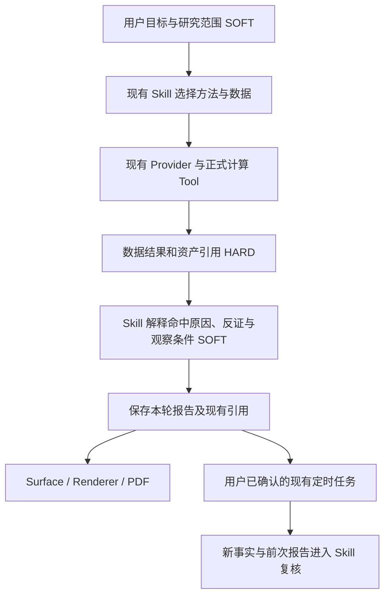

# daily_stock_analysis 深读及与 InStock、Fin Agent 的结合方案

日期：2026-09-28。性质：源码分析、离线核验与实施设计；未接入上游服务，未修改业务实现。

**建议吸收 daily_stock_analysis 的持续研究体验：证据覆盖可见、报告分层、同一股票的历史对照、自选股批量复核；吸收 InStock 的确定性指标与筛选样例；由 Fin Agent 现有 Tool、Skill、资产、调度和回测承接执行。**

新增价值应是“找到值得研究的对象 → 用证据形成判断 → 持续检查判断是否仍成立”。不以增加策略数量、多 Agent 数量或评分字段作为目标。

## 1. 阅读基线与结论边界

- daily_stock_analysis，以下简称 DSA：固定 [commit d3fee51][dsa-commit]，完整 SHA `d3fee51a9e5ebec756fe8184c1d13b2accf5e39f`，提交时间 2026-09-27 20:35:00 +08:00，根许可证为 MIT。本次 GitHub API 读取显示约 6.57 万 stars；这只能说明关注度，不能证明策略有效性。
- InStock：固定 `b6e0ca2268cfbadd02f5ed052159c187b6670231`，具体计数、算法探针和边界见[前一份报告](myhhub_stock_integration_review_20260928.md)。
- Fin Agent：HEAD `93f8815d34359f2cc6493efc47284dcc7e14afb0`，以当前工作区为准；存在用户原有未提交修改，不能把本次观察等同于干净 commit 的状态。
- DSA 阅读覆盖主 pipeline、传统/Agent 两条分析路径、15 个策略的组织方式及代表性内容、数据适配、新闻搜索、上下文与报告模型、历史比较、研究产物、通知降噪、后验评估、前端报告组件和相关测试。
- 对照 Fin Agent 的 stock-research、technical-structure-analysis、stock-screening、factor-analysis、market-overview、研报修订方法，以及金融结果注册、搜索、展示、策略运行、回测和定时任务。
- 核验限定为源码阅读、合成数据探针和离线测试。没有运行真实模型分析、行情抓取、Web 端到端、通知或生产调度。运行维不据此记为 READY。

## 2. 三个项目的“策略”含义不同

| 层次 | InStock | DSA | Fin Agent 应承担什么 |
|---|---|---|---|
| 数据与指标 | 日线、技术指标、形态、选股器字段 | 多源行情、新闻、技术与基本面上下文 | 统一数据入口、来源与时点、确定性指标口径 |
| 筛选规则 | 10 个主要返回布尔命中的函数 | 提示词描述条件，调用工具后由模型分析 | 需要复现、排名或回测的条件进入正式 Tool/代码资产 |
| 研究方法 | 较薄 | 15 个自然语言策略文件及综合分析流程 | 作为现有 Skill 的方法参考，按问题选择与组合 |
| 历史验证 | 信号后续收盘涨跌幅 | 报告/观点的方向结果与价位触达评估 | 区分研究评价、信号统计和真实组合回测 |
| 用户体验 | 筛选表、K 线、信号表现 | 自选股分析、摘要、证据状态、历史报告、推送 | 复用 Surface/Renderer，把研究变成可持续复核的资产 |

“技术指标”“确定性筛选规则”“自然语言研究方法”“组合执行策略”可以在产品中解释清楚，无需为此在核心协议增加一套策略类型枚举。

DSA 的 [strategies/README.md][strategies] 明确说这些是无需编写代码的自然语言策略；[Skill 实现][skills]将 instructions 注入提示词。因此“放量突破”YAML 本身不是可直接回测的算法，更不能把 15 个提示词当作 15 个独立验证过的 Alpha。

## 3. DSA 真正值得学习的实现

### 3.1 围绕一次研究组织数据，而不是把数据源全部交给模型

[主 pipeline][pipeline]组织行情、历史 K 线、技术分析、可选筹码、基本面、新闻、市场阶段和历史记录。基本面等辅助维度失败时保留缺口，继续其他可完成的分析；盘中数据与已完成日线有所区分。

它有传统分析和 Agent 分支。配置默认 `agent_mode=False`，选择策略等场景可进入 Agent 路径；Agent 架构默认 `single`，`multi` 是配置选项。不能根据 README 的多 Agent 宣传，推断每次分析都会执行一串专家 Agent。[配置][config]、[Agent factory][factory]可以核对这一点。

对我们有用的是“同一研究时点、各证据维度的可用性、辅助数据失败不阻塞主线”。不应照搬其整套 pipeline 或默认五维新闻搜索：Fin Agent 已由 Skill 根据问题选择取证目标；简单行情问题无需补齐全部维度。

### 3.2 显示实际证据覆盖，而不是显示一份总是完整的报告

[AnalysisContextPack][context-schema]记录数据块的来源、时间、缺失、降级、估算等信息；[builder][context-builder]从本轮已经获取的结果组装；[prompt 摘要][context-prompt]主要投影状态，刻意不展开数据值。真正的数值仍在原分析上下文内，这不是一份替代所有数据的统一事实仓库。

Agent 路径的 [news_evidence][news-evidence]跟踪实际搜索工具返回的新闻，通过上下文传播覆盖并发调用，再写回本轮报告。这个方向很有价值：不能因为运行结束后又搜到了新闻，就把它说成本轮判断已经参考的证据。

但“工具返回了 N 条”依然不等于“报告引用并支持了 N 条”。Fin Agent 应分别保留取数/返回事实和正文实际引用，展示“没有新闻结果”“有历史数据但缺最新披露”等具体缺口；不把消息条数变成研究置信度。

本地 [FinanceResultRegistry](../../src/scenarios/financial_qa/result_registry.py)已经持有 result_ref、查询范围、行数、列可用性、依赖和样本完整性，金融问答还保存 tool_calls、skill_entries、prompt_assets。优先让适配层使用这些已有事实，给 Skill 和 Renderer 提供简洁证据说明；来源时间缺失时如实保留缺失。不要再建第二份 AnalysisContextPack 字段树，也不要让模型抄写整份取数状态。

### 3.3 报告分层，结果、证据和运行诊断各有入口

DSA 的 [ReportOverview][report-overview]、[AnalysisContextSummary][context-ui]、[ReportNews][report-news]和 [ReportDiagnostics][diagnostics]把摘要、证据与运行信息拆到不同组件；[brief 模板][brief]提供适合快速浏览的同一报告视图。

可借鉴的首屏是：核心判断、支持它的少量事实、最强反证、下次检查什么。详细表格、来源与日期、K 线放在可展开部分；工具调用和失败诊断保留在过程通道。

Fin Agent 的 [stock-research 报告方法](../../src/skills/finance-business/skills/stock-research/references/report-template.md)已有命题、反证、情景、观察清单和证据附录，金融问答也已有 Surface 与 PDF 导出。主要差距在交互组织与历史使用，不在缺少另一套固定报告目录。

### 3.4 研究能够留下历史，后续再评价

[history_comparison_service][history]取同股票最近 90 天内的若干报告，默认最多 5 条，展示时间、评分、建议与趋势；它为用户理解观点是否变化提供了入口。

但这个服务没有计算“哪条新证据导致哪项命题变化”。我们应在现有报告与数据引用基础上，向前推进为证据驱动的观点复核：比较相同时点口径的新旧事实，再由 Skill 解释维持、加强、削弱或无法判断的原因。这些首先是自然语言判断，不需要增加跨系统枚举状态。

DSA 还实现了 [ResearchArtifact helper][artifact]：从已有报告派生 thesis、evidence、invalidation_conditions、next_actions。这里尤其要区分设计意图和接线现状：文档称尚未接入完整持久化/历史详情；当前 [stock_profile_service][stock-profile]已在读取画像时调用 helper。它是已有报告的派生视图，不能认定已成为全系统统一的权威研究资产。

我们的主张是“一份权威正文及其现有结果引用，多种展示视图”。条件和命题默认保持语义完整的自然语言；只有用户需要程序定时检查某项条件时，才把那个条件编译成最小可执行约定。

### 3.5 批量研究复用公共上下文，评价同时关注工具成本

[daily_market_context][daily-market]利用大盘复盘历史与缓存避免同一批次每只股票重复生成市场背景。Fin Agent 可以先一次获取共同的市场/行业事实，再对候选股分别研究。只共享同市场、同研究时点且来源可追溯的公共事实；用户持仓、偏好和未公开材料仍处于用户自己的 scope。

[trajectory metrics][trajectory]计算必要工具覆盖、重复调用、失败重试、缓存使用和步骤预算。这可以补充我们的评测：不只检查是否产出长报告，还检查是否反复查询同一事实，以及花费是否与研究目标相称。工具覆盖用于评测样本，不成为线上固定工具顺序的拒绝规则。

## 4. 15 个方法如何选择性吸收

| DSA 方法组 | 推荐去向 | 处理方式 |
|---|---|---|
| volume_breakout、ma_golden_cross、bull_trend、shrink_pullback | technical-structure-analysis；需复现的部分进入技术 Tool/策略资产 | 首批候选。计算交给程序，Skill 解释阶段、反证与后续确认 |
| expectation_repricing、event_driven、growth_quality | stock-research 的催化/预期差、公司类型、现金流质量 references | 对照现有方法做小幅补充；多数内容已有覆盖，不新增三个同义 Skill |
| box_oscillation、bottom_volume、one_yang_three_yin | 技术研究的按需方法参考 | 把平台、底部、缩量等词转成公式前，先明确窗口与适用范围；暂不作为默认筛选器 |
| hot_theme、emotion_cycle、dragon_head | market-overview、行业/主题研究 | 依赖板块广度、涨跌停、市场结构等真实数据；没有数据就不输出精确周期和龙头排名 |
| chan_theory、wave_theory | 用户明确需要时的解释性参考 | 分段和形态识别有主观性；本轮不投入自动交易规则化 |

以 [volume_breakout.yaml][volume-breakout] 为例，它把“日成交量超过五日均量两倍”“实时量比大于 2”“次日开盘确认”“情绪分加 12”“突破位下方 3% 止损”写在同一方法中。吸收前必须拆开用途：

1. **当日可计算条件**：指标定义、完整/未完成 K 线、均量窗口、突破基准由正式 Tool 明确。实时量比与完整日线成交量比可能不是同一口径。
2. **后续观察**：次日开盘尚未发生时，只能写为待验证条件，不能进入当日信号回测形成前视。
3. **研究解释**：平台突破的市场含义、失败情形、基本面配合由 Skill 处理。
4. **策略参数**：止损幅度、加仓方式、评分权重只有用户选择该具体策略时才明确，不上升为系统通用投资规则。

因此，同一个方法可同时提供一个可计算的筛选模板和一段研究参考，但二者用已有数据结果对齐；不能把 YAML 当代码执行，也不能让 LLM 重算几十只股票的量价指标。

## 5. 不宜直接移植的部分及实证

### 5.1 情绪、置信度、数据质量不是同一个分数

DSA 多处使用 sentiment_score 和固定加减分；[context builder][context-builder]还有按数据块和状态预设权重的质量总分。这适合其产品约定，却不是经过校准的金融结论概率。

更具体地，[ResearchArtifact helper][artifact]将 `abs(score - 50) / 50` 写作 confidence。本次调用真实 helper 的合成探针得到：

| 输入情绪分 | 输出 confidence | evidence 数量 |
|---|---:|---:|
| 50 | 0.00 | 0 |
| 72 | 0.44 | 0 |
| 95 | 0.90 | 0 |
| 100 | 1.00 | 0 |

同一 helper 会把一个只标记 `available`、没有时点的基本面块映射成 `fresh/good`；未提供具体证伪条件时补一个 manual 复核条件。**这些是派生 helper 的语义边界，不代表 DSA 每次真实分析都没有证据。** 它们说明这种结构完整性不能直接替代研究可信度。

Fin Agent 已有 [scoring-and-confidence](../../src/skills/finance-business/skills/stock-research/references/scoring-and-confidence.md)规范。保持缺失为缺失，用证据覆盖、冲突和关键未知解释把握程度；正式评分须有可复现公式与明确用途，不把情绪分变成胜率。

### 5.2 多 Agent 投票不能替代独立证据

DSA 的可选多 Agent 分支包含技术、情报、风险、决策、策略专家，以及冲突识别、调解、自评和修订投影；[契约][multi-contract]和 [aggregator][aggregator]将方向、置信度与历史表现参与聚合。

这些机制的存在不构成比单一研究上下文更准确的实证。多个角色可能使用同一模型和同一信息，不是独立样本；短期方向命中与长期公司质量也不适合直接加权。引入后还会增加模型调用、状态与修复分支。

我们应先在现有 stock-research 上下文里保留最强反证、冲突来源和未决问题。只有固定样本显示独立研究确实改善效果，且收益覆盖成本时，再评估特定环节是否需要并行独立分析。本轮不迁移 orchestrator、调解协议和投票系统。

### 5.3 后验方向统计不能替代组合回测

DSA 的 [backtest_engine][backtest]使用信号起点价格及后续日线高/低/收盘评价方向、止盈止损触达等；传统接口还从建议文字解析持仓方向，较新的路径支持结构化 decision signal。

这个引擎没有共享资金账户、组合约束和完整交易成本模型。其模拟 entry 是传入的 start_price，不能据此宣称实现了次日可成交价格。不要用它替换 Fin Agent 的现有组合账本和 next-open 执行语义。

[skill opinion outcome evaluator][outcomes]按固定周期和引擎版本保留后验样本，有助于避免将未成熟结果算作命中率。可吸收的是“研究发表时冻结记录，再在预先约定的观察期评价”的方法。研究评价、信号收益统计和含成交/成本的回测结果必须分别解释。

### 5.4 多数据源与多市场是适配工作，不是功能开关

DSA [data_provider/base.py][providers]支持优先级切换、预算与并发控制；[市场支持说明][market-support]同时表明各市场数据覆盖不一致。六个市场可输入股票代码，不等于六个市场都支持同等基本面、广度、复权和成交规则。

可学习它的适配器契约测试与辅助数据失败处理，尤其是同实体、同报告期、同频率和同单位的检查。Fin Agent 应通过现有数据 Provider 添加确有需求的数据能力；替代源若口径不同，要暴露口径差异。空结果不能自动当作连接故障触发无止境换源。

[新闻过滤][search]对发布日期和查询窗口进行处理，值得对照现有 SearchGateway 的发布时间过滤查缺补漏。不能将抓取时间当发布时间，也不应整体搬入大量关键词补丁和来源特例。

### 5.5 通知降噪的产品经验可用，运行状态不能照抄

[notification_noise.py][notification]支持去重、冷却、静默时段和摘要，但明确采用进程内状态。它不保证跨进程、跨重启的通知幂等。

Fin Agent 已有 owner scope、不可变运行快照、租约恢复和至少一次执行的[定时任务](../scheduled_task_runtime.md)。未来用户授权推送时，使用现有任务运行身份和通知通道的持久化幂等能力承接；不要新增一套 GitHub Actions 调度器或复制进程内 dict 作为服务端唯一状态。

## 6. 与我们现有架构结合的最小路径

**这是现有主线的能力补充，不是新增研究协议。** 系统持有身份、权限、研究时点、资产修订和结果引用；Tool 负责公式和查询；Skill 负责判断、反证与解释；Renderer 负责首屏和展开层次。

| 能力 | 当前落点 | 最小增量 | 所属责任 |
|---|---|---|---|
| 技术指标统一 | stock_quote_tool、正式技术 Tool、策略代码 | 抽取可复用确定性计算；锁定窗口、复权、预热和空值语义 | Tool/计算实现 |
| 研究方法增强 | stock-research、technical-structure-analysis、market-overview references | 增补有价值的条件与反证，删掉重复说明和固定加减分 | 业务 Skill / SOFT |
| 证据摘要 | FinanceResultRegistry、result_refs、工具元数据 | 从已有结果投影来源、截至日、实际缺口；不要求模型重复事实 | 适配与展示 |
| 报告与历史 | 金融问答保存结果、Surface、PDF、现有会话历史 | 先引用前次报告，再提供同股票历史入口；用正文承载变化原因 | SOFT + 现有资产框架 |
| 自选股日报 | 现有 Tool/Skill 资产、scheduled_task_* | 一次市场公共取数，逐候选复核；结果链接到同一份报告 | 调度复用 + 业务 Skill |
| 信号与后验评价 | strategy_run_service、strategy_backtest_service、tests/evals | 明确筛选输出语义，保存发表时快照，增加独立研究评价样本 | 正式 Tool 与评测 |

两项现有实现约束必须先认清：

- `stock_quote_tool._compute_tech_indicators` 已有 MA/MACD/RSI 实现。其窗口与初始化口径不能在“引入更多指标”时悄悄改变；先形成共同来源与回归样本，避免第三份指标实现。
- 旧 `QuantFactorScreeningService` 接收 factor_plan，但实际评分代码仍是固定 momentum/liquidity/moneyflow/catalyst 公式；上一份报告已用探针确认修改因子方向未改变排序。不能把它包装成已经支持任意 DSA/InStock 策略的执行器。优先通过现有工具开发主线生成明确代码资产与版本，再接 StrategyRunService。

## 7. 统一实施顺序与验收

### 第一阶段：让已有研究更可见、更可复核

目标：同样的一次研究，用户能快速看懂结论依据和证据局限。

- 先整理现有报告首屏与证据展开视图，按本轮真实 result_refs 和来源元数据展示，复用现有 Surface。
- 在 stock-research 现有方法里对照吸收“预期差、事件兑现、趋势确认与失败条件”，不复制 15 个 YAML，也不扩大系统输出 Schema。
- 增加固定评测样本：行情陈旧、新闻零结果、辅助源失败、财务与技术冲突、盘中与收盘问题、报告二次追问。
- 验收：新闻为空仍能完成有证据的分析；不补零/补 50 分；无法取得的来源日期不变成 fresh；网页与 PDF 使用同一报告；用户能展开看见支撑关键判断的实际来源。

### 第二阶段：把 InStock 的确定性筛选接到研究前面

目标：用户可以解释性地筛出候选，再对少量候选进行研究。

- 建立共享指标函数，首批选择前一份报告建议的三个小模板：持续放量、均线趋势、明确排除当日窗口的前高突破。修正命名与公式，不照抄上游偶然行为。
- 需要排名、权重、组合约束时写入具体策略代码和用户确认的设计，不交给模型口头排序。
- 把 DSA 的技术方法用于解释“为什么命中、什么情况会失败”，把 growth_quality / expectation_repricing 用于候选进一步研究。
- 验收：固定行情 fixture 的公式正确；当日决策不读次日数据；空候选可正常结束；同数据同资产版本可复现；命中规则与最终组合执行之间有现有明确的输出适配。
- 若进入组合回测，继续使用 Fin Agent 的 SelectionOutputProfile、SelectionSnapshot 和账本。当前动态历史股票池等边界仍须遵守，不能用今日股票池包装历史可交易结果。

### 第三阶段：自选股日报与观点持续复核

目标：一次研究可以被后续事实更新，而不是每日生成互不相干的长文。

- 首版直接使用用户当前持仓/自选清单或明确输入的代码列表，无需先建设新的股票池管理平台。
- 由现有定时任务执行已确认的研究任务；“A 股收盘后”应在业务工具内核对实际交易日和有效行情日期，周一到周五的 cron 不等于交易日。
- 先复用共同市场事实，再逐股比较新旧证据。摘要回答“新增什么事实、哪个判断受影响、什么仍未解决”；完整报告保留链接。
- 区分数据变动、口径/模型/Skill 版本变化、仅措辞变化。正文改写本身不应触发“观点重大变化”。
- 通知作为单独、后续授权的通道能力；只对用户关注的实际变化或明确执行故障通知，复用报告内容和任务运行身份，不为每个通道重新请求模型。
- 验收：无新证据时不虚构新判断；新公告能定位到对应命题；运行恢复不重复产生通知副作用；前次报告可读取且权限正确；历史日线、报告发布日期和本次研究时点一致。

### 后续研究项

发表时冻结报告/模型/Skill/代码版本及证据引用，成熟后再按预设期限评价；先做离线观察，不自动改变线上策略权重。筹码分布、61 个 K 线形态和更复杂技术流派排在后面，以明确业务需求和有效性样本决定投入。

新增 HARD 字段只有在已有记录确实无法定位前次报告、重放输入、控制权限或执行条件时才考虑；优先扩展已有可选元数据。届时补正常流、兼容输入和真正严重错误的协议测试，不引入展示用途状态机。

## 8. 一个贯穿三者的用户场景

用户提出：“从我的 A 股自选股里找近期放量突破、经营没有明显恶化的公司，解释主要机会与反证，收盘后继续观察。”

1. Fin Agent Skill 理解周期、股票范围和研究重点。规则阈值通过设计说明或用户明确偏好确定，系统不假定统一投资风格。
2. 正式 Tool 用统一指标计算候选，返回命中条件及所用行情；这一步吸收 InStock。
3. 同一个研究上下文按候选的重要问题取财务和事件证据，结合趋势确认、预期差和成长质量方法；这一步选择性吸收 DSA。
4. 展示一页结论与证据，保留最强反证和下一观察点。没有最新新闻就写清缺口，不把技术信号自动升级为公司质量判断。
5. 用户在现有定时任务预览里确认执行时间、对象和任务；后续读前次报告与新数据，解释变化。任何通知均遵循用户选定通道与条件。
6. 如果用户进一步要求历史收益验证，再走正式策略资产与组合回测；研究文字和“看多”不直接转换成下单动作。

## 9. 本次验证与可复现证据

- DSA：选取 5 个测试文件，**124 passed / 3 deselected，1.74 秒**。覆盖 backtest engine、通知降噪、ResearchArtifact helper、上下文摘要和轨迹指标。使用 Fin Agent Python 环境、`--noconftest`，跳过上游为 Web/异步测试全局替换事件循环及 TestClient 的钩子；显式排除 3 项依赖完整工具注册的测试。没有安装完整上游依赖，因此不是上游标准环境的全量通过结论。
- Fin Agent：研究方法组合、Skill 搜索授权、研究模式、SearchGateway 与新闻、定时任务五组，**50 passed，13.42 秒**；一个 python_multipart 的依赖弃用提示。
- 合成探针：直接调用固定版本的 ResearchArtifact helper，复现情绪分转 confidence、无时间 available 转 fresh、无具体证伪条件补 manual 三项行为。它检验 helper 语义，不评价真实金融样本效果。
- 运行环境 Python 3.12.14；上游 SHA、Fin Agent HEAD、工作区 dirty 标记、关键源码和测试文件 SHA-256 见 [probe_results.json](evidence/daily_stock_analysis_review_20260928/probe_results.json)。
- 完整命令和原始测试输出见 [test_results.txt](evidence/daily_stock_analysis_review_20260928/test_results.txt)，探针源码见 [review_probe.py](evidence/daily_stock_analysis_review_20260928/review_probe.py)。

本次只新增分析文档和证据文件。后续如复制实现片段，分别保留 DSA 的 MIT、InStock 的 Apache-2.0 许可信息；数据供应商的使用权限仍按原数据来源处理。

[dsa-commit]: https://github.com/ZhuLinsen/daily_stock_analysis/commit/d3fee51a9e5ebec756fe8184c1d13b2accf5e39f
[strategies]: https://github.com/ZhuLinsen/daily_stock_analysis/blob/d3fee51a9e5ebec756fe8184c1d13b2accf5e39f/strategies/README.md
[skills]: https://github.com/ZhuLinsen/daily_stock_analysis/blob/d3fee51a9e5ebec756fe8184c1d13b2accf5e39f/src/agent/skills/base.py
[pipeline]: https://github.com/ZhuLinsen/daily_stock_analysis/blob/d3fee51a9e5ebec756fe8184c1d13b2accf5e39f/src/core/pipeline.py
[config]: https://github.com/ZhuLinsen/daily_stock_analysis/blob/d3fee51a9e5ebec756fe8184c1d13b2accf5e39f/src/config.py
[factory]: https://github.com/ZhuLinsen/daily_stock_analysis/blob/d3fee51a9e5ebec756fe8184c1d13b2accf5e39f/src/agent/factory.py
[context-schema]: https://github.com/ZhuLinsen/daily_stock_analysis/blob/d3fee51a9e5ebec756fe8184c1d13b2accf5e39f/src/schemas/analysis_context_pack.py
[context-builder]: https://github.com/ZhuLinsen/daily_stock_analysis/blob/d3fee51a9e5ebec756fe8184c1d13b2accf5e39f/src/services/analysis_context_builder.py
[context-prompt]: https://github.com/ZhuLinsen/daily_stock_analysis/blob/d3fee51a9e5ebec756fe8184c1d13b2accf5e39f/src/analysis_context_pack_prompt.py
[news-evidence]: https://github.com/ZhuLinsen/daily_stock_analysis/blob/d3fee51a9e5ebec756fe8184c1d13b2accf5e39f/src/agent/news_evidence.py
[report-overview]: https://github.com/ZhuLinsen/daily_stock_analysis/blob/d3fee51a9e5ebec756fe8184c1d13b2accf5e39f/apps/dsa-web/src/components/report/ReportOverview.tsx
[context-ui]: https://github.com/ZhuLinsen/daily_stock_analysis/blob/d3fee51a9e5ebec756fe8184c1d13b2accf5e39f/apps/dsa-web/src/components/report/AnalysisContextSummary.tsx
[report-news]: https://github.com/ZhuLinsen/daily_stock_analysis/blob/d3fee51a9e5ebec756fe8184c1d13b2accf5e39f/apps/dsa-web/src/components/report/ReportNews.tsx
[diagnostics]: https://github.com/ZhuLinsen/daily_stock_analysis/blob/d3fee51a9e5ebec756fe8184c1d13b2accf5e39f/apps/dsa-web/src/components/report/ReportDiagnostics.tsx
[brief]: https://github.com/ZhuLinsen/daily_stock_analysis/blob/d3fee51a9e5ebec756fe8184c1d13b2accf5e39f/templates/report_brief.j2
[history]: https://github.com/ZhuLinsen/daily_stock_analysis/blob/d3fee51a9e5ebec756fe8184c1d13b2accf5e39f/src/services/history_comparison_service.py
[artifact]: https://github.com/ZhuLinsen/daily_stock_analysis/blob/d3fee51a9e5ebec756fe8184c1d13b2accf5e39f/src/services/research_artifact_service.py
[stock-profile]: https://github.com/ZhuLinsen/daily_stock_analysis/blob/d3fee51a9e5ebec756fe8184c1d13b2accf5e39f/src/services/stock_profile_service.py
[daily-market]: https://github.com/ZhuLinsen/daily_stock_analysis/blob/d3fee51a9e5ebec756fe8184c1d13b2accf5e39f/src/services/daily_market_context.py
[trajectory]: https://github.com/ZhuLinsen/daily_stock_analysis/blob/d3fee51a9e5ebec756fe8184c1d13b2accf5e39f/evals/agent_trajectory/metrics.py
[volume-breakout]: https://github.com/ZhuLinsen/daily_stock_analysis/blob/d3fee51a9e5ebec756fe8184c1d13b2accf5e39f/strategies/volume_breakout.yaml
[multi-contract]: https://github.com/ZhuLinsen/daily_stock_analysis/blob/d3fee51a9e5ebec756fe8184c1d13b2accf5e39f/docs/multi-strategy-contract.md
[aggregator]: https://github.com/ZhuLinsen/daily_stock_analysis/blob/d3fee51a9e5ebec756fe8184c1d13b2accf5e39f/src/agent/skills/aggregator.py
[backtest]: https://github.com/ZhuLinsen/daily_stock_analysis/blob/d3fee51a9e5ebec756fe8184c1d13b2accf5e39f/src/core/backtest_engine.py
[outcomes]: https://github.com/ZhuLinsen/daily_stock_analysis/blob/d3fee51a9e5ebec756fe8184c1d13b2accf5e39f/src/core/skill_opinion_outcome_evaluator.py
[providers]: https://github.com/ZhuLinsen/daily_stock_analysis/blob/d3fee51a9e5ebec756fe8184c1d13b2accf5e39f/data_provider/base.py
[market-support]: https://github.com/ZhuLinsen/daily_stock_analysis/blob/d3fee51a9e5ebec756fe8184c1d13b2accf5e39f/docs/market-support.md
[search]: https://github.com/ZhuLinsen/daily_stock_analysis/blob/d3fee51a9e5ebec756fe8184c1d13b2accf5e39f/src/search_service.py
[notification]: https://github.com/ZhuLinsen/daily_stock_analysis/blob/d3fee51a9e5ebec756fe8184c1d13b2accf5e39f/src/notification_noise.py
