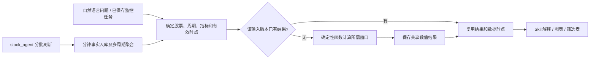

# 分钟数据刷新、按需计算，以及龙虎榜和竞价来源

2026-09-28。设计与源码核验；本篇核验没有调整采集频率、请求上游行情、启动任务、修改数据库或部署代码。用户随后允许研究分钟按需直取与龙虎榜网页双源，修订方案及后续公开点测见[10 实时补取与采购](10_realtime_lhb_auction_procurement.md)。

**建议保留现有十分钟分批采集承担基础覆盖，即时问题在供应商预算内按需补取并计算，订阅监控对订阅并集持续刷新/计算；相同输入结果共享缓存。十分钟延迟不能满足当前突破等时效敏感问题。龙虎榜适合披露后以东财主取、新浪备用，通过基本抽取检查后入库；竞价过程须单独选源验证。**

## 1. 已核实的现状，不再假设需要重建采集器

按用户提供的位置，读取了 `/Volumes/ext/stock_agent` 及工作线程“Review分钟K线迁移与配置改动”。本地stock_agent HEAD为 `33073b60c13a98cf7919e9a03ad7fee07a8184a2`；源码、启动脚本、文档对以下参数一致。线程里的服务器检查是历史记录，本轮没有重新读取服务器运行参数。

| 项目 | 现有实现 |
|---|---|
| 调度 | 每10分钟边界后5秒触发，交易日/交易时段内运行 |
| 范围 | 按本地 `stock_name.tsv` 名单；本次按同一解析规则数得5,708个代码，不能当作当前上市A股总数 |
| 分批 | 每批1,000只，批内12并发；批间冷却40秒 |
| 网络接口 | 每只股票一次单证券 `kLineData` 请求；固定取最近20根1分钟K。**1,000只是客户端分组，不是一次HTTP请求取得1,000只** |
| 预算 | 单批抓取截止60秒，日内整轮目标预算420秒；达到截止条件会停止后续批次 |
| 截止时点 | 同一轮冻结同一截止分钟；晚返回的批次也过滤掉截止分钟之后的K线 |
| 入库 | 每批1分钟bar幂等upsert；同一事务内重算受影响3/5/10/15/30/60分钟窗口和当日日K，再提交 |
| 收盘轮 | 15:00不因整轮420秒预算截断已规划批次；源码仍保留单批抓取超时的停止条件，不代表绝不缺数 |
| 补数 | 常驻任务不回扫更早历史；另有低优先级补缺脚本，线程记录它会给实时任务让路 |

源码：[刷新任务](/Volumes/ext/stock_agent/src/market_realtime_kline_refresh.py:690)、[启动参数](/Volumes/ext/stock_agent/scripts/run_market_realtime_minute_snapshot.sh:19)、[数据库聚合](/Volumes/ext/stock_agent/src/market_realtime_kline_refresh.py:504)、[独立历史补缺脚本](/Volumes/ext/stock_agent/scripts/backfill_minute_gap.py:1)。本轮只读这些文件，没有执行采集模块；模块正常运行会建表/写库，不能用于只读探测。

### 对此前时点差的修正解释

之前14:41左右抽样，平安银行到14:40，而茅台、宁德时代到14:30。**分批提交足以解释这个现象，不能仅凭这次差异就判断上游异常。** 具体当日批次是否全部成功，需要该轮日志；上游服务保障是否明确则是另一项问题。

须区分：

- **数据粒度**：每根bar是1分钟。
- **刷新间隔**：每10分钟启动一轮。
- **用户看到的数据年龄**：当前时间减去最后已完成bar的市场时间。

例如14:40这一轮的末批14:46才提交，14:45查询该批股票时仍可能看到14:30。因此10分钟触发不保证数据年龄≤10分钟。在单股发布滞后7分钟的示例中，下一轮落库前的数据年龄可接近17分钟；420秒是目标预算，包含抓取等待、写库等因素后并不是硬SLA，17分钟也不是已验证上限。

### 当前预算有多紧

按本地5,708只计算，共6批，仅5次批间冷却就用200秒，420秒预算剩220秒给所有网络抓取、处理和数据库写入。忽略DB与所有开销，12并发的理想平均请求耗时也需约≤0.463秒，才可能在剩余时间完成5,708次请求；实际还受慢请求、分批边界和写库影响。

这只是必要条件的粗算，不是服务压测或供应商限额。相同规模每10分钟一轮约571次请求/分钟（跨整轮平均）；改成每分钟全市场一轮，基础请求量约放大10倍。首期不能通过直接缩短全市场间隔来解决交互新鲜度。

计算证据：[minute_event_design_evidence.json](../evidence/data_capability_inventory_20260928/minute_event_design_evidence.json)。

## 2. 即时按需计算与缓存可以同时成立

**按需计算和按需补取分别决策，也不等于每个用户都重新取数、重新计算。** 现有批量路径在新批次提交后更新输入；仅反复计算旧数据不会变新。用户问题要求更近时点时，修订方案允许在统一限额内补取最新尾段，不必等待下一轮批量提交。

| 内容 | 建议运行方式 | 缓存/入库方式 |
|---|---|---|
| 1分钟事实和已有多周期K | 基础分批采集及库内聚合；即时需求按需补取尾段 | 同股同时请求合并、事实共享；不重复抓5/15/30分钟源 |
| 单股/自选股MA、MACD、RSI、ATR、BOLL等 | 用户第一次请求该输入版本时算；第二次直接复用 | 以证券、周期、截止bar、输入版本或窗口指纹、价格口径、公式修订和参数定位 |
| 用户已订阅的持续监控 | 对订阅股票并集，在新数据提交后计算监控真正需要的指标 | 跨用户相同计算合并；用户规则/通知仍归各自任务 |
| 同分钟量能对比 | 历史同分钟基线盘后计算；当前累计量随数据入库更新 | 历史基线按交易日版本长期复用，当前结果按截止分钟复用 |
| 长窗口筹码、复杂统计、自定义研究 | 明确请求后执行；按成本决定订阅范围 | 参数相同且无私有输入可共享；不挂进采集器同步提交路径 |
| 尚未结束bar的试算 | 只在存在对应输入、用户确需观察时提供 | 明确是临时值；按实际输入变化失效，不能与完成bar结果混用 |

例如14:40截止的5分钟RSI第一次算出后，100名用户读取同一股票、同一参数，可以复用该版本；等14:50新一轮数据到达后再算。这里缓存复用的是明确时点的结果，没有把14:40包装成14:49的实时状态。

**缓存的新鲜度由输入决定，TTL只负责回收。** 已完成bar也可能被数据源修订，不能只按最后时间戳永久命中；旧bar修正而末端时间不变时，相关窗口仍须失效。优先利用现有数据元信息/输入指纹；不要求模型生成或管理这些事实。

首期直接对所需历史窗口做固定公式计算即可。EMA等可增量维护，但这属于后续实测需要时的优化，必须保持同一初始化和修订规则，不能为省计算导致全算与增量结果不同。

### 用户问“现在”时如何表现

单股问题先匹配所需时点：复盘或明确历史窗口可以直接用库内数据；“现在是否突破”等问题则在统一供应商预算内按需补取并立即计算，不必要求先开持续监控订阅。响应标明实际输入时间；补取失败可展示旧时点参考，但不能将其作为当前状态的确认。持续监控才需要主动提高相应股票的刷新频率。

全市场筛选/排名默认按共同截止时点比较。某轮只落库了前两批时，可展示上一轮已核实完整的截面；用户愿意接受部分范围时展示该时点覆盖数和范围。不能把一部分14:40和另一部分14:30的结果不加说明地称为“同一时点全市场排名”。共同截面是可比较的截止点，不要求把全部批次改成一个大事务提交。

5分钟RSI14使用14根5分钟bar；“盘中日线RSI”使用历史日线及当日临时bar；“同刻量比”使用历史相同时间窗口。三者输入和用途分别登记，不能混用“分钟指标”名称。

## 3. 现有实现中应优先处理的衔接

1. **复用现有入口和供应商预算。** Fin Agent正式分钟查询已经读库；旧工具还存在直连分钟接口的方法。统一入口按时间要求判断是否补取，缓存miss本身不是重抓原始数据的理由。现有实时快照mode=2若参与同一业务，也要计入对应供应商的总请求预算，不能只限制后台刷新进程。
2. **保持同轮统一截止和分批提交。** 它已经解决了晚批次漂移到更新窗口的问题；无需重建全市场采集服务。
3. **区分已到结束时间与输入完整。** 当前多周期聚合的 `is_finalized` 判断主要是最后源bar到达窗口结束时间；若中间缺一根，仍可能标完成。计算时结合已有 `source_bar_count`、预期交易时段与数据源停牌/无成交约定检查所需窗口；缺失不能填零再算量比。这里处理的是影响确定性公式的真实缺数，不增加系统层业务判断状态。
4. **预算不足时保证轮转公平。** 当前固定名单顺序，触发单批/整轮截止会停止后续批次。若连续出现截断，尾部可能反复未覆盖；可在现有任务内轮转起始批次或优先上轮未完成对象。先从运行日志确认发生频率，不增加并发掩盖压力。
5. **20根重叠不等于历史修复。** 它用于正常周期及晚批次的重叠覆盖；长故障、连续跳过、较晚抓取都可能超出可恢复范围。已有独立补缺路径继续在低优先级下工作，不能把历史大回扫塞进实时轮次。
6. **长期基线要有长期来源。** 相关线程约定snapshot保留最近5个有数据交易日，full归档留史，归档清理由数据库事件执行；该状态是历史记录，本轮未重新核对事件。20日同刻基线不能依赖热表偶然保留更久的数据，需明确full读取入口、完整性和索引。

源码支持：[单源请求](/Volumes/ext/stock_agent/src/market_realtime_kline_refresh.py:168)、[固定名单读取](/Volumes/ext/stock_agent/src/market_realtime_kline_refresh.py:293)、[结束标记与计数](/Volumes/ext/stock_agent/src/market_realtime_kline_refresh.py:547)、[截止时停止后续批次](/Volumes/ext/stock_agent/src/market_realtime_kline_refresh.py:771)、[Fin旧直连方法](../../../src/tools/stock_quote_tool.py:300)。

后续的高频订阅应复用同一个供应商预算：按所有用户的股票并集去重，只对确有监控需求的范围提高频率，其余保留基础刷新。12并发和40秒冷却是现有节流参数，不是跨所有进程已统一限额的证明。先在现有调度内承接需求和去重，不新增一套通用调度框架。

## 4. 龙虎榜：两个仓库实际怎么取

| 仓库/路径 | 实际输入与输出 | 可用性判断 |
|---|---|---|
| InStock 东方财富龙虎榜 | `datacenter-web.eastmoney.com/api/data/v1/get`；`RPT_DAILYBILLBOARD_DETAILSNEW`取每日上榜明细，有分页 | 属于网站取数链路，可研究其字段映射；没有据此证明生产稳定性 |
| InStock 个股席位 | `stock_lhb_stock_detail_em`按证券、日期、买卖方向读取买/卖榜，返回营业部名、金额、净额等 | 有席位级取数函数，但本次未发现它接入常规入库作业；不能认为完整席位仓已现成可搬 |
| InStock 新浪分支 | 页面HTML及表格解析，另有统计函数 | 对页面结构依赖明显；存在函数不代表主任务有独立故障切换保障 |
| DSA 龙虎榜上下文 | AkShare候选函数 `stock_lhb_stock_statistic_em`、`stock_lhb_detail_em`、`stock_lhb_jgmmtj_em` | 都是东方财富系数据；换函数不等于换独立供应源 |
| DSA最终研究块 | `is_on_list/recent_count/latest_date`等简要信号 | 不是完整席位明细服务，不能直接支持席位买卖网络/跨股汇总 |

InStock请求包装有超时、重试与分页等待，也依赖Cookie/网站头；新浪分支直接解析HTML，所查日明细函数没有显式请求timeout。这些能改善个人使用体验，不构成已确认的发布时效、结构兼容或全量覆盖保障。

DSA这段龙虎榜函数调用候选接口时没有明确传入起止日期，而在结果上再做窗口过滤；统计表与明细表的语义也不同。离线运行其实际方法，给一条“上榜次数7”的近期汇总行，输出 `recent_count=1`；给一条60天前记录，20天窗口输出 `is_on_list=false` 但 `recent_count=1`。这是合成输入的语义验证，不是在线数据质量抽样；说明摘要逻辑也需要重做口径，不能只换一个数据域名就照搬。

固定源码：[InStock龙虎榜](https://github.com/myhhub/stock/blob/b6e0ca2268cfbadd02f5ed052159c187b6670231/instock/core/crawling/stock_lhb_em.py#L731)、[请求包装](https://github.com/myhhub/stock/blob/b6e0ca2268cfbadd02f5ed052159c187b6670231/instock/core/eastmoney_fetcher.py)、[DSA龙虎榜摘要](https://github.com/ZhuLinsen/daily_stock_analysis/blob/d3fee51a9e5ebec756fe8184c1d13b2accf5e39f/data_provider/fundamental_adapter.py#L529)。离线证据见前述JSON及[探针](../evidence/data_capability_inventory_20260928/probe_minute_event_design.py)。

### 我们的引入方式

向现有供应商核对覆盖的同时，按用户新确认采用东财主源、新浪备用；主源失效才切换，不增加日常交叉裁决。通过基本抽取检查后按披露批次盘后统一入库，保留证券、披露日期、统计起止期、上榜原因、营业部/席位、买卖方向、金额和来源。榜单可能覆盖单日或多日；同一席位可能同时出现在买卖榜及多个理由下，汇总时不能重复计入。席位披露也不能直接等同于某个投资者的真实持仓变化。最新点测与主备方案见10。

龙虎榜不是需要每分钟刷新的盘中指标，适合全体用户共享；问答/筛选从库内按需聚合，Skill解释披露含义。上交所本身提供[交易公开信息查询](https://www.sse.com.cn/disclosure/diclosure/public/inquirydata/index.shtml)，可用于样本对照，但官网可查不等于存在适合我们批量生产调用的稳定API。

## 5. 竞价：需要先分清三类数据

| 数据 | 能回答的问题 | 获取与计算方式 |
|---|---|---|
| 竞价结束后的成交结果 | 开盘成交金额、相对历史竞价放量、高开幅度 | 结果发布后取一次/少量校核并入库；指标可离线或按需算 |
| 竞价过程的参考价、匹配量、未匹配量等序列 | 竞价期间供需如何变化 | 需要当时的专门行情覆盖；普通连续交易分钟K无法重建全过程。因子可按需算，原始时序须预先采集或由历史服务提供 |
| 通达信“抢筹”等专有榜单 | 在该供应商定义下哪些股票排前列 | 供应商派生值，不能当作完整竞价事实，也不能假装由普通K线等价复算 |

InStock的 `stock_chip_race_open/end` 请求 `excalc.icfqs.com:7616` 的TQLEX服务，使用源码内固定Token及客户端风格请求头；参数固定 `offset=0,count=100`，没有翻页循环。输出为抢筹金额、幅度、占比等派生列。所查代码没有显式网络超时。这不是全市场原始竞价采集器；榜单外股票不能当作“没有竞价抢筹”。本轮没有使用其Token或Cookie调用该服务。

DSA中 `closing_auction` 主要是交易阶段上下文；筛选服务的“竞价上涨/下跌”是东方财富异动类型标签。源码核对未发现与之对应的完整竞价原始序列采集。不能把这两类名字当作已有竞价数据源。

固定源码：[InStock抢筹榜单](https://github.com/myhhub/stock/blob/b6e0ca2268cfbadd02f5ed052159c187b6670231/instock/core/crawling/stock_chip_race.py#L16)、[DSA阶段定义](https://github.com/ZhuLinsen/daily_stock_analysis/blob/d3fee51a9e5ebec756fe8184c1d13b2accf5e39f/src/core/trading_calendar.py)、[DSA异动标签](https://github.com/ZhuLinsen/daily_stock_analysis/blob/d3fee51a9e5ebec756fe8184c1d13b2accf5e39f/src/services/screening_service.py#L2019)。

交易所即时行情本身区分竞价参考价、匹配与未匹配量，参见[上交所2026年交易规则5.2.1](https://www.sse.com.cn/lawandrules/sselawsrules2025/stocks/exchange/c/c_20260424_10816482.shtml)。这是数据语义参考，不代表本轮接入交易所行情。

### 有文档的供应接口也要核对口径

作为能力调研，Tushare官方文档可确认：

- [top_inst](https://tushare.pro/wctapi/documents/107.md) 提供营业部、买卖侧、金额和上榜原因，并设权限门槛；可作为席位字段需求参考。
- [stk_auction](https://tushare.pro/wctapi/documents/369.md) 描述的是竞价结束后的当日成交结果，可在9:26–9:29间获取；独立权限，不能用于9:20时的实时过程判断。
- [stk_auction_o](https://tushare.pro/wctapi/documents/353.md) 文档标记为9:30窗口、盘后20点更新；它和前者不能仅因名字相似就作为互相替换的数据源。

这不是采购推荐或已接入声明。官方仓库还存在一份2026-09-19提交的[竞价全零值与跨接口口径核查反馈](https://github.com/waditu/tushare/issues/1927)，当前读到的是用户报告，未作为已证实供应商缺陷。它说明正式文档、权限收费也不能替代对采样时段、单位、空值含义、覆盖、修订与支持响应的试用核验。优先盘点当前供应关系，再决定是否需要任何新增供应商。

## 6. 融合范围收敛

1. 在Fin Agent接好已有分钟库的时点、完整窗口与按需计算；即时需求通过统一预算补取，使用共享事实和数值缓存。
2. 保存连续监控需求后，对订阅并集按需要的频率更新并计算相应指标；个性化解释/通知属于原有用户任务，不必每批都调用模型。
3. 需要高频权益时，再结合实际采集日志的各批耗时、未完成数和供应商预算决定可服务股票数。优先级不突破总限额；未证明容量前不承诺1分钟更新。
4. 龙虎榜按盘后网页主备取数，通过基本抽取检查后入库，再引入席位分析方法；竞价明确“结果”或“过程”，分别试用正式接口，不直接搬InStock专有抢筹抓取器。

系统继续持有数据时点、结果版本、任务归属与执行证据；Skill决定如何解释延迟、缺口和分析用途。利用现有字段和结果引用，不新增统一业务状态机或为每种指标扩张Output Schema。
