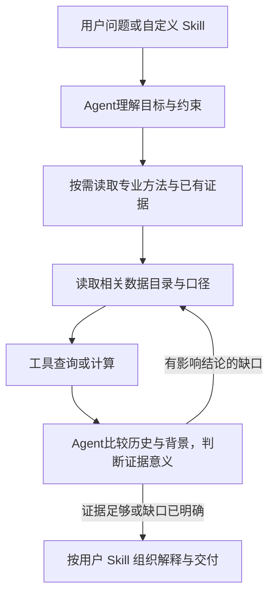

# 指标、专业方法与用户 Skill 的使用流程

核对日期：2026-09-29。本文明确现有能力的职责与合理使用方式，不增加运行协议、数据库表或新的调度层。方案流程与实测状态分别说明。

## 先回答“这个 Skill 是什么”

本轮完善的是现有 `technical-structure-analysis`，中文名称为“技术结构分析”，属于技术分析方法；同时更新了 `factor-analysis` 和 Skill 编写指导。没有建立一个拥有全部指标的“指标 Skill”。

| 对象 | 保存什么 | 谁使用 |
|---|---|---|
| 共享数据与计算 | 原始行情、已发布日线指标、分钟按需计算结果及实际证据 | 所有有权限的数据请求与分析流程 |
| 数据目录 | 指标含义、用途、单位、时间/公式口径、可用字段及调用方法 | Agent 查找能力并构造准确查询；用户也可直接提出取数请求 |
| 专业方法 Skill | 如何提出问题、选择证据、比较、解释和停止 | Agent 可按任务加载；同一方法可服务多个用户 Skill |
| 用户自定义 Skill | 用户的研究目标、对象范围、偏好、约束和交付方式 | Agent 执行用户自己的研究流程，按需参考专业方法并查询共享数据 |

Skill 本身是方法文本。执行者是 Agent：读取方法、查询数据、解释证据。`related_skills` 在编写服务里表示 `composition_context`，不是自动递归执行另一 Skill 的函数调用，也不自动授予工具权限。

## 专业方法的分工

| 方法 | 适用问题 | 与指标的关系 |
|---|---|---|
| `technical-structure-analysis` 技术结构分析 | 趋势、量价、动量、波动、关键位置与结构变化 | 自主选择有用技术指标，不拥有或垄断其查询入口 |
| `factor-analysis` 因子分析 | 股票特征的横向差异、纵向变化及有证据时的有效性研究 | 不限技术因子；估值、质量、成长等仍从各自数据视图读取 |
| `kline-analysis` 个股K线与近期形态解读 | 图表、近期形态及形态后续演变 | 按需使用同源行情、指标和真实可调用的形态/视觉能力 |
| `kline-basic-reading` 近期K线基础解读 | 未受候选形态影响的近期走势图解读 | 为K线综合分析提供基础背景，不必作为每次技术问答的入口 |
| `relative-strength-analysis` 相对表现分析 | 与行业、宽基或风格基准的同期表现比较 | 使用对齐后的个股与基准证据 |

这些是可组合的方法，适用范围可以重叠。一次任务围绕用户目标选主方法，缺什么再补相关方法；不强制串行跑完全部 Skill。简单指标查询可以直接走数据工具。

## 三种入口，共用数据能力

1. **直接取数**：“这只股票最近20日的RSI如何变化？”Agent读取对应目录，查询序列并按需展示；不必先完成一份技术分析报告。
2. **直接分析**：“这只股票最近是不是转弱了？”Agent按当前语义选择技术方法，先了解价格与成交背景，再查询能区分当前解释的指标。
3. **执行用户 Skill**：“按我的持仓复盘方法分析这些股票。”Agent读取用户方法，遵循其目标与约束，按需参考技术、因子、基本面等方法，查询同一套数据后完成用户要求的综合判断。

三种入口都可以继续追问或补查。数据不会因为第一次被某个 Skill 使用，就只能由该 Skill 访问。用户明确要求特定指标或公式时保留其要求；未指定时由 Agent 选择。缺少注册能力或数据时明确缺口，不把文字中提到的方法当成已经执行过。

## 编写时与执行时分开

**编写时**保存长期有效的目标、约束和使用方法，关联当前确实存在的专业方法与工具。不把某只股票今天的异常、固定指标套餐或临时分析结果固化成未来每次运行的必选项。生成的候选仍沿用现有保存、发布和权限流程。

例如用户只需写：

> 对我的持仓做复盘。结合近期技术面和必要的因子信息，解释值得注意的变化，以及这些变化是否影响原有判断。指标由你结合股票情况选择，重点说明依据和反证，没有明显变化时简要说明。

这段目标应保留在用户 Skill 中；不要求用户补写RSI、MACD或ATR清单。若用户主动要求固定公式、阈值或输出，也保留明确约束。

**执行时**结合本次股票、问题、截止时点和真实结果选择指标。同一个 Skill 在不同股票、不同日期下可以查询不同证据。增加一个已注册的新指标无需重写所有用户 Skill，但它是否被合理选中仍需要真实链路评测。

## 一次分析的合理流程

首次取证用于了解背景和缩小候选范围；拿到结果后才能判断哪些变化值得解释。查询前选择“可能有帮助的证据”，查询后选择“实际支持判断的证据”，两者不能合并成一次固定指标选择。

- 已有可用证据优先复用，已确定的独立数据请求尽量合并；依赖实际结果的补查再进行。
- 需要日线当前值/历史序列时使用 `stock.technical.query`；已有指标的窗口统计使用其 `kd` 方法；同一可比时点的股票集合聚合使用 `agg`。窗口统计并非重新定义原指标计算周期。
- 分钟当前值、逐根历史与快照分别使用对应视图，保留实际数据截止时间；按需计算不等于实时补采。
- 历史位置、持续性和同类差异按本题需要取得。没有历史分位或对应计算能力时，不用均值、极值冒充分位或显著性。
- 解释价值以是否影响用户问题为准；既允许关注异常，也允许正常证据支持原判断。稀有数值、解释价值与预测能力分别举证。
- 不将专业方法已经写出的结论替代底层证据。后续分析复用实际结果引用与口径，不只传递“很强/很弱”等形容。

展示时，正文说明少量关键判断、为何值得注意和反证；指标数值、参照窗口、数据截止时间和来源按现有表格/图表/明细能力提供。内部API选路和调试记录保留在过程通道。

## K线能力的当前状态与协作

本次重新核对代码：`kline-analysis`、`kline-basic-reading`、`relative-strength-analysis` 已加入业务 Skill 目录。之前“尚未注册”的描述已过时。目录注册证明方法可被发现，不证明形态扫描、图片输入、渲染与视觉模型调用全部在当前运行时接通；K线 Skill 本身也明确了这一边界。

技术结构分析与K线解读按任务选择主次，共享证券、周期、复权、截止时点及已查询结果。无需每次互相加载或重复生成两份报告。形态计算属于工具事实，方法负责选择和解释；同源指标、图像与形态不重复当成独立证据。

## 实现和验收边界

已有数据目录/查询实现、专业方法加载，以及用户 Skill 编写时的关联上下文。上一轮完善了自主选择的SOFT方法和合成评测，相关39项回归通过；真实模型仍存在事实越界，见[人工复核](../evidence/technical_evidence_adaptive_20260929_r2/review.md)。本轮只补充职责与流程设计，并更新K线注册状态，没有修改运行逻辑。

完整流程的验收仍需要实际用户 Skill 与真实问答链路：不点名因子的用户目标是否能关联合适方法；执行时是否自主发现并正确查询；不同股票/行情是否改变取证重点；解释是否忠于实际证据；后续追问是否复用证据。方法文件存在、接口测试通过和一次解释表现，均不能单独证明整条链路已可靠。
