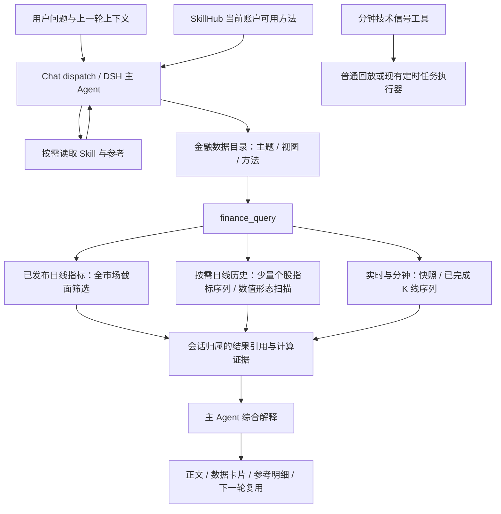

# 指标、因子与 K 线能力的对话链路梳理

日期：2026-09-30。基于本机工作区（基线 commit `93f8815d34359f2cc6493efc47284dcc7e14afb0`，包含其他 session 尚未提交的变更）。本次没有部署、重启、修改生产数据库或启用定时任务。

## 在体系中的位置



| 能力 | 权威实现 / 入口 | 作用及边界 |
|---|---|---|
| 公共指标公式 | `src/services/technical_indicator_calculator.py` | 27 项日线指标；明确预热、EMA/Wilder 初始化、缺失值、比例与单位，输出确定性数值 |
| 盘后计算与存储 | `stock_indicator_daily_job.py`、`stock_indicator_store.py`、`scripts/stock_indicator_daily.py` | 源历史固定起点 2018-01-02；批次、范围、公式版本、输入指纹和发布生命周期。`stock.technical` 查询/窗口/聚合读取已发布事实 |
| 实时指标 | `stock_indicator_realtime.py` → `stock.technical_realtime.query` | 即时报价派生特征，保留数据时点、滞后及不可用原因 |
| 分钟指标 | `stock_indicator_minute.py` → `technical_minute` / `technical_minute_series` | 30 项指标；按当日开盘起算，递归项带 session 前缀；已完成周期、午休、缺口、时效和源缓存有明确语义 |
| 分钟信号 | `stock_minute_signals.py`、`stock_minute_signals_tool.py`、Tool Registry | 6 类确定性事件；普通调用可回放，定时调用按系统任务归属记首次发现与修订。没有交易、通知能力；未开放为金融 DSH 任意可调用的写工具 |
| 因子分析 | `factor-analysis` | 根据用户目标选择可得因子、解释横截面和时间序列差异；不是一个自动拥有任意计算、IC 验证或回测能力的独立服务 |
| 技术/资金/相对强弱 | `technical-structure-analysis`、`capital-flow-analysis`、`relative-strength-analysis` | 共享标的、期间与实际证据，由主 Agent 按需组合成一个回答 |
| K 线数值库 | `src/experiments/kline_patterns/{catalog,engine,analysis,strength}.py` | 当前代码含 64 个数值定义；区分必要条件、确认时间、未知检查、程度与后续演变。不是预测胜率或视觉确认 |
| K 线方法与看图 | `kline-analysis`、`kline-basic-reading` | 前者组织分析，后者描述独立看图方法。研究脚本中的绘图、独立 VLM 调用没有因 Skill 注册就自动进入聊天运行时 |
| Skill 编写与组合 | `SkillHubCatalogService`、`FinanceBusinessSkillCatalog`、Skill Studio | 候选/启用版本、公开与个人可见性、关联方法说明进入现有运行快照。关联是方法入口，不授予工具权限、不自动启动多个 Agent |

原有盘后发布接口用于全市场筛选是合理的；历史指标只存了少量发布日时，不能满足“最近一个月 MACD 怎么变化”。此前模型会反复查询相同快照，或根据原始行情自行计算。不能通过把单点称作序列来掩盖这一差别。

## 本次框架修正

1. **增加两个现有数据目录中的视图**，沿用 `finance_query`、既有 API 解析/校验和结果存储，没有另造 Skill 执行服务。
   - `stock.technical_series.query`：1–5 只股票，最近 1–252 根完整日线，先用固定锚点历史计算、再裁输出。27 项指标和 OHLC 使用同一后复权口径，不写回盘后批次。
   - `stock.kline_patterns.query`：1–5 只股票、最近 1–60 根；复用既有数值库及演变计算，返回逐个命中。价格统一缩放至截止日真实收盘价；信号日/截止日收盘与形态边界数值直接随证据返回，避免仅有“高于/低于边界”而迫使模型从另一价格口径重建边界。扫描摘要、定义版本和未知检查数留在计算证据中。无命中不等于所有检查均可判定。
2. **补齐计算证据的传递**：provider 原有 `evidence` 以前停留在存储层，现在通过可选 `provider_evidence` 进入查询结果、明细读取和下一轮工作集。复权、输入日期、分钟时效与缺口可以跟随数据；依然使用会话归属检查，不能读取其他会话的结果。
3. **保留新的查询范围**：结果索引保存代码、截止日、数量、分钟周期、起点、部分周期开关和时效阈值，避免后续“照刚才的口径”丢失真实参数。
4. **取消标准对话开头的强制工具动作**：已有证据可以直接解释、收尾或按需读取明细。新查询仍必须具备对应数据契约；真正尚未完成的查询、仅数据模式和快速模式继续执行原有规则。不增加状态枚举或重试次数。
5. **修复 MCP 子进程配置继承**：动态计算在主模型正常时曾返回 401，原因是 stdio MCP 子进程未继承共享 LLM 配置而读取旧 `.env`。在现有启动环境显式传递网关、凭据与模型；不把密钥写入上下文、报告或代码。
6. **评测与目录一致性**：评测脚本从配置选择模型，支持同一会话的追问和自定义样本文件；修复字符串 turn ID 的结果匹配。同步基础看图 Skill 的目录描述，更新过时的固定目录数量与提示词断言。
7. **动态计算输入契约**：代码生成原来只看到列名和任务，不知道日期以字符串传入，也不知道输入已按查询窗口选取。补充日期类型说明和系统实际观测的输入行数、日期范围。复现并修正了 `.dt` 类型错误，以及把已选好的“上一交易日截止”再过滤一遍造成均量错误的问题；没有添加样本专用计算分支。
8. **澄清顶层路由语义**：“用动态计算工具计算均量”曾被误分到目录浏览。提示词现区分“执行能力描述”和“具体资产标识”，保持原有三种处理模式。真实路由回归同时覆盖泛称计算能力、普通行情查询及明确工具名称调用。

业务解释仍属于 Skill；本次未添加“银行股/十字星”等关键词路由，没有将研究视觉流程硬编码成通用框架的必经阶段。

## 真实测试方法与证据边界

`scripts/eval_skill_chat_live.py` 通过本地 Flask test client 调用 `/api/chat/dispatch`，真实使用外层路由、DSH、当前模型、数据源、Skill 加载、结果引用、回答和推荐问题。只替换身份和会话持久化为内存适配器，避免写真实用户会话。它不覆盖公网 HTTP、浏览器渲染、真实身份配额和生产部署。

当前配置模型为 `BL/deepseek-v4-flash-0731`。首个诊断基线运行沿用了其他 session 脚本写死的 v4.1，已纠正；两者不能用于受控的性能提升结论。

复现命令（根目录已有项目依赖）：

```sh
.venv/bin/python scripts/eval_skill_chat_live.py \
  --output outputs/framework-live-new-run \
  --cases-file tests/evals/framework_capabilities_v1.json \
  --cases kline,factor,combined,relative,minute,quote,compute
```

每个运行目录保留 manifest（commit、源文件哈希、模型、有效预算和样本）、请求、逐轮回答、真实工具轨迹、耗时及模型上报用量。带 followups 的样本沿用同一会话；不以独立问题冒充上下文验证。

诊断证据位于 `outputs/framework_capabilities_20260930/`。`baseline`、`chat_a/b` 为问题定位过程，不能冒充修复后的验证；`final_a/b`、`verified` 为中途验证，目录名中的 final 不代表后续未再修改。`confirmed` 已覆盖新的形态边界证据和上下文直接收尾，但尚未覆盖最后的动态计算输入契约和顶层路由修正；`compute_routing_final` 覆盖上述最终修正，run_end 中源文件变更为空。以各 manifest 和 run_end 确定覆盖版本，不能把不同修订的通过项拼成一次完整生产回归。

## 验证结果

- 指标、分钟、K 线数值库、数据协议、权限、Skill 组合及 DSH 定向回归：**385 passed**，见 `outputs/framework_capabilities_20260930/pytest-final.xml`。
- 最后的动态计算输入、跨运行时目录披露、对话路由协议与样本回归：**151 passed，23 skipped**。跳过项是默认关闭的真实模型意图评测，见 `pytest-additional.xml`。
- 针对本次路由修正启用的真实模型评测：**3 passed**，见 `pytest-live-intent.xml`。
- 金融 DSH 循环策略 Node 测试：**71 passed**。保留工具授权、会话隔离、仅数据模式及快速模式约束，同时允许有证据的普通追问直接回答。
- `git diff --check` 通过。没有宣称全仓库默认质量门、浏览器端到端测试或生产性能已通过。

逐题问题、回答、实际 Skill/API、耗时、模型轮次和上报 Token 见 [业务问题实测记录](../../outputs/framework_capabilities_20260930/business_review.md)。测试使用真实市场数据与模型，但不生成真实用户会话。

已独立核对最近 5 个交易日成交量均值：`(75,945,732 + 90,672,565 + 104,381,872 + 71,534,143 + 69,097,909) / 5 = 82,326,444.2 股`，与最终动态计算返回一致；该轮 35.24 秒、3 次 DSH 模型调用，没有工具重试。原始输入和复核结果见 `business_crosschecks.json`。

最终工作区还完成 `factor_final` 两轮复测，运行中源文件变更为空：首问 68.36 秒、3 次 DSH 模型调用、一次标准指标查询；三只股票的动量/波动/量比共 9 个核心表格值逐项一致。追问 89.73 秒，正确将“第二只”解释为招商银行并沿用 2026-09-29 截止日，实际调用新历史序列接口。两轮均正常结束且无查询执行失败；这证明链路可用，不代表所有业务解释正确。

## 业务复核发现及下一步边界

本次可以确认能力发现、方法加载、数据查询、结果留存及上下文复用已存在可运行路径；不能把全部回答评为业务正确。

1. **K 线价格口径仍会混用**：形态接口已返回同口径母线低点 11.4684、高点 11.6446，回答的关键观察价修正为 11.47；但同一正文又引用原始历史价 11.72/11.90，并把“重新收复边界”解释成确定转多。前者应继续在行情字段的价格口径说明与 Skill 的证据选择中统一，后者属于业务解释强度，不能由新增状态或关键词拒绝器解决。
2. **相对强弱样本未核验真实除息**：回答以未复权收盘计算价格差，并以“9 月不是常规除息高峰”弱化风险；组合分析样本却查到了 9 月 24 日每股 0.249 元的分红。该样本的收益解释不能算完整通过。应由相对强弱方法选定一致收益口径，调用已有复权价格或公司行为能力。
3. **数据正确不代表摘要精确**：MACD 追问正确解析第二只为招商银行，并取得完整历史序列，但回答把有一天收窄的负柱概括成持续扩大。最终复测仍出现“每天加深、整段没有收窄”的错误；因子首问的核心表格正确，正文却把前 5 日均量写作当日成交量。保留逐日证据并纳入固定效果样本，不扩大底层业务校验。
4. **按需序列已可用，但模型不总会选它**：组合分析仍可能只读取两个已发布日的截面再说明“历史不足”。需要在方法选择效果评测中持续验证按需序列的发现与使用，不要在所有金融问题前强制跑一遍固定工具链。

## 尚未覆盖或不能据此宣称的能力

- 聊天没有接通研究版的独立基础看图、候选选择及 VLM 逐形态复核。当前完成的是数值证据链；不得声称看过图片、完成视觉识别或验证了形态预测价值。
- 分钟信号的定时任务集成有代码和单元测试，本次未创建生产定时任务、发通知或核实服务器 cron 正在运行。
- 按需计算解决少量个股历史，不代替全市场历史批次的运维补算，也未证明并发容量、长稳或生产恢复能力。
- 工具执行成功不等于业务分析可靠。样本中仍需复核区间裁取、分段汇总、量纲及模型延伸判断；不增加针对单个样本的业务 validator。
- 用量是 API/DSH 已上报的用量；现有动态计算内部代码生成丢弃了其独立模型 usage，不能将记录总数当作完整网关账单。

运行维覆盖未全部 READY，因此本记录不作生产可信综合分或生产放行结论。
