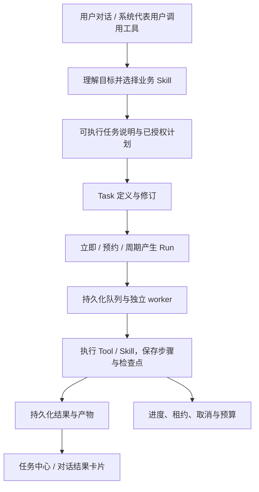

# 通用后台任务与股票 AutoML 接入设计

日期：2026-10-03。依据：`ac1d53e321b75c01bc0a52d1016278388d7a5b21` 的仓库实现。

本文保留实施前的设计与缺口记录，后续已按此方向实现并做本地运行验证。当前代码、接口、运行方式及已知边界以 [用户任务系统](../scheduled_task_runtime.md) 为准；本轮训练与验证证据见 [验收记录](../user_task_runs/20261003/README.md)。未执行生产数据库升级或部署，本文不是生产放行回执。

已落地：立即/预约/周期统一定义和运行、SQLite/MySQL 持久化接口、租约 fencing、独立子进程监督、取消/运行预算/检查点恢复、可信聊天工具桥、通用任务中心及授权文件下载。AutoML 接入了自然语言研究设计、冻结数据与实验计划、分类/回归搜索、开发折回测、公司与时间盲测和 LLM 报告。

当前仍有边界：MySQL 真实迁移与并发运行未验收；完整 DSH 聊天链受本机缺 SDK 阻断；上传文件/跨任务文件交接、冻结旧模型在新窗口比较未实现。后文的“现有代码与实际缺口”指改动前基线，能力不能仅凭设计章节推定已经完成。

## 1. 核心决策

以现有持久化定时任务、独立 worker、Tool/Skill 执行计划为基础，扩展成通用 Task Runtime。立即执行、预约一次和周期执行共用同一套运行记录、领取机制和结果入口。股票 AutoML 是第一个长时间业务执行能力，机器学习规则继续留在独立模块中。

任务不是一种新的 Agent 对话阶段。对话负责理解和提交，Task 负责保存长期目标，Run 负责一次具体执行，Tool/Skill 负责完成业务工作。关闭浏览器或切换对话后，Run 仍然由独立 worker 执行。

这一改动分别属于：

- **SOFT 框架**：任务意图理解、业务 Skill 选择、计划解释、进度与结果表达。
- **HARD 协议**：任务归属、定义修订、执行快照、依赖、预算、租约、取消、检查点与结果引用。
- **业务能力**：股票样本选择、预测目标、模型搜索、训练、评估、回测和 LLM 评审。

市场、行业、模型、胜率、交易日等概念不进入通用调度器。

## 2. 现有代码与实际缺口

| 已有入口 | 现有能力 | 接入长任务需要补齐的内容 |
|---|---|---|
| `src/services/scheduled_task_{protocol,compiler,service,store}.py` | 自然语言编译，Tool/Skill 依赖，owner 隔离，定义修订，运行快照，创建幂等 | trigger 当前必须是 cron；需要支持无 trigger 和预约一次 |
| `src/services/scheduled_task_{executor,worker}.py` | 独立进程、租约、运行中续租、异常后的租约恢复 | 步骤结果目前到整次运行结束才落库；恢复会重新执行；失去租约不能及时终止正在阻塞的长步骤 |
| `src/services/task_service.py` | 旧版 Skill 异步任务、步骤与结果查询 | 执行器是 Web 进程内的线程池；不能作为新长任务的可靠执行基础 |
| `src/services/runtime_execution_service.py` / `aiia_runtime_task` | 对话与工具运行的追踪 | 保留为 trace 投影，不作为另一份任务队列权威状态 |
| `frontend/src/components/ScheduledTasksPanel.tsx` | 定时任务编译预览、列表、手动运行、运行结果 | 扩展为任务中心，增加执行中进度、取消、结果卡片与对话关联 |
| `src/quant_research/automl/` | 独立 CLI、多模型、多周期、公司/时间留出、回测、报告 | 自然语言约束编译、后台适配、进度回调、可恢复实验、取消及预算执行 |

AutoML 当前有两个容易误解的边界：

1. `advisor.py` 的 LLM 主要在给定候选中选实验、解释指标；自由文本 `objective` **不等于** 已经转成并落实了所有训练约束。
2. `runner.py` 每次创建新研究目录。虽然逐实验写 `development.json`，目前并不读取它恢复执行；不能据此声称支持断点续跑。

## 3. 用户入口和主流程



用户可以说：

- 定向研究：“用近三年的银行股数据，研究持有 3/7 个交易日的上涨概率，计入交易成本，留出其他公司验证，最多试 30 个方案。”
- 有约束探索：“不限定模型和行业，优先寻找跨公司稳定的规律，最多运行一小时；没有满足要求的方案也要说明。”
- 周期研究：“每周六重新训练一次，并和上一版模型在同一个新评估窗口比较。”
- 其他任务：“整理这些公司的公告，再比较变化，最后生成报告。”

定向与自由探索共用同一种任务：用户规定的内容固定，未规定的内容由业务 Skill 在已披露的默认范围和预算内决定，不增加一组“定向/随机/自主”的生命周期状态。

对于明确要求执行且已具备可执行参数的请求，直接提交并返回任务回执；预览能力用于查看和修改计划，不把每次提交都变成额外确认流程。真正无法确定执行含义的信息在入队前澄清，例如把“期间触及目标价”误作“持有到期收益”。

回执首先展示：将做什么、采用什么关键口径、预算上限、何时运行、任务入口。运行后可以离开页面，回来查看进度和结果。

## 4. 最小持久化契约

### Task：要做什么，以及何时产生运行

继续使用现有定义中的任务 ID、owner、`requirement_brief`、修订号、执行计划、启停和创建幂等信息。主要扩展为：

| 信息 | 用途 |
|---|---|
| 可选 trigger | 缺省：创建后立即运行一次；`at`：预约一次；`cron + timezone`：周期执行 |
| 通用执行预算 | 本次最长执行时间等真正由 runtime 执行的上限；具体实验数放在 AutoML 输入中 |
| 可选来源对话引用 | 从原对话定位任务与交付结果；权限仍以 owner 为准 |

`requirement_brief` 保留完整目标、限制、用户偏好和必要业务口径。只把执行程序需要精确读取的约束结构化，不把每句话拆成 JSON 字段树。

执行计划沿用现有 `steps / target_ref / inputs / depends_on`。LLM 只输出本轮计划或修订贡献；ID、owner、版本、历史、执行时间和既有事实由系统保存。

### Run：一次被冻结的执行

沿用现有 run ID、定义修订、说明/计划快照、`scheduled_for`、执行状态、租约、起止时间、结果和错误。新增能力所需信息包括：

- 完成步骤及其结果引用、当前业务检查点；已完成步骤在恢复时可复用。
- 本次实际解析后的输入及其证据引用，例如日期范围、数据快照和模型配置；由业务执行器提供，runtime 不解释业务字段。
- 每次领取生成的租约 token；防止过期 worker 覆盖新 worker 的检查点或结果。
- 取消请求时间和首次开始执行时确定的 deadline；进程重启不重置时间预算。
- 可查询的简短进度，以及现有 trace 中的详细过程证据。

定义修改只影响新产生的 Run，不能偷偷改变正在运行的股票池、目标或预算。改变正在执行的目标，使用取消当前 Run、修订定义并新建 Run 的明确流程。

生命周期仍以现有 `pending → running → completed / failed` 为主。增加用户停止能力时才加入 `cancelled`，因为它代表用户已要求终止且执行已停止；“准备数据、训练、回测、评审”是进度描述，不是系统状态。首期不增加暂停、审批中、等待用户等状态。

“任务执行完成”和“研究发现达标”是不同事实：完整完成了研究但未找到合格模型，应为 `completed`，业务报告明确“本轮未找到满足要求的模型”。

## 5. 执行、恢复与资源边界

### 统一执行基础

通用核心逐步从 `scheduled_task_*` 中抽取，旧类与旧 API 作为兼容入口调用同一实现。新长任务不进入 `AsyncTaskService` 的 Web 线程池。旧异步任务在调用方迁移前继续由原路径管理，不能把同一个 Run 同时交给两套执行器。

首期继续使用现有数据库和独立 worker，无需引入新队列产品。单机限制并发即可；ML 依赖只安装在执行 ML 的环境，Web 服务不加载 sklearn。执行资产的运行配置决定是否启动独立子进程，通用步骤类型仍为 tool/skill。

AutoML 子进程必须受父进程监督：达到 deadline、用户取消或租约丢失时，终止该次执行的进程组。合作式回调可在实验边界及时停止，监督进程负责处理中途阻塞的模型拟合。只有确认执行已停止，才将取消操作收敛为终态。

### 检查点与恢复

每个业务步骤完成后立即保存结果引用，然后启动后续步骤。租约恢复读取同一运行快照和已提交的步骤结果，不再从空 `outputs` 重做整个计划。

步骤内检查点是可选能力。AutoML 需要在实验边界保存：冻结的研究参数、数据/代码指纹、留出划分、随机种子、本轮已确定的候选、已尝试实验及失败、累计预算、模型选择决定和已生成结果。保存本轮候选后再执行，恢复时不会再次调用 LLM 改写同一轮实验。

恢复必须继续读取同一份授权范围内的数据快照；仅保存数据 hash 无法保证供应商数据修订后的可复现性。配置或实现版本不兼容时不能把旧检查点当作可继续运行的当前证据。

恢复粒度首先是“已完成步骤 / 已完成实验”，不承诺暂停和恢复 sklearn 正在执行的一次 `fit`。被中断的实验可能从头运行，但已消耗的时间和尝试预算要记账，避免反复中断带来无限资源消耗。

所有检查点与终态写入均校验当前有效租约 token。每次执行尝试使用独立产物目录，只有持有有效租约的执行者能发布为权威结果；过期进程不能覆盖同一文件。

整体保持“至少一次”执行语义。对有外部副作用的资产，使用由 `run_id + step_id` 派生的幂等标识；不能声称任意 Tool 都具备恰好一次执行。现有工具的执行错误需按其真实返回契约交给适配层处理，不能把“无合格股票”之类业务结果当作运行故障。

### 复杂任务的范围

外层继续使用已有的有限依赖计划；复杂研究中的探索、调整和循环由业务 Skill 在预算内完成。运行系统提供保存检查点和产物的能力，不把每次模型推理都拆成一条工作流节点。

首期覆盖多步、有依赖、可恢复、可预约/周期执行的后台任务。中途人机审批、任意动态图、跨集群训练等需要真实业务后再扩展，不在本次引入完整工作流语言。

## 6. AutoML 适配方式

依赖方向保持为：

```text
对话 / Task API
        ↓
通用 Task Runtime → 已注册的 Tool / Skill
                             ↓
                   AutoML 业务适配层
                             ↓
                   quant_research.automl
                             ↓
                       backtest
```

`quant_research.automl` 不导入任务服务、Web、用户会话或系统数据库。CLI 继续可独立运行；适配层负责身份上下文、运行目录、进度/检查点回调和产物登记。

### 业务 Skill：把目标变成研究参数

在提交时把用户明确要求映射到 `ResearchSpec` 已支持的参数，保留研究说明。例如持有周期、行业、市值、流动性、模型范围、最大实验数、成本、信号数和回撤要求。没有表达的参数采用有界默认值，并在任务说明中展示关键假设。

未受支持的明确约束必须被指出，不能只放进 `objective` 就表示已执行。当前 `ResearchSpec.from_dict` 会忽略未知元数据，因此适配层不能依赖它验证“所有用户要求均已落实”。约束是否落实的语义判断属于领域 Skill；只有会导致错误执行的关键缺项进入必要校验。

“未来 7 天内上涨”要区分：持有 7 个交易日后的正收益、7 日内任一天触及阈值、或期间最大回撤等不同目标。当前引擎支持收盘后发信号、次日开盘入场、持有 h 个交易日后开盘退出的收益标签，不能直接宣传为期间触及概率。

周期任务的“近三年”等相对范围，在每次 Run 中以持久化的 `scheduled_for` 为时间锚点，由领域代码解析一次并保存。实际可用数据截止另行记录，不使用锚点之后才发布的数据；同一个 Run 重试时不得重新移动时间窗口。股票交易日属于领域解析，不放入 cron 调度器。

### 执行工具与研究循环

建议注册一个后台执行的 `stock_automl_research` 工具，由任务执行器调用。普通对话的提交工具只入队，不能同步等待整个训练过程。以下是业务顺序，不要求拆成七个通用步骤：

1. 固定研究参数、数据快照、股票池、时间和公司留出集。
2. 从可用字段和候选模型中确定有界实验范围。
3. 在开发集内训练、校准、滚动验证和回测。
4. 用开发集证据决定后续候选，累计实验数与资源预算。
5. 冻结选择，再评估保留的公司与时间窗口。
6. 保存模型、样本统计、指标、交易账本和报告。
7. LLM 基于已保存证据解释结论及局限。

拆分当前 runner 内的“计算研究结果”和“语言评审”边界，使评审失败可以单独重试，或者作为后续 Skill 步骤执行，不需要重新训练。现有 CLI 的一键运行体验保留。

LLM 不修改算出的指标，不以盲测结果反复调参直至达标。无人达标时交付失败的研究假设和证据；不能不断扩大搜索预算。推断概率、信号胜率、成交胜率、组合收益和跨公司表现应分别说明。

“每周重训”与“评估已冻结模型”是两种业务计划。模型版本和研究历史由 AutoML 产物关联；新旧模型必须在可比较的样本与成本口径下评估。已被反复查看的测试窗口不能继续声称是未揭盲证据。

### 结果与权限

运行表保存简洁结论及产物引用，大型数据、模型和账本留在独立产物存储。模型文件不塞入 JSON，也不默认加入 Git。

沿用现有 Surface Block/Renderer 展示报告、表格和文件。下载先校验任务归属和 run-artifact 关联，再解析文件引用；现有 `file_artifact_service.read_manifest` 没有 owner 参数，不能认为“知道引用就是有权限”。

LLM 评审接收必要的汇总指标和业务说明，数据库凭据、文件系统路径和无关原始数据不进入正式结果。

## 7. 工具、API 与任务中心

建议首先提供三个面向 Agent 的工具：

| 工具 | 行为 |
|---|---|
| `task_submit` | 理解任务或接收已编译计划，校验授权后持久化，立即返回 task/run 回执 |
| `task_get` | 返回当前进度、简洁结果和可追溯产物；不重新执行任务 |
| `task_cancel` | 停止指定运行，保留已完成的证据；停用周期定义使用定义更新接口 |

工具名称为拟议名称，尚未注册。所有 owner 均从可信调用上下文获取。系统 Agent 代表当前用户提交时沿用该用户权限，不能通过请求体写一个 `system` owner 获得额外权限。创建计划和执行步骤前都检查资产权限；任务提交工具不作为首期后台计划的执行目标，避免递归创建任务。

现有 `/api/tasks/{job_id}` 属于旧异步 Skill API，不能直接改成另一种对象。建议新增：

- `/api/task-definitions`：预览、创建、列表、修订、启停和手动产生 Run。
- `/api/task-runs/{run_id}`：状态、进度、结果、取消和产物读取。
- 旧 `/api/schedules*` 保持兼容，适配至同一核心。

同一 owner 的重复提交用幂等键返回同一任务/运行；相同键带不同请求应返回明确冲突，不能悄悄使用旧要求。任务与立即运行的创建要在同一事务中，避免有任务无运行或重复运行。

前端把现有“定时任务”扩展为“任务中心”，支持一次性/周期任务和运行历史；对话只展示简洁任务卡片。首期通过有间隔的查询获得持久化进度，详细 trace 按需展开，不为进度展示另建一套事件总线。

有确切分母时展示“已完成 12/30 个实验”；未知总量时展示当前步骤，不编造百分比和预计完成时间。最终卡片首先回答目标是否达到、主要证据及限制，再提供样本、模型比较和回测明细。

任务结果应能从任务中心和原对话关联入口重新读取，用户不在线也不会丢失。站外消息投递属于后续独立能力，只有用户明确要求才接入。

## 8. 数据库兼容与实施顺序

优先增量扩展现有 `aiia_scheduled_task` / `aiia_scheduled_task_run`，不另建一份内容相同的通用任务主表。可以先保留物理 `schedule_id` 字段，在通用服务接口映射为 task ID，不为了命名一次性重写全部调用方。

需要迁移的最小变化围绕：可空 cron 与可选预约时间、预算和来源引用、运行检查点/进度、租约 token、取消请求和 deadline。详细 trace 继续复用既有存储，业务检查点内部结构由对应执行器负责。最终字段以实际实现和索引查询需要为准，本文不预建无使用方字段。

一次性任务仅物化一次，之后不再产生 next run；领取条件必须排除尚未到 `scheduled_for` 的运行。周期任务沿用漏跑合并策略，并在定义说明中披露。对于同一定义的长任务，首期默认不重叠运行，正在执行期间合并后续到期触发，避免训练不断堆积。

旧 worker 无法正确处理新的一次性定义和取消契约。因此迁移应先验证隔离数据库，在停止旧领取器后切换新 worker，再开放新提交入口；不能认为数据库增量兼容就意味着新旧 worker 可以混跑。回滚前停用新入口并处理新形态记录，不直接删除用户任务或回退数据库。

实施按可验收的竖向切片推进：

| 顺序 | 交付内容 | 完成标准 |
|---|---|---|
| 1 | 复用调度核心支持立即/预约/周期；持久化进度、步骤结果、有效租约写入和取消 | 一个已有 Tool/Skill 可以通过三种触发方式执行；Web 重启不丢任务，worker 恢复不重复已提交步骤 |
| 2 | AutoML 业务 Skill、后台适配、独立子进程、实验检查点及评审边界 | 自然语言明确约束可验证地进入 ResearchSpec；训练可取消、恢复；返回真实样本统计与回测产物 |
| 3 | 注册提交/查询/取消工具，任务中心与对话卡片接通 | 用户通过对话提交后可以离开、返回、查看结果；其他用户无法读取任务或产物 |
| 4 | 使用同一机制运行普通多步研究/报告任务；覆盖周期重训 | 无需修改调度协议即可换业务资产；旧定时任务测试保持通过 |

首个端到端样例使用现有 AutoML demo 数据，验证机制之后再进行有预算的 KingdomAI 实验；不把此前 10 支股票的 smoke 结果解释为新任务系统或策略泛化的验收。

## 9. 必须覆盖的验收

- **协议**：立即、预约、cron 正常执行；旧 draft 兼容；缺少执行资产、非法依赖和无法解析的 trigger 等确定性错误被拒绝。
- **授权**：提交、查询、取消、运行和产物读取均按 owner；伪造 owner 无效；资产撤权后不能继续新的步骤。
- **持久化与恢复**：完成第一步后终止 worker，恢复后仅继续剩余步骤；过期 lease token 不能保存检查点或发布结果；未来运行不能提前领取。
- **幂等与调度**：重复提交不重复入队；一次预约只执行一次；并发 worker 不重复物化同一时间槽；周期长任务不无限堆积。
- **资源**：训练中取消或超时能终止子进程，保留已完成实验；恢复不重置预算；Web 请求及时返回回执。
- **业务**：行业/市值/周期等明确要求确实影响输入；不支持的目标不被静默忽略；开发与最终测试不交叉；无达标模型也能完成并解释。
- **数据与研究恢复**：恢复继续使用同一数据快照、划分与候选；已结束实验不会重做；最终测试后不会自动根据测试成绩追加调参。
- **结果**：LLM 评审失败不丢失数值证据，重试评审不重训；样本数、信号数与成交数不混用；页面关闭后结果仍可读取。
- **通用性**：至少一个非 ML 的两步 Tool/Skill 任务使用同一 API、worker、取消与结果通道，不依赖股票字段。

此处列出的是后续实现的验收要求，尚未执行。既有 AutoML/backtest 测试通过只证明对应模块在既有范围内的行为，不代表通用任务接入已经完成。
