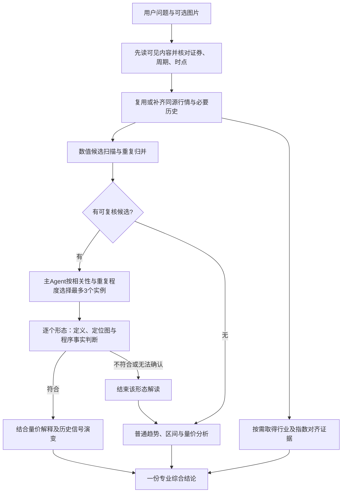

# K线与相对强弱 Skill：范围、方法与接入边界

> 2026-09-29 输入对照：复杂图文版与图上数字版已完整保留；新增纯图/纯数值固定实例对照。纯图并未稳定更准，纯数值保留更多力度与反证，但两者仍有事实错误；不把缩短提示等同于质量达标。参见 [四版本准确性与分析价值对照](/Volumes/ext/fin_agent/docs/development_tasks/evidence/kline_single_source_20260929/report.md)。

> 当前研究实现：数值定义与家族强度 → 保守排弱 → 独立短上下文选择 → 每例一次局部解读／相关实例数值直读 → 主Agent纯文本综合。最新验证见 [强度、优先级与调用管理](/Volumes/ext/fin_agent/docs/development_tasks/evidence/kline_strength_20260929/report.md)。下文保留前期设计与实验记录，不代表当前仍使用双视觉调用。

本轮是业务 SOFT 方法建设：新增 `kline-analysis` 和 `relative-strength-analysis`，注册到既有业务目录，并在个股研究方法组合、技术结构分析中增加按需入口。不扩张系统输出Schema、不增加状态枚举、不新增并行Agent调度。

## 用户体验

用户可以直接上传图、只说“看K线”，或在个股研究中询问走势。先解释用户图中能确认的内容；没有图或缺关键数据时主动用已授权行情补齐，证券/周期真正不明才询问。历史图不默认换成最新行情，分时线不当作OHLC蜡烛。

搜索最近两周的信号，需要更长的指标预热与背景历史。按每个已完成周期识别，在当时可见数据上确认；后续走势用来解释延续或失效。最终可能有多个形态、只有历史形态、没有典型形态或证据不足，这些结果以自然语言表达，不新建系统状态。



## 方法边界

| 业务方法 | 负责什么 | 不重复承担什么 |
|---|---|---|
| kline-analysis | 图片补全、候选回看、视觉复核、近期信号与量价综合 | 不将无图/缺数当零命中，不解释已否定形态 |
| relative-strength-analysis | 基准选择、时点与收益口径对齐、相对强弱 | 不由同期涨跌推断因果，不混同alpha |
| technical-structure-analysis | 通用价格结构及指标选择 | 已加载K线方法足够时不重复展开 |
| sector-theme-analysis / market-overview | 行业经营/参与及整体市场环境 | 不为一个相对涨跌问题重复全市场研究 |
| stock-research | 个股研究主命题与最终综合 | 不固定每份报告都全量扫描形态 |

并行适合身份和时点已确认后的独立取数：个股候选扫描/绘图与行业指数行情可重叠。基准依赖行业分类时先取分类；复核依赖候选与图，解释依赖明确符合，综合依赖双方已有证据。并行Skill取证不等于必须创建多个Agent。

## 当前实际能力

| 能力 | 当前证据与边界 |
|---|---|
| Skill目录发现、正文及参考加载 | 已注册，沿现有不可变快照和授权读取 |
| 行情和日线/分钟技术指标 | 复用现有金融数据目录，具体字段由运行时发现 |
| 62项形态数值计算、示例重绘 | `src/experiments/kline_patterns/` 已有离线研究实现；不是Finance CC正式工具 |
| 视觉模型 | KingdomAI `BL/deepseek-v4.1-flash` 已有图片探针；凭据留在本地配置，不进Skill。此前四例两阶段测试走DashScope，不能混记为KingdomAI准确率 |
| 上传图片直达视觉、自动取数后扫描/绘图/复核 | 本轮未接通正式聊天全链路。当前financial_qa附件路径主要将解析预览拼入文本，不能据此证明图片已作为多模态输入 |
| 大小窗口任意扫描、多候选统一回执 | 已定义方法，尚需把离线引擎适配为正式受权工具；不得仅靠提示词假称执行 |
| 基准比较 | 方法已注册；精确对齐和关系计算须依赖正式数据/计算能力，不让模型心算替代 |

## 后续真正接通的最小工作

这张表是接入说明，不是已实现API清单。

1. 复用已鉴权附件引用，使图片能够传入实际图像工具；不向模型传磁盘路径冒充图片，不把密钥写进提示词。保持证券、周期与图片可见时点。
2. 将现有引擎与渲染适配为按证券、周期、截止时点和搜索窗口执行的能力，输入优先采用已有授权行情结果引用；复用计算特征，保留未覆盖原因。日线定义向分钟迁移须单独验证，不直接复用阈值。
3. 候选工具提供形态版本、参与区间、确认时点、程序事实及图引用；业务说明保持自然语言。视觉是否明确符合是后续解释是否执行的必要事实，其余表达不拆多层Schema。必要条件已确定失败应在候选计算层排除，不增加通用审查层。
4. 根据已验证的KingdomAI多模态路由做图像调用；同一候选截断到确认时点。记录请求模型、实际endpoint、数据/定义/图版本、分阶段耗时与模型结果，凭据不入日志。无候选不调用形态视觉，基础走势仍独立解读；重复图可缓存。
5. 以真实用户请求进行全链路测试，覆盖上传完整/残缺图、无图、多/零形态、两周回看与确认延迟、日内未完成K线、基准缺数；另做独立标注和纯数值/带视觉对照。分阶段方法测试不能替代这些证据。

## 本轮验证入口

- 方法文件：`src/skills/finance-business/skills/kline-analysis/`、`src/skills/finance-business/skills/relative-strength-analysis/`。
- 固定合成样例：`tests/evals/kline_skill_methods_v1.json`。
- 实际模型方法测试：`docs/development_tasks/evidence/kline_skill_methods_20260929/`。已加载Skill与参考、无外部数据工具、没有实际发送图片，用于检查业务行为与边界，不代表图像识别准确率。
- 既有目录、快照、显式调用测试沿用 `tests/test_finance_business_skills.py`、`tests/test_finance_business_default_skills_v2.py`、`tests/test_finance_business_skill_catalog.py`、`tests/test_business_skill_explicit_invocation.py`。

未部署生产，未变更全局模型配置或数据库。

## 2026-09-29：最多三个实例与全调用用量

Skill 在数值初选后由主 Agent 选择最多 3 个实例，可少选、不凑数。视觉否定后不补选；未入选候选不进入已确认结论。提示词见 `kline-analysis/references/candidate-selection.md`。

独立研究链路现已由 `src/experiments/kline_patterns/analysis.py` 串接：数值扫描 → 实际主模型选择 → 一例一组图片，先判断、仅 true 时解读 → 把全部逐例结果交给实际主模型综合。选择与综合、每例判断与解读均记录 provider usage，图片与缓存已计入输入时不重复相加；缺 usage 保留未知。每个案例保存原图、定位元数据、输入、原始回答和阶段用量。

`scripts/eval_kline_analysis.py` 使用真实行情的只读查询或快照重放，主模型与 VLM 均走内部 KingdomAI `BL/deepseek-v4.1-flash`。复现实验：

```bash
.venv/bin/python scripts/eval_kline_analysis.py \
  --inputs docs/development_tasks/evidence/kline_top3_20260929/daily_inputs.jsonl.gz \
  --output docs/development_tasks/evidence/kline_top3_new_run
```

这是独立业务链路实验，尚未注册到 FinancialQa/HTTP/UI 工具链；其 token 是该实验主模型及 VLM 的全部请求，不含未执行的正式入口路由、规划与工具检索。最新实测、逐阶段错误归因和账单入口：`evidence/kline_top3_20260929/report.md`。纯图误判和解读过度推断仍有发生，不能以数值命中后 9 个正例都获视觉认可来声称视觉准确率 100%。

## 验证结果

两份Skill通过quick_validate，目录/业务测试20项、快照/显式调用30项通过；全部按需参考能由实际业务目录加载。证据与最终方法hash见 `evidence/kline_skill_methods_20260929/skill_validation.json`。

内部KingdomAI模型完成8类合成场景首轮测试：7例完整返回、1例思考预算截断；两个场景补测完整返回。多形态归并、历史信号失效、视觉否定停止、分钟数据时点和基准缺数处理能遵守主要边界。仍有真实失败：残缺历史图的补数计划被扩展到今天；零形态样本仍无参照地称“窄幅”，且把量能确认夸大成价格结构改变的必要条件。因此不记为8/8通过，不将结构测试当效果结论。原始请求、回答及逐例人工复核全部保留在 `evidence/kline_skill_methods_20260929/manual_review.json` 和相邻结果目录。

## 2026-09-29：独立基础解读与纯文本综合

新增并注册 `kline-basic-reading`，由独立多模态请求读取20根近期图与程序统计，不接收形态候选。普通形态分支改为一张10根局部图，只绘相关指标面板，沿用判断true后再解读的调用规则。跨月摆动需保留完整主体，不能为满足展示长度截断结构。主Agent选择与最终综合均为纯文本；综合只消费基础、单形态结果和带时点的程序事实。

全量历史用于指标预热，展示窗口单独截取。程序提供阴阳计数、均线关系、带明确日期的量比和MACD变化、信号后首次收盘越过信号日高低点的日期。几何成立与量能支持分开，不能给均线交叉等形态临时追加量能必要条件。

数值库补充三法的此前同向趋势（v2），移除镊子名称中未被长影条件支持的“双针”；RSI失败摆动说明明确突破方向及实际中间水平。62定义、3股、最近10日共1,860组通过向量/标量和因果前缀一致性复核，原两阳反例被正常初筛拒绝。63项相关测试及两个Skill验证通过。

三个问题最新完整运行共51,923 token（主+基础+形态），较原DS轮97,644减少46.8%；当轮具体形态选择存在差异，不作为严格配对模型准确率比较。本次三轮与独立诊断共83次调用、151,572 token。仍有纯图判定矛盾、VLM判定理由估算未给出的ATR阈值、内包解读多算一天、成立与后续确认混用等残留，不宣称错误清零。

原图、新图、全部输入输出、人工复核、分阶段token及源码快照：[当前证据目录](/Volumes/ext/fin_agent/docs/development_tasks/evidence/kline_split_20260929/report.md)。此变更仍是业务Skill与独立研究链路，未将扫描/渲染/VLM工具接入正式FinancialQa/HTTP/UI。
