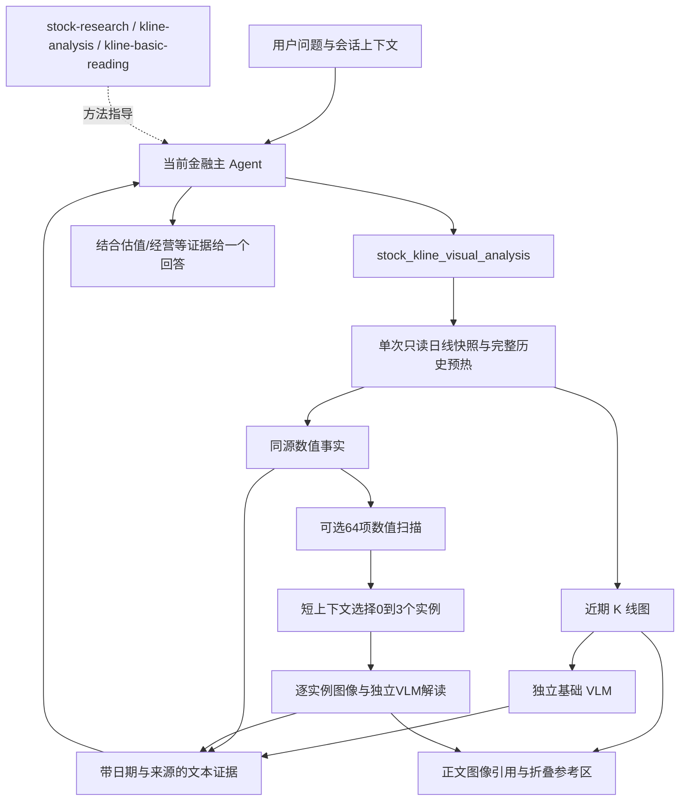
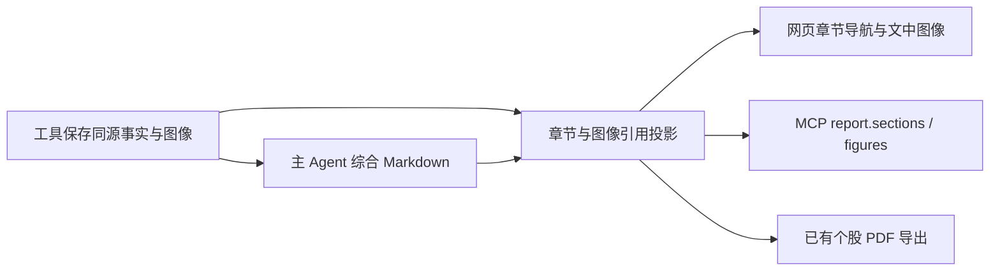

# K 线看图接入与系统能力架构复核

日期：2026-09-30。范围：本地工作区的内置金融方法、静态系统工具、统一数据目录和聊天适配；排除用户创建的测试工具。含其他会话尚未提交的代码，不代表生产部署验收。

## 判断与本轮修正

现有主方向合理：**主 Agent 持有会话与结论，Skill 提供业务方法，Tool 取得/加工证据，数据目录定义取数合同**。不需要把每个因子注册成 Tool，也不需要把每个 Skill 运行成独立 Agent。需要解决的是少数边界与实际运行能力不一致。

| 发现 | 影响 | 本轮处理 |
|---|---|---|
| 看图、选形态与 VLM 复核只有研究链路，没有聊天工具入口 | Skill 能描述流程，却无法真正执行 | 新增 `stock_kline_visual_analysis`，接注册、Agent 授权、CC/DSH MCP、结果引用和界面参考数据 |
| 当前 `BL/deepseek-v4-flash-0731` 对盲测图片回答“无法看到图片” | HTTP 成功不能证明看过图 | 显式配置 `LLM_VISION_MODEL`；未配置时明确返回未执行。后续按用户指示采用 `BL/deepseek-v4.1-flash`，见下方补记 |
| 研究流程自己再调用主模型写最终回答 | 与聊天历史、用户追问、其他研究分支脱节，增加一次重复综合 | 聊天只调用证据阶段，复用原研究入口的可选 `synthesize=False`；最终综合留给当前 Agent |
| 图像使用 `/tmp` 依赖目录和 macOS 字体 | 无法直接在服务器重现 | 正式声明 Matplotlib 依赖，使用包自带字体及中性英文图例；绘图串行保护，模型请求不持有绘图锁 |
| 投资分析 Agent 声明 9 个已停用/退役旧工具 | 配置承诺与可执行资产不符 | 删除失效声明，加入已有统一金融数据查询及新视觉工具；旧实现保留以免破坏兼容 |
| 技术结构、K 线分析、基础看图职责相近 | 容易重复取数、重复扫描与写三份结论 | 明确三者分别组织定量证据、具体形态演变、独立图像背景；按需组合、共享时点与结果 |
| 新增视觉/选择模型调用不在主 Harness 用量内 | 请求总 Token 会漏计，或误计成新 Agent 轮次 | 辅助调用按阶段保留模型、耗时、usage；请求统计单独加总，缺失 usage 保持未知，图像与缓存输入不重复加算 |

## 本轮实现后的执行关系



- 基础看图：`review_patterns=false`，只有一张近期日线/成交量图和一次 VLM 调用，不跑形态扫描。
- 形态分析：同一冻结序列派生图像和事实，基础看图后，按问题选择最多 3 个数值候选局部复核；不补选凑数。
- 基础 VLM 不接收用户的预设结论、计算事实、候选列表或主 Agent 历史。局部 VLM 只接收单形态定义与一张图。选择模型看问题和程序摘要，主模型接收各分支文本证据。
- 参数限定单只完整股票代码、1–60 根已完成日 K、可选截止日。指标从固定历史锚点预热后再裁图；当前未收盘和未来日期不进入计算。日线复权价统一缩放至实际截止日原始收盘，成交量单位为股。
- 不接受任意本地文件路径或远程图片 URL。工具生成的 PNG、输入 hash、图像 hash、模型调用与完整结果保存在归属当前会话的结果中；再次读取结果需要原会话权限。
- 图像不回灌文本主模型。参考数据区沿用已有 Resource Renderer 展示同一张 PNG，默认折叠；未新增业务阶段或生命周期状态。
- 单次视觉流程有时间预算、每次请求有超时、无自动重试。失败分支保留独立可用事实；未完成的 VLM 文本不作为已验证结果。

## 全部 18 个业务 Skill 的合理位置

以下是业务方法地图，不是新增硬编码父子状态或调用依赖。公共 Skill ID 保持兼容。

| 业务层次 | Skill | 本职与关系 |
|---|---|---|
| 市场与产业环境 | `market-overview` | 指数、宽度、成交、风格环境，为标的研究提供背景 |
| 市场与产业环境 | `sector-theme-analysis` | 行业/板块/主题的交易热度与产业兑现；热点标签不等于收入暴露 |
| 标的与组合比较 | `stock-research` | 单一公司的主命题与最终综合，按缺口采用专业方法 |
| 标的与组合比较 | `stock-comparison` | 同业或跨业务公司的可比性与取舍，不机械按同一倍数排名 |
| 基本面与定价 | `earnings-analysis` | 本期业绩变化与兑现，侧重事件和期间变化 |
| 基本面与定价 | `financial-quality-analysis` | 多期盈利、现金流与资产负债质量，侧重持续性 |
| 基本面与定价 | `valuation-analysis` | 商业模式对应估值锚、价格隐含预期与条件情景 |
| 基本面与定价 | `dividend-analysis` | 分配质量与可持续性，区分预案、实施及特别分红 |
| 研究证据 | `equity-report-analysis` | 提炼机构观点、预测与分歧；预测不是已兑现业绩，目标价不是内在价值 |
| 价格与交易结构 | `technical-structure-analysis` | 定量技术结构、趋势、波动、支撑/突破条件；按需复用看图 |
| 价格与交易结构 | `kline-basic-reading` | 低成本独立图像背景，是可单用的局部方法 |
| 价格与交易结构 | `kline-analysis` | 具体形态、发生日期、当前演变、数值与视觉反证 |
| 价格与交易结构 | `relative-strength-analysis` | 同区间、同收益口径下对市场/行业的相对表现 |
| 价格与交易结构 | `capital-flow-analysis` | 分单流量、融资杠杆和持有人披露分别解释，不都叫“主力资金” |
| 筛选与量化解释 | `stock-screening` | 将条件变成可解释候选；临时筛选不等于发布策略 |
| 筛选与量化解释 | `factor-analysis` | 解释因子值、暴露与限制；单次技术指标比较不等于有效性回测 |
| 其他证券品种 | `fund-analysis` | 份额、价格/净值与披露；持仓、费用和经理须另有证据 |
| 其他证券品种 | `bond-analysis` | 行情、条款、利率信用和转股机制；没有现金流等输入不能给精确久期/YTM |

个股研究**应该能够用看 K 线，但不应该每次都强制看**。用户问近期走势、交易位置、基本面与价格背离时采用技术分支；只问财报字段、报价或长期经营命题时，保留最小充分取证。技术信号不承担公司质量或估值正确性的证明责任。

## 系统工具的分层（28 个 active 静态注册项）

| 层 | 当前工具 | 处理原则 |
|---|---|---|
| 统一金融取数 | `finance_data_query` | 聊天经 `finance_query` 编排目录中的 37 个视图/55 个方法条目；视图不是独立 Agent |
| 已有数据访问适配 | `stock_realtime_quote`、`stock_daily_kline_query`、`stock_intraday_kline_query`、`stock_valuation_query`、`stock_fundamental_snapshot`、`stock_financial_statement_query`、`stock_announcement_query`、`stock_capital_flow_query` | 保留接口兼容；不同时向 DSH 暴露一组与统一目录重复的查询入口 |
| 基金与指数访问 | `fund_daily_market_query`、`fund_profile_query`、`index_daily_market_query` | 同上；方法能力须以实际字段、时点和非空数据为证 |
| 市场与分类关系 | `market_realtime_breadth`、`plate_rank_query`、`plate_members_query`、`stock_plate_membership_query`、`get_company_taxonomy_profile`、`实时行情排名查询`、`涨跌停列表查询` | 数据与关系事实，不自行生成投资结论；行业、主题、板块与公司业务暴露分别表达 |
| 确定性计算/观察 | `indicator_series_query`、`stock_minute_signals`、`quant_data_provider`、`quant_factor_screening` | 旧指标序列/旧量化链与新增标准指标体系分清；分钟观察不默认创建任务或推送 |
| 语义证据加工 | `stock_kline_visual_analysis` | 真正需要图像理解的计算证据工具；不放进声称确定性的行情字段视图 |
| 外部材料 | `general_search`、`financial_news_search` | 后者保留兼容，当前聊天以 general_search 为补充；搜索摘要不冒充原始披露 |
| 文件 | `file_io` | 文件解析与产物，沿用归属和文件 ID 边界 |
| 隐藏验证旁路 | `stock_protocol_data_query` | direct-only；不作为业务主入口 |

25 个非 active 项、8 个内部开发/编写方法和2个历史 Skill 仍见 [完整盘点](system_skills_tools_inventory_20260930.md)。内部开发方法属于“能力生产流程”，金融业务方法属于“使用能力回答问题”，不应在面向用户的专业方法列表中混放。

## 不在本轮扩大实现的缺口

1. `src/experiments/kline_patterns` 已被数值查询和视觉适配复用，名字仍带研究属性。本轮复用其经过测试的纯计算/绘图逻辑，正式入口在 service/tool；后续稳定后可搬迁公共库并保留研究脚本适配，避免现在搬动其他会话正在改的整个模块树。
2. 技术因子值和形态成立不证明可交易收益。正式因子有效性需要时点数据、样本定义、成本和样本外检验；当前固定篮子回测不是通用因子研究平台，也尚未列入金融 DSH 白名单。
3. 基金/债券 Skill 的研究范围宽于结构化数据覆盖。现有正文已约束补充披露与缺口表达，暂不增加“完整估值已就绪”的工具声明。
4. 当前新增正式视觉工具只覆盖已完成日线。分钟级视觉复核、任意用户原图的候选扫描、非股票证券 K 线尚未由本工具承担，不能把日线重绘当成这些能力的验收。
5. 私人数据库 Skill、生产实际配置、压测/恢复未在此审查范围。工具 active、测试通过和本机真实调用均不等于生产已放行。

## 验证证据

记录目录：`outputs/kline_chat_integration_20260930/`。当前 0731 的实际盲测保存在 `vision_probe.json`，请求仅包含一张三色几何图和观察指令，返回明确无法看到；未用数值/文字泄露图片答案。

自动化覆盖独立输入、同源日期/窗口、无配置、无效参数、失败保留事实、会话归属、完整文本与图像分离、辅助用量、Resource 图像渲染及默认折叠。真实聊天采用 `scripts/eval_skill_chat_live.py` 和 `tests/evals/kline_chat_visual_v1.json`，身份/会话使用本地适配，不写生产会话。

视觉模型启用与真实端到端业务复核状态以本文件后续实测补记为准。当前尚未执行生产部署或重启。

### 本轮实测补记

- 440 项 Python 相关回归通过，2 项跳过；72 项 DSH 策略测试通过；14 项前端测试通过；TypeScript 与 `git diff --check` 通过。不是全仓库、压测或生产质量门验收。
- 两处现存 SOFT 文案测试仍绑定旧段落标题/旧句子，本轮保留引用完整性、渐进加载和工具协议隔离断言，移除已过时的文案重复要求。
- 用真实平安银行数据生成并人工查看日线图：源历史 2122 条（2018-01-02 至 2026-09-29），展示最近10根（2026-09-15 至09-29），价格/均线与量能同源；图像、元数据和 hash 已保存。
- 真实聊天诊断2轮均完成：自动选基础看图、传 `review_patterns=false`；模型未配置时明确报告，然后转数值分析；追问沿用标的和截止日扩大窗口。运行中有源文件修改，故仅为诊断证据，不能当最终 ref 的验收。
- 上述数值降级回答出现“收回 MA5”与引用的收盘低于 MA5 相矛盾，业务质量不能因 HTTP/流程完成就算通过；没有为该单一案例增加关键词规则。启用 VLM 后仍需按同源程序事实人工审阅结论。
- 初次诊断时视觉验收为 NOT_READY。用户随后指定 DS Flash 4.1；现已确认接入点列出 `BL/deepseek-v4.1-flash`，三图形颜色盲测通过并返回 image_tokens。未采用 Qwen。后续业务与图文输出验证见补记。
- API 的 `finance_task` 同样获得服务端授予的新金融看图工具；没有顺带开放 Web 或自定义工具。`detail` 可查看辅助模型阶段、模型名、耗时与用量；主 Agent 轮次保持原定义。

机器可读记录：[`verification.json`](/Volumes/ext/fin_agent/outputs/kline_chat_integration_20260930/verification.json)。其中绑定当前 commit、工作区关键源码 hash 与实际测试环境，未知项如实保留。

### 启用方式

服务端显式配置 `LLM_VISION_MODEL` 为经过图片盲测的模型 ID，沿用现有 `LLM_BASE_URL` 和 `LLM_API_KEY`；聊天、路由和形态选择仍使用 `LLM_DEFAULT_MODEL`。依赖中新增 Matplotlib，绘图不依赖临时目录或系统中文字体。配置留空时只允许数值分支，不宣称看图。本地 `.env` 与 `.env_tmp` 已选择 `BL/deepseek-v4.1-flash`；未修改服务器或重启。

视觉模型确定后运行固定真实业务样本：

```sh
.venv/bin/python scripts/eval_skill_chat_live.py \
  --output outputs/kline_chat_visual_verified \
  --cases-file tests/evals/kline_chat_visual_v1.json \
  --cases basic,patterns,research,comparison
```

样本覆盖独立基础看图、调整窗口追问、形态局部复核、个股研究结合估值、以及“第二只”延续证券身份。此命令只在已配置视觉模型时才能完成真正的视觉验收。

## DS Flash 4.1 与统一图文报告补记

本轮用户明确选择 DS Flash 4.1。接入点实际 ID 为 `BL/deepseek-v4.1-flash`；本地文字与视觉模型已使用该 ID，沿用 `.env_tmp` 的接入地址和凭据，未操作服务器。三图形盲测及真实日K均取得图像 Token 用量。候选选择的兼容接口实测接受 `enable_thinking=false`；仅此短上下文选择任务使用该参数，避免预算在推理阶段耗尽；视觉解读仍独立执行。

### 内容与机器契约

主 Agent 只写一份 Markdown。章节内容、顺序与业务判断仍归 Skill；系统仅投影少量可寻址信息，不要求模型复写图片、数据源或整套报告 JSON。



- 二级标题可带 `{#technical}` 等维度标识；系统剥离展示标记、保留 `id/title/content/figure_ids`。普通 Markdown 和重复/缺失标识均兼容，不因报告表达差异拒绝结果。
- 图像由工具注册后生成 `fig_...` 标识；主模型只获得图注、标的、日期和标识，用 `finance-figure:` 引用，不获得 base64。局部图带实际形态名和信号日，避免错配。
- 网页在相关解读旁显示已保存图片，支持放大/恢复宽度，窄屏在图内滚动；3个以上章节显示导航，原始明细仍折叠。PDF 从同一归属轮次加载同图同文。
- MCP 默认返回章节及图像元数据；`include_images=true` 才附带 PNG data URL。原 `summary/data/detail` 兼容，纯数据模式不返回报告。
- 同源计算补齐实际均线值；基础看图 Skill 明确程序事实与定性视觉观察的证据边界，冲突时舍弃依赖误读的论据。没有新增业务校验器、状态机或二次模型改写层。

### 诊断批次与质量边界

`outputs/kline_report_20260930/chat/` 第一批6轮均在HTTP/DSH层完成，源文件未在运行中变化；“第二只”正确继承为招商银行600036.SH及原截止日。形态案例的基础、选择与3次局部VLM全部完成，但不能据此认为业务验收全部通过：发现20日追问沿用视觉阴阳误读、形态最终回答半句结束，以及简要研究没有加载 Skill 的交付口径不足。后续补齐事实、图像身份与方法说明，再按实际结束事件复测；禁止将这批 `completed` 直接当成质量 PASS。

网页实际组件已在桌面与390px视口检查，图片正常加载，页面内容宽度等于视口可用宽度；放大/恢复正常。PDF已有实际渲染检查。部署、并发、长稳、生产身份与外部客户端验收不属于本轮运行覆盖。

### 最终复测与格式回放

最终模型批次位于 `outputs/kline_report_20260930/chat_final/`，运行期间源码未变化，4轮均正常结束，记录了底层 `stop/tool-calls` 结束事件。此后仅对章节标识的可选空格和子标题标记清理做兼容修正，使用4轮原始回答按当前投影源码重新回放；证据为 `projection_replay.json`，不是重新调用模型。

| 样本 | 总耗时 | 总Token（含路由、辅助视觉与后处理的已报用量） | 主Agent步数 | 输出 |
|---|---:|---:|---:|---|
| 独立10根日K | 74.3秒 | 21,758 | 2 | technical/watchlist，1图 |
| 追问扩大到20根 | 71.6秒 | 35,193 | 2 | 沿用证券/截止日，明确纠正视觉与程序事实冲突，1图 |
| 形态分析 | 182.8秒 | 45,070 | 2 | 4章、4张已存图；基础、选择及3次局部VLM全部完成，回答完整收尾 |
| 简要个股研究 | 125.1秒 | 98,668 | 5 | 加载stock-research/kline-basic-reading，conclusion/valuation/technical/link/evidence，1图 |

当前投影的5个MCP/章节契约测试通过；相关后端套件59项通过，最终投影/展示/PDF套件25项通过（测试集合重叠，不相加）；72项DSH策略、11项前端测试、TypeScript和Vite构建通过。浏览器验证实际React组件，认证MCP协议以TestClient固定结果验证。未将本轮称为全部业务金标通过：第一批的半句结束未复现，但保留异常记录；自然语言时间窗口与定性看图仍需业务复核。

总证据入口：`outputs/kline_report_20260930/verification.json`；MCP示例（由真实研究回答投影，默认不带图片数据）：`outputs/kline_report_20260930/mcp_report_example.json`。运行覆盖不包括并发、长稳及生产环境，生产就绪仍为 NOT_READY。
