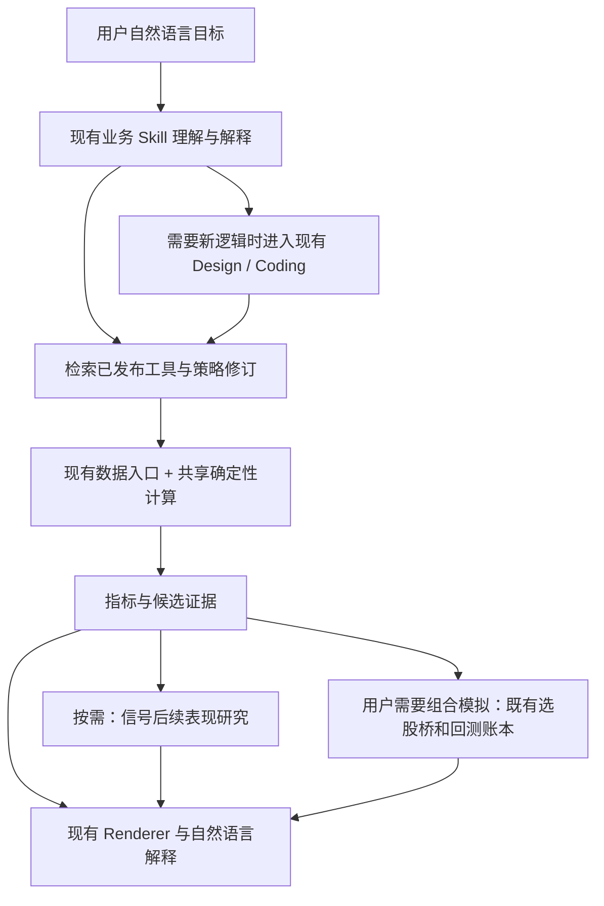

# myhhub/stock 阅读分析与 Fin Agent 引入建议

日期：2026-09-28。性质：源码分析与实施建议；本次未接入上游、未修改业务代码。

**建议将 InStock 用作技术分析能力和选股方法的参考来源，优先形成“共享指标计算 → 少量已验证策略 → 信号表现研究”的能力链。沿用 Fin Agent 的数据入口、资产修订、策略运行、回测和 Renderer。**

补充联读：[daily_stock_analysis 深读及三者结合方案](daily_stock_analysis_integration_review_20260928.md)。综合两个项目后，产品接入顺序建议先改善现有研究报告的证据展示，再落地本文的共享指标与少量规则，随后通过现有定时任务支持自选股持续复核；本文的指标口径和回测边界保持适用。

## 1. 阅读范围与证据边界

- 上游：[myhhub/stock][repo]，固定 commit `b6e0ca2268cfbadd02f5ed052159c187b6670231`，提交时间 2026-04-02。
- GitHub API 在本次读取时返回 14,646 stars、3,003 forks，根目录许可证为 Apache-2.0。热度只用于描述项目传播程度。
- 本地 Fin Agent：HEAD `93f8815d34359f2cc6493efc47284dcc7e14afb0`，基于当前工作区阅读。工作区原有未提交修改，尤其涉及 Custom Tool、Skill 和 Renderer；本分析不将整个工作区等同于干净 commit。
- 阅读了上游 README、指标计算、61 个形态映射、10 个策略文件、筹码计算、收益跟踪、数据获取、作业调度、表结构及部分展示代码；对照了本地行情工具、业务 Skills、旧量化筛选、Strategy Wrapper、回测桥、核心账本和金融图表。
- 执行了本地合成数据探针及 58 项现有针对性测试。没有启动上游 Web、数据库、爬虫、定时作业或交易服务；没有用真实行情验证策略有效性，也没有访问 README 所链接的 IMA 知识库。
- 探针结果、环境及关键文件 SHA-256 见 [probe_results.json](evidence/myhhub_stock_review_20260928/probe_results.json)。本次没有运行全量测试，不能据此宣称全量质量门或生产就绪。

## 2. 项目实际提供了什么

它的主线很直接：获取行情及选股器数据，计算技术指标和形态，逐股检查策略条件，将命中股票保存下来，补充后续涨跌幅，再通过表格和 K 线展示。

| 资产 | 核对结果 | 对我们真正的价值 |
|---|---|---|
| 技术指标 | README 列出约 32 类；源码包含 TA-Lib 调用和自定义 pandas/numpy 计算。`STOCK_STATS_DATA` 配置了 74 个输出列，含价格、多周期值和派生值，不能算成 74 个独立因子 | 指标口径参考、计算覆盖、指标与图表组合 |
| K 线形态 | 表结构中实际注册 61 个 TA-Lib `CDL*` 函数 | 可批量计算的形态特征，而非 61 个经过验证的盈利策略 |
| 规则选股 | 策略目录和注册表均为 10 个；多数是输入历史 DataFrame、输出布尔命中的函数 | 易于解释和修改的策略样例 |
| 综合选股 | `TABLE_CN_STOCK_SELECTION` 为 206 列，包含标识和展示字段；主要映射东方财富选股器接口返回的数据 | 筛选维度和字段目录参考；不等于 206 个本地因子公式 |
| 筹码分布 | Python 与 JS 两份计算；按换手率衰减历史筹码、按日内价格区间分配新增筹码，输出成本分布及 70%/90% 区间 | A 股技术分析中有辨识度的解释性视图 |
| “选股回测” | 以信号当日收盘为基准记录随后各日收盘涨跌幅 | 信号后续表现跟踪的起点 |
| 展示与批处理 | 配置驱动表格、K 线联动筹码、历史日期批量计算、共享行情和线程池 | 借鉴按需展开、计算复用和结果复用的思路 |

统计采用 Python AST 读取配置，没有导入表结构模块或连接数据库。依据：[指标实现][indicators]、[表结构及注册表][tables]、[选股器数据获取][selection]、[筹码计算][cyq]。

README 顶部的“2200+ 因子”描述链接至外部 IMA 知识库。**本次核对的 Git 仓库不能视为一套随代码交付、可直接执行的 2200 因子库。** README 还列了基本面选股示例，但当前策略注册表只有上述 10 项。[README][readme]

## 3. 值得吸收的特点，以及直接移植会遇到的问题

### 3.1 最值得保留的是业务可解释性

放量上涨、均线趋势、阶段新高、突破后整理等方法，可以用几句话解释目的，再用历史行情确定性计算。这很适合我们的自然语言创建工具：用户先确认“想找什么”，随后执行固定版本的规则，结果显示命中依据，用户再调整观察窗口或阈值。

上游把行情、指标、形态、策略和后续表现放在同一个使用流程中，也值得借鉴。Fin Agent 可以把这个流程变成“解释一个候选 → 查看命中证据 → 研究历史表现 → 保存或修改工具”，无需让用户在大量报表之间自行关联。

### 3.2 名称、说明与实际公式需要分别核对

| 源码事实 | 接入时的处理 |
|---|---|
| `turtle_trade.check_enter` 只判断当前收盘是否为含当日在内的最近 N 日最高收盘，允许相等，没有退出、仓位管理或完整交易系统 | 作为“区间收盘新高/高位持平”筛选样例。如果我们实现严格突破，应明示改为超过前 N 日最高收盘，并补足 N+1 根数据，不能沿用原名称暗示完整海龟策略 |
| `low_atr` 中名为 `atr` 的量是涨跌幅绝对值均值；极值循环用 `if/elif`，新高日不会更新最小值；`ratio > 1.1` 也不等价于最高价/最低价大于 1.1 | 暂不直接引入。若需要低波动选股，应按清晰定义使用 ATR/价格等正规计算，作为新的策略修订 |
| `enter.py` 的说明写“小于 2%”，执行却在涨幅小于 2% 时排除；成交额条件使用收盘价乘成交量近似 | 移植前确定最终业务口径，真实成交额已有时直接使用对应字段 |
| `backtrace_ma250` 的间隔用日期相减，得到自然日；高而窄旗形还依赖机构龙虎榜条件 | 不能只根据 README 名称自动生成实现；交易日窗口与额外数据依赖要在方法说明和代码中一致 |
| 部分指标的 NaN/Inf 被直接改成 0；批量指标入口默认仅取 90 根计算数据，而内部还计算 MA200 | 保留缺失和预热不足事实；计算窗口由实际依赖决定，展示窗口单独截取 |
| 筹码 `avg_cost` 实际取累计筹码 50% 位置 | 展示为“估算筹码成本中位数”；不能称为真实平均持仓成本或机构成本 |

依据：[新高规则][turtle]、[低 ATR 规则][lowatr]、[放量上涨][enter]、[回踩年线][annual]、[旗形规则][flag]、[指标实现][indicators]、[筹码实现][cyq]。

合成探针确认：60 根完全相同的收盘价会命中其“海龟”规则；构造末 10 日单调上升的数据，原 `low_atr` 返回 False，仅在内存把最小值更新改为独立 `if` 后变为 True。后者只证明极值更新缺陷，不表示认可其指标定义或阈值。

### 3.3 “收益跟踪”和“可交易组合回测”需要明确区分

`rate_stats.get_rates` 计算的是：

```text
信号后第 h 根有效行情的收盘价 / 信号日收盘价 - 1
```

没有在该模块模拟资金、持仓、买卖成交、手续费、滑点和不可成交情况。因此它适合描述信号后的价格变化，不能直接作为可实现的策略收益。[源码][rates]

探针用信号日收盘 100、次日开盘 120、第二日收盘 130：上游给出 30% 的两日变化；从次日开盘买入到第二日收盘的未计费收益约为 8.33%。两个数字回答不同问题，不能在报告中混用。

此外，`fetch_stocks(date)` 获取当前股票快照后可以附上传入日期，不能由此得到历史股票池。行情默认取前复权数据，缓存也没有形成每次研究的完整不可变数据快照。回填日期本身不能证明 point-in-time 可用性。[数据入口][fetch]

### 3.4 运行外壳不适合直接成为 Fin Agent 的依赖

上游包含 Tornado、MySQL 表结构、爬虫、单例行情缓存、cron 和 easytrader。直接包装整个项目会把这套服务生命周期、数据口径和异常处理一起引入，而我们已经有相应主线。

当前 `execute_daily_job.py` 中指标、形态、策略和回测的调用被注释。README 的整批耗时也没有绑定本次环境及 workload，不能作为现有版本全链路吞吐证据。源码树未发现专门的自动化测试套件。[作业入口][dailyjob]、[依赖][requirements]

建议只借鉴已审阅的计算和交互思路；数据仍由本地 Provider 提供，运行仍由现有工具和 Strategy Wrapper 管理。自动交易模块不在本次引入范围，本仓库也明确将 `action` 限于 Design。

## 4. Fin Agent 已有基础，以及真正的缺口

| 本地能力 | 代码事实 | 对接建议 |
|---|---|---|
| `StockQuoteTool._compute_tech_indicators` | 已计算 MA5/10/20、MACD、RSI；采用自己的初始化和平滑方式，均线允许不满窗口，RSI 使用简单滚动均值 | 先抽出可复用计算函数并明确版本，再扩展 ATR、BOLL、量比、区间高低点。展示、筛选和回放消费同一实现；不要增加第三套指标计算 |
| `technical-structure-analysis`、`factor-analysis`、`stock-screening` | 已有理解、解释和证据边界的方法；factor Skill 明确把确定性公式交给正式 Tool | 补充按需参考的方法和已发布工具入口；无需新建一个选股 Agent |
| `QuantFactorScreeningService` | 计划可声明因子，但执行代码固定为动量、流动性、资金与消息计数评分，未消费自定义公式、方向和权重 | 不作为通用因子执行器继续扩展；在用户可达的旧入口中先修正能力声明或接到真正执行该规则的正式实现 |
| `QuantDataProviderService` | 提供 artifact、coverage、数据来源；旧默认 Tool 包装未注入 query executor，计算还硬选 local_dev，不能把 fixture 成功当默认可用 | 新能力使用实际可运行的数据主线和现有授权运行时，不复用测试注入条件冒充生产接入 |
| `StrategyRunResolver/Executor` | 已管理策略引用、时点、预热、股票池和有界调度 | 参数和代码在修订阶段确定；运行时不让 LLM 对每只股票重写判断 |
| `SelectionOutputProfile` 与回测桥 | 已将明确的排序结果映射为完整目标组合；历史回放要求固定版本和时点保证 | 原样复用。逐股布尔命中若要变为 Top-N，需策略本身声明排序规则，不能用并行完成顺序代替排名 |
| `src/backtest/` | 有下一日开盘执行、资金账本、成本和未来访问边界 | 作为组合模拟的唯一核心；事件研究另走计算路径 |
| `FinanceChart` 与 Surface Block | 已有 K 线、指标线、成交量、表格、指标摘要和资产展示框架 | 优先复用；RSI/MACD 应使用独立量纲的副图，当前默认指标叠加在价格轴不能直接承担所有指标展示 |
| `src/quant_research/` | 已有 draft 因子/策略 JSON 和发布适配服务 | 不能把 draft 或目录项当成已验证的可执行因子库；本次无需再扩张这套描述协议 |

主要本地入口：

- [行情指标实现](../../src/tools/stock_quote_tool.py#L110)
- [旧筛选固定评分](../../src/services/quant_factor_screening_service.py#L308)
- [因子研究 Skill](../../src/skills/finance-business/skills/factor-analysis/SKILL.md)
- [股票筛选 Skill](../../src/skills/finance-business/skills/stock-screening/SKILL.md)
- [技术分析 Skill](../../src/skills/finance-business/skills/technical-structure-analysis/SKILL.md)
- [策略运行](../../src/services/strategy_run_service.py)
- [选股回测桥](../../src/services/strategy_backtest_service.py)
- [回测架构与边界](../backtest_core_architecture.md)
- [金融图表](../../frontend/src/components/renderers/FinanceChart.tsx)

旧筛选探针只改变 `price_momentum` 的 `higher_better/lower_better`：计划 hash 改变，但两只合成股票仍按相同的 20.01、5.01 分排序。这里的首要问题是声明与实际执行不一致；需要修复执行能力或准确限定声明，不能用新增关键词校验解决。

本地组合回测也有明确边界：现有选股桥只接受 `explicit_targets` 的历史股票池；动态股票池缺时间线时会拒绝。Buy & Hold 适配器明确提示未处理公司行动和退市结算，涨跌停成交、容量及 A 股 T+1 也未精确建模。接上更多策略不会自动补齐这些能力。

## 5. 按 SOFT → HARD → SOFT 引入

**本次主要是业务 Skill 与确定性计算能力的增量，只有真正跨模块执行和追溯所需的数据进入 HARD。**



### SOFT：方法与交互

- 策略含义、应用场景、窗口选择、阈值理由和局限放在现有业务 Skill 的按需 references 或完整 Design 中。
- 不为每个指标建 Skill，不把 206 列或 61 种形态全塞进系统提示词。
- 用户要求“完整海龟系统”时进入已有工具创建流程，明确退出和仓位规则；已有的新高筛选不能静默代替完整需求。
- 已保存工具由 Direct 读取和展示既有资产；修改业务条件走现有修订流程。

### HARD：可执行事实与结果

- 复用现有工具身份/修订、参数、有效日期、股票池引用、数据 artifact 和运行证据。
- 指标返回数值/序列，选股返回明确定义的候选和排序，组合返回现有 `TargetPortfolio`；公式版本通过代码和资产修订追溯。
- 股票代码、交易日、数值单位、复权方式和预热数据直接影响计算正确性，需要在数据适配与运行证据中明确。现有字段够用时不增加字段。
- 解释性命中理由保留自然语言；用于排序或执行的关键中间量保留为表格列。无需设计复杂的“策略理由对象树”。
- 不引入新的顶层 mode、全局策略状态机、通用公式 DSL 或第三方策略专属协议。简单常用公式采用可测试函数，组合策略用现有 Tool/Coding 能力表达。

## 6. 推荐的功能顺序

| 顺序 | 交付内容 | 价值与相对成本 |
|---|---|---|
| 第一批 | 共享指标计算与正式调用入口；3 个简单选股模板；复用 K 线与命中证据展示 | 高复用、低至中等改动；最贴合当前架构 |
| 第二批 | 信号后 1/5/10/20 个交易日的表现研究；以固定股票池接既有组合回测 | 补齐“这个条件历史上表现如何”；数据时点与样本对齐成本中等 |
| 第三批 | 少量常用 K 线形态；估算筹码分布及联动图 | 形态计算较小；筹码口径、验证与 UI 成本更高 |
| 按真实需求再做 | 热门策略收盘批跑、缓存、关注列表与结果变化提示 | 可复用现有定时任务；先有稳定能力和工作量证据再全市场预计算 |

### 第一批建议具体做到什么

共享计算先覆盖 MA、MACD、RSI、ATR、BOLL、成交量均值/量比、区间最高最低价。这些不是全部需要从零实现；MA/MACD/RSI 应从现有代码整理，确认口径后版本化复用。标准公式可直接用经过版本固定和测试的库，避免整包依赖 InStock。TA-Lib 是可选实现依赖，本次未安装，也未验证在部署环境中的构建与结果。

先提供三个可以完整解释的策略模板：

1. **放量上涨**：涨幅、实体方向、真实成交额和相对前 N 日成交量共同判断；窗口是否包含当日明确写入定义。
2. **均线趋势增强**：从明确的均线水平或斜率条件开始，避免用“均线多头”名称掩盖多种不同算法。
3. **区间收盘突破**：明确严格突破、并列新高、观察 N 日的语义。本建议优先采用“超过此前 N 日最高收盘”，它是对上游样例的重新定义。

通用指标函数作为工具实现层共享代码。每个可保存、可回放的策略由现有工具资产管理自己的执行入口与修订。业务 Skill 通过目录发现能力；用户调整窗口、阈值只修改相应参数或资产修订，不改系统协议。

暂缓“停机坪、回踩年线、高而窄旗形、低 ATR 成长”等复杂或口径有出入的样例，待第一批稳定后逐个澄清业务定义。K 线形态先挑吞没、锤头、十字等少量场景，正负值展示为形态方向特征，不直接命名为买卖建议。

### 第二批：事件研究与组合模拟各回答自己的问题

事件研究展示信号后的价格变化、相对基准变化、中位数、分位数、正收益比例和样本数。它不产生成交账本。近期信号未来窗口尚未走完时，仅进入已成熟窗口的统计并披露覆盖数，不能填零；停牌时不能把“下一条有报价”默认当成下一交易日。未来收益标签只供评估端使用，不能回流给信号计算。

用户进一步要求“每周买前十、等权、持有并调仓”时，再明确排序、Top-N、仓位、调仓频率和费用，经现有桥进入 `TargetPortfolio` 和账本。布尔筛选结果不能自动推导出这些选择。

第一版历史演示采用用户明确指定的股票集合，报告写明这是固定集合研究，不能宣称历史全市场选股效果。需要历史全市场时，先补齐历史股票池及数据可用时间证据，不绕过现有拒绝边界。

### 第三批：筹码是有价值的特色，但需要正确命名

筹码分布可以回答“近期价格相对估算成交成本集中区在哪里”，适合技术分析和候选解释。输入 OHLC、换手率、复权口径与窗口要保持一致；图形和解释均标注为估算。

建议把 Python 计算结果作为单一来源，前端只渲染，避免同时维护 Python/JS 两套算法导致图文不一致。验证离散化、零换手、一字价格、窗口长度及分位成本，再接独立视图。不从该分布推断真实股东或“主力持仓”。

## 7. 用户体验与性能落点

一个合适的目标场景是：

> “从我这组股票中，找出最近收盘突破前 60 日高点、成交量超过此前 5 日均量两倍的股票，解释命中原因；再看看相同条件过去的表现。”

执行后首屏展示股票范围、时点、候选数和条件摘要，候选表给出收盘价、前高、突破幅度、量比等少量证据。点开单只股票看 K 线、均线和信号位置；再按需查看事件研究或组合回测。示例不预设一定存在候选。

Design 展示理解和拟实现的筛选口径，详细公式、预热与验收默认折叠；Coding 展示模块和真实测试进展；Direct 调出已保存定义、实现和历史结果。没有必要复制上游的大型数据表页面。

性能上先做到同一次运行只取一次可复用行情、只计算请求所需指标，候选计算可独立并行，横截面排序在完整股票池上完成，组合账本保持逐日顺序。大表以 artifact 传递，模型只接收摘要与代表样本。若增加缓存，应绑定数据内容/版本、代码修订、参数及截止时点，不以“某股票今天算过”作为命中依据。

后续定时批跑复用现有 scheduled task/worker；不要复制上游 cron 或嵌套线程池。全市场多用户运行还需验证进程级背压、共享资源上限与数据批量查询，不照搬“普通笔记本约 4 分钟”的性能说法。

## 8. 首批实施拆分与验收

建议按三个可独立评审的变更推进，不先建立大型因子平台。

| 变更 | 核心工作 | 最小验收 |
|---|---|---|
| A：计算口径与共享实现 | 整理现有 MA/MACD/RSI，补窗口和缺失语义；新增 ATR/BOLL/量比；梳理旧筛选入口的真实能力 | 固定行情 fixture 与独立期望值；修改未来行情不改变过去值；不同展示窗口不改变同一截止时点的成熟指标；单位与复权不混用 |
| B：三个策略模板与展示 | 正式执行入口、版本绑定、命中中间量、现有 Skill references 和 Renderer 对接 | 命中/未命中/预热不足分别有样例；窗口边界、并列高点、零成交量；参数改变确实改变计算；批量与单只结果一致 |
| C：研究与已有回测衔接 | 信号未来表现计算；固定股票集合上的策略桥示例 | 信号日期与未来窗口严格隔离；未成熟样本覆盖；基准同期；D 收盘决策与 D+1 开盘执行；空候选与执行失败保持不同语义 |

若引入 HARD 改动，补正常流、兼容输入和关键结构/权限/时点错误的协议测试。业务口径差异由公式测试与策略修订处理，不加入通用业务 validator。

还需通过 chat API 做至少四个真实交互场景：查询已有指标；修改一个策略参数；要求历史表现并区分事件研究与组合回测；要求不存在的完整海龟交易系统时准确转入创建流程。过程中插入其他金融问题再返回，检查当前资产和用户修改是否保留。这些拟真场景本次尚未执行。

## 9. 本次验证记录

在本地 `.venv` Python 3.12.14、pandas 2.3.3 环境运行：

```bash
.venv/bin/python -m pytest -q \
  tests/test_backtest_core.py \
  tests/test_strategy_backtest_service.py \
  tests/test_strategy_run_service.py \
  tests/test_quant_factor_screening_service.py
```

结果：**58 passed in 1.27s**。覆盖现有核心与桥接协议，不覆盖上游全部指标、真实数据质量、收益有效性、前端体验和生产性能。探针额外证明了上文三个上游口径/实现问题及本地旧筛选方向未执行的问题。既有测试通过与发现业务语义缺口并不矛盾。

许可证方面，根许可证是 Apache-2.0；实际复制代码时按其要求携带许可证、保留适用声明并标注修改，依赖和具体来源另外核对。本分析没有复制上游实现到业务代码。代码许可证不能替代行情源和外部 IMA 内容的使用授权。[许可证][license]

**建议启动的首个闭环：共享指标口径 + 三个选股模板 + 可解释结果展示。事件研究紧随其后，筹码作为后续特色能力。每一步都能复用当前主线并单独证明价值。**

[repo]: https://github.com/myhhub/stock
[readme]: https://github.com/myhhub/stock/blob/b6e0ca2268cfbadd02f5ed052159c187b6670231/README.md
[tables]: https://github.com/myhhub/stock/blob/b6e0ca2268cfbadd02f5ed052159c187b6670231/instock/core/tablestructure.py
[indicators]: https://github.com/myhhub/stock/blob/b6e0ca2268cfbadd02f5ed052159c187b6670231/instock/core/indicator/calculate_indicator.py
[selection]: https://github.com/myhhub/stock/blob/b6e0ca2268cfbadd02f5ed052159c187b6670231/instock/core/crawling/stock_selection.py
[cyq]: https://github.com/myhhub/stock/blob/b6e0ca2268cfbadd02f5ed052159c187b6670231/instock/core/kline/cyq.py
[turtle]: https://github.com/myhhub/stock/blob/b6e0ca2268cfbadd02f5ed052159c187b6670231/instock/core/strategy/turtle_trade.py
[lowatr]: https://github.com/myhhub/stock/blob/b6e0ca2268cfbadd02f5ed052159c187b6670231/instock/core/strategy/low_atr.py
[enter]: https://github.com/myhhub/stock/blob/b6e0ca2268cfbadd02f5ed052159c187b6670231/instock/core/strategy/enter.py
[annual]: https://github.com/myhhub/stock/blob/b6e0ca2268cfbadd02f5ed052159c187b6670231/instock/core/strategy/backtrace_ma250.py
[flag]: https://github.com/myhhub/stock/blob/b6e0ca2268cfbadd02f5ed052159c187b6670231/instock/core/strategy/high_tight_flag.py
[rates]: https://github.com/myhhub/stock/blob/b6e0ca2268cfbadd02f5ed052159c187b6670231/instock/core/backtest/rate_stats.py
[fetch]: https://github.com/myhhub/stock/blob/b6e0ca2268cfbadd02f5ed052159c187b6670231/instock/core/stockfetch.py
[dailyjob]: https://github.com/myhhub/stock/blob/b6e0ca2268cfbadd02f5ed052159c187b6670231/instock/job/execute_daily_job.py
[requirements]: https://github.com/myhhub/stock/blob/b6e0ca2268cfbadd02f5ed052159c187b6670231/requirements.txt
[license]: https://github.com/myhhub/stock/blob/b6e0ca2268cfbadd02f5ed052159c187b6670231/LICENSE
