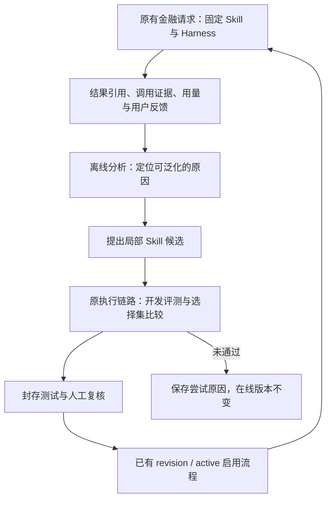

# RSI 递归自我改进：源码、论文、采用实例与 Fin 体系决策

调研日期：2026-09-30。**本轮仅调研；未安装优化器、运行自改进循环、修改业务代码、启用定时任务或部署。**

本报告续接 [9 月 8 日初步调研](agent_rsi_research_and_fin_agent_fit_20260908.md)，重点补充近期项目、真实源码、采用证据，以及当前 Fin Agent / Fin Harness 的接入条件。外部仓库固定提交、论文版本和本地关键文件指纹见 [来源清单](../research/rsi_20260930/source_manifest.json)。外部源码只读检出在临时研究目录，未加入产品依赖。

本地依据：Fin Agent `93f8815` **加当前未提交工作区**；Fin Harness `38ea60b`。不能把工作区能力说成已上线，也不能把历史评测成绩视为当前版本验收。检索工具连接失败后，使用 GitHub 官方 API、源码仓库、arXiv 和作者原站直接核查；这是有代表性的深查，不是全网穷尽清单。

## 1. 决策结论

**值得引入的是“可验证、可撤回的离线改进能力”；现在不宜引入在线自修改生产 Agent，更不需要替换 DSH/CC。**

优先顺序：

1. **先建立可信的业务比较，再试单个 Skill 的有界改进。** 首轮同时比较当前版本、一次性修订、少轮次自动优化，确认循环本身是否比普通修订更有价值。
2. **SkillOpt 是本次新增的最贴近候选；GEPA 是通用优化引擎候选。** 前者面向 Skill 的局部编辑、拒绝经验和验证选择，后者便于把现有 DSH 全链路接为黑盒评估函数。先做一个最小实验，不叠加两个优化框架。
3. **Fin Agent 持有业务评分、样本权限与 Skill 生效权；Fin Harness 保持运行底座。** 通用的运行证据、版本绑定、预算和隔离接口可以逐步沉淀到 Harness，但不把金融评分和每个案例的经验写进 DSH 核心。
4. **真正递归的“改进优化器本身”放到后面。** Hyperagents、Dream-RSI 有值得研究的实证，但比 Skill 优化昂贵，且不具备我们的业务评估闭环。先证明一阶改进的泛化和经济性。

当前最主要缺口不是“Agent 还不会反思”，而是：**哪些结果真的正确、候选是否确实执行、改进是否泛化、总成本是否完整**。没有这些条件，递归会放大评分缺陷。

## 2. RSI 到底指什么

RSI 不是一种统一 SDK，也不是 DSH/CC 的同类产品。要看持久变化发生在哪里，以及产生改进的方法是否也会变化。

| 变化对象 | 实际机制 | 与严格 RSI 的关系 |
|---|---|---|
| 当次回答 | 自检、重试、修复工具调用 | 任务内修正；结束后未必留下能力变化 |
| 记忆、Skill、提示词 | 从多次经历提炼、修订并复用 | 跨任务自改进；通常模型权重不变 |
| 工具、工作流、harness 配置/代码 | 生成候选程序，执行评估，保留版本 | Agent 系统进化；优化流程可能仍固定 |
| 提案方式、搜索策略、优化器经验 | 改进“怎样提出、分配计算和筛选改进” | 更接近递归自改进/元改进 |
| 模型权重与训练操作 | 自生成训练数据、RL、训练 improver | 成本与基础设施要求明显更高 |

这是研究分类，不是建议新增业务状态枚举。重复执行一个固定优化循环不自动证明“改进速度会越来越快”；后者需要跨轮、跨任务、等预算的独立证据。

一个有价值的循环至少有五部分：**可修改资产、反馈来源、候选提出器、独立比较器、版本选择**。框架通常只提供其中几项。真正困难的是比较器是否测到用户关心的结果，而不是能否自动改文件。

## 3. 近期路线与源码核查

### 3.1 SkillOpt：最贴近我们已有 Skill 体系

来源：[论文 2605.23904v1](https://arxiv.org/html/2605.23904v1)、[仓库](https://github.com/microsoft/SkillOpt)。本次源码 `79124b3`，2026-09-06。

目标模型执行任务，独立优化模型读取成功/失败轨迹，对 Skill 作有限的 add/delete/replace 编辑；在选择集上比较候选，接受有改进的版本。论文区分训练、选择、最终测试集，覆盖问答、表格、文档及工具交互；并非只评 Skill 文本好不好看。

关键源码：

- [`skillopt/evaluation/gate.py`](https://github.com/microsoft/SkillOpt/blob/79124b37e9a6371e13b753f8bcd7adb1e493ade1/skillopt/evaluation/gate.py)：默认按选择分数严格提升接受，平分拒绝；支持 hard/soft/mixed。
- [`skillopt/optimizer/meta_skill.py`](https://github.com/microsoft/SkillOpt/blob/79124b37e9a6371e13b753f8bcd7adb1e493ade1/skillopt/optimizer/meta_skill.py)：把跨 epoch 经验保留给**优化器**，不直接塞给业务 Agent。它开始触及元改进，但不意味着允许无限自改程序。
- [`skillopt_sleep/consolidate.py`](https://github.com/microsoft/SkillOpt/blob/79124b37e9a6371e13b753f8bcd7adb1e493ade1/skillopt_sleep/consolidate.py)：处理任务拆分、候选比较、最终再次回放；`Sleep` 是独立包，不等同论文训练器。

**特别值得核对的 DSH 支持：** 仓库确有 [`plugins/dsh/src/index.js`](https://github.com/microsoft/SkillOpt/blob/79124b37e9a6371e13b753f8bcd7adb1e493ade1/plugins/dsh/src/index.js)，使用 Cordis `apply(ctx)`、`defineTool` 和 `ctx.tools.register`，包装 Python 引擎；提供 status、dry-run、run、adopt、harvest、schedule、unschedule。说明原生扩展面能承载这类能力，但并非“我们的 DSH 已能自动学习”：

1. [`harvest_sources.py`](https://github.com/microsoft/SkillOpt/blob/79124b37e9a6371e13b753f8bcd7adb1e493ade1/skillopt_sleep/harvest_sources.py) 有 Claude/Codex/Pi 等源，**没有 DSH/Fin 会话采集分支**。插件入口和日志适配是两回事。
2. 插件 peer 依赖写的是 `dsh-tools ^0.1.0-rc.8`，本地维护版本为 `0.1.2-alpha.1`。同名 API 是可行性线索，不是已通过的版本兼容证明；本轮未运行插件加载测试。
3. 插件依赖 `tools` 和 `shell`，并暴露本地写入和调度。我们的金融 profile 明确关闭 bash/editor 模型工具、通过金融 MCP 提供授权能力；不能直接把七个维护工具放进用户金融问答。
4. Sleep 的 adopt 写本地 Skill/CLAUDE 文件。我们的个人 Skill 走 owner、不可变 revision、active 指针和运行快照；**直接写文件不能代替现有启用流程**。
5. Sleep 部分回放是文本式。其 [`judges.py`](https://github.com/microsoft/SkillOpt/blob/79124b37e9a6371e13b753f8bcd7adb1e493ade1/skillopt_sleep/judges.py) 允许通过回答里的 `TOOL_CALL:` 标记近似判断调用工具；这不能用来证明我们的真实金融查询发生过。

两个默认值也不能忽略：`gate_no_regression` 默认 false，平均分上升可能掩盖个别任务退步；`gate.py` 有可选的指令词密度奖励，默认关闭。本项目不应启用按 MUST/NEVER 等词频加分的选项，中文适配与业务正确性都不能靠这种分数代表。

**采用判断：** 优先借鉴有界修改、拒绝经验、独立选择和人工生效。若实际采用代码，使用固定版本、接真实 DSH rollout 和自己的 scorer；不把 Sleep 插件当作可直接上线的完整方案。论文“部署时无额外优化调用”是成立的设计方向，但 Skill 文本仍占 token，不能说推理成本为零。

### 3.2 GEPA：较成熟的通用候选搜索器

来源：[论文 2507.19457v2](https://arxiv.org/html/2507.19457v2)、[仓库](https://github.com/gepa-ai/gepa)。本次源码 `3f160c2`，2026-09-25。

[`GEPAAdapter`](https://github.com/gepa-ai/gepa/blob/3f160c295000dd31db3d438c3d17553c23cc5f81/src/gepa/core/adapter.py) 的关键职责很清楚：`evaluate` 运行候选并返回逐题结果、分数、轨迹；`make_reflective_dataset` 从轨迹提炼适合修改某个组件的反馈。优化器不理解我们的数据权限、财务口径，也不替我们定义正确性。

[`core/engine.py`](https://github.com/gepa-ai/gepa/blob/3f160c295000dd31db3d438c3d17553c23cc5f81/src/gepa/core/engine.py) 在候选池中搜索，保留对不同样本有优势的候选，支持接受策略与停止条件。当前还提供 `optimize_anything`、多目标分数、并行评估等；不再只能理解为“改一句 system prompt”。

实际源码采用已查证：

- [DSPy `GEPA`](https://github.com/stanfordnlp/dspy/blob/main/dspy/teleprompt/gepa/gepa.py) 导入 GEPA 并把程序、metric 和 compile 流程接入。
- [MLflow `GepaPromptOptimizer`](https://github.com/mlflow/mlflow/blob/master/mlflow/genai/optimize/optimizers/gepa_optimizer.py) 实现 `MlflowGEPAAdapter`，实际调用 `gepa.optimize`。这些是可见的集成代码，强于 README 中的采用名单。
- GEPA 自带 [GSkill](https://github.com/gepa-ai/gepa/blob/3f160c295000dd31db3d438c3d17553c23cc5f81/src/gepa/gskill/gskill/train_optimize_anything.py)，将编码任务执行反馈转成可复用 Skill；属于作者案例，不能算独立金融生产验证。

[Databricks 原始实验](https://www.databricks.com/blog/building-state-art-enterprise-agents-90x-cheaper-automated-prompt-optimization) 有企业信息抽取场景。所谓“90 倍便宜”比较的是优化后的开源模型与另一种闭源模型的 serving 成本，不是同一模型接上 GEPA 就便宜 90 倍。文章同时报告优化阶段耗时和更长提示带来的 serving 成本增加。

**采用判断：** 最适合把既有 Fin Agent 当黑盒执行器、只开放有限文本资产搜索。无需迁入 DSPy/MLflow，也不必替换 DSH。与 SkillOpt 的选择应由最小适配成本和同预算实验结果决定，论文排行榜不能替代本项目比较。

### 3.3 autoresearch / pi-autoresearch / Darwin Skill：低门槛，但裁判仍要自己做好

[Karpathy autoresearch](https://github.com/karpathy/autoresearch) 固定训练时间和评估入口，让 Agent 修改 `train.py`，根据 validation bits-per-byte 保留或丢弃。默认 `program.md` 由人修改；这是清晰的自主实验循环，不宜直接描述成默认会改进自身研究机制。

[`pi-autoresearch`](https://github.com/davebcn87/pi-autoresearch) 是实际使用 Pi 的扩展，本次源码 `939ede8`。其 [`index.ts`](https://github.com/davebcn87/pi-autoresearch/blob/939ede8220daad440eac6bb7b6e315cc283e0a64/extensions/pi-autoresearch/index.ts) 注册实验、测量、记录工具；测量脚本可输出 `METRIC`，检查失败时阻止 keep，保留 JSONL 记录并处理 Git 版本。

需要读到实现层的区别：keep/discard 和 metric 由调用参数带入；噪声提示是 advisory；次要指标通常只监控。它不是自动证明质量不下降的统计系统。其自动提交/撤回整个实验工作目录的方式，也不适合直接作用于我们多人并行且已有大量未提交变更的工作区。

[Darwin Skill](https://github.com/alchaincyf/darwin-skill) 是采用这条路线的 Skill 优化实例。本次 `8a8b662` 的 [`SKILL.md`](https://github.com/alchaincyf/darwin-skill/blob/8a8b66258e3c45d6ae4aea39719468c6428fcb0a/SKILL.md) 已从绝对分数差改为同一 judge 看两个版本的成对比较；README 的旧版描述不能完全代表当前流程。它有真实测试提示词和人工环节，但允许干跑，且大量评价仍围绕 Skill 文本。不可把多个评委同意直接视作金融结果正确。

**采用判断：** 小范围“改—测—保留”模式很实用；不需要把无限循环、自动 Git 操作和通用文本评分整套移植。CC/DSH 可以执行这种流程，Pi 只是其中一种执行底座。

### 3.4 DGM / Hyperagents：真正触及改进机制的递归

[DGM 论文](https://arxiv.org/html/2505.22954v3) 与 [`DGM_outer.py`](https://github.com/jennyzzt/dgm/blob/a565fd2d1dca504ef5104a7cc0f3bdc4ab9b4fd2/DGM_outer.py) 展示：从 archive 选择父 Agent，修改自身代码，跑编码评估，保留多样化分支。它不只是贪心地把每次最高分版本覆盖上去；有些暂时较弱的分支可能是后续改进的起点。

[Hyperagents 论文](https://arxiv.org/html/2603.19461v1) 把 task agent 与修改 task/meta agent 的 meta agent 放入可编辑程序。本次 `59a68f6`：[`meta_agent.py`](https://github.com/facebookresearch/Hyperagents/blob/59a68f672dfb92c74aeb7e61535d776fb36e172d/meta_agent.py) 是初始修改器；[`generate_loop.py`](https://github.com/facebookresearch/Hyperagents/blob/59a68f672dfb92c74aeb7e61535d776fb36e172d/generate_loop.py) 管 Docker 执行、lineage diff、分阶段评估与 archive。源码另有允许修改父代选择的实验选项；论文主体仍保留外层评估/选择约束，并非所有边界都自动改。

论文实证横跨编码、论文评审、机器人奖励设计等，还有改进机制的跨域迁移。它比“记录经验”更接近严格 RSI，但外部实验成绩不是我们的金融适配成绩。

成本边界很具体：论文附录估计 100 次迭代，仅自修改阶段约 **3300 万 token**，任务评估另计。这不是给普通问答每轮加一次反思的轻量功能。其估算段落的分项与总数还有算术不一致，本报告只引用明确分项，不据此计算本项目预算。

Hyperagents 源码许可证为 **CC BY-NC-SA 4.0**，OpenRSI 原创部分为 **CC BY-NC 4.0**。研究机制可以先行，商业产品直接复制这些代码前需要解决相应授权；不能把公开 GitHub 仓库等同于可直接商业依赖。

**采用判断：** 先学候选谱系、沙箱和元改进评估；暂不将生产代码自修改作为首期方向。未来自定义工具 Coding/Test 比开放金融问答更适合做隔离代码进化实验。

### 3.5 Dream-RSI：近期最值得跟踪的“优化搜索策略”

来源：[项目仓库及论文 PDF](https://github.com/zhengkid/Dream-RSI/tree/4149ea9181ab1db80f85717ffda2c9f0f130e85b)，2026 年 9 月。已读仓库内 36 页论文；项目网站本次返回 403。仓库明确：**完整代码、发现的程序和复现脚本仍在准备，不能说已有可直接集成实现。**

其改进对象不是业务回答，而是探索策略：选择哪条候选分支、继续多深、并行多少、何时停。把历史探索树保存为回放环境，候选策略重新选择已记录节点，读取其真实执行结果，不必每次重新执行昂贵的发现过程；再回到真实环境验证改进策略并补充历史。

一个关键限制是：回放只能遍历记录中已经存在的父子分支，不能凭空预测未尝试过的程序、调用或回答。因此，我们现有的一条 CPO 请求日志不能自动变成“任意新提示词都能免费测试”的模拟器。新提示可能改变取数、上下文与总结，仍要真实运行。

对 Fin 的潜在价值是**以后优化离线实验如何分配预算**，而不是现在照搬“做梦式学习”。目前首先缺少多候选探索树和可靠任务评分。论文还发现，在其部分实验中，把历史硬总结成方向提示反而约束探索；这进一步提醒我们不能把所有失败都沉淀成强制规则。

### 3.6 RSIAgent：学环境经验，业务执行时冻结记忆

来源：[2026-09 论文](https://arxiv.org/html/2609.15364v1)、[源码 `a9e5626`](https://github.com/AetherLabsAI/RSIAgent/tree/a9e56263f6deaa493496ad6b155fe24bf131bc12)。

Curriculum 提出练习，Actor 在软件环境操作，Verifier 独立核查，随后整理记忆。先广泛探索，再针对薄弱点练习；正式测试阶段关闭课程生成与记忆写入。框架和权重并未在每轮递归重写，主要积累可复用经验。

[`phase1_wave.py`](https://github.com/AetherLabsAI/RSIAgent/blob/a9e56263f6deaa493496ad6b155fe24bf131bc12/explore/phase1_wave.py) 从同一个波次前记忆启动独立分支，之后串行合并；[`target_learning.py`](https://github.com/AetherLabsAI/RSIAgent/blob/a9e56263f6deaa493496ad6b155fe24bf131bc12/explore/target_learning.py) 管理候选、验证及记忆提升；[`core/verifier.py`](https://github.com/AetherLabsAI/RSIAgent/blob/a9e56263f6deaa493496ad6b155fe24bf131bc12/core/verifier.py) 刻意不给核查者 Actor 的私有推理与记忆。

这可借鉴为“不同候选用同一初始状态、业务运行版本冻结”。但不要照搬成每次金融问答再增加三个 Agent。README 自己披露其汇总含选定重试、不同预算和局部重新评分；不能把 headline 当作等预算、多次独立重复的净 RSI 收益。其失败分析也承认验证误判和错误经验会限制改善。

### 3.7 RSI-Harness：可版本化配置底座，不是默认自动优化器

本次 [源码 `737bf1f`](https://github.com/CosmosMind-ai/RSI-Harness/tree/737bf1f5a5a56f0c49bbd5180e71d651113038ac) 使用 Pi `0.84.3`。Genome 把提示、工具、Skill、MCP、策略等配置装成资产，GEE 从会话历史分析重复操作和纠正，再经用户确认生成配置。

源码 [`pi-projection.ts`](https://github.com/CosmosMind-ai/RSI-Harness/blob/737bf1f5a5a56f0c49bbd5180e71d651113038ac/src/harness/pi-projection.ts) 把配置映射到 Pi 原生设置；[`pi-surface.test.ts`](https://github.com/CosmosMind-ai/RSI-Harness/blob/737bf1f5a5a56f0c49bbd5180e71d651113038ac/test/pi-surface.test.ts) 从 Pi 类型声明检查覆盖面。它避免 fork Pi 核心的思路，很符合我们保持 DSH 主线兼容的目标。

但是配置生成、结构校验、用户认可，不等于证明运行质量提升。它更像改进资产的载体。Fin 已有 profile patch、Skill revision 和依赖锁定，不应为名称相近再造 Genome 协议。

### 3.8 其他实际工程路线：ACE、Reef、Penguin、Raven、OpenRSI

| 项目 | 本次实际核对 | 对我们有用的判断 |
|---|---|---|
| [ACE](https://github.com/ace-agent/ace/tree/82709de050e1db6e6ef2f07bcb0393560b94992a) | Generator 仍整体格式化传入 playbook；金融示例预算默认 80,000 token；通用 playbook 操作仍有 UPDATE/MERGE/DELETE TODO | 借鉴增量经验；不全量追加进上下文。其金融基准不等于我们的取数与多轮研究 |
| [Reef](https://github.com/Human-Agent-Society/reef/tree/aadbd2ac3011b929638865b6c782cfb89f97306a) | 当前 evaluation 已改成 evaluate+decide 插件；有 AlwaysSelectMixin 和 RegressionCheckMixin。harness 教程 grader 是 sieve/fib/csv 三题的末行答案 | 9 月 8 日报告中的旧默认类描述不能当现版本结论。发布是否优于基线取决于具体 recipe；不迁入整套 serving/training 系统 |
| [PenguinHarness](https://github.com/Prism-Shadow/penguin-harness/tree/9eebc91c09175b16150a5a0bb6ecc46ba28e066c) | agent-tuning Skill 编排冻结 benchmark、候选、评测、版本快照；snapshot-service 有真实归档实现。另一 continual-learning stop hook 在长任务后委托直接修订 Skill | 两条路径的保证不同：评测优化不能与会后经验写入混为一谈。其优化规约仍允许平均分比较且初始/候选重复次数不同，不作为我们的无退步标准 |
| [Raven](https://github.com/EverMind-AI/Raven/tree/e6c0344cb7ce00db25d554e4bb671ec1909a8f9f) | 独立 evolver 有筛选/确认/封存测试方案；README 标注该树计划退役，统一入口仅注册 AppWorld；runtime Curator 为 experimental | 可借鉴 cheap screen→重复确认，但需要区分展示案例、计划能力和当前受支持入口。不能因“harness of harnesses”就判断是更成熟替代品 |
| [OpenRSI](https://github.com/FrontisAI/OpenRSI/tree/71ae803a035d5e3b78c19fa49ed9f67d0550cbaa) | `OpenMLE-Evo/tts_search/program_database.py` 保存程序、父代、Draft/Improve/Debug/Crossover；存在真实 MLE/NatureBench 适配与示例轨迹 | 是机器学习工程训练与搜索体系；任务执行和 GPU 预算不是普通金融问答规模。当前不引入权重训练 |

这几条路线共同说明：**可编辑性、持续记忆、自动评估、自动发布是四件不同的事。** 仅看“自进化”功能名无法知道项目实际保证了哪一件。

另一个源码与概述的差别：Raven 的 [`paired.py`](https://github.com/EverMind-AI/Raven/blob/e6c0344cb7ce00db25d554e4bb671ec1909a8f9f/evolver/orchestrator/gates/paired.py) 将平均分高于对照设为 `promoted`，将达到 2σ 另记为 `credited_2sigma`，两者不等价。因此看到“三道 gate”或“统计检验”的描述，也不能推导每个保留候选都已有显著收益。

## 4. 是否已有真实采用？有，但证据层次必须分开

| 例子 | 已看到的证据 | 能说明什么 / 不能说明什么 |
|---|---|---|
| DSPy / MLflow 接 GEPA | 实际适配器与调用代码 | 证明通用优化器已进入正式开源开发工具；不证明所有用户都在生产持续优化 |
| Databricks 企业信息抽取 | 原始实验、模型对照、优化和 serving 成本讨论 | 证明企业任务存在可测收益；不是金融 Agent 端到端收益承诺 |
| gbrain-evals 接 SkillOpt | 独立下游的 [实验报告与 runner 入口](https://github.com/garrytan/gbrain-evals/blob/main/docs/benchmarks/2026-06-03-skillopt.md) | 真实采用案例，但报告承认历史 receipts 丢失、早期训练和 held-out 规则相同；不能当强泛化证明 |
| pi-autoresearch / Darwin Skill | 真实扩展代码、工作流和作者实例 | 证明流程可操作；业务效果依赖用户自己的测量 |
| DGM / Hyperagents / RSIAgent | 论文、代码、基准与部分日志入口 | 研究可复现资产，非独立生产应用的审计 |
| ATLAS 金融 Agent | [仓库](https://github.com/chrisworsey55/atlas-gic/tree/cf4349f15c9d68a67042f792973372f2e0231088)、部分 JANUS/MiroFish 代码、收益 CSV、自述实盘 | 完整 autoresearch/backtest 核心未公开；不能据此验证自改进导致收益提升 |

两个实际案例尤其有启发：

**gbrain：先问是否需要循环。** 其报告明确记载，简单样本的一次性修订与完整循环都达到相同 held-out 分数；循环不是天然更好。它还展示了只靠章节标题拿满分、独立内容判分却很低的例子。这直接支持我们的三组对照和独立业务复核。

**ATLAS：公开金融例子不等于可复现收益。** [`src/README.md`](https://github.com/chrisworsey55/atlas-gic/blob/cf4349f15c9d68a67042f792973372f2e0231088/src/README.md) 明确核心实现细节 proprietary；描述的 `src/agents/autoresearch.py`、`backtest_loop.py` 不在当前公开树。按五个交易日 Sharpe 变化来改提示还会受到行情切换、小样本、重复试验和事后信息影响。它可以作为产品思路参考，不能作为我们应该引入收益驱动 RSI 的依据。

本轮没有找到足以独立核验的“与 Fin Agent 类似的金融查询/分析系统，依靠全自动 RSI 长期稳定提升且完整公开”的生产证据。这是检索范围内的证据结论，不是断言此类系统不存在。

## 5. 对当前 Fin 代码的具体判断

### 已有可复用基础

| 当前入口 | 源码事实 | 可以承接的部分 |
|---|---|---|
| `src/services/skill_authoring_service.py` | `revise_candidate` 读取完整上一版与反馈，检查 base revision，保存新候选；reference 由系统保留 | 优化器产生本轮修改建议，而不是重造资产生命周期 |
| `src/services/skill_candidate_store_service.py` | owner 隔离、不可变候选 revision；候选写入不切 active | 候选与生产版本天然分离 |
| `src/services/skill_hub_catalog_service.py` | runtime_catalog 解析可用版本；activate 有 expected candidate/active revision | 复用现有显式启用与并发保护 |
| `src/scenarios/financial_qa/business_skills.py` | content hash、不可变运行快照、按需正文/参考 | 每次实验绑定确切 Skill；运行中不漂移 |
| `src/scenarios/financial_qa/dsh_service.py` 与 loop policy | 原生 SDK、金融 MCP、步骤与工具证据、历史选择 | 沿用真实执行路径，不另造模拟金融 Agent |
| `scripts/eval_skill_chat_live.py` | 真实 `/api/chat/dispatch`、DSH、模型和数据；记录源文件 hash、case hash、模型、配置与运行中变更 | 可以作为真实 rollout 的基础；已替换身份/持久化，非生产全链路 |
| `src/services/request_usage_service.py` | 已有辅助工具模型用量合并、缺失与零区分 | 复用统计口径；仍须确认每条模型调用都接入，不能仅从函数存在宣称账单完整 |
| Fin Harness session/profile/plugin 与双仓锁定 | 完整归档和模型可见历史分离、原生扩展点、固定 runtime | 适合执行冻结版本和记录实验环境；不是现成 RSI 引擎 |

### 当前四个真正的缺口

**1. 完成判定不等于业务 scorer。** `eval_skill_chat_live.py` 的脚本成功条件是 HTTP 200、`ok` 和 `finish_reason == completed`。这正确地测通路，但不能拿作优化器的质量奖励。方法选择脚本也不能替代最终结果正确性。

**2. 当前工作区需先固定。** 多个 session 的未提交改动同时存在；只记 HEAD 不足以复现实验。现有 hash manifest 是好基础，开始实验前仍应选定可复现快照。外部候选只能修改隔离副本中的允许资产，不能触碰共享 checkout。

**3. 作者测试与真实业务链路还要接起来。** authoring 流程生成的 candidate、选择集执行的 candidate、最后启用的 candidate 必须是同一个 hash/revision。否则会出现“以为测试了新 Skill，实际跑的是原 active 版本”。要在 trace 中核实真正加载的资产。

**4. 反馈还需要证据归因。** 用户纠正可能是偏好、改口、数据问题或答案错误。不能一律转成全局经验；private Skill/会话的归属保持原样。框架错误应回到实现修复，不能把异常数据长期记成金融规则。

9 月 30 日能力记录中的 MACD 趋势概括、均量与当日量混淆、复权边界、历史序列选择，适合做效果样本。但报告中的运行版本不完全相同，须在冻结基线上复现，不能把它们都认定为当前仍存在的缺陷。

## 6. 五个维度：可能收益与代价

| 维度 | 可能获得的收益 | 不成立的捷径 | 我们应如何判断 |
|---|---|---|---|
| 效果 | 高频错误逐渐减少，方法选择和证据解释更一致 | 文本更完整、评委分更高就认为结果更好 | 数据/计算核对＋盲评；保留合理等价路径、空结果和正确拒答 |
| 效率 | 少量局部改动减少重复读取、失败重试、无效展开 | 强迫所有任务少调用工具，或少看数据就奖励 | 同质量条件下比较总调用、首答/全程延迟及重试；样本小不宣称生产 P95 |
| 消耗 | 高频任务复用经过优化的短 Skill | “冻结权重/零额外调用”就说零成本 | 计入优化、评测、judge、内部计算模型、回滚和新上下文成本 |
| 稳定性 | 已验证资产冻结、失败经验帮助减少重复试错 | 每次会话后自动改 active Skill | 候选不生效、失败不影响在线版本、明确复现和恢复证据 |
| 健壮性 | 对改口、换标的、数据缺失、不同运行时的迁移更好 | 多堆几条禁止规则或增加多个审查 Agent | 跨任务/实体/时间划分、反例、关键协议回归与真实多轮测试 |

经济性应比较：

`总成本 = 一次性提案与评测成本 + N × 每请求实际成本 + 维护/复核成本`

若候选每请求净节省 `ΔC > 0`，粗略回本量是 `C_优化 / ΔC`；若 `ΔC ≤ 0`，不能宣传为省成本，只能另行评估质量收益。这里的每请求成本包含新增 Skill token 和辅助模型调用；缓存 token、普通输入和输出的实际价格不同，不能只比 token 总数。

离线学习不增加用户当前请求的链路步骤，但共享网关并发可能拖慢在线服务，因此实验需要独立并发/预算限制。“后台运行”本身不等于没有线上影响。

## 7. 接入边界：沿用 SOFT → HARD → SOFT

- **SOFT**：归因、提出方法修改、说明适用范围，使用自然语言；允许结论是“不修改”或“删除冗余”。
- **HARD**：系统保存源版本、数据/样本指纹、owner、调用事实、候选 hash、预算和评估证据；模型不重复生成已有事实。
- **SOFT**：向维护者展示“为何改、实际改变了什么、哪些题改善或退步、有哪些未知”。

第一版只需实验脚本和现有候选资产，无需新增生产数据库表、运行时 validator、状态机或通用“学习平台”。离线评分只用于候选选择，不能顺手变成每个在线业务请求的强制拒绝层。

| 内容 | 首期归属 |
|---|---|
| 金融方法、局部数据口径、答案证据忠实性 | Fin Agent Skill/目录及业务评测 |
| 私人方法和用户偏好 | 原 owner 私有候选与权限体系 |
| 采样、选列、是否需全量统计的自然语义决策 | Agent 方法与既有工具能力；不按“列表/统计”等关键词固化 |
| 权限、结果归属、版本与调用事实 | 现有系统协议；优化器不能改 |
| 上下文选择、工具协议、回放、执行预算的通用能力 | 证明确有缺口后才进入 Fin Harness 插件/核心 |
| 自动修复 Harness/工具实现 | 后续独立 Git 提案、协议测试与 review，不由在线自学习直接发布 |

例如 CPO 列表：应测最终展示的完整性、缓存引用、需要统计时全量计算是否正确，以及所需列的实际读取。不能仅以“LLM 看得更少”判优。模型重复搬运已保存列表若源于框架传递，应在框架修复；RSI 不应以新提示补丁遮掩。

## 8. 怎么证明“更好”，并避免越学越错

1. **冻结业务裁判与最终测试。** 优化器可以看到训练失败及有用反馈，不能修改 scorer、删失败样本或用最终测试反复选版本。经多轮选择的 validation 已不是独立泛化证据；最终 test 开封后要结束该轮搜索。
2. **按任务族拆分，而非只按问题字符串。** 同一股票换名称、同一日期换说法可能仍泄漏。金融样本还要保留实际数据截止日、当时可得信息及复权/公司行为口径；候选比较先用相同快照，另外再测 live 时效。
3. **分开结果正确、解释忠实、工具可执行。** 取到数据不代表答对；正确空结果不能因少数据而扣分；不要求只能走唯一 API。确定性事实用程序核验，开放解释用成对盲评和必要的人审，不能用回答自称成功。
4. **保护原本正确的任务。** 平均分上升不能抵消关键任务退步；权限、归属、数值/时点等严重错误必须单独查看。有限样本只能支持“在这些条件下未发现退步”，不能数学保证所有未来效果不变。
5. **同预算重复，保存完整分母。** 基线和候选使用相同模型、参数、数据与重复次数；交错运行减少端点漂移。超时和不可判定单列，不删除；不要候选重复很多次取最好、基线只跑一次。
6. **验证候选确实生效。** 绑定实际加载的 Skill revision、双仓 commit/工作树 hash、配置、目录版本和 case hash。新增提示没加载上，或旧会话残留正文，都会使比较失真。
7. **最少必要的反馈。** 反思输入是任务、实际动作、工具结果引用、错误、回答和评分理由；无需保存或索取隐藏推理链。敏感会话只在既有授权范围内处理，不复制进公共报告。
8. **控制经验膨胀。** 可删除、替换、合并；稳定知识合回唯一权威资产。优化器失败经验放优化器侧，不给所有用户请求追加一份无限增长的手册。

## 9. 下一步计划：先小实验，再决定是否产品化

以下是待选择的计划，**本轮没有执行**。

### 第一步：准备一个可比较的最小实验

- 固定当前双仓和相关工作区资产，选一个 Skill 与一种可复现失败机制。
- 优先选择“数值证据与文字概括是否一致”或“已有能力能否被正确发现”；先复核是否是工具/目录 bug。若根因属于 HARD 实现，退出 Skill 优化路线，正常修代码。
- 整理 8–12 个开发诊断样本，覆盖正常结果、反例、缺失数据和追问；这些已看过的样本只用于开发。
- 定义最小业务 scorer，先用明显正确/错误的样本检验裁判是否能区分，不先接自动优化循环。

交付：冻结基线、可复现失败、评分依据、编辑范围、预算估计。此时仍不需要生产 hook 或 DSH 插件。

### 第二步：比较三种办法，回答“循环值得吗”

| 实验组 | 内容 | 目的 |
|---|---|---|
| A | 当前已冻结 Skill | 控制组 |
| B | 人工辅助或模型一次性局部修订 | 对照常规改进成本 |
| C | SkillOpt 式有界编辑，最多 4–6 个候选 | 衡量迭代选择是否有额外收益 |

使用独立的选择集和封存测试集；样本扩到约 40–60 个任务族、关键项 2–3 次成对重复，可作为首轮试验规模，**不是统计充分性或生产容量标准**。实际数量按每条 rollout 成本和主要指标的不确定性调整；不能先花完预算再补设门槛。

第一轮只修改一个 Skill 正文，冻结模型、工具、全局提示、Harness 和数据契约。方法加载版本走隔离 runtime snapshot；不先改 Skill 的 owner、权限、关联范围或 reference 生命周期。现有 authoring 能力是生成候选的入口，运行评估与生效指针继续归现有服务。

预算按 `候选数 × (诊断回放数 + 选择集数) × 重复次数 + 三组最终测试` 估算，并单列提案/judge 调用。先跑小样本测单位成本，再设置总花费、总时限、候选数和并发上限；不采用“永远运行”的默认策略。

**选择准则：** 关键任务和协议不退步；业务质量有可信收益，或同质量下总成本有可信收益；改动简洁、可解释。如果 B 与 C 相当，采用 B 的简单流程，不为 RSI 名称扩大系统。若成本超限、评分噪声覆盖收益或持续无增益，保存证据后停止，不自动加轮数。

### 第三步：接入候选工作流

只有第二步有收益时，才把离线提案接到现有 Skill Studio / candidate revision。展示 diff、逐题变化、用量、来源和未覆盖项，由原启用动作发布。新版本只影响后续运行；回滚使用现有资产版本能力，若当前接口不足先验证最小恢复路径，不直接覆盖用户正在用的资产。

此阶段可以评估 GEPA 是否比轻量局部编辑更适合多组件候选；不能为了使用优化器而要求所有业务改写成 DSPy 程序。也不启动无人工关注的夜间自动采集与发布。

### 第四步：再考虑 Fin Harness 通用能力

在至少两个不同业务消费者都验证需要后，抽取通用部分：实验运行版本绑定、证据导出、预算和隔离执行接口。保持原生 plugin/profile/MCP 边界及现有历史回放语义，给 DSH 升级保留最小差异。

真正的元改进可先研究“哪些失败值得尝试、哪个候选先测、何时停止”，仍固定业务裁判；Dream-RSI 的树回放要等有实际多分支记录后再考虑。开放生产代码自修改和模型权重训练不在近期路线。

## 10. 与 9 月 8 日报告相比，本次新增/修正

- **新增 SkillOpt 及其 DSH 插件的源码核查**，把它提升为首轮候选；但明确插件没有 DSH 日志适配和 Fin 资产发布集成。
- **新增 Hyperagents、Dream-RSI、9 月 RSIAgent**，区分优化器递归、搜索策略进化、记忆学习。
- **新增 Pi 和实际开源采用链**，不再只列抽象框架：DSPy/MLflow、pi-autoresearch、Darwin Skill、gbrain-evals。
- **核对近期平台的成熟度**：Raven 的计划退役/实验入口，Penguin 的评测优化与会后写 Skill 是不同流程，RSIH 主要是配置资产化。
- **修正 Reef 旧实现描述**：当前已改成 evaluation plugin/mixin；不能沿用旧默认类推导全部路径行为。
- **核查金融采用宣传**：ATLAS 有部分公开代码，但完整优化/回测链缺失。
- **结合本地新增能力**：已有 Skill 候选/CAS/运行快照与真实聊天评测；也确认当前脚本 completion 信号不能直接作业务优化奖励，且辅助模型用量已有新的合并实现。

最终建议是：**先把“自动提出可验证的改进候选”做好，再决定自动化程度；将 RSI 作为现有系统的离线研发能力，而不是金融用户每次对话都要承担的新执行层。**
