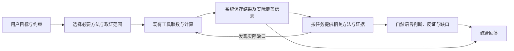

# Skill 执行、上下文交接与调度调研

调研日期：2026-09-29。依据当日官方文档、官方技术文章及本地 Fin Agent / fin_harness 实现。网页会持续更新，文中机制不代表所有 SDK 版本均支持；未对外部框架做性能排名。实验结果另见文末关联记录。

## 决策

继续以当前 DSH 为执行底座。优先吸收“按需加载方法、按任务组织工作上下文、保存证据引用、程序负责计算、按真实边界恢复”的机制，不整体迁入另一个 Agent 框架，也不把每个 Skill 编译为固定 DAG。

Skill 是业务方法；Agent 是带上下文和工具权限的执行者；harness 管理执行生命周期。这三者不能一一对应：一个分析步骤可使用多个方法，一个复杂 Skill 也可能跨多个步骤。

## 官方实现中值得吸收的做法

| 来源 | 查证到的机制 | 对 Fin Agent 的采用判断 |
|---|---|---|
| [Agent Skills 规范](https://agentskills.io/specification) | 方法正文与 supporting resources 分离，按需加载；规范描述技能包而非完整执行调度器 | 保持自然语言方法和兼容资产格式，运行权限、发布版本继续由现有系统持有 |
| [Claude Code Skills](https://code.claude.com/docs/en/skills) | 目录简介先加载，正文按需读取；重复相同正文可只标注已加载；`context: fork` 可独立执行并返回摘要 | 保留现有按需读取与正文去重；独立任务可采用隔离上下文。不要把它的 `allowed-tools` 当作我们权限交集的替代 |
| [OpenAI Agents SDK Handoffs](https://openai.github.io/openai-agents-python/handoffs/) | `input_filter` / `input_items` 选择接收方可见输入，并保留原 session history；默认交接继承历史；nested history 为可选 beta | 借鉴“模型看到的输入”和“归档的事实记录”分离，默认不复制整个过程。压缩和过滤不是信息保密的充分条件 |
| [Deep Agents Skills](https://docs.langchain.com/oss/python/deepagents/skills) | 简介、正文、资源三级渐进加载；线程中的方法状态需要明确处理重新加载 | 继续复用本系统 revision/snapshot，单次运行绑定版本，下一次运行解析新的发布版本 |
| [Deep Agents 上下文组织，2026-09-08](https://www.langchain.com/blog/organizing-context-in-a-multi-agent-harness) | 子任务可选择 `isolated` 或 `fork`；后者继承上下文，可能减少重复取证并利用缓存；独立审视适合隔离 | 这是近期最有价值的补充：隔离不应成为绝对规则，应看任务是否依赖之前的细节。先用明确证据交接验证，暂不增加业务枚举 |
| [Deep Agents 动态子任务](https://docs.langchain.com/oss/python/deepagents/dynamic-subagents) | 在解释器中用循环、分支、批量并发组织任务；文档标记相关解释器能力 beta | 多股/多文档批处理可候选使用；当前先复用 `finance_query.steps` 的批处理，不引入任意递归调度和额外执行环境 |
| [Google ADK Skills](https://adk.dev/skills/) / [Context compaction](https://adk.dev/context/compaction/) | SkillToolset 提供正文、资源与脚本调用；压缩可按间隔或 token 阈值触发并保留重叠事件，语言实现有差别 | 按任务边界组织输入优先；长对话压缩作为补充，不把金融事实只交给模型摘要保管 |
| [LangGraph Persistence](https://docs.langchain.com/oss/python/langgraph/persistence) / [Microsoft Agent Framework Checkpoints](https://learn.microsoft.com/en-us/agent-framework/workflows/checkpoints) | 保存运行状态供恢复；内存保存不等于进程重启可恢复，checkpoint 有存储和保留成本 | 后续沿用 DSH 日志与已保存结果恢复失败步骤；跨进程持久任务有明确需求时再做调度队列与恢复测试 |
| [Anthropic Programmatic Tool Calling](https://platform.claude.com/docs/en/agents-and-tools/tool-use/programmatic-tool-calling) | 代码组织多次工具调用和数据处理，只把需要的结果交给模型 | 数学与批量操作下沉到现有查询、聚合和受控计算；不能以此为由给所有 Skill 开放任意代码与外部访问 |

同名参数不代表相同语义：Claude Code 的 `context: fork` 文档描述的是不继承主对话的独立子任务；上述 Deep Agents 的 `mode: fork` 则继承父级状态。集成时应比较实际上下文行为，不能照搬字段名称。

源码交叉核对：[Deep Agents subagents.py](https://github.com/langchain-ai/deepagents/blob/main/libs/deepagents/deepagents/middleware/subagents.py) 将 fork 标记为 experimental，并排除旧 structured_response / summarization session 等状态，避免把上一步产物误当成本步结果；[OpenAI HandoffInputData](https://github.com/openai/openai-agents-python/blob/main/src/agents/handoffs/__init__.py) 明确区分 `new_items` 与 `input_items`。这两点支持我们保留原始事实、单独组织下一步输入的选择。链接指向调研当日 main，未来集成须另行锁定依赖版本。

“最新”不等于优先上线。动态子任务和自动历史嵌套中仍有 beta 能力；本轮采用其设计经验，没有安装这些框架或切换模型提供商。

## 与本系统当前实现的差距

现有 [dsh_loop_policy.mjs](../../src/scenarios/financial_qa/dsh_loop_policy.mjs) 已有渐进目录、工具 guard、调用预算、结果预览投影、正文去重和真实结果引用。标准模式中的 catalog/query/details/final 主要是工具与预算阶段，尚不等于独立的业务分析步骤。

已有 [SessionVariableStoreService](../../src/services/session_variable_store_service.py) 保存完整结果，工具侧区分 row_count 与 sample_complete；[业务方法加载](../../src/scenarios/financial_qa/business_skills.py) 持有方法快照。应复用这些所有者，避免再建平行证据库或另一套 SkillRunner。

[方法选择指引](../../src/scenarios/financial_qa/skill_selection.md) 已明确“优先主要方法、按实际缺口补充其他方法”；技术分析 Skill 也已要求少量指标、反证与停止扩展。因此不能把本次问题归因于完全缺少这些规则，再重复堆一套提示。需要在真实运行中评测方法选择是否收敛、当前阶段是否携带不必要的方法正文，以及模型在有限预算下能否完成综合。

本地 fin_harness 提供会话日志、按 turn 选择历史、可追溯的模型输入及插件扩展点。按 turn 截取历史不自动实现同一 turn 内的业务步骤交接；不要直接删改消息数组，破坏工具调用配对、日志回放与目录可见性授权。第一步用独立实验会话验证交接效果，无需修改 harness 核心。

## 目标运行方式

这张图描述职责，不要求每格新增一次模型请求。简单问题可以直接取数并回答。复杂任务在当前步骤已完成、下步关注点改变时交接；判断依赖完整细节时保留相关上下文，不能为了“干净”强行删掉用户约束、反证和失败事实。

隔离还有重做工作的成本：若下步只拿到原始表格与全部方法，它可能从头完成所有分析。真正的业务交接还应保留上步已经交付的简短结论、依据与未决问题，同时把原始证据作为权威引用；不传递或要求模型输出内部思维链。本次冻结实验只测试“原始证据→综合”，尚未验证这种“已有分析成果→综合”的收益。不能用小上下文等同于小工作量。

### 最小交接内容

- SOFT：原始目标、必要反馈、当前步骤的问题、已有判断与未确定之处；保持自然语言。
- HARD：沿用既有 run/session、Skill revision、result_ref、实际行数与日期、数据口径、计算输入引用和结果。这些由系统提供，不要求模型再生成一遍。
- 原始结果继续保存；当前步骤默认只加载相关证据，需要时按引用回查。系统提供的覆盖信息必须由实际结果计算，不能从请求中的 count 或自然语言 goal 推测。
- 方法中的业务阈值和解释由 Skill 决定；字段含义由目录维护。确定性计算保留公式和实际窗口，避免模型心算和多个地方复制定义。

### 调度、预算和恢复

- 能同批取得的独立数据合并查询；真正有依赖的步骤串行。共享数据不等于共享不同用户的权限或私人方法上下文。
- 全任务控制总时限和预算，步骤使用当前所需工具与适当预算；不把预算额度写成必须执行的轮数。
- 无进展、重复请求、确定性的协议错误由运行器处理；业务证据不足可形成有限结论，不额外叠加每步审批或一组业务状态。
- 失败重试从已保存证据继续；若任务产生外部写入，恢复必须解决副作用重复执行，不能因为有 checkpoint 就假定恰好执行一次。
- 完成与正确分开：执行器完成表示本步有结果，不表示金融结论通过评测。边界测试检查归属、覆盖、引用与恢复，业务样本检查解释准确性、反证及用户体验。

### Skill 管理与界面

保留现在的系统/个人归属、查看/编辑/共享使用权限和不可变版本。用户仍编写自然语言目标与方法，不填写 DAG、状态机和模型专用参数。执行视图可以按实际过程展示“正在查证”“已获得哪些证据”“仍有哪些缺口”，详情绑定工具结果和方法版本，不把原始上下文平铺到业务正文。

共享个人 Skill 的正文保密是另一个真实边界：若最终回答模型直接收到私有正文，仅靠提示词不能保证不泄漏。未来隔离执行可以减少正文暴露面，但方法输出也可能泄漏内容，不能把本次上下文实验当作保密验收通过。本次不改动已有权限链，也不把私有资产带入研究实验。

## 本轮最小实现与后续顺序

本轮新增独立实验 [skill_handoff.py](../../src/experiments/skill_handoff.py) 与 [回放脚本](../../scripts/eval_skill_evidence_handoff.py)，冻结先前个股案例的数据、方法、字段说明和模型输入，比较三种证据表示：原始工具返回、系统整理的证据交接、交接加确定性计算。业务代码、全局配置和线上默认路径不变。

实验先判断“证据交接是否能减少混淆与成本”。它还不是自动规划、多步骤并发、失败恢复和权限隔离的全链路实现。若结果支持，下一步在现有问答入口接入一次受控的取证/综合边界，再加入不同股票、数据缺口与用户改口样本。只有跨步骤长任务确有必要时再扩大调度范围。

详见 [阶段交接实验记录](skill_evidence_handoff_eval_20260929.md)。
