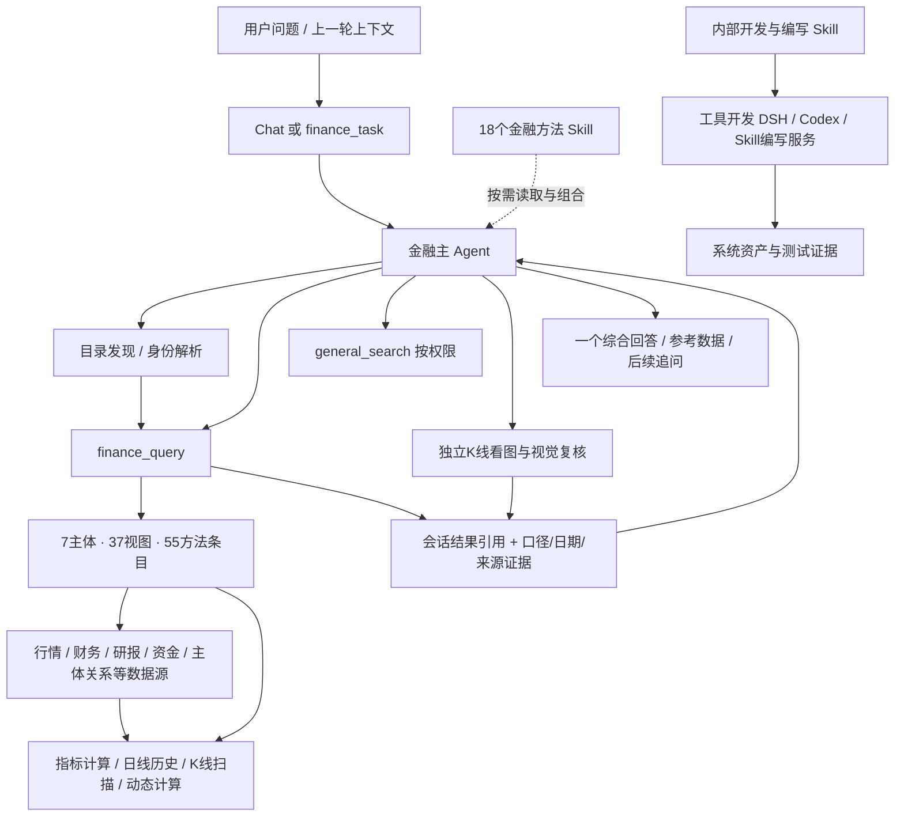

# Fin Agent 系统级 Skill、工具与数据能力全景

日期：2026-09-30。以当前本地工作区的内置目录、注册实现和运行时暴露规则为准，包含尚未提交的变更。不是服务器部署快照。排除用户/测试创建的自定义工具、数据库中的个人 Skill 与草稿；没有读取这些资产来凑数量。

| 层次 | 数量 | 口径 |
|---|---:|---|
| 金融业务 Skill | 18 | 当前内置业务方法目录 |
| 内部开发/编写 Skill | 8 | 7 个工具开发方法 + 1 个 Skill 编写方法 |
| 历史编译型 Skill | 2 | 均已 retired，单列保留 |
| 静态工具注册项 | 53 | 28 active，25 disabled/retired/deprecated；active 中 1 项隐藏旁路 |
| 统一金融数据目录 | 7 个主体 / 37 个视图 / 55 个方法条目 | 含 kd 参数模板，不是 55 个互不相干的顶层 Tool |
| 金融 DSH 内部工具 | 最多 8 | 6 个发现/查询/结果/方法工具，加按授权开放的 general_search 与 stock_kline_visual_analysis |
| 工具开发 DSH 内部工具 | 7 | 系统自身开发能力，不是用户创建的测试工具 |
| 对外金融 MCP 工具 | 3 | finance_task、finance_data_query、list_skills |

不同层次数量不能相加：同一个 general_search 或 finance_query 可能在多个运行时被包装；同名的 finance_data_query 在对外 MCP 与静态注册层输入契约也不同。active 表示定义状态，不保证当前环境数据完整或所有 Agent 都有调用权限。

## 1. 总体关系

业务 Skill 是方法指导，主 Agent 负责实际调用和综合。多个 Skill 可以共享同一份数据；加载方法不等于运行了一个独立 Agent，不自动授予新权限，也不要求按每个 Skill 各写一份报告。下面“使用数据/协作”按方法内容及现有目录整理，是语义关系，不是写死的依赖图。

## 2. 全部 18 个金融业务 Skill

| Skill | 用途 | 常用数据/计算入口 | 方法协作 |
|---|---|---|---|
| [市场环境分析](/Volumes/ext/fin_agent/src/skills/finance-business/skills/market-overview/SKILL.md) `market-overview` | 分析证券市场或大盘的整体环境，适用于市场复盘、大盘强弱、行情参与度、风格分化和风险偏好等问题。结合指定时点或区间的指数、涨跌宽度、成交及板块表现，解释市场结构、主要分歧和后续观察点。 | index.quote、stock.quote、plate.quote；市场宽度工具 | 可按需结合行业主题、资金分析 |
| [行业、热点板块与概念分析](/Volumes/ext/fin_agent/src/skills/finance-business/skills/sector-theme-analysis/SKILL.md) `sector-theme-analysis` | 分析行业、热点板块与概念主题，适用于寻找近期热点、比较板块强弱、判断热度演变与持续性、识别领涨分化及解释公司受益关系等问题。结合热点事件、行情资金、成分表现和业务证据，区分市场关注、交易表现与产业兑现。 | hot_event.*、plate.*、industry.*、stock.quote / moneyflow | 可将代表公司交给个股研究方法分析 |
| [个股分析](/Volumes/ext/fin_agent/src/skills/finance-business/skills/stock-research/SKILL.md) `stock-research` | 围绕单只股票开展分析，适用于投资逻辑、经营前景、价格走势、风险判断和持仓复盘等问题。按需结合基本面、技术面、资金面、研报观点、新闻热点、行业板块与宏观环境、同业对比，依据用户关注点和查询结果灵活选择、组合与调整分析方法。 | stock.basic_info / financial_3_table / business_segment / pricevalue / report / report_metric；按需行情、资金、公告搜索 | 综合组织研报、业绩、财务质量、估值、比较、技术、K线、相对强弱、资金、分红等方法 |
| [个股研报解读](/Volumes/ext/fin_agent/src/skills/finance-business/skills/equity-report-analysis/SKILL.md) `equity-report-analysis` | 从研报中检索、解读和综合与个股相关的机构观点与研究证据。适用于机构看法、预测指标、评级与目标价、看多看空理由，以及研报涉及的行业景气、公司经营、管理层、风险和产业链等问题；支持观点提炼、共识分歧比较和预期变化追踪，可独立使用或为个股分析提供证据。 | stock.report、stock.report_metric；按需 general_search | 为个股研究、估值与比较提供机构观点和预测证据 |
| [业绩与财报变化分析](/Volumes/ext/fin_agent/src/skills/finance-business/skills/earnings-analysis/SKILL.md) `earnings-analysis` | 解读公司的业绩预告、快报或定期报告，适用于本期业绩如何、增长由什么驱动、利润质量如何及是否超出预期等问题。对齐报告期和比较基准，分析收入利润、利润率、现金流与一次性因素，说明新增变化及其对经营判断的影响。 | stock.financial_3_table / performance_notice / business_segment / report_metric | 与财务质量、估值、研报方法协作 |
| [自然语言选股](/Volumes/ext/fin_agent/src/skills/finance-business/skills/stock-screening/SKILL.md) `stock-screening` | 按用户的自然语言条件筛选股票，适用于寻找符合估值、成长、财务、量价、资金或行业主题要求的候选等问题。明确股票范围、时间窗口、必要条件、偏好与排序，利用可用数据执行筛选，解释入选依据和数据缺口。 | 股票身份/成分范围；stock.pricevalue / financial_3_table / technical / moneyflow 等 | 按条件选择数据；可结合因子解释，不等于自动启动旧量化工具 |
| [因子研究与解释](/Volumes/ext/fin_agent/src/skills/finance-business/skills/factor-analysis/SKILL.md) `factor-analysis` | 分析已定义的投资因子，适用于因子含义与计算口径、股票间因子值或排名差异、因子随时间变化和适用局限等问题。围绕样本与窗口检查底层数据和计算结果，解释因子反映的股票特征；有相应测试数据时分析有效性与风险。 | stock.technical、stock.technical_series；按需行情窗口、dynamic_cal、行业/规模数据 | 解释工具算出的因子，可与选股、技术结构组合 |
| [个股估值分析](/Volumes/ext/fin_agent/src/skills/finance-business/skills/valuation-analysis/SKILL.md) `valuation-analysis` | 评估公司的估值与价格隐含预期，适用于贵不贵、估值是否有基本面支撑、历史位置、同业溢价折价和关键假设敏感性等问题。根据商业模式与盈利阶段选择估值口径，结合增长、回报率和现金流形成有条件的判断。 | stock.pricevalue / financial_3_table / business_segment / report_metric | 与财务质量、研报、可比公司方法组合 |
| [财务质量分析](/Volumes/ext/fin_agent/src/skills/finance-business/skills/financial-quality-analysis/SKILL.md) `financial-quality-analysis` | 分析公司跨期财务质量，适用于盈利能否持续、利润是否转化为现金、应收存货是否异常、偿债压力和财务风险等问题。交叉核对多个可比报告期的盈利、现金流、营运效率与资产负债，识别趋势、背离和需要进一步验证的风险线索。 | stock.financial_3_table、stock.business_segment；按需披露材料 | 为个股研究、业绩、估值、分红提供质量判断 |
| [个股与可比公司比较](/Volumes/ext/fin_agent/src/skills/finance-business/skills/stock-comparison/SKILL.md) `stock-comparison` | 比较两只或多只股票，适用于同业竞争、跨行业或不同成长阶段的投资取舍、寻找可比公司及指定指标对比等问题。围绕共同问题结合业务、财务、估值、市场表现与机构预期，按对象差异调整方法，解释相对优势、代价和结论成立条件。 | 各股票同口径财务、估值、业务、行情、研报；行业/板块关系 | 复用各专业方法，形成一个可比结论 |
| [技术结构分析](/Volumes/ext/fin_agent/src/skills/finance-business/skills/technical-structure-analysis/SKILL.md) `technical-structure-analysis` | 围绕同周期数值行情和技术指标判断价格、成交与趋势结构，适用于趋势强弱、支撑阻力、波动、突破条件及指标变化。需要直观量价背景时复用基础看图，需要具体形态演变时组合K线分析；数值证据与图像观察分别保留。 | stock.quote / technical / technical_series / technical_minute / technical_minute_series / technical_realtime；按需 corporate_action | 正文明确可组合 kline-analysis、relative-strength-analysis |
| [个股K线与近期形态解读](/Volumes/ext/fin_agent/src/skills/finance-business/skills/kline-analysis/SKILL.md) `kline-analysis` | 细致解读个股已完成日K及近期形态，适用于看看K线、近期出现过哪些形态、历史信号是否仍值得关注。通过授权看图工具取得独立基础解读、数值扫描和最多3个局部视觉复核，由主Agent综合当前结构、历史含义与后续演变；无典型形态也正常分析走势。 | stock_kline_visual_analysis；同源已完成日线、独立VLM和程序事实 | 综合数值扫描、独立基础看图与局部复核；正式工具按授权与视觉配置执行 |
| [近期K线基础解读](/Volumes/ext/fin_agent/src/skills/finance-business/skills/kline-basic-reading/SKILL.md) `kline-basic-reading` | 独立看图解读个股近期日K的走势、均线与量价背景，适合直接看K线或个股研究中的简要技术面分支；只读取一张同源近期价格与成交量图，不扫描形态，不接收候选或其他模型结论。 | stock_kline_visual_analysis；同源已完成日线、独立VLM和程序事实 | 直接回答基础量价，或供个股/K线研究复用；通过正式视觉工具关闭形态扫描执行 |
| [个股与基准相对强弱](/Volumes/ext/fin_agent/src/skills/finance-business/skills/relative-strength-analysis/SKILL.md) `relative-strength-analysis` | 比较个股与行业、宽基或风格指数的同期表现，适用于判断跑赢跑输、市场共振、个股独立强弱和技术走势的外部背景。依据用户指定或业务可比的基准对齐区间和收益口径，区分绝对涨跌、相对表现及证据边界，可独立使用或配合K线与个股研究。 | stock.quote、index.quote、plate.quote；行业/成分定位、公司行为 | 与技术/K线/个股研究组合，统一区间和收益口径 |
| [分红质量与可持续性分析](/Volumes/ext/fin_agent/src/skills/finance-business/skills/dividend-analysis/SKILL.md) `dividend-analysis` | 分析公司的现金分红质量，适用于股息水平、分红是否稳定、高股息是否可靠及未来能否持续等问题。区分预案、已实施和特别分红，结合多期利润、现金流、负债与资本需求，判断分红支撑、主要风险和可持续条件。 | stock.corporate_action / financial_3_table / pricevalue / quote | 与财务质量、估值方法组合 |
| [基金分析](/Volumes/ext/fin_agent/src/skills/finance-business/skills/fund-analysis/SKILL.md) `fund-analysis` | 分析一只基金或比较多只基金，适用于基金表现、ETF折溢价与交易活跃度、同类产品差异和持有风险等问题。先识别产品与份额类别，结合可用行情、净值和披露材料选择方法；取得持仓、费用或经理信息时进一步分析策略暴露与管理表现。 | fund.basic_info、fund.quote；按需公开披露材料 | 现有目录重点是身份、行情与净值；持仓/经理/费用须另取证 |
| [债券分析](/Volumes/ext/fin_agent/src/skills/finance-business/skills/bond-analysis/SKILL.md) `bond-analysis` | 分析单只或多只债券的市场表现与风险，适用于债券价格变化、交易活跃度、发行人风险和债券比较等问题。结合可用行情与已取得的条款材料，按普通债或可转债选择方法，分析收益口径、利率信用风险及转股赎回条件。 | bond.basic_info、bond.quote；按需发行条款及发行人材料 | 目录并未自动提供完整利率曲线、久期或信用评级计算 |
| [资金流与交易结构](/Volumes/ext/fin_agent/src/skills/finance-business/skills/capital-flow-analysis/SKILL.md) `capital-flow-analysis` | 分析个股或板块的资金流与交易结构，适用于资金持续流入流出、资金与价格背离、板块资金集中以及两融变化等问题。结合分单资金、成交、行情及按需的融资融券和股东披露，区分短期交易信号、杠杆变化与持有人结构，解释证据及风险。 | stock.moneyflow、plate.moneyflow、stock.margin / shareholder / quote | 与技术、K线、行业及个股研究组合，区分流量/存量/持有人 |

## 3. 新增指标、因子、K 线能力位于哪一层

| 能力 | 数据接口或工具 | 关系 |
|---|---|---|
| 已发布日线指标 | `stock.technical.query / kd_<field>_<method> / agg` | 公共盘后计算 → 批次发布 → 跨股查询/筛选 |
| 按需日线历史 | `stock.technical_series.query` | 1–5只股票，固定历史锚点计算后裁取1–252根；不依赖已有历史发布批次 |
| 分钟快照和序列 | `stock.technical_minute.query`、`stock.technical_minute_series.query` | 已采集分钟K → 周期聚合 → 指标，携带时点/完整周期/缺口 |
| 实时快照特征 | `stock.technical_realtime.query` | 现有实时报价 → 日内位置与变动特征 |
| K线数值扫描 | `stock.kline_patterns.query` | 1–5只股票、1–60根窗口 → 64个数值定义 → 命中/边界/演变证据 |
| 自定义表计算 | `stock.quote.dynamic_cal` | 数据窗口 → 受控代码生成与执行 → 计算结果；不是新建并发布一个用户工具 |
| 分钟事件检查 | `stock_minute_signals` | 复用分钟指标 → 6类规则；普通回放/既有定时任务观察；不直接向用户推送通知 |
| 旧指标序列查询 | `indicator_series_query` | 查询旧指标存储，当前声明close_ma_5/10/20；与新增27项指标体系不同 |
| 量化筛选工具链 | `quant_factor_screening` → `quant_data_provider` → code runtime | 独立确定性筛选链，需要 verified 数据；并非当前 factor-analysis 必调依赖 |

日线 27 项字段：`ma5`、`ma10`、`ma20`、`ma60`、`return1`、`return5`、`return20`、`prior_volume_mean5`、`prior_volume_mean20`、`volume_ratio5`、`bias20`、`prior_close_high20`、`prior_close_high60`、`prior_close_low20`、`distance_prior_high20`、`macd_dif`、`macd_dea`、`macd_hist`、`rsi14`、`atr14`、`atr_ratio14`、`boll_mid20`、`boll_upper20`、`boll_lower20`、`boll_width20`、`boll_percent_b20`、`volatility20`。

分钟共 30 项：日线有限窗口项去掉 volatility20；MACD/RSI/ATR 等递归项使用 session_ 前缀，再增加 session_vwap、session_volume_shares、session_amount、session_return_from_open。不是把当日短序列冒充长期日线指标。

实时 8 项：return_from_preclose、return_from_open、opening_gap、intraday_amplitude、drawdown_from_high、rebound_from_low、range_position、avg_price_bias。

分钟 6 类规则：ma20_cross_up、ma20_cross_down、ma20_hold_above、session_macd_cross_up、session_macd_cross_down、volume_expansion。

K线基础看图与逐形态视觉复核已增加正式聊天工具入口，必须配置支持图片的视觉模型后才能真正执行；注册成功不等于视觉效果或生产部署已经验收。因子方法可以解释现有工具已定义的因子，但不代表任意因子、IC检验、中性化或策略回测都已在金融 DSH 开放。

## 4. 当前金融 DSH 可暴露的系统工具

| 工具名 | 职责 |
|---|---|
| `resolve_security` | 统一证券名称和代码 |
| `read_finance_catalog` | 按主体、视图、方法读取真实数据契约 |
| `finance_query` | 运行一组有语义目标的金融查询/计算步骤 |
| `load_finance_result` | 按会话归属读取已保存明细，复用查询结果 |
| `read_finance_skill` | 加载一个或多个已授权方法正文 |
| `read_finance_skill_reference` | 按需读取已加载方法的参考资料 |
| `stock_kline_visual_analysis` | 同源日线取数、绘图、独立基础看图及可选局部复核；按 Agent 授权和 VLM 配置执行 |
| `general_search` | 按运行时与Skill授权补充公开资料；不是所有会话固定开放 |

`run_backtest` 在金融 CC 工具构造中存在（固定股票篮子历史表现），但不在当前金融 DSH 暴露白名单中。`stock_minute_signals`、`quant_factor_screening`、`file_io` 也没有因为进入静态注册表就自动进入该白名单。

## 5. 全部 28 个 active 静态系统工具

这些是 Tool Registry 内置入口，存在业务包装和兼容入口，与上面的金融 DSH 工具集合不同。部分入口底层复用相同市场服务，不能当作独立数据源计数。

| 工具 | 名称 | 用途 | 可见性/边界 |
|---|---|---|
| [stock_capital_flow_query](/Volumes/ext/fin_agent/src/tools/definitions/stock_capital_flow_query.tool.json) | 个股资金流向 | 获取单只股票在指定 start/end 交易日范围内的日级资金流向序列。 | 按调用方权限与运行时开放 |
| [stock_realtime_quote](/Volumes/ext/fin_agent/src/tools/definitions/stock_realtime_quote.tool.json) | 个股实时行情 | 查询单只股票的实时行情快照。 | 按调用方权限与运行时开放 |
| [stock_daily_kline_query](/Volumes/ext/fin_agent/src/tools/definitions/stock_daily_kline_query.tool.json) | 个股日K查询 | 获取单只股票在指定 start/end 交易日范围内的日级 K 线行情序列。 | 按调用方权限与运行时开放 |
| [stock_intraday_kline_query](/Volumes/ext/fin_agent/src/tools/definitions/stock_intraday_kline_query.tool.json) | 个股分钟线查询 | 获取单只股票最近可用交易日的日内分钟行情序列。 | 按调用方权限与运行时开放 |
| [stock_valuation_query](/Volumes/ext/fin_agent/src/tools/definitions/stock_valuation_query.tool.json) | 个股估值查询 | 获取单只 A 股在指定 start/end 交易日范围内的日级估值和市值序列。 | 按调用方权限与运行时开放 |
| [stock_fundamental_snapshot](/Volumes/ext/fin_agent/src/tools/definitions/stock_fundamental_snapshot.tool.json) | 个股基础资料查询 | 获取单只 A 股的基础资料和公司资料快照。 | 按调用方权限与运行时开放 |
| [stock_financial_statement_query](/Volumes/ext/fin_agent/src/tools/definitions/stock_financial_statement_query.tool.json) | 个股财务三表查询 | 查询单只股票的核心财务三表数据。输入 stock 表示股票代码、简称或公司名称。可选择资产负债表、利润表、现金流量表或一次返回三表。该工具只返回结构化报表字段，不返回估值、行情或公司简介。 | 按调用方权限与运行时开放 |
| [fund_daily_market_query](/Volumes/ext/fin_agent/src/tools/definitions/fund_daily_market_query.tool.json) | 基金日行情查询 | 获取单只基金或 ETF 在指定 start/end 交易日范围内的日级行情序列。 | 按调用方权限与运行时开放 |
| [fund_profile_query](/Volumes/ext/fin_agent/src/tools/definitions/fund_profile_query.tool.json) | 基金基础资料查询 | 查询单只基金或 ETF 的基础资料和最新交易属性快照。 | 按调用方权限与运行时开放 |
| [index_daily_market_query](/Volumes/ext/fin_agent/src/tools/definitions/index_daily_market_query.tool.json) | 指数日行情查询 | 获取单只指数在指定 start/end 交易日范围内的日级行情和估值序列。 | 按调用方权限与运行时开放 |
| [stock_announcement_query](/Volumes/ext/fin_agent/src/tools/definitions/stock_announcement_query.tool.json) | 股票公告查询 | 查询单只股票的交易所公告和披露记录。输入 stock 表示股票代码、简称或公司名称。可按公告日期范围和关键词过滤，默认返回最近公告。该工具只返回公告元数据和可选截断正文，不做事件判断或投资结论。 | 按调用方权限与运行时开放 |
| [finance_data_query](/Volumes/ext/fin_agent/src/tools/definitions/finance_data_query.tool.json) | 金融数据协议查询 | 金融数据查询顶层工具。执行 subject/dataview/function 协议请求串，内部由金融数据 catalog、validator 和 provider 处理。 | 按调用方权限与运行时开放 |
| [stock_kline_visual_analysis](/Volumes/ext/fin_agent/src/tools/definitions/stock_kline_visual_analysis.tool.json) | K线独立看图与形态复核 | 同源日线绘图、基础VLM、可选形态筛选与局部复核；主Agent最终综合 | 已接聊天入口；需配置支持图片的视觉模型 |
| [stock_minute_signals](/Volumes/ext/fin_agent/src/tools/definitions/stock_minute_signals.tool.json) | 分钟技术信号检查 | 逐根检查当日完整分钟K，返回均线穿越、连续站稳、session MACD交叉和量能扩张事件及当前条件。普通调用按需回放；用于已有定时任务时按任务归属保存首次发现、修订与事件证据，不发送通知，不调用模型或上游行情API。 | 按调用方权限与运行时开放 |
| [stock_protocol_data_query](/Volumes/ext/fin_agent/src/tools/definitions/stock_protocol_data_query.tool.json) | 个股协议化数据查询 | 按 stock subject/domain/data_view/op 协议查询个股基础数据。当前用于旁路验证，不进入 planner 默认候选。 | 隐藏旁路，默认候选不收录 |
| [financial_news_search](/Volumes/ext/fin_agent/src/tools/definitions/financial_news_search.tool.json) | 金融新闻查询 | 兼容查询公司、行业、板块、主题或事件相关新闻；新查询统一使用 general_search。 | 按调用方权限与运行时开放；新查询推荐 general_search |
| [general_search](/Volumes/ext/fin_agent/src/tools/definitions/general_search.tool.json) | 资料搜索 | 查询公开资料与新闻。个股可传 stock_code 读取按时间倒序的新浪资讯标题目录；结合问题选择链接后传 urls 读取去噪 Markdown 正文。其他问题通过配置的搜索服务查询。 | 按调用方权限与运行时开放 |
| [market_realtime_breadth](/Volumes/ext/fin_agent/src/tools/definitions/market_realtime_breadth.tool.json) | 大盘实时涨跌情况 | 查询市场实时上涨、下跌、平盘、涨停和跌停家数。 | 按调用方权限与运行时开放 |
| [plate_rank_query](/Volumes/ext/fin_agent/src/tools/definitions/plate_rank_query.tool.json) | 热门板块排名 | 查询热门板块的行情、成交额和主力资金排名。可用 plate 按板块代码或名称过滤，也可以不传 plate 直接取全市场排名。sort_by 支持涨跌幅、成交额和主力净流入。include_members 可附带每个板块内的代表个股，但该工具不替代板块成分股明细查询。 | 按调用方权限与运行时开放 |
| [plate_members_query](/Volumes/ext/fin_agent/src/tools/definitions/plate_members_query.tool.json) | 板块成分股查询 | 获取指定板块的成分股列表。 | 按调用方权限与运行时开放 |
| [stock_plate_membership_query](/Volumes/ext/fin_agent/src/tools/definitions/stock_plate_membership_query.tool.json) | 个股所属板块查询 | 获取指定股票所属的板块关系列表。 | 按调用方权限与运行时开放 |
| [get_company_taxonomy_profile](/Volumes/ext/fin_agent/src/tools/definitions/get_company_taxonomy_profile.tool.json) | 股票板块归属查询 | 获取单只股票所属的板块归属画像。 | 按调用方权限与运行时开放 |
| [indicator_series_query](/Volumes/ext/fin_agent/src/tools/definitions/indicator_series_query.tool.json) | 指标序列查询 | 获取已计算好的指标时间序列。当前支持 close_ma_5、close_ma_10、close_ma_20。 | 按调用方权限与运行时开放 |
| [实时行情排名查询](/Volumes/ext/fin_agent/src/tools/definitions/实时行情排名查询.tool.json) | 实时行情排名 | 获取市场内股票的实时行情 TopK 排名。 | 按调用方权限与运行时开放 |
| [涨跌停列表查询](/Volumes/ext/fin_agent/src/tools/definitions/涨跌停列表查询.tool.json) | 涨跌停列表查询 | 查询指定市场的涨停股或跌停股列表。 | 按调用方权限与运行时开放 |
| [file_io](/Volumes/ext/fin_agent/src/tools/definitions/file_io.tool.json) | 文件读写 | 统一文件读写工具。读取时按文件后缀或 MIME 规则路由 CSV、Excel、Word、文本等解析器；写入时生成 runtime artifact，不直接覆盖本地文件。 | 按调用方权限与运行时开放 |
| [quant_data_provider](/Volumes/ext/fin_agent/src/tools/definitions/quant_data_provider.tool.json) | 量化选股数据 Provider | 按股票池和数据需求准备量化选股数据 artifact。 | 内部权限 |
| [quant_factor_screening](/Volumes/ext/fin_agent/src/tools/definitions/quant_factor_screening.tool.json) | 自然语言量化与消息面选股 | 执行量化因子筛选并返回候选股、因子表和审计信息。 | 内部权限 |

## 6. 全部 37 个数据视图及 55 个方法条目

下表列的是统一金融查询之下的 API，不是要额外注册的顶层 Tool。`kd_<field>_<method>` 是字段/统计方式的模板；具体允许字段、窗口和参数以目录为准。所有方法条目含完整前缀，便于定位。

| 主体 | 视图 | 数据内容 | 方法条目 |
|---|---|---|---|
| 股票 | `stock.basic_info` 基础信息 | 股票代码、名称、行业与上市日期。 | `stock.basic_info.query` |
| 股票 | `stock.quote` 行情 | 股票历史日 K、分钟 K 与实时行情快照。 | `stock.quote.query` `stock.quote.kd_<field>_<method>` `stock.quote.agg` `stock.quote.dynamic_cal` |
| 股票 | `stock.moneyflow` 资金流 | 股票资金流入、流出与净流入，按主力、散户及单笔规模分类。 | `stock.moneyflow.query` `stock.moneyflow.kd_<field>_<method>` |
| 股票 | `stock.pricevalue` 估值 | 股票市值及 PE、PB、PS 等估值指标，支持历史估值百分位。 | `stock.pricevalue.query` `stock.pricevalue.kd_<field>_percentile` |
| 股票 | `stock.financial_3_table` 财务三表与财务指标 | 公司实际披露的财务三表与财务指标，按公司、报告期返回收入利润、资产负债、现金流、费用、每股收益及比率。 | `stock.financial_3_table.query` |
| 股票 | `stock.report` 研报明细 | 逐篇机构研报的评级与变动、目标价、核心观点、风险和来源；核心观点提供增长催化、业绩驱动、竞争格局与市场份额、竞争优势及战略展望的分析依据。 | `stock.report.query` `stock.report.agg` |
| 股票 | `stock.report_metric` 研报预测指标 | 研报标准年度指标事实，按公司、机构、年份和值类型查询 EPS、归母净利润及增速、营业收入及增速、PE、PB、ROE。 | `stock.report_metric.query` `stock.report_metric.agg` |
| 股票 | `stock.margin` 融资融券 | 股票融资融券余额、买入、偿还、净买入、融券余量及融资余额占流通市值比例。 | `stock.margin.query` `stock.margin.kd_<field>_<method>` |
| 股票 | `stock.shareholder` 股东 | 公司股东户数、前十大股东、第一大股东与前十大流通股东。 | `stock.shareholder.query` |
| 股票 | `stock.pledge` 股权质押 | 公司股权质押比例、质押解押明细及股东累计质押冻结汇总。 | `stock.pledge.query` |
| 股票 | `stock.corporate_action` 股本事件 | 公司分红送转、增发、配股、限售解禁与 IPO 事项。 | `stock.corporate_action.query` |
| 股票 | `stock.performance_notice` 业绩预告 | 公司披露的业绩预告类型、变动原因及净利润、收入预测区间。 | `stock.performance_notice.query` |
| 股票 | `stock.business_segment` 业务分部与客户供应商 | 公司各报告期的业务、产品、地区分部及前五大客户供应商，覆盖收入、成本、利润、毛利率、收入占比与增速。 | `stock.business_segment.query` |
| 股票 | `stock.technical` 日线技术指标 | 标准日线技术指标，读取公共盘后计算结果，用于趋势、量能、突破和波动筛选。 | `stock.technical.query` `stock.technical.kd_<field>_<method>` `stock.technical.agg` |
| 股票 | `stock.technical_minute` 分钟技术指标 | 基于已采集分钟K按需计算的趋势、量能与当日指标，支持当前周期试算并返回数据时点。 | `stock.technical_minute.query` |
| 股票 | `stock.technical_realtime` 实时快照指标 | 最新行情的日内走势、跳空、振幅、回撤与区间位置，按需读取现有实时行情源。 | `stock.technical_realtime.query` |
| 股票 | `stock.technical_minute_series` 分钟技术指标序列 | 返回当日完整K线逐根指标，保留区间内发生后消失的变化；缺口不填充。 | `stock.technical_minute_series.query` |
| 股票 | `stock.technical_series` 日线技术指标序列 | 对指定个股按需计算已完成日线及27项指标序列，用于分析近期趋势、指标变化和因子比较。无需已有盘后发布批次。 | `stock.technical_series.query` |
| 股票 | `stock.kline_patterns` K线数值形态扫描 | 对指定个股近期已完成日K运行形态定义库，返回命中、程度和后续演变；无命中仍返回扫描范围与背景事实。仅数值扫描，未做视觉确认。 | `stock.kline_patterns.query` |
| 指数 | `index.basic_info` 基础信息 | 指数代码、名称、类型与简介。 | `index.basic_info.query` |
| 指数 | `index.quote` 行情 | 指数日行情与 K 日窗口指标。 | `index.quote.query` `index.quote.kd_<field>_<method>` |
| 指数 | `index.pricevalue` 估值 | 指数市值及 PE、PB、PS 等估值指标。 | `index.pricevalue.query` |
| 指数 | `index.constitution` 成分股 | 指数与成分股的对应关系及权重，支持按指数统计成分股指标。 | `index.constitution.query` `index.constitution.agg` |
| 行业 | `industry.basic_info` 基础信息 | 行业代码、名称、级别与层级关系。 | `industry.basic_info.query` |
| 行业 | `industry.constitution` 成分股 | 行业与成分股的对应关系，支持按行业统计成分股指标。 | `industry.constitution.query` `industry.constitution.agg` |
| 板块 | `plate.basic_info` 基础信息 | 板块代码、名称、类型与简介。 | `plate.basic_info.query` |
| 板块 | `plate.quote` 行情 | 板块日行情与 K 日窗口指标。 | `plate.quote.query` `plate.quote.kd_<field>_<method>` |
| 板块 | `plate.moneyflow` 资金流 | 板块资金流入、流出、净流入及 K 日窗口指标。 | `plate.moneyflow.query` `plate.moneyflow.kd_<field>_<method>` |
| 板块 | `plate.pricevalue` 估值 | 板块市值及 PE、PB 等估值指标。 | `plate.pricevalue.query` |
| 板块 | `plate.constitution` 成分股 | 板块与成分股的对应关系，支持按板块统计成分股指标。 | `plate.constitution.query` `plate.constitution.agg` |
| 基金 | `fund.basic_info` 基础信息 | 基金代码、简称与全称。 | `fund.basic_info.query` |
| 基金 | `fund.quote` 行情 | 基金日行情、净值与 K 日窗口指标。 | `fund.quote.query` `fund.quote.kd_<field>_<method>` |
| 债券 | `bond.basic_info` 基础信息 | 债券代码、简称与发行主体。 | `bond.basic_info.query` |
| 债券 | `bond.quote` 行情 | 债券日行情与 K 日窗口指标。 | `bond.quote.query` `bond.quote.kd_<field>_<method>` |
| 市场热点 | `hot_event.base_info` 热点信息 | 市场热点的触发时间、激活次数、沉寂天数、核心事件与关联公司数量。 | `hot_event.base_info.query` |
| 市场热点 | `hot_event.state` 热度走势 | 市场热点的热度、变化、趋势方向与市场强弱对比。 | `hot_event.state.query` |
| 市场热点 | `hot_event.member` 关联股票 | 热点与关联股票的对应关系，支持从股票反查热点。 | `hot_event.member.query` |

## 7. 内部开发/编写 Skill 与系统工具

这里保留系统自身的开发能力，排除开发流程中生成的具体测试工具。

| Skill | 作用 |
|---|---|
| [financial-tool-requirement](/Volumes/ext/fin_agent/src/skills/financial-tool-development/skills/financial-tool-requirement/SKILL.md)（需求理解与澄清） | 把用户目标形成可确认需求 |
| [financial-tool-design](/Volumes/ext/fin_agent/src/skills/financial-tool-development/skills/financial-tool-design/SKILL.md)（工具设计） | 形成实现流程、模块、输入输出和数据使用方式 |
| [financial-tool-flowchart](/Volumes/ext/fin_agent/src/skills/financial-tool-development/skills/financial-tool-flowchart/SKILL.md)（流程图表达） | 基于已有设计绘图 |
| [financial-tool-implementation](/Volumes/ext/fin_agent/src/skills/financial-tool-development/skills/financial-tool-implementation/SKILL.md)（代码实现） | 实现设计并运行技术测试 |
| [financial-tool-test-execution](/Volumes/ext/fin_agent/src/skills/financial-tool-development/skills/financial-tool-test-execution/SKILL.md)（业务测试执行） | 组织真实或指定样本与执行证据 |
| [financial-tool-edit-planning](/Volumes/ext/fin_agent/src/skills/financial-tool-development/skills/financial-tool-edit-planning/SKILL.md)（修改规划） | 判断局部修改范围与修订方案 |
| [financial-tool-edit-implementation](/Volumes/ext/fin_agent/src/skills/financial-tool-development/skills/financial-tool-edit-implementation/SKILL.md)（局部代码修改） | 依据修改计划实现并验证 |
| [skill-authoring](/Volumes/ext/fin_agent/src/skills/skill-system/skills/skill-authoring/SKILL.md)（Skill 编写与修订） | 从已注册能力生成待审核 Skill 候选 |

工具开发主目录列出前5个阶段方法；两个 edit 方法由实现代码直接引用；skill-authoring 由 Skill 编写服务使用。这8个不属于18个面向金融问答的业务方法。

工具开发 DSH 暴露7个系统工具：

| 工具 | 职责 |
|---|---|
| `finance_query` | 查询金融数据供开发与验证使用 |
| `load_result` | 读取已保存查询结果 |
| `read_finance_asset` | 读取当前需求、设计、实现与测试等权威资产 |
| `request_user_interaction` | 请求必要的用户澄清或确认 |
| `save_finance_artifact` | 保存阶段资产 |
| `implement_dynamic_tool` | 提交实现/修复请求，由主进程交给 Codex |
| `run_dynamic_tool` | 在既有归属/执行约束下测试或运行工具 |

## 8. 对外 MCP 入口

| MCP工具 | 用途 |
|---|---|
| `finance_task` | 通用金融分析；可指定 skill_ids，也可省略让 Agent 选择；支持 conversation_id 延续上下文 |
| `finance_data_query` | 自然语言金融数据查询，可返回数据/摘要/两者 |
| `list_skills` | 列出当前身份可用的已发布金融 Skill 元数据 |

当前对外 MCP 不是把28个 active Tool逐一平铺，也没有直接以工具名调用任意静态工具的通用入口。内部 finance_data_query 接收数据协议请求，对外同名MCP入口接收自然语言 query，两者不能直接混用参数。

## 9. 历史资产（保留记录，不能算当前有效能力）

两个历史编译型 Skill 均 retired：`stock_deep_dive`（被当前 stock-research 的方法路径取代）；`quant_factor_screening`（旧 Skill已退役，同名静态 Tool仍 active）。

下列25个静态注册名仍在代码里，但按定义禁止正常调用：

| 注册名 | 中文名 | 状态 |
|---|---|---|
| [equity_research_search](/Volumes/ext/fin_agent/src/tools/definitions/equity_research_search.tool.json) | 个股研报查询 | disabled |
| [stock_funds](/Volumes/ext/fin_agent/src/tools/definitions/stock_funds.tool.json) | 个股资金查询 | disabled |
| [stock_realtime_funds_flow](/Volumes/ext/fin_agent/src/tools/definitions/stock_realtime_funds_flow.tool.json) | 个股实时资金流向 | disabled |
| [stock_history_funds_flow](/Volumes/ext/fin_agent/src/tools/definitions/stock_history_funds_flow.tool.json) | 个股资金历史 | disabled |
| [stock_industry_funds_flow](/Volumes/ext/fin_agent/src/tools/definitions/stock_industry_funds_flow.tool.json) | 行业资金对比 | disabled |
| [capital_flow_query](/Volumes/ext/fin_agent/src/tools/definitions/capital_flow_query.tool.json) | 资金流向查询 | retired |
| [plate_capital_flow_query](/Volumes/ext/fin_agent/src/tools/definitions/plate_capital_flow_query.tool.json) | 板块资金流向 | retired |
| [stock_quote](/Volumes/ext/fin_agent/src/tools/definitions/stock_quote.tool.json) | 个股行情查询 | deprecated |
| [stock_history_kline](/Volumes/ext/fin_agent/src/tools/definitions/stock_history_kline.tool.json) | 个股历史日K | deprecated |
| [stock_intraday_kline](/Volumes/ext/fin_agent/src/tools/definitions/stock_intraday_kline.tool.json) | 个股日内分钟K线 | deprecated |
| [security_universe_query](/Volumes/ext/fin_agent/src/tools/definitions/security_universe_query.tool.json) | 股票集合过滤聚合 | disabled |
| [market_history_amount](/Volumes/ext/fin_agent/src/tools/definitions/market_history_amount.tool.json) | 市场整体资金 | disabled |
| [market_minute_amount_series](/Volumes/ext/fin_agent/src/tools/definitions/market_minute_amount_series.tool.json) | 市场分钟成交额序列 | disabled |
| [get_hot_industries_and_leaders](/Volumes/ext/fin_agent/src/tools/definitions/get_hot_industries_and_leaders.tool.json) | 热门行业与行业龙头 | retired |
| [get_hot_sectors_and_leaders](/Volumes/ext/fin_agent/src/tools/definitions/get_hot_sectors_and_leaders.tool.json) | 热门板块与板块龙头 | retired |
| [get_hot_concepts_and_leaders](/Volumes/ext/fin_agent/src/tools/definitions/get_hot_concepts_and_leaders.tool.json) | 热点概念与概念龙头 | retired |
| [plate_member_query](/Volumes/ext/fin_agent/src/tools/definitions/plate_member_query.tool.json) | 板块成分查询 | disabled |
| [theme_leaders](/Volumes/ext/fin_agent/src/tools/definitions/theme_leaders.tool.json) | 主题龙头查询 | disabled |
| [大盘情绪指标](/Volumes/ext/fin_agent/src/tools/definitions/大盘情绪指标.tool.json) | 大盘情绪指标 | disabled |
| [大盘整体情况](/Volumes/ext/fin_agent/src/tools/definitions/大盘整体情况.tool.json) | 大盘整体情况 | deprecated |
| [个股动量排名](/Volumes/ext/fin_agent/src/tools/definitions/个股动量排名.tool.json) | 个股动量排名 | disabled |
| [实时个股动量排名](/Volumes/ext/fin_agent/src/tools/definitions/实时个股动量排名.tool.json) | 实时个股动量排名 | disabled |
| [file_read_excel](/Volumes/ext/fin_agent/src/tools/definitions/file_read_excel.tool.json) | Excel 文件读取 | retired |
| [file_read_csv](/Volumes/ext/fin_agent/src/tools/definitions/file_read_csv.tool.json) | CSV/TSV 文件读取 | retired |
| [file_read_word](/Volumes/ext/fin_agent/src/tools/definitions/file_read_word.tool.json) | Word 文件读取 | retired |

旧研报工具 equity_research_search 停用不等于研报能力停用：当前使用 stock.report / stock.report_metric。旧资金、行情入口停用也不等于相应统一数据视图停用。

## 10. 维护依据

- [金融业务方法目录](/Volumes/ext/fin_agent/src/skills/finance-business/catalog.json)
- [静态工具注册表](/Volumes/ext/fin_agent/src/tools/registry.py)
- [金融数据视图与方法目录](/Volumes/ext/fin_agent/src/tools/finance_data/catalog/api_view_catalog.json)
- [金融DSH工具白名单](/Volumes/ext/fin_agent/src/scenarios/financial_qa/dsh_mcp_server.py)
- [工具开发DSH白名单](/Volumes/ext/fin_agent/src/scenarios/custom_tool/dsh_mcp_server.py)
- [对外MCP定义](/Volumes/ext/fin_agent/src/finance_api/app.py)
- [SkillHub目录合并与可见性](/Volumes/ext/fin_agent/src/services/skill_hub_catalog_service.py)

## 本轮架构复核更新

独立日线看图已新增正式工具与聊天适配，见 [架构复核与验证记录](/Volumes/ext/fin_agent/docs/development_tasks/kline_chat_architecture_review_20260930.md)。当前能力边界以该记录中的实现和实测结果为准；工具注册不等于视觉模型已经配置或生产已部署。
