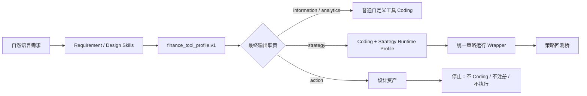

# 金融工具画像与运行伴随契约

## 目标

金融工具创建仍按 `SOFT → HARD → SOFT` 工作：用户自然描述需求，Design Skill 根据**最终输出职责**自动形成工具画像，系统只保存少量稳定事实并选择必要的运行伴随契约，最后由对应 Renderer 解释能力与边界。用户不需要先学习或手工选择工具类别。

工具画像只用于检索、展示和选择后续流程，不授予权限，也不替代输入输出 Schema、Strategy Wrapper 或回测契约。

## 轻量画像

每个新修订可以携带 `finance_tool_profile.v1`：

- `family`：`information`、`analytics`、`strategy`、`action`
- `execution_shape`：`aggregate_context`、`entity_local`、`cross_sectional`、`portfolio_stateful`
- `output_semantic`：`facts`、`metric`、`series`、`assessment`、`ranked_selection`、`signal`、`portfolio_target`、`action_receipt`
- `summary`：可选的一句自然语言用途说明

分类看输出职责，不看“评分”“策略”等单个关键词：

| 典型工具 | 画像 | 运行伴随契约 | 回测 |
| --- | --- | --- | --- |
| 行情/研报查询 | `information` | 无 | 不适用 |
| 大盘强度、单股评分、诊断 | `analytics` | 无策略契约 | 不适用 |
| Top-N 选股、买卖/持有信号、目标权重 | `strategy` | Strategy Runtime；需要时附 Selection Output | 可通过既有策略回测桥接 |
| 下单、撤单、调仓执行 | `action` | 当前仅保存 Design | 禁止实现、注册和执行 |

`execution_shape` 是描述事实，不会自动触发循环或并发。当前只有真正的策略类通过既有 Strategy Wrapper 获得统一的 `as_of_date`、交易日窗口、单标的/批量有界调度；普通逐股指标未来如需批量运行，应由通用调用编排器处理，而不是把它伪装成策略。

## 与创建、运行和回测的衔接

Design 阶段保存画像并展示流程图；Coding 阶段只有 `strategy` 可以生成策略运行伴随契约。画像与伴随契约一起绑定到不可变工具修订：局部代码修复继承当前画像，完整重设计必须重新判断，避免旧分类污染新设计。旧修订没有画像时继续按原有契约运行。

已保存画像会进入用户可见的 Tool/Skill 检索目录，参与工具说明和模糊匹配；目录仍只列可调用资产，`action` 设计不会出现在 `$` 调用建议中。

策略类仍由现有两个 HARD 伴随契约负责可执行语义：

- Strategy Runtime Profile：日期、窗口、标的绑定和批量调度方式。
- Selection Output Profile：入选列表、代码字段和顺序等机器可读取出口。

组合回测只消费已满足这些契约的策略输出，不从普通指标或自由文本猜测持仓。画像本身永远不能绕过这一边界。

## Action 风险边界

本期不增加交易 API、下单工具、权限、路由或执行状态。`action` 可以产出带关键分支和风险说明的 Design，但前端不显示“确认并继续实现”，Finance CC、Coding 服务、修订存储和运行时均拒绝把它变成可执行工具。未来如开放，必须另行设计账户授权、人工确认、额度与品种限制、幂等、撤销/补偿、审计和紧急停用，不能复用当前只读工具权限。
