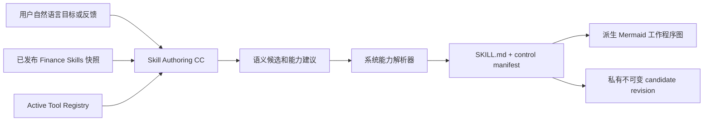

# CC-native Skill Authoring Candidate v1

## 目标

本纵切面让用户用自然语言创建和迭代新的 CC-native Skill 候选，同时保持它与 Legacy `SkillRunner / skill.json / schema.json` 完全隔离。

当前完成的是 candidate authoring，不包含测试、发布、运行时激活或共享。用户可以先看到最 raw 的 `SKILL.md`、真实能力绑定和工作程序图。

## 主流程



这条链遵循 `SOFT → HARD → SOFT`：

- 用户目标、完整 `SKILL.md` 和每一步说明是 SOFT。
- `skill_id`、revision、owner、Tool/Skill 标识和有序 step id 是最小 HARD。
- Studio 展示、程序图和后续解释是派生 SOFT。

## 权责边界

### Authoring CC 负责

- 理解目标和自然语言流程。
- 编写完整 `SKILL.md`。
- 从本轮提供的真实 catalog 中建议 Tool 和相关 Skill。
- 给出 2-10 个可理解的工作步骤。

### 系统负责

- 生成稳定 `skill_id`、owner、revision 和 hash。
- 只接受本地发布 Skill 快照和 Active Tool Registry 中存在的能力。
- 丢弃未知或未类型化的能力，并保留 resolution note。
- 将全部解析后的 Tool 保存在工作流连接中；只有 Finance CC 的补充能力请求才转换成带命名空间的 `allowed-tools`，行情和财务等主 Agent 基础工具不重复申请授权。
- 从步骤和绑定派生 Mermaid，不把图作为第二份权威协议。
- 用 compare-and-swap 检查 base revision，保存不可变修订。

模型提到能力不等于授权。candidate 的 `active_revision_no` 始终为 `0`；本纵切面没有发布 API，也不会修改 Finance CC 的 active Skill snapshot。

## 候选资产

候选 revision 的核心内容是：

```text
skill_markdown
control_manifest.tool_connections[]
control_manifest.related_skills[]
control_manifest.workflow_steps[]
flowchart (derived)
requirement / feedback / change_summary
authoring_evidence
```

`related_skills` 的关系固定为 `composition_context`。它表示未来发布编译时可由 Finance CC 一并提供的方法上下文，不表示 Skill 绕过主 Agent 直接调用另一个 Skill。

## 持久化

v1 复用通用运行时资产表，不新增数据库迁移：

- `aiia_runtime_artifact.artifact_type = skill_v2`
- `current_revision_no` 保留给未来 active revision
- `source_manifest_json.candidate_revision_no` 指向最新候选
- `aiia_runtime_artifact_revision` 保存每个不可变候选快照

所有读写都带 owner 条件；不存在和无权限使用相同的 404 语义，避免泄露其他用户的候选身份。

## API

- `GET /api/skill-hub/candidates`：列出当前 owner 的候选摘要。
- `POST /api/skill-hub/candidates`：从 `{requirement}` 创建 revision 1。
- `GET /api/skill-hub/candidates/{skill_id}/revisions/{revision_no}`：读取 owner 范围内的指定修订。
- `POST /api/skill-hub/candidates/{skill_id}/revisions`：从 `{feedback, base_revision_no}` 创建下一不可变修订。

写接口只接受 `application/json`，限制输入长度，并对同一 owner 的并发生成做进程内抑制。生产公开前仍需接入跨进程限流和成本配额。

## 下一阶段

1. candidate-bound 测试：固定 revision 运行 happy/error/adversarial 用例，并比较 with/without Skill。
2. 引用资产 authoring：按需生成 `references/`，仍保持渐进加载。
3. publish compiler：测试通过后编译不可变包，显式更新 active pointer 和 Finance CC registry snapshot。
4. 分享与权限：personal/workspace/public 由系统授权，不由 Markdown 或模型声明决定。
