# Fin Agent Skill System V2：CC-native 专业方法、Skill Hub 与可控执行

> 状态：Proposed
>
> 日期：2026-08-03
>
> 适用范围：金融业务 Skill 的定义、创建、优化、发布、运行和评测；不重做 Tool、Strategy、Backtest 的既有契约。

## 0. 结论先行

Fin Agent 应把 Skill 明确定义为：

> **由 Finance CC 按需加载并执行的、可复用且可评测的金融专业方法。**

Skill 不是数据 API，不是固定计算程序，也不是另一个独立 Mini-Agent。它的主体仍是自然语言，但平台需要在其外部增加一层很薄的控制面，以保证发布后的权限、工具发现、版本和测试可控。

最终采用三层结构：

```text
Portable Skill Core（SOFT）
  SKILL.md：专业方法、步骤、判断逻辑、适用边界、证据和质量要求
                         ↓ compile / publish
Fin Control Manifest（HARD）
  能力授权、步骤标识、步骤候选工具、少量执行预算
                         ↓ runtime resolve
Finance CC Execution（SOFT）
  根据当前问题动态选择步骤和工具，基于真实证据形成自然语言结论
```

再由 Skill Hub 在三层之外持有：身份、归属、不可变修订、当前发布指针、测试证据、审计和可见性。

本方案有六个关键决定：

1. 新的金融业务 Skill 全部运行在 Finance CC 主线上，不再新建第二套 SkillRunner。
2. `SKILL.md` 是业务语义的唯一主体；不再以 `skill.json.skill_body` 为真正执行内容。
3. Skill 不定义最终回答的固定 Output Schema；最终展示继续由 CC、Evidence 和系统 Renderer 负责。
4. Web Search 不保存成孤立布尔值，而保存为可版本化的业务能力授权；Studio 可以把能力授权呈现成开关。
5. 每步候选工具用于缩小发现范围、提高选择效率和形成可评测轨迹，不把 Skill 编译成固定 DAG。
6. Studio 手工编辑和 CC 自然语言编辑都向同一 draft stream 追加不可变 candidate revision；只有显式发布才切换运行版本。

---

## 1. 三个产品目标及其验收含义

### 1.1 明确普通问答、Skill、Tool 和 Workflow 的边界

系统不能因为一个问题“看起来金融”就加载 Skill，也不能因为某项分析会调用多个 Tool，就把它实现成 Tool。

| 类型 | 核心价值 | 典型输入 | 执行特征 | 示例 |
|---|---|---|---|---|
| 普通金融问答 | 回答事实或解释概念 | 单一事实、明确指标、简单解释 | 直接回答或调用一两个数据 Tool | “贵州茅台昨天收盘价是多少”“什么是 PEG” |
| Tool | 提供确定性数据、转换、计算或动作 | 稳定参数 | 同一数据时点下结果应基本一致 | 行情查询、财务查询、公式计算、自定义选股工具 |
| 金融业务 Skill | 提供可复用的专业判断方法和业务经验 | 需要多维证据与综合判断的专业问题 | CC 可按场景选择、跳过或重排步骤 | 科技股深度研究、财报质量分析、行业景气分析 |
| Workflow / Tool Plan | 保证固定依赖、固定顺序或机器交接 | 明确、可执行的过程协议 | 节点和依赖由系统确定执行 | 固定因子计算流水线、批量回测、定时数据任务 |

判断一项需求是否值得成为 Skill，至少满足以下三项：

- 它包含模型仅凭通用知识不稳定具备的业务方法或经验；
- 它会在多次、相似但不完全相同的问题中复用；
- 它能定义“专业增益”并通过案例评测，而不只是包装一次 Tool 调用。

如果只是在查询某个字段，使用普通问答 + Tool。如果必须严格按固定顺序执行、每一步结果都要由程序精确消费，则实现为 Tool 或 Workflow。如果重点是“应该从哪些维度判断、证据不足时如何处理、如何权衡冲突信息”，则适合 Skill。

例如“科技股分析方案”是 Skill；其中的研发费用率计算、估值分位查询和新闻检索是 Tool。Skill 告诉 CC 何时、为何以及如何组合这些能力，Tool 负责可靠取数和计算。

#### 1.1.1 专业框架、Reference 与 Skill 的晋级规则

“有专业名称”不等于应该注册为 Skill。Porter 五力、PESTLE、Economic Moat、DuPont、Piotroski 或 DCF 等框架，默认是专业方法中的按需参考；它们帮助 CC 提问、组织证据和检验判断，但不应各自占用路由入口、执行轮次或独立结果协议。

| 能力形态 | 默认承载位置 | 晋级条件 |
|---|---|---|
| 一条短原则或少量启发式 | 当前 `SKILL.md` | 是当前方法每次都需要的核心指引 |
| 有来源、适用边界和行业变体的完整分析框架 | `references/` | 由已激活 Skill 按当前问题渐进读取 |
| 高频、可独立触发、边界明确并能单独评测的专业任务 | 金融业务 Skill | 实际案例证明独立 Skill 比 reference 有稳定专业增益 |
| 有固定公式、稳定输入输出或需要重复计算 | Tool | 模型临时计算会降低准确性或可复现性 |
| 有严格前后依赖和机器结果交接 | Workflow / Tool Plan | 后续步骤必须精确消费前序结果 |

Finance CC 是唯一的组合者：它可以在同一 working set 中选择零个、一个或少量并列 Skill；Skill 不调用 Skill，专业框架也不参与顶层路由。报告可说明本次借鉴了哪些框架、为何适用、贡献了什么判断和有哪些限制，但不要求新增 `framework_id`、固定框架清单或大规模 Output Schema。只有实际运行分析、权限控制或跨模块机器消费证明结构化字段不可替代时，才进入 HARD 协议。

这个晋级规则同时控制复杂度：先在现有 Skill 内验证方法收益，再决定是否拆分；不因追求报告完备性扩张 Skill 数量，也不因框架名称专业而重复加载上下文。

### 1.2 Skill 必须可沉淀、可持续优化

“可编辑文件”不等于可持续优化。系统必须保证：

- Studio 和自然语言交互编辑的是同一个资产和同一条 candidate revision 流；
- 每次测试绑定精确的 Skill revision、模型、工具集和数据截止时间；
- 编辑不会覆盖当前线上版本；
- 发布是带归属校验和并发检查的原子指针切换；
- 历史运行能够追溯到当时实际使用的 revision；
- 线上失败案例可以沉淀为下一版回归用例。

### 1.3 Skill 固化后要可控且高效

可控不等于把专业分析变成字段协议，而是保证：

- 只有被授权的 Skill 可以进入当前会话；
- 只有权限交集内的 Tool 可以实际执行；
- CC 优先看到当前 Skill、当前步骤最相关的少量工具；
- 工具越权、证据不足、候选工具偏离、成本和延迟可观察；
- 最终回答仍可根据问题自然调整，不被固定 JSON 和页面结构绑死。

---

## 2. 外部框架调研及可借鉴边界

### 2.1 Agent Skills：自然语言核心与渐进加载

[Agent Skills 规范](https://agentskills.io/specification)把 `SKILL.md` 定义为必需主体，只要求 `name`、`description` 和 Markdown 指令；`references/`、`scripts/`、`assets/` 按需加载。正文没有固定结构限制，`allowed-tools` 仍是实验性字段，具体实现支持可能不同。

适合 Fin Agent 的部分：

- `description` 同时描述“做什么”和“什么时候使用”，用于路由；
- 专业方法保留自然语言，不拆成大 JSON；
- 长参考资料渐进加载，避免每轮把全部金融知识塞入上下文；
- Skill 目录可导出、可审阅、可移植。

Fin Agent 需要额外补充的部分：

- 用户归属、共享范围和发布修订；
- 真正的 Tool 权限边界；
- 步骤级候选工具和金融能力映射；
- 触发、执行、结果和版本对比评测。

### 2.2 Claude Code / Agent SDK：原生 Skill 与运行时权限不是一回事

[Claude Code Skills](https://code.claude.com/docs/en/skills)支持自然触发、显式调用、`allowed-tools`、`disallowed-tools` 和渐进加载。但其文档明确说明：`allowed-tools` 是一次调用期间的免确认授权，并不会限制其他工具是否仍可调用。

更重要的是，[Claude Agent SDK Skills](https://code.claude.com/docs/en/agent-sdk/skills)明确说明：

- Skill 由文件系统发现，SDK 没有动态注册 Skill 的编程 API；
- SDK 可以通过 `skills` 选项过滤当前会话可见的 Skill；
- `SKILL.md` 的 `allowed-tools` 在 SDK 中不生效，Tool 访问必须通过 query 级权限或回调控制。

因此 Fin Agent 必须同时具备：

1. 发布后将 DB revision 编译成不可变的 CC 插件文件快照；
2. 在 Fin Runtime 中做真正的权限交集与 Tool 调用拦截。

仅在 frontmatter 增加 Web Search 开关无法形成安全或稳定保证。

### 2.3 OpenAI Skills：Chat 创建与 Editor 管理同一资产

[OpenAI 的 Skills 产品说明](https://help.openai.com/en/articles/20001066)把 Skill 定义为可复用、可分享的工作流，同时提供“Create with chat”和 Skills Editor；Hub 区分 Installed、Created by me、Shared with me 和 workspace 资产，管理员能够查看 owner、access、invocations 和更新时间。

Fin Agent 应借鉴这种“双入口、单资产”体验：对话负责帮助用户把经验讲清楚，Studio 负责直接审阅和修改；二者必须写入同一修订服务。Hub 的 owner、access、调用量和版本信息由系统持有，不塞进 `SKILL.md`。导入资产还需要静态扫描，但 Fin 第一版不支持 Skill 内任意代码。

### 2.4 LangGraph：专业方法不是固定 DAG

[LangGraph 的官方区分](https://docs.langchain.com/oss/python/langgraph/workflows-agents)是：Workflow 具有预先确定的代码路径和顺序，Agent 会动态决定过程和工具。

Fin Agent 应借鉴这条边界：Skill 可以有专业步骤和候选工具，但科技公司所处阶段、用户关注重点、可获得数据和近期事件不同，CC 必须能跳过、重排或补充步骤。若每步必须执行并严格向下一步交接，则应升级成 Tool / Workflow，而不是继续给 Skill 增加状态机。

### 2.5 Google ADK：动态 Skill Hub 是可行的

[Google ADK Skills](https://adk.dev/skills/)同样采用 metadata、instructions、resources 的渐进结构，并允许 Skill Source 由数据库等数据源提供，用于动态更新和个性化。这证明“DB 为发布权威、文件系统为运行时物化快照”是合理架构。

可借鉴其 Toolset 过滤思路，但不复制完整 Agent YAML 或 Visual Builder。Fin Studio 只管理专业方法及其控制面，不演变成通用 Agent Builder。

### 2.6 Anthropic 金融参考：方法与 Connector 分离

[Anthropic Financial Services](https://github.com/anthropics/financial-services)按 Equity Research、Financial Analysis、Investment Banking 等真实业务任务组织 Agent、Skill 和 Connector。对 Fin Agent 最有价值的不是照搬美国市场模板，而是职责划分：Agent 组织端到端工作，Skill 沉淀领域方法，Connector / Tool 提供数据和动作。

---

## 3. 当前项目的根因审计

当前仓库存在两套金融 Skill 语义。

### 3.1 CC-native business methods 是正确主线

`src/skills/finance-business` 下已有 11 个自然语言 Skill，通过 catalog 和 CC 插件加载。其特点是：

- `SKILL.md` 是方法主体；
- Finance CC 根据专业任务按需加载；
- CC 继续拥有会话、工具选择、证据判断和最终回答；
- 最终输出是自然语言及证据引用，没有业务 Output Schema；
- 当前已实现部分 `Agent tools ∩ Skill allowed-tools` 的补充工具权限控制。

这已经具备 V2 的运行语义基础。

### 3.2 Legacy Studio / SkillRunner 是另一种执行哲学

旧链路当前只管理 `stock_deep_dive`、`quant_factor_screening` 两个 compiled Skill，要求 `SKILL.md + skill.json + schema.json`，并把 `skill.json.skill_body` 当成执行主体，把 `SKILL.md` 定位为补充说明。它还包含：

- `strict / auto / free` Tool 模式；
- `required_tools_before_final`；
- 固定最大步骤；
- 固定 Output Schema；
- 独立 AgentLoop 和 JSON action 协议；
- 从 `final_output / render_payload` 驱动旧 Renderer。

它本质上把 Skill 实现成了独立 Mini-Agent / Workflow，与 CC-native “专业方法”语义冲突。

### 3.3 不是增加几个配置字段就能修复

当前主要根因是：

1. **发现分裂**：CC-native 11 个 Skill 不进入旧 Studio、旧 `/api/skills/catalog` 或统一资产补全。
2. **编辑分裂**：Studio 编辑 `skill_body/schema`，Finance CC 执行 `SKILL.md`。
3. **创建分裂**：没有统一 `/create_skill`；旧 `/draft-skill` 和 `/refine-skill` 走一次性 Blueprint，而不是 Finance CC 创建会话。
4. **发布分裂**：文件、catalog 和 DB revision 都存在，但没有“candidate → test → publish → runtime snapshot”的唯一主线。
5. **覆盖风险**：旧 refine 直接写 canonical 文件；测试也没有绑定不可变 revision。
6. **权限分裂**：CC-native 链路已有部分交集控制，Legacy 任务路径仍可按 Skill 自己的策略选择工具。
7. **输出分裂**：新链路自然语言 + Evidence Renderer，旧链路固定 schema + render payload。
8. **热更新不可靠**：当前 CC session fingerprint 没有完整 Skill 内容 revision/hash，修改后不保证现有会话切换。
9. **归属与写入边界不足**：旧 Studio 写接口没有形成统一的 owner/admin 授权、名称规范化、路径 containment 和原子发布边界。
10. **异步测试不绑定版本**：任务排队后再修改同名文件，实际执行内容可能与发起测试时不同，测试证据无法证明某个 revision。

所以正确方向不是继续扩展旧 `skill.json`，而是统一 Skill 的权威语义、修订和运行路径。

---

## 4. V2 领域模型

### 4.1 只保留三种 Skill 分类，不增加新的顶层运行状态

| 分类 | 用户可见 | 运行方式 | 例子 |
|---|---:|---|---|
| `business_method` | 是 | Finance CC 内按需加载 | 科技股分析、财报分析、行业分析 |
| `system_skill` | 通常否 | 平台内部 CC 工作流使用 | Tool 需求、设计、Coding、测试 |
| `legacy_compiled` | 迁移期只读 | 仅为历史任务兼容 | `stock_deep_dive` 等旧资产 |

`legacy_compiled` 是迁移标签，不是长期新建选项。新的 Studio 不提供创建此类型的入口。

不新增 `skill_development` 顶层 `turn_mode`。`/create_skill` 和自然语言“帮我建立一套科技股分析方法”进入已有 `system_operation`，目标资产为 Skill；真正执行专业金融问题仍进入 `investment_analyst + normal_qa`。

### 4.2 Skill revision 的三个组成部分

```text
SkillRevision
├── skill_markdown        # SKILL.md，业务语义主体
├── control_manifest      # 最小机器控制事实
└── companion_assets      # references、examples、eval cases
```

系统另外持有而不要求模型重复生成：

- `skill_id`
- `owner_id`
- `visibility`
- `revision_no`
- `base_revision_no`
- `parent_revision_no`
- `active_revision_no`
- `content_hash`
- `created_by / created_at`
- 测试结果和发布审计

这些是真正需要跨模块寻址、授权和追溯的 HARD 事实。

### 4.3 Portable Skill Core

建议的导出结构：

```text
technology-stock-analysis/
├── SKILL.md
├── fin-agent.yaml
├── references/
│   ├── business-stage.md
│   └── evidence-guidance.md
├── examples/
└── evals/
```

`SKILL.md` 建议包含以下自然语言章节，但不把章节固化成运行时 JSON：

```markdown
---
name: technology-stock-analysis
description: 深度分析科技公司的商业化阶段、研发效率、竞争壁垒、增长质量与估值匹配。适用于用户要求综合研究或使用明确科技股分析框架时；不用于单一行情或单字段查询。
---

# 科技股深度分析

## 目标与适用边界
...

## 分析方法
1. 先判断业务阶段与主要价值驱动，不对所有公司套用同一估值方法。
2. 评估研发投入到产品、收入和现金流的转化。
3. 核对竞争位置、客户集中度、周期暴露和近期催化。
4. 将增长质量与估值容忍度放在同一框架中判断。

## 数据不足与冲突证据
...

## 最终回答要求
给出核心判断、关键证据、反面因素、数据截止时间和仍待验证事项。
```

主体描述的是“怎么思考”，不是“最终必须输出哪些 JSON 字段”。

### 4.4 Fin Control Manifest

`fin-agent.yaml` 是平台生成和 Studio 管理的机器控制面。用户无需手写原始 Tool ID。

最小建议结构：

```yaml
schema_version: 1

supplemental_capability_grants:
  - finance.news-search

steps:
  - id: classify-business-stage
    title: 判断业务阶段和价值驱动
    candidate_capabilities:
      - finance.company.business-profile

  - id: evaluate-rd-conversion
    title: 评估研发投入和商业化转化
    candidate_capabilities:
      - finance.company.financial-quality

  - id: verify-recent-catalysts
    title: 核对近期催化和反面事件
    candidate_capabilities:
      - finance.news-search

limits:
  max_tool_calls: 8
```

只保留真正需要机器读取的内容：

- `supplemental_capability_grants`：Skill 可申请的附加能力上限；
- `steps[].id/title`：Studio、测试和 trace 的稳定锚点；
- `candidate_capabilities`：该步骤优先发现的稳定业务能力，由 Compiler 解析为 Tool 和目录切片；
- `limits`：只允许比 Agent 全局预算更紧，不允许扩权。

Finance CC 的基础能力，如 `finance-query`、Skill 加载、working set、Evidence 和 Renderer，由 Agent 配置和 Runtime 持有，在 Studio 中只读展示，不要求每个 Skill 重复授权。Skill grant 只管理财经新闻、通用 Web、用户 Custom Tool 等附加能力。这与当前 Finance CC “核心金融查询始终可用、Skill 只授予补充 Tool”的主线一致。

不加入：

- `pending / running / skipped / completed` 等步骤状态；
- 每步固定输入输出字段；
- 固定页面组件和 Renderer payload；
- `required_tools_before_final` 的通用强制协议；
- `strict / auto / free` 之类会形成平行执行器的模式枚举。

### 4.5 步骤候选工具的准确语义

步骤不是 Runtime 状态机，候选能力也不是固定调用清单。它同时服务三个目的：

1. **发现效率**：发布时编译出每步的小型 Tool Profile，避免 CC 浏览全量工具目录。
2. **执行引导**：Skill 加载后，CC 能看到每步优先可用的数据/检索能力。
3. **评测与观察**：Trace 记录实际工具相对候选集合的覆盖和偏离，帮助优化 Skill。

候选能力不能扩大附加能力授权。CC 因数据缺口需要使用同一授权能力下的其他 Tool 时可以偏离候选集合，但必须记录到 trace；不要为了允许这种合理偏离增加步骤状态或拒绝主线。

#### 金融场景的 Tool Profile 编译

Fin Agent 的大量结构化数据最终都通过 `finance-query` 入口访问。如果每一步只写 `finance-query`，候选集合并没有真正缩小。V2 因此让 authored manifest 保存稳定的业务能力，而不是易变的 API / MCP 原始名称：

```text
finance.company.financial-quality
        ↓ SkillControlCompiler + Tool Registry revision
finance-query
  + subject/company profile
  + financial statement / performance dataview catalog slice
```

同理：

- `finance.news-search` 解析到受控财经新闻 Tool；
- `web.general-search` 解析到通用 Web Tool，若当前 Runtime 未提供则标记 unavailable；
- `custom.tech-rd-score` 解析到用户有权使用的某个 Custom Tool 资产；
- 具体 API schema 仍由 Tool Catalog 管理，不复制进 Skill。

发布快照保存 `tool_registry_revision`、解析后的 Tool ref 和 profile hash，以保证复现；Skill 作者看到的仍是稳定业务名称。API 替换但能力语义不变时，只更新 Registry 映射，不要求批量改写 Skill。

Tool Registry 同时标记能力属于 Finance CC core 还是 supplemental。Compiler 允许步骤引用 core 能力；引用 supplemental 能力时，必须同时存在于本 Skill 的 `supplemental_capability_grants` 中。

若产品要求“步骤 A 必须先调用 X，X 的结构化结果必须原样传给步骤 B”，该资产应迁移为 Tool / Workflow。Skill 不承担伪确定性。

### 4.6 Web Search 的配置方式

Studio 可以给用户展示清晰开关，但持久化不能只保存：

```yaml
web_search: true
```

应保存语义能力：

```yaml
supplemental_capability_grants:
  - finance.news-search
  - web.general-search
  - finance.announcement-search
  - finance.research-report-search
```

原因：

- “财经新闻”“公司公告”“研报”“通用网页”具有不同来源质量、时效、权限和注入风险；
- 单一布尔值会随能力增加不断膨胀成更多布尔字段；
- 能力 ID 可以由 Tool Registry 映射到当前环境的具体 MCP / 内部 Tool；
- Runtime 可以明确显示“已授权但当前不可用”，而不是让模型猜测。

建议默认策略：

- 结构化行情、财务、估值等事实优先走 `finance.structured-data`；
- 近期事件优先走受控的 `finance.news-search`；
- `web.general-search` 默认关闭，只有方法确需更广泛外部材料时才授权；
- 外部网页内容一律视为不可信证据，保留来源和截止时间，不允许网页文字改变系统权限或运行规则。

“允许”不等于“每次必须调用”。是否需要搜索由 CC 结合用户问题、数据时效和现有证据判断。

按当前实现，Finance CC 已关闭通用 `WebSearch / WebFetch`，可控补充检索主要是 `financial_news_search`，且只有少量系统 Skill 获得授权。因此首个纵切面只应落地 `finance.news-search`；`web.general-search` 先作为 Registry 中“当前不可用”的未来能力展示，不能仅凭 Studio 打开开关就绕过 Runtime 配置。

### 4.7 最终输出与智能 Renderer

业务 Skill 不再拥有 Output Schema，也不直接选择前端组件。它只在自然语言中规定业务质量，例如：

- 核心判断要明确；
- 事实、推断和未知项要区分；
- 使用了实时/近期事实时给出数据截止时间和来源；
- 暴露重要反面证据与风险；
- 回答长度服从用户当前要求。

运行结束后：

```text
CC natural answer + result refs + evidence metadata
                ↓
FinancialQaPresentationService / Surface Renderer
                ↓
文字、表格、指标卡、图表等场景化展示
```

这里分成两个不同职责：CC 在直接事实查询完成后，根据问题语义和真实结果判断是否还需要一份小型趋势、期间比较、结构拆分或横向对照，并通过正式数据 Tool 取得它；这一步决定“还要展示哪些有解释价值的数据”，不按 API 名称写死。PresentationService 不再发起隐藏查询，只把 CC 实际选择的 `result_refs` 按数据形状编译成指标卡、表格、K 线或分时等 Surface Block。用户要求极简、已有结果本身可比较或没有有效补充数据时，CC 可以不扩展。

Skill 可影响“哪些业务信息重要”，但不输出 `render_payload`。这样 Studio 可以预览多种展示，却不会为了 UI 变化修改 Skill 协议。

---

## 5. Skill Hub、版本与发布

### 5.1 权威来源

生产运行时采用：

```text
DB active revision = 发布权威
Immutable compiled filesystem snapshot = CC SDK 运行载体
Repository finance-business Skills = 系统种子和开发源
```

不能继续同时让 canonical 文件、catalog JSON 和 DB “都像权威”。系统 Skill 可以从仓库 seed 导入 Hub；用户 Skill 直接进入 DB revision。发布服务把授权用户当前可见的 active revision 编译成只读插件快照。

### 5.2 不可变修订模型

可复用现有 `aiia_runtime_artifact` 与 `aiia_runtime_artifact_revision`：

- Artifact 行持有身份、owner 和 `current_revision_no`；现有表没有独立 visibility 列，第一纵切面沿用 `source_manifest_json.visibility`，只有形成稳定跨模块查询需求后才考虑迁移成列；
- Revision 行以 `markdown_text` 保存不可变的 `skill_markdown`，以 `definition_json` 保存 control manifest、references index、`base_active_revision_no` 和 `parent_revision_no`，并使用现有 `content_hash`；不要把尚不存在的列描述成已实现字段；
- `current_revision_no` 只表示当前已发布版本；
- 新建或每次保存修改都追加一个不可变 revision，不改变 active pointer；
- candidate 是当前 authoring context 明确选中的非 active revision，不新增 `draft/testing/reviewing` 等资产状态；历史上发布过的 revision 由发布审计识别，不会因为当前不 active 就被误判成新草稿；
- Studio 和 Chat 更新时都携带当前 `parent_revision_no`，保存后得到新的 candidate revision 并更新自己的 draft head；并发形成的两个子 revision 都保留，不静默覆盖；
- 发布使用 `expected_active_revision` 做乐观并发校验并原子切换指针；
- 回滚是把 active pointer 切换到已验证的历史 revision，不修改历史内容。

现有 Custom Tool 的 candidate/activate 模式已经提供了可复用实现范式，不应为 Skill 再发明另一套发布协议。

### 5.3 Skill Runtime Snapshot

发布后由 `SkillPackageCompiler` 生成：

- 完整且经过校验的 `SKILL.md`；
- 与当前 CC runtime 兼容的 frontmatter；
- references 的 allowlisted 文件；
- `skill_id / revision / content_hash / control_hash` 索引；
- 运行时权限映射，不向模型暴露 owner 等无关信息。

物化目录必须是内容寻址且只读的：snapshot marker 保存可复算的 revision payload 与逐文件 hash；启动、物化和显式 reload 时验证完整文件集、hash、路径 containment 与 Skill 身份，失败时不得切换 active binding。请求热路径不重复扫描和 hash 文件，只接受当前进程已经验证过的 `revision + runtime_root + authorized skill subset`；binding 缺失时可走兼容 provider，binding 一旦存在但不合法则必须失败，不能静默混用其他 revision 的正文和权限。

`FinanceClaudeSessionService` 的 fingerprint 必须包含：

```text
authorized_skill_catalog_revision
+ each active skill content hash
+ effective tool-control hash
+ system prompt hash
```

同一 turn 的路由摘要、Skill 子集、工具 grant、插件根目录和 revision 必须来自同一个 snapshot。发布后新会话使用新 snapshot；已有长会话是继续固定旧 snapshot，还是断开旧 client 并用同一 session 在新 snapshot 上恢复，由明确发布策略决定，不在每轮热读文件。当前 system seed 的显式 reload 采用后者，用户 Skill publish 的产品策略仍待确认。

---

## 6. `/create_skill` 与自然语言优化

### 6.1 接管入口

新增统一用户入口：

```text
/create_skill <自然语言需求>
```

同时支持没有命令的自然语言：

- “帮我沉淀一套适合分析科技股的方法”；
- “把我刚才分析 SaaS 公司的思路做成 Skill”；
- “优化我的科技股 Skill，增加研发转化和近期催化分析”；
- “这个 Skill 不要使用通用网页，只看结构化数据和财经新闻”。

命令只是确定性入口，不是另一条业务实现。二者都进入现有 `system_operation`，由 CC Skill Creator 处理同一个会话资产。

### 6.2 第一阶段必须先做资产分类

Creator 先判断用户真正需要的是：

- 普通问答提示偏好；
- 新的金融业务 Skill；
- 确定性自定义 Tool；
- 固定 Workflow / Strategy / Backtest。

若用户说“做一个 Skill，每天固定取前 100 只股票、计算 20 日指标并导出表”，Creator 应说明其中确定执行部分适合 Tool/Workflow，并只把专业判断方法保留在 Skill，不迎合名称创建错误资产。

### 6.3 创建会话的 SOFT → HARD → SOFT

```text
用户自然语言、案例和反馈（SOFT）
  ↓ CC 理解
目标、适用/不适用场景、专业方法、证据需求和成功标准（SOFT）
  ↓ Resolver / Compiler
tool capability grants、step ids、candidate capabilities、base revision（HARD）
  ↓ Preview
Skill 草稿、权限说明、测试结果和改动摘要（SOFT）
```

首次创建只追问会改变资产类型或核心方法的缺失信息。建议 CC 聚焦：

1. 想反复解决什么专业任务；
2. 哪些问题应该触发，哪些普通问答不应触发；
3. 用户自己的核心分析步骤和经验是什么；
4. 需要哪些数据、新闻或其他证据；
5. 什么样的答案才算比普通问答更专业；
6. 提供 2–3 个真实使用问题作为初始测试。

不要让用户先填写 schema、MCP 名称、Renderer 页面类型或状态枚举。

### 6.4 Creator 的最小模型输出

模型只输出本轮贡献：

```json
{
  "skill_markdown": "完整自然语言 SKILL.md",
  "control_patch": {
    "supplemental_capability_grants": ["finance.news-search"],
    "steps": [
      {
        "id": "evaluate-rd-conversion",
        "title": "评估研发投入和商业化转化",
        "candidate_capabilities": ["finance.company.financial-quality"]
      },
      {
        "id": "verify-recent-catalysts",
        "title": "核对近期催化和反面事件",
        "candidate_capabilities": ["finance.news-search"]
      }
    ]
  },
  "change_summary": "新增研发转化维度，并允许在必要时检索财经新闻。"
}
```

模型不重复输出 `owner_id`、revision、visibility、发布状态、测试状态和 hash。系统把业务能力解析到实际 Tool ID，校验授权后合并为 candidate revision。

这里的 JSON 是 Creator 与系统之间的最小机器交接，不是业务 Skill 的最终回答格式。

### 6.5 编辑与发布流程

```text
active revision N
      ↓ 首次编辑
candidate revision N+1
      ↓ Studio 编辑 / 自然语言 patch
candidate revision N+2（新的 draft head，N+1 仍不可变）
      ↓ diff + static validation + test matrix
user publish N+2
      ↓
atomic active pointer N → N+2
      ↓
compile immutable CC plugin snapshot
```

自然语言编辑必须展示语义 diff 和权限 diff，例如：

- 新增了哪个专业判断；
- 修改了哪些触发/不触发场景；
- 新增或移除了什么能力；
- 哪个步骤的候选 Tool 发生变化；
- 哪些既有测试可能受影响。

禁止 `/refine-skill` 直接覆盖 active 内容。

---

## 7. Skill Studio 产品设计

Studio 不应继续以 `skill.json` 和 `schema.json` 为首页。建议使用五个工作区。

### 7.1 定位

显示并编辑：

- Skill 名称和描述；
- 解决的专业任务；
- 应触发 / 不应触发问题；
- 与普通金融问答、Tool 的边界；
- 典型用户问题。

该区直接编辑 `SKILL.md` 的定位语义，并驱动触发评测。

### 7.2 专业方法

- Markdown 主编辑器；
- 从 Markdown 抽取的步骤卡片；
- references 管理和按需预览；
- 右侧自然语言 Copilot，可对当前 candidate 提出 patch；
- 原始文件视图作为高级入口，而不是默认体验。

步骤卡片与 Markdown 不是两套业务真相：步骤标题和方法由 `SKILL.md` 表达，稳定 step id 和候选工具映射由 Control Manifest 表达。

### 7.3 能力与工具

- 以业务名称展示能力开关，如“结构化金融数据”“财经新闻”“通用网页”；
- 展示能力映射到的当前 Runtime Tool，不要求用户认识 MCP ID；
- 每步展示 0–N 个候选工具；
- 实时展示最终有效权限和不可用原因；
- 新增能力时明确显示权限扩大 diff。

### 7.4 测试与 Trace

对每个 case 展示：

- 是否选择了预期 Skill；
- 实际加载的 revision；
- Tool 调用、参数摘要和证据；
- 实际步骤覆盖与候选 Tool 偏离；
- 最终回答；
- 延迟、token、Tool 调用数；
- 数据缺口和运行错误。

支持 candidate vs active、with-skill vs without-skill 对比。线上失败 trace 可一键复制为回归 case。

### 7.5 版本与发布

- active / candidate 清晰区分；
- Markdown、能力、步骤工具和 references 的联合 diff；
- 测试证据与具体 revision 绑定；
- 发布、回滚、分享和权限操作；
- 并发编辑冲突时要求基于新 active revision 重新合并，不静默覆盖。

---

## 8. Runtime 路由与执行

### 8.1 统一发现

`SkillRegistrySnapshot` 对当前用户生成一个授权目录：

```text
system active business methods
+ user-owned active methods
+ explicitly shared active methods
- disabled / unauthorized / legacy-retired assets
```

目录只预加载 `skill_id + name + description + revision + category`。完整 `SKILL.md` 和 references 仅在选中后加载。

Studio、`/api/skills/catalog`、`$` 补全和 Finance CC 必须读同一 Registry Snapshot，不再分别扫描不同目录。

迁移期间先使用独立只读 `/api/skill-hub` 承载统一目录，旧 `/api/skills/catalog` 暂留给 Legacy Studio。只有当 Studio、旧 workbench 和 React fallback 都迁离旧接口，且 `$business_method` 已能分流到 Finance CC 后，才能切换公共兼容入口；不能为了接口名统一而让 business method 进入 SkillRunner。

### 8.2 路由原则

```text
用户问题
  ├─ 单一事实 / 简单解释 → 普通金融问答
  ├─ 明确调用 $skill     → 验证权限后优先加载该 Skill
  ├─ 匹配专业方法        → CC 自动选择 0–少量 Skill
  └─ 创建 / 编辑 Skill   → system_operation + Skill Creator
```

Skill 未命中或不可用不应中断普通金融问答。显式调用了不存在或无权使用的 Skill 时，系统应明确说明，不静默替换成名称相近的资产。

### 8.3 真正的 Tool 权限公式

硬授权只由系统计算，并区分基础能力与 Skill 申请的附加能力：

```text
Core Tool Grant
  = Agent core tools
  ∩ user / tenant policy
  ∩ runtime currently available tools

Supplemental Tool Grant
  = Agent supplemental tools
  ∩ Skill supplemental capability grants
  ∩ user / tenant policy
  ∩ runtime currently available tools

Effective Tool Grant = Core Tool Grant ∪ Supplemental Tool Grant
```

步骤候选集合不能扩权，默认用于 Tool Profile、排序和评测，不作为另一层状态化授权。对于受控的外部搜索、写操作或高成本 Tool，Runtime 仍可设置更严格的 deny / approval policy。

由于 Claude Agent SDK 不执行 `SKILL.md.allowed-tools`，权限检查必须位于实际 Tool handler / permission callback，不能只写在 prompt 或 frontmatter。

### 8.4 执行轨迹而非业务状态机

每次运行记录独立 trace：

- `skill_id / revision / snapshot_hash`；
- 路由原因；
- 实际 Tool grant；
- Tool 调用和证据引用；
- 关联的 step id（显式标注或事后归因均可）；
- 候选集合偏离；
- 最终数据截止时间；
- latency / token / error。

这些信息走 trace/debug 通道，不进入用户正式回答，也不在 Skill revision 中维护 `current_step`。

---

## 9. 校验、评测和发布 Gate

### 9.1 系统必须阻止的硬错误

- `SKILL.md` 无法解析，name/description 缺失或 identity 改变；
- reference 路径越出当前不可变 revision；
- capability 未注册、用户无权授权或映射到危险 Tool；
- 附加 `candidate_capabilities` 超出 Skill supplemental capability grants；
- base revision 已过期或 owner 不匹配；
- bundle 携带未经允许的可执行脚本；
- snapshot 编译失败或 hash 不一致。

### 9.2 不应由系统硬拒绝的质量问题

- 专业方法不够细；
- 某个低风险案例效果一般；
- 步骤顺序与预期不同但证据充分；
- 最终章节结构和措辞变化；
- 候选工具被合理跳过；
- 缺少非关键示例。

这些应作为 Studio 警告、评测结果或用户反馈，而不是扩张 validator 和状态。

### 9.3 四类 Skill Eval

1. **触发评测**
   - should trigger；
   - should not trigger；
   - 显式调用；
   - Skill 间歧义。

2. **执行评测**
   - 是否越权；
   - 是否获得必要证据；
   - Tool 失败时是否合理降级；
   - 调用数、延迟和成本；
   - 检查必要/禁止 Tool，不默认要求完整顺序一致。

3. **结果评测**
   - 金融事实和计算正确性；
   - 数据时点和来源；
   - 事实、推断和未知项边界；
   - 反面证据、风险和适用条件；
   - 相比普通问答是否体现该 Skill 的专业增益。

4. **版本评测**
   - candidate vs active；
   - with-skill vs without-skill；
   - 多轮反馈回归；
   - 线上失败 case 回灌。

个人 Skill 可以在静态硬校验通过后由用户确认发布，并展示质量警告；系统和团队共享 Skill 可以要求核心 eval case 通过后才发布。不要用同一套高门槛阻断个人实验。

### 9.4 通用平台与系统旗舰 Skill 使用同一协议、不同质量投入

平台必须让普通用户仅凭自然语言就能创建一个基本符合业务要求的 Skill；不能把系统自带复杂 Skill 的参考数量、专业框架、评测规模或报告标准变成所有用户的必填门槛。

系统自带且直接代表产品核心能力的 Skill，可以在同一运行协议上投入更高质量建设，例如更精细的 progressive references、行业原型、证据政策、专属真实评测和版本对比。`stock-research` 属于这种系统旗舰能力：它可以追求专业研究报告级效果，但不获得额外权限、不进入独立运行器，也不要求通用 Creator 复制其全部结构。

这种差异不新增 `quality_tier` 等 Skill 业务状态。系统资产与用户资产的发布策略由既有 owner、visibility、发布入口和产品策略判断；运行时仍只处理相同的 Skill snapshot、权限交集、working set 和 trace。质量差异体现在作者投入与 Eval Gate，而不是第二套协议。

验收时分别衡量：

- **用户 Skill 基线**：意图和边界清楚、必要工具可用、无越权、核心案例基本满足用户要求；
- **系统旗舰 Skill**：除基线外，还要验证跨行业适配、证据完整性、专业框架选择、最强反证、时点一致、长尾延迟和相比普通问答的明确增益；
- **共同约束**：都不因追求完备而强制固定章节、固定 DAG、复杂 Output Schema 或不必要的 Tool 调用。

---

## 10. 建议 API 与服务边界

这里只定义最小职责，不要求一次性建设完整平台。

### 10.1 服务

- `SkillHubService`：身份、归属、目录、active revision、共享和审计；
- `SkillRevisionService`：创建 candidate、读取 diff、原子发布、回滚；
- `SkillAuthoringService`：CC 自然语言创建/编辑，输出语义和 control patch；
- `SkillControlCompiler`：能力 → Tool、步骤候选、静态校验；
- `SkillPackageCompiler`：active revision → CC 插件快照；
- `SkillRegistrySnapshot`：给 Studio、Catalog 和 Finance CC 提供统一只读目录；
- `SkillEvalService`：绑定 revision 执行测试和保存结果。

### 10.2 最小 API 形态

```text
GET  /api/skill-hub
GET  /api/skills/{skill_id}
POST /api/skills/candidates
POST /api/skills/{skill_id}/candidates/{revision}/patch
POST /api/skills/{skill_id}/candidates/{revision}/tests
POST /api/skills/{skill_id}/candidates/{revision}/publish
POST /api/skills/{skill_id}/revisions/{revision}/rollback
```

创建、patch 和测试必须带 owner context；patch 必须带 `expected_candidate_revision` 并返回一个新的不可变 revision；publish 必须带 `expected_active_revision`。实际命名可按项目现有 API 约定调整，重要的是职责和并发语义。

---

## 11. 分阶段落地方案

### Phase 0：冻结定义和迁移边界

- 在系统提示、产品文案和路由评测中统一 Skill / Tool / 普通问答边界；
- 明确新 Skill 只创建 `business_method`；
- 标记 Legacy SkillRunner 为兼容路径，不再扩展功能；
- 在新 authoring 主线可用前，将 Legacy Studio 写操作收紧到管理员，并补齐 owner、名称规范化和路径 containment；
- 建立一组 should-trigger / should-not-trigger 基线 case。

验收：同一需求在 Chat、Studio 和 API 中不会被定义成三种不同资产。

### Phase 1：统一只读 Skill Hub 与 Snapshot

- 将现有 11 个 finance-business Skill 作为 system seed 导入统一 Registry；
- Catalog、`$` 补全、Studio 列表和 Finance CC 使用同一只读 snapshot；
- snapshot 带 revision/hash，CC session fingerprint 使用这些值；
- 现有 Skill 执行行为保持不变。

验收：Studio 能看到当前 CC 真正能运行的 Skill，运行 trace 能证明具体 revision。

### Phase 2：最小 candidate / publish 纵切面

只选择 `stock-research` 做端到端验证：

- active revision 导入 DB；
- Studio 修改 `SKILL.md`、新闻能力和一个步骤候选工具；
- 保存为 candidate，不影响 active；
- 绑定 revision 运行三类测试；
- 显式 publish 后生成新插件 snapshot；
- 新会话使用新 revision，旧运行仍可追溯。

验收：证明“同一资产、不可变版本、可控权限、可回滚”的核心闭环，不先铺开全部 UI。

### Phase 3：`/create_skill` 和自然语言编辑

- 接入 `system_operation`；
- Creator 先做资产分类，再形成 requirement brief；
- 输出 `skill_markdown + control_patch + change_summary`；
- Studio Copilot 与 Chat 编辑同一 candidate；
- 支持从当前对话方法或真实案例起草 Skill。

验收：用户无需理解 MCP ID 和 schema，也能完成创建、测试、修改和发布。

### Phase 4：步骤工具优化、Eval 和 Trace

- 每步 Tool Profile 和候选工具预览；
- Tool 权限解析器覆盖所有补充 Tool；
- candidate vs active、with/without Skill 对比；
- 线上 trace 回灌；
- 团队/系统 Skill 的发布 Gate。

验收：既能证明没有越权，也能证明 Skill 带来专业增益和可接受成本。

### Phase 5：迁移 Legacy

- 统计 `stock_deep_dive` 等旧资产的真实调用和定时任务依赖；
- 与 CC-native 方法重叠的请求重定向到新主线；
- 固定确定性逻辑抽到 Tool / Workflow；
- 历史任务按旧 revision 只读可追溯；
- 最后关闭新建 Legacy compiled Skill，并移除旧 Output Schema Studio 主入口。

验收：用户只看到一套新 Skill 语义，Legacy 只承担历史兼容。

---

## 12. 与现有代码的落点

V2 应沿现有主线收敛，不大范围推倒重写：

| 当前模块 | 建议改动 |
|---|---|
| `src/scenarios/financial_qa/business_skills.py` | 保留读取接口，底层从静态 catalog 逐步切到 `SkillRegistrySnapshot`；system seed 仍可走相同适配器。 |
| `src/scenarios/financial_qa/service.py` | 解析当前用户可见的 Skill snapshot，计算 supplemental grant，并把 revision/hash 交给会话服务。 |
| `src/scenarios/financial_qa/tools.py` | 保留现有实际 Tool handler 拦截，扩展到用户 Skill revision 和 capability resolver；不要把授权退回 prompt。 |
| `src/services/finance_claude_session_service.py` | 加载编译后的用户专属插件快照；session fingerprint 纳入 catalog/content/control hash。 |
| `src/services/asset_invocation_service.py` | Skill 发现改读统一 Hub，不再以是否存在 `skill.json` 判断所有 Skill；显式 business Skill 仍进入 Finance CC。 |
| `src/services/top_level_shortcut_service.py` 与 interaction preprocess | 增加 `/create_skill` 确定性命令，但沿用 `system_operation`；自然语言仍由语义路由判断。 |
| `src/services/runtime_artifact_service.py` | 不直接复用“保存即移动 current revision”的 `sync_skill()`；抽出 Skill candidate/publish store。 |
| `src/services/database_custom_tool_store_service.py` | 复用其 immutable candidate、owner check、expected active revision 和 atomic activation 的范式，而不是耦合 Custom Tool 业务字段。 |
| `src/services/skill_studio_service.py` 与旧 `src/skill_runtime/` | 冻结为 Legacy 兼容；新 Studio 调用新的 Hub/Revision/Authoring 服务，不继续增加 schema 或执行模式。 |
| `frontend` Skill Studio | 从 raw `skill.json/schema.json` 页面改成定位、方法、能力、测试、版本五区；第一阶段可先做一个 `stock-research` 纵切面。 |

建议新增的服务文件只承载明确职责：

```text
src/services/skill_hub_service.py
src/services/skill_revision_service.py
src/services/skill_authoring_service.py
src/services/skill_control_compiler.py
src/services/skill_package_compiler.py
src/services/skill_eval_service.py
```

先复用现有数据库表和 Finance CC 权限链；只有现有表确实无法表达 `parent/base revision` 或测试绑定时，才增加最小列或关联表。

---

## 13. 第一版不要做的事情

- 不把每个 Skill 编译成 LangGraph 或固定 DAG；
- 不增加 `skill_development` 等新的顶层状态；
- 不让模型重复输出 owner、revision、publish status；
- 不让 Skill 定义回答 JSON 或 Renderer 组件树；
- 不开放 Skill 自带任意 Python / Shell 代码；确定代码进入自定义 Tool 流程；
- 不用关键词分支修补单个触发 case；通过 description、正反例和触发 eval 优化；
- 不把 Web Search 作为“打开就每轮必搜”的开关；
- 不让自然语言 refine 直接覆盖 active revision；
- 不在迁移完成前删除历史 Skill 和任务记录。

---

## 14. 最终架构图

```mermaid
flowchart LR
    U["用户：普通问题 / 专业分析 / 创建或优化 Skill"] --> R["顶层语义路由"]
    R -->|"普通事实或解释"| QA["Finance CC 普通问答"]
    R -->|"专业方法"| REG["Skill Registry Snapshot"]
    R -->|"创建或优化"| AUTHOR["CC Skill Creator"]

    AUTHOR --> CAND["不可变 Candidate Revision"]
    STUDIO["Skill Studio"] --> CAND
    CAND --> EVAL["Trigger / Execution / Result Eval"]
    EVAL --> PUB["原子 Publish"]
    PUB --> DB["Skill Hub Active Revision"]
    DB --> COMP["Skill Package Compiler"]
    COMP --> REG

    REG --> CORE["SKILL.md 专业方法"]
    REG --> CONTROL["Fin Control Manifest"]
    CORE --> CC["Finance CC 动态执行"]
    CONTROL --> PERM["Runtime 权限与 Tool Profile"]
    PERM --> CC
    CC --> TOOLS["金融数据 / 新闻 / Web / 自定义 Tool"]
    TOOLS --> EVIDENCE["Evidence + Trace"]
    EVIDENCE --> CC
    CC --> RENDER["自然语言结果 + 智能 Renderer"]
```



这套结构把系统应该保证的稳定事实放进 HARD 层，把金融专家真正关心的方法和表达保留在 SOFT 层。它既兼容 CC Skill 的自然语言优势，也具备 Fin Agent 在权限、效率、版本、测试和金融证据方面需要的可控性。
