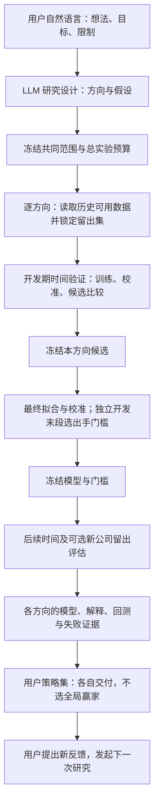

# Stock AutoML：由用户想法驱动的策略研究

这是一个已接入用户任务系统的独立研究模块。用户用自然语言描述选股想法、目标和限制，LLM 在现有数据与模型能力内提出研究方向，后台分别训练、验证并交付策略资产。一次任务可以有多个方向；每个方向保留自己的模型和证据，系统不按最终测试成绩挑一个全局赢家。没有自动交易能力，也不修改行情数据库。

系统遵循 SOFT → HARD → SOFT：用户原始需求及研究假设 → 共同执行配置与各方向配置 → 真实实验、策略解释及用户报告。通用任务系统负责归属、调度、进度、取消与恢复；AutoML 模块负责研究，不另建任务生命周期。



图中的独立门槛选择段用于 precision 模式。旧配置仍可运行固定阈值、预测损失优先的研究。

## 一次性训练与日常使用是两种任务

训练任务读取历史数据，设计、训练、校准、验证和回测，交付一个或多个固定版本的策略资产。用户之后可另外创建使用某个策略版本的选股任务：每次只读取当时可用输入，加载保存的预处理、模型、校准器与筛选门槛，执行预测并反馈结果；它不训练、不重新搜索规则，也不按当天结果更换门槛。

当前已实现训练任务和 `predict_strategy` 复用接口；普通用户从自然语言创建定时模型推理任务的适配工具尚未接入。不能把重复调度 `stock_automl_research` 当作这个能力。通用任务系统已有的周期安排只负责何时调用哪个工具；不意味着每日必须重新训练。

重新训练是用户另行发起的研究，产生新版本；新版本通过验证后是否替换日常使用模型，应单独决定。模型效果下降可以反馈给用户，不隐式改写正在使用的模型。定时推理还必须匹配训练的信息时点：例如14:55运行需要只使用截至14:55可得的数据训练模型，当前15:10收盘后模型不能提前使用。

## 用户如何引导，以及系统能自主做什么

用户可以要求“用低波动与量能研究少出手的机会”，也可以指定行业、股票、时间、持有周期、特征范围、模型及精确率目标。领域规划器保存完整原始需求，以自然语言说明各方向的假设，并将执行参数编译成 `ResearchSpec`。例如，两个方向可以分别只使用波动/量能特征和行业/估值特征，各自产生模型与解释。

LLM 可以在共同约束内选择现有特征子集、样本机制、模型和持有期，并根据开发期证据调整后续候选顺序。未指定方向数量时，规划提示通常建议约 2—3 个不同方向；明确、简单的想法也可只研究一个。候选探索仍由有限模型、特征和参数组合执行，不是自由生成代码或任意新公式。

用户决定的范围与预算不能由方向扩大。日期、股票池、算法族、目标等由配置承载；假设、设计理由和结果解释保持自然语言。明确要求但目前无法表达的目标会在规划阶段指出，不能用相似标签替代。尤其是“14:30—14:55 行情预测次日高开”所需的窗口与标签仍未实现。

`max_trials` 是整项研究的候选预算，按方向顺序均分，余数分给靠前方向。比如 5 次、2 个方向分为 3+2 次。每个候选还会执行 `folds` 次时间验证，以及可能的分类校准；最终模型拟合和阈值比较另有计算开销，因此候选数不等于模型 `.fit()` 调用次数。当前不会把某方向未用完的预算自动转给其他方向。

## 入口与快速运行

用户入口是现有任务系统的自然语言提交；后台能力为 `stock_automl_research`。工具只接受具备任务运行、用户归属和产物目录的授权后台上下文。预约、周期调度和最长运行时间由通用任务系统处理。CLI 和 Python 接口适合开发、显式配置及离线复验。

在仓库根目录，使用 Python 3.10+：

```bash
python -m venv .venv-automl
.venv-automl/bin/python -m pip install -r requirements-automl.txt
.venv-automl/bin/python -m src.quant_research.automl --demo --max-trials 4
.venv-automl/bin/python -m src.quant_research.automl --inventory
.venv-automl/bin/python -m src.quant_research.automl --config docs/examples/stock_automl.json --llm
.venv-automl/bin/python -m src.quant_research.automl --requirement '分别从低波动量能和行业估值研究3/7日持有机会，宁可漏选，总共6次实验' --llm
```

`scripts/run_stock_automl.py` 保留兼容入口。`--config` 接收一个显式 `ResearchSpec`，形成单方向研究；`--requirement` 通过 LLM 编译自然语言，不能同时使用 `--config`。`--requirement` 本身就需要 LLM；`--llm` 另外启用候选规划及报告评审。不用 `--requirement` 或 `--llm` 的合成 demo 不访问数据库或 LLM。

示例 JSON 已设 `max_symbols=null`、`min_precision=0.6`、`optimize_threshold=true`，采用全范围公司池与精确率研究。`max_train_rows=20000` 是每次基础模型拟合的行数上限，不会将验证或测试公司池缩成 20,000 行。若只做小试跑，可显式加 `--max-symbols 30 --max-trials 4`；产物会披露公司抽样，不能据此声称覆盖全市场。

CLI 仅把 `.env` 加载到进程，不打印凭据。数据库 URL 按 `KINGDOMAI_DB_URL`、`BI_DB_URL`、`BUSINESS_DB_URL` 顺序解析，schema 必须为 `kingdomai`；`--db-env ENV_VARIABLE_NAME` 可指定连接。每次读取保持同一只读一致性快照，参数绑定，超时及单批行数上限；不会为寻找分钟表自动跨凭据切换数据库。LLM 使用现有兼容接口配置，接收用户需求、候选和汇总证据，不发送原始行情、新闻正文或数据库凭据。

## 数据、样本与特征

样本单位为“股票 × 交易日”的一次持有机会，分钟 bar 条数不是独立隔夜样本数。当天已发生行情和此前历史是输入，未来真实收益用于制作标签。

| 数据 | 当前特征或作用 | 可得时点与边界 |
|---|---|---|
| `kcrp_stock_price` | 过去 1/3/7/20 日收益、20 日波动、振幅、开盘缺口、均线距离、量比、成交额、换手率；复权收益标签 | t 日收盘后 15:10 决策；滚动特征只使用截至当日数据；供应商复权版本仍可能修订 |
| `kcrp_stock_pricevaluate` | 总市值、PE TTM、PB MRQ | 按下一自然日可用处理；没有原始修订版本 |
| `kcrp_stock_industry` | SW2021 一级行业 | 按 begin/end 生效区间对齐，不使用今天行业回填全部历史；分类历史修订仍有局限 |
| `kcrp_news_info` | 最近 7 个自然日可用新闻的条数 | 公告日期次日与实际入库时点取较晚者；无新闻日补零；不是新闻情绪或全网热度 |
| `aiia_stock_realtime_minute_snapshot` | 日内分钟收益波动率、分钟条数 | 仅完整 1m bar、截至 15:00，15:05 后可用；不是指定尾盘窗口 |
| Python `events` 或 `--events-csv` | 额外历史数值特征 | 需 `symbol,available_at,<数值列>`；按可得时间向后 as-of 合并，不能覆盖价格或标签 |

`technical` 使用 11 项日线派生特征；`enriched` 加上实际存在的辅助特征。`feature_names` 可明确限制到其中的一个子集；缺少指定特征会留下不可执行证据，不静默换成其他特征。`--inventory` 只导出表字段目录，不能解释为所有数据库表都已进入训练。

未指定 `symbols` 且 `max_symbols=null` 时，使用在研究区间任一时间有效上市的 A 股池，包含期间 IPO 和随后退市公司；行业筛选先使用重叠历史区间，再按样本日过滤。显式 `symbols` 优先并完整保留；显式整数 `max_symbols` 才按 seed 抽取公司用于试跑。拟合阶段超过 `max_train_rows` 时只抽取训练行，概率校准、验证和测试仍保留其自然样本分布。SVM 的基础拟合另有 4,000 行上限。

日线、估值、新闻按最多 64 只股票 × 366 日读取，每批最多 50,000 行，超过就报错；分钟按 8 只 × 31 日、每批 100,000 行读取并立即聚合。最终仍会构建内存 DataFrame；分批不等于训练全流程流式，也不构成全市场规模的性能验收。

KingdomAI 适配器另从同一连接的日线表读取全市场 `DISTINCT trade_date`，存入 `daily.attrs['market_calendar']`。单股停牌缺报价时，交易日仍保留为空行，不把持有期顺延成“后几个有报价日”。这是数据库观测交易日历，尚非交易所权威日历认证。Python 调用可显式传 `build_panel(..., market_calendar=...)`；没有外部日历的 `provided_frame` 只能使用所给行情日期并集，不能据此认证单股跨停牌日期的标签；调用者需提供独立市场日历。

分钟必须在本次指定连接与区间真实可用；明确开启分钟而没有有效分钟特征时，任务/CLI 报告无法完成该方向。不会自动使用另一个库的短期分钟表来充当多年历史。

## 目标、模型和选股规则

当前唯一标签时序是：t 日收盘后观察，t+1 日开盘进入，t+h+1 日开盘退出。

```text
forward_return = adjusted_open[t+h+1] / adjusted_open[t+1] - 1
分类标签 = 1，当 forward_return > target_return；否则为 0
回归标签 = forward_return
```

`h=1` 也不是“次日开盘 / 今日收盘 − 1”的高开目标。期间触及目标、止盈止损、空头、期权等也未接入。训练标签是毛收益，扣成本盈利是另外一个评估口径。

可用算法族为 `linear`（逻辑回归 / Ridge）、`elastic_net`、决策树、随机森林、SVC/SVR 和直方图梯度提升。它们都是通用统计学习模型，没有内置股票有效性保证。样本机制为 `all`、动量、反转、流动性、低波动及新闻活跃；行业、市值、成交额可进一步限定研究范围。单股研究应设置 `company_holdout_fraction=0`，重点检查后续时间证据。

| 参数 | 实际含义 |
|---|---|
| `target_return` | 定义正样本的毛收益门槛 |
| `min_precision` | 选中事件达到目标的开发期精确率要求，不是整体 accuracy |
| `optimize_threshold` | 是否在开发期比较出手阈值 |
| `probability_threshold` / `regression_threshold` | 固定阈值；自动阈值模式下作为参与比较的起点之一 |
| `top_k` | 每日最多选多少只，允许空选 |
| `min_signals` / `min_signal_dates` | 开发证据至少覆盖多少信号与出手日期 |
| `min_win_rate` | 扣假设成本后正收益的信号比例要求，与目标 precision 分开 |
| `max_drawdown` | 开发组合回撤绝对值上限 |

自然语言规划默认启用 `min_precision=0.6` 与自动阈值研究，具体要求由用户需求决定。直接构造 `ResearchSpec` 的兼容默认仍是 `min_precision=None, optimize_threshold=False`，保留旧的固定阈值、损失优先路径。

## 每个方向如何训练、选门槛和测试

1. **先锁定留出范围。** 最晚 `test_fraction` 的时间作为最终测试；可选按 seed 留出一部分公司，它们的全部历史不参与开发。所有股票共享时间边界。标签结束时间必须早于下一阶段起点。
2. **开发期滚动验证。** 对每个候选做扩展时间窗训练和后续验证，得到 OOF 预测。数值插补、缩放和行业编码只在拟合集学习；分类再用较晚时间块做 sigmoid 校准，边界再次 purge。回归不做概率校准。
3. **比较开发候选。** precision 模式基于 OOF 比较阈值与每日 Top K 后的目标精确率、出手日期、按日期宏平均精确率、月度表现、实际下跌误选、扣成本胜率与回撤；允许某个时间段完全不出手。整体 Brier/MSE、AUC、校准桶、RMSE、Rank IC 仍保留为诊断。旧模式按各折相对常数预测损失改善的均值减标准差排序。
4. **冻结该方向候选，再训练最终模型。** precision 模式把开发样本按日期再分成前 80% 的模型开发段与末 20% 的阈值选择段，并剔除跨界标签。分类在前段内部再按 75%/25% 分基础拟合与校准；回归使用前段拟合。实际行数受缺失、样本规则和训练行预算影响，不能直接用这些比例乘总行数。
5. **冻结最终出手规则。** 最终模型和校准器固定后，用未参与它们拟合的开发末段选择阈值，并记录该段的支持度、精确率、扣成本胜率与回测。这个阶段属于模型选择证据，不能称为最终独立测试。未达标仍保留候选及原因，不伪造有效策略。
6. **最后揭盲。** 每个方向只对其开发期选定的一名候选进行后续时间、以及可选新公司后续时间评估。不会看测试结果再换候选或调阈值。所有方向的结果并列交付，不根据这些最终成绩挑全局冠军。

阈值、模型与冻结选择写入 `selection.json`；样本计数分别列出实际拟合、校准、阈值选择、purge 和预算抽样排除行数。日期/月度摘要是描述性稳定性证据，不是统计置信界。多个股票同日及多日持有标签有相关性；旧 Wilson 区间不能作为策略可靠性的独立试验置信保证。

## 回测与效果边界

回测复用 `src.backtest` 的现金账本：收盘信号、次日开盘执行、按 h 日换仓，逐日记录现金、持仓、佣金、滑点、税费和执行问题，并与同区间同股票池基准比较。信号按股票日统计，可能重叠，也不一定在换仓日实际成交；信号 precision、扣成本信号胜率和组合收益是不同指标。

无信号时 precision 为空、交易为零，不能解释为高胜率。模型使用复权价格和 1 份单位；未完整模拟 A 股整手、最小佣金、历史税费、涨跌停开盘队列、停复牌、分红及退市清算。结果是研究证据，不能据此宣称真实成交回报或生产放行。

反复观察同一测试窗口后修正模型，会污染测试。用户反馈可启动下一次研究，但当前程序不会跨研究自动维护“从未揭盲”的独立测试库。新的解释、剪枝或规则调整仍需新的开发与验证证据；LLM 不得改变已计算指标。

## 策略资产、解释与复用

新 CLI 运行输出到被 Git 忽略的 `outputs/stock_automl/study_<id>/`：

```text
study_<id>/
  research_design.json       原始需求、共同配置和方向计划
  study_plan.json             冻结执行计划与来源
  research_checkpoint.json   各方向恢复引用
  study.json / study.md       策略集合及失败说明
  direction_1/<run_id>/       第一方向的独立研究资产
  direction_2/<run_id>/       第二方向的独立研究资产
```

每个方向保存配置、候选、开发结果、模型选择、样本计数、模型、代码/数据指纹、回测与语言评审。`strategy.json` 保存目标、范围、特征、冻结门槛及证据；`explanation.json/.md` 来自实际模型结构：线性模型展示系数、预处理和校准关系；决策树展示路径、原始量纲阈值与叶子支持；复杂模型仅输出适合它的摘要，不假装拥有简洁精确规则。这一步没有自动完成新的事后剪枝。LLM 可以解释事实与局限，不能替模型编造选股理由。

新行情可复用保存的预处理、模型、校准器和冻结规则：

```python
from src.quant_research.automl.inference import predict_strategy

scored = predict_strategy(study_directory, daily_frame, events, strategy_id="direction_1")
selected_stocks = scored[scored.selected]
```

研究集合必须指定 `direction_1` 或已保存的 `strategy_id`；不能默认选第一项或回测最好的一项。单方向运行目录可以不传标识。输出包含 `symbol,date,horizon,target_return,prediction_kind,prediction,selected`。只对共同最新日期、有连续历史并符合已保存样本/股票约束的股票计算预测；`selected` 复用冻结阈值和 Top K，可能全为 False。建议提供至少 60 个交易日历史及市场日历，最低滚动历史需求为 21 个交易日。`predict_latest` 保留兼容接口。

后台发布研究设计、汇总、模型解释和报告；原始行情、逐行预测及 `model.joblib` 保留在受任务归属保护的本地目录。只加载自己生成、可信的本地 joblib 文件，不将市场训练矩阵或模型自动提交到 Git。

## 恢复、复核与验证

```bash
# 恢复整个研究集合，沿用原CLI输出目录
python -m src.quant_research.automl --resume outputs/stock_automl/study_<id>

# 单独重试某方向的LLM报告解读，不训练
python -m src.quant_research.automl --review-only outputs/stock_automl/study_<id>/direction_1/<run_id>

# 旧版单方向run目录仍可恢复
python -m src.quant_research.automl --resume outputs/stock_automl/<legacy_run_id>

python -m pytest -q tests/automl tests/test_backtest_core.py
```

研究集合恢复校验完整冻结计划和来源；每个方向还校验配置、实现和数据指纹。已完成方向不会重训，已预留但中断的候选仍计入预算。一个方向不可执行会保存原因，其他方向继续交付。普通报告失败可以独立重试，不能因为 LLM 暂时失败重跑训练。

目前测试覆盖多方向共享预算、独立产物、取消/恢复、失败方向隔离、冻结门槛、单股缺报价与交易日历、时间 purge、预处理/校准隔离、各算法族、推理复用与回测成本。合成训练仅证明流程与协议，不能作为股票效果证据；当前实现也未完成全市场规模训练的性能验收或新高精确率策略验收。

2026-10-03 的[数据与选模复核](development_tasks/automl_precision_event_review_20261003.md)记录：2024—2025 日 K 有 2,614,333 条原始记录，旧三千多行拟合来自小股票池配置。该文是历史审计；其中全池、precision、多方向与策略资产等待办已在本次实现推进，分钟窗口/高开目标仍未落地。另见[可解释策略参考调研](development_tasks/automl_interpretable_strategy_references_20261003.md)及[历史小池运行证据](stock_automl_runs/20261003_smoke/README.md)。历史结果不能冒充当前实现的全市场验证。

2026-10-07 的[14:45 次日高开独立探索](stock_automl_runs/20261007_next_open_1445/README.md)使用约一个月的真实分钟窗口，在独立试验脚本中核对目标和信息时点；留出的 5 个交易日里，已试线性模型没有超过同池高开基率。后续发现这版短窗口模型也使用了可能跨基准断点的复权价收益与标签，结果尚未按一致价格口径重算。该试验尚未接入本模块的 `ResearchSpec`、策略资产或日常推理任务，不能按它声称现有 AutoML 已支持 14:45 高开预测。

同日的[长历史、每周限额选股试验](stock_automl_runs/20261007_next_open_weekly/README.md)在固定抽样 1,000 只股票上，用前一交易日及更早的行情、资金流、大盘、行业和估值验证“少量出手、允许空仓”的口径。验证期选出的模型在 2026 年 1—7 月留出测试上有 79 个信号、49.37% 高开，名次与命中率未稳定单调；它没有使用当天 14:45 分钟特征，不能视为可部署的高置信度策略。

后续的[高开超过 2% 目标、随机基准与涨停可交易性复核](stock_automl_runs/20261007_next_open_targets/README.md)发现受限树集成的测试段虽有 24/62 次高开事件，但 62 条信号中 50 条前日涨停，24 次命中中 21 次选股日最终涨停；后续 7 次命中全部对应选股日最终涨停。剔除前日涨停后重训，测试期逻辑回归仅 11/65 次高开 `>2%`，后续期 0/19；受限树集成测试为 12/145。旧的同日同波动率 lift 未控制涨停接力，不能解读成可交易的高置信度策略。该研究仍只有 T−1 输入和固定抽样股票，没有全期 14:45 可买入证据。

[因子解释和 `>1%` 目标的再审查](stock_automl_runs/20261007_next_open_targets/factors_and_high1_audit.md)发现跨日期复权价基准断点，因此新试验改用同一交易日的昨收、收盘和开盘比值。排除最近五日涨停后，逻辑回归测试期 29/145（20.0%）、后续期 6/45（13.3%），对应同日同上市板块基率为 16.1% 和 10.0%；按周重采样的超额下十分位均低于零。两段低开均超过一半，且没有实现空仓或可靠的分数排序。四个新增量价/资金组合因子没有稳定改善，去除两个冗余因子的逻辑回归后续期仅 3/42。原逻辑回归后续期只有 10/45 条信号能核对到合格的 14:45 分钟记录，仍缺可买入性证明。

方法参考：[时间序列验证](https://scikit-learn.org/stable/modules/generated/sklearn.model_selection.TimeSeriesSplit.html)、[Pipeline 与数据泄漏](https://scikit-learn.org/stable/common_pitfalls.html)、[概率校准](https://scikit-learn.org/stable/modules/calibration.html)。模块依赖边界见[模块 README](../src/quant_research/automl/README.md)。
