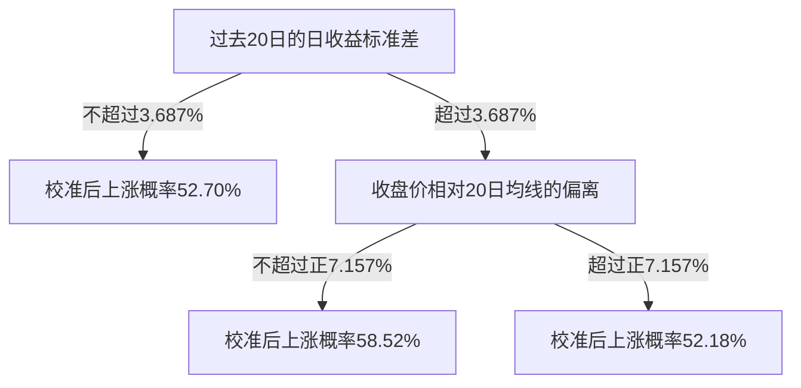

# 历史 AutoML 模型：实际类型、解释与剪枝审计

已核查真实保存的模型，并完成开发期剪枝及线性模型精简对照。模型确实由机器学习训练，能够提取真实系数和决策路径；目前没有证据表明剪枝后出现了稳定达标的股票机会。没有替换任何原模型。

## 实际训练与保存了什么

本地 14 份研究记录中，5 份使用 KingdomAI 行情，9 份为合成数据测试。以下结论只使用真实行情研究。重复研究共享历史数据，不是五次独立盲测。

| 真实研究 | 股票×日期原始行数 | 成功候选数 | 实际保存的最终模型 |
|---|---:|---:|---|
| 20261002T173655Z_fb3cc160 | 10×485＝4,850 | 12 | 1 日直方图梯度提升分类器 |
| 20261002T174351Z_8ee73a17 | 10×485＝4,850 | 12 | 1 日逻辑回归 |
| 20261002T174618Z_584fcb51 | 10×485＝4,850 | 12 | 7 日逻辑回归 |
| 20261003T042157Z_4609ceb6 | 16×485＝7,760 | 8 | 1 日逻辑回归 |
| 20261003T042758Z_5370a71f | 16×485＝7,760 | 8 | 7 日逻辑回归 |

历史候选实际包含逻辑回归、Ridge、ElasticNet 分类/回归、决策树、随机森林、SVM 分类、直方图梯度提升分类/回归。最新一轮仅比较了逻辑回归 2 个、Ridge 2 个、分类树 2 个、回归树 2 个。

每轮仅保存最终 `model.joblib`，其他候选保存配置和评估结果。因此本次直接检查了 5 个最终模型；决策树内部结构按最新一轮冻结的数据、配置和实现重建，并核对原指标。没有声称读取到不存在的候选模型文件。

所有 5 个真实研究选出的模型都未满足当时全部开发约束。“最终模型”表示开发候选中的相对优选，不表示研究达标或已可使用于交易。

## 最新逻辑回归可以精确解释

最新模型预测的是：在收盘后形成判断，次日开盘进入，持有 7 个交易日后开盘退出，毛收益是否大于 0。它不预测“未来 7 天内任意时刻曾经上涨”。

该轮 16 家公司中，13 家用于开发，3 家留出。最终开发训练输入 4,679 行，其中基础拟合 3,406 行、时间靠后的校准 1,169 行，边界剔除 104 行。16 个原始输入经预处理展开成 25 列：15 个数值特征和 10 个行业指示列。保存的最终模型 25 个系数均非零，使用 L2 正则化，`C=3`。

概率校准层也是逻辑回归，斜率为 0.529514，截距为 0.291456。将其合并后，实际预测公式为：

```text
p = sigmoid(0.333934 + Σ 校准后系数[j] × 预处理后特征[j])
校准后系数[j] = 0.529514 × 原始逻辑回归系数[j]
```

程序逐行验证公式与保存模型的预测一致，最大概率差为 `2.78e-16`。下列是部分真实系数；数值特征已在基础拟合数据上标准化。

| 特征 | 校准后 log-odds 系数 | 模型内方向 |
|---|---:|---|
| 20 日日收益波动率 | +0.260972 | 提高模型估计 |
| 均线偏离 | +0.139759 | 提高模型估计 |
| 换手率 | −0.182969 | 降低模型估计 |
| 近 7 日收益 | −0.143370 | 降低模型估计 |
| 总市值 | −0.133274 | 降低模型估计 |
| 成交额的 log1p | −0.104779 | 降低模型估计 |
| 7 日入库新闻数量 | +0.008608 | 在本模型中贡献较小 |

这些系数表示其他输入固定时，每增加一个基础拟合标准差，对 log-odds 的影响；不是上涨概率的百分点变化，也不是金融因果规律。相关特征可能彼此分摊贡献。

按基础拟合数据上的“相对均值的平均绝对 log-odds 贡献”统计，并将行业列合并，模型最依赖的输入依次是行业、20 日波动率、换手率、均线偏离、近 7 日收益。这是当前模型使用输入的程度，不是样本外重要性或 SHAP。

行业解释尤其需要谨慎：13 家开发公司仅覆盖 10 个行业，8 个行业只有 1 家公司。虽然模型没有直接输入股票代码，但行业和公司特征难以在这个小股票池中分离；尚不能将其解释为整个行业的稳定效应。

## 线性模型精简的实际结果

逻辑回归没有树枝；相应简化方法是减少特征、加强正则化或使系数稀疏。固定比较了以下四种方案，沿用原两个扩展时间验证折及分类校准，未调整概率阈值。

| 方案 | 两折非零系数数 | 第一折 Brier | 第二折 Brier | 是否全部达标 |
|---|---|---:|---:|---|
| 原逻辑回归，C=3 | 24 / 24 | 0.252310 | 0.246202 | 否 |
| 去掉行业 | 14 / 14 | 0.262828 | 0.250697 | 否 |
| 更强 L2，C=0.3 | 24 / 24 | 0.253505 | 0.246493 | 否 |
| ElasticNet，C=0.3、l1_ratio=0.5 | 23 / 22 | 0.253944 | 0.246733 | 否 |

Brier 越低越好。原模型第一折也没有超过常数概率基准（基准 0.250455）。这次去行业、增加收缩和稀疏化均未改善两个验证折的概率误差，不能以“更简单”为由替换原模型。这里统计的是各折重新训练的模型，非零系数数与最终模型的 25 个不同。

## 决策树进一步剪枝的实际结果

最新一轮有 4 个树候选：3 日分类、1 日分类、1 日回归、7 日回归。它们原本已有限制深度 3/6、叶子至少 20 个基础拟合样本的预剪枝；`ccp_alpha=0` 仅表示未做额外成本复杂度后剪枝。

本次对每个候选使用 5 个 alpha，在两个时间折评估，共 40 次。alpha 只由最早折的基础拟合数据产生，固定后用于两个折；校准、验证和留出数据不参与产生 alpha。每次修改分类树后都重新做原时间分区的概率校准。

原树的全部 8 折训练计数、预测和回测指标均复现。重点结果如下：

| 候选与变化 | 第一折 | 第二折 | 判断 |
|---|---|---|---|
| 1 日分类：7/8 叶剪到各 3 叶 | Brier 0.254362→0.252885 | Brier 0.249905→0.249128 | 误差降低，但两折均无 ≥60% 概率信号 |
| 1 日回归：alpha=1.53425e-5，5/6 叶→4/2 叶 | 9 信号，扣成本胜率 33.3%，组合 −0.42% | 12 信号，扣成本胜率 75%，组合 +13.14% | 一个区间改善，跨区间不稳定 |
| 7 日回归：16/16 叶→10/6 叶 | RMSE 0.098869→0.096989 | RMSE 0.067846→0.066805 | 两折误差降低，第二折组合仍 −6.12% |

没有任何剪枝变体满足原全部约束。按原开发评分 `mean(skill) − std(skill)` 排序，4 个树候选各自最优的 alpha 都退化到只有根节点的常数树。这说明这批条件分裂尚未证明比常数预测更可靠，不应把“剪后误差下降”自动解释成发现了可靠机会。

剪枝方法使用 scikit-learn 的[最小成本复杂度剪枝](https://scikit-learn.org/1.7/modules/tree.html#minimal-cost-complexity-pruning)。

## 一棵实际学出的简化树

以下来自重建的 1 日分类候选、第一折、`ccp_alpha=0.00346050645`。选择这个例子仅因为它是保留条件分支时最简单的版本，没有按验证胜率挑叶子。阈值已还原到原始单位，导出规则的逐行路由与树实际结果一致。



波动率没有年化。数值缺失时沿用基础拟合集的中位数插补；完整精度和填充值在 `tree_rule_example.json`。三条路径的最终概率均低于 60%，因此都不触发信号。

看似最有希望的中间路径是“波动率 >3.687%，均线偏离 ≤+7.157%”。它在基础拟合的 269 个样本中上涨比例为 63.57%，经时间校准后的预测为 58.52%；在后续验证的 213 个匹配样本中，上涨比例只有 46.95%，扣成本盈利比例为 44.60%。这些是该叶子全部匹配样本的描述统计；它没有触发策略交易。

这就是模型解释应展示的完整链条：真实条件 → 基础拟合支持 → 校准后预测 → 后续验证结果。LLM 可以解释这些计算证据，但不能把训练时的高命中率改写成可靠的未来胜率。

## 集成模型怎样处理

历史保存的直方图梯度提升分类器有 80 棵树、2,320 个节点、1,200 个叶子，最大实际深度 14。候选记录中的 `depth=6` 没有用于该算法；实际设置为每树最多 15 叶，未限制深度。不能把它说成一棵深度 6 的决策树。

它的校准斜率是 −0.015100，几乎压平且反转基础模型分数。直接展示树内的正向分支，会误解最终预测。需要针对“预处理＋集成模型＋校准器”整体评估解释。

| 模型 | 可解释性与后续精简方向 |
|---|---|
| 逻辑回归 / Ridge / ElasticNet | 系数和加性贡献容易解释；用正则化、特征精简，再重训验证 |
| 单棵决策树 | 路径直接表达条件组合；可用深度、叶子支持数和成本复杂度剪枝 |
| 随机森林 | 是多棵树的综合结果，整体难化为少量规则；可限制每树复杂度、比较特征消融 |
| 梯度提升树 | 多棵树逐步相加，不能任意删树而继续使用旧校准概率；应比较较少迭代或更少叶子的重新训练版本 |
| 本实现的 RBF SVM | 不能直接读取一组简短业务规则；需要局部解释，或另训简单代理并检验其拟合保真度与独立预测效果 |

此次实际进行的精简训练仅包括最新逻辑回归与上述 4 个树候选。没有重新训练森林、SVM 或历史梯度提升模型，也没有声称完成 SHAP 或代理模型蒸馏。

## 证据与复现

本目录只保存聚合结果、参数、系数和叶子规则，没有复制行情明细或模型二进制。原始模型和数据保持不变。研究资产的 hash、环境、对应原代码和审计脚本 hash 在 JSON 中记录。审计是在 `e61b275` 基础上加本次离线脚本执行；这不是生产就绪评审。

- `inventory.json`：5 个真实研究的候选类型与已保存模型复杂度。
- `linear_explanation.json`：精确系数、贡献、行业支持、四种开发期简化对照。
- `tree_pruning.json`：40 次剪枝评估、原指标复现核对与配置。
- `tree_rule_example.json`：图示的实际三条叶子路径及支持证据。

完整本地审计在 `outputs/model_audit_20261003/`；树子目录另有全部 8 份剪前/剪后第一折规则。离线入口是 `scripts/audit_automl_linear_explanations.py` 与 `scripts/audit_automl_tree_pruning.py`，不依赖外层用户任务运行器，不改变现有模型选择或任务协议。它们仅应读取受信任的本仓库本地 pickle/joblib 资产。

```bash
RUN=outputs/task_runtime_eval/20261003T042736/artifacts/run_2f02293ff42f4f6cad1815d31af4c475/step_1/ff03a31d387842e5838ee3b6da07b01c/20261003T042758Z_5370a71f
OMP_NUM_THREADS=1 OPENBLAS_NUM_THREADS=1 .venv-automl/bin/python scripts/audit_automl_linear_explanations.py --run-dir "$RUN" --output-dir outputs/model_audit_20261003/linear
OMP_NUM_THREADS=1 OPENBLAS_NUM_THREADS=1 .venv-automl/bin/python scripts/audit_automl_tree_pruning.py --research-dir "$RUN" --output-dir outputs/model_audit_20261003/tree_pruning
OMP_NUM_THREADS=1 OPENBLAS_NUM_THREADS=1 .venv-automl/bin/python -m pytest -q tests/automl/test_model_audit.py tests/automl/test_stock_automl.py
```

上述测试命令实际结果为 **32 passed in 11.73s**。测试覆盖正、负和零校准斜率，缺失值/缺失指示列、未知行业分组，禁止写入原研究目录，以及既有 AutoML 回归。真实数据审计另外核对原最终预测、开发折预测/回测、原文件未变，以及树规则路径一致性；5 个历史模型文件的 SHA-256 均与审计清单一致。未重跑全仓库测试或前端测试，本次未修改业务运行器、API 或 UI。

这些新增比较只使用开发公司的开发期数据；原留出期从 2025-08-11 开始，未用于本次精简选择，也未重新评估。历史留出结果已经揭盲，后续不能重复使用并称为新的盲测。若要证明精简规则具有泛化能力，需要冻结方案，再验证未参与选择的新公司和新时期。每日信号及 7 日标签会重叠，不能把样本行数当作独立交易次数。

当前最有依据的下一步是扩大同一行业内的公司覆盖，建立开发期留公司验证，再把“模型解释、受限精简、重新校准、逐时期/逐场景验证”作为 AutoML 的业务步骤接入现有统一任务资产。外层只管理已有阶段、进度和产物；事实解释仍由 AutoML 计算证据提供，LLM 负责解释和提出下一轮研究假设。
