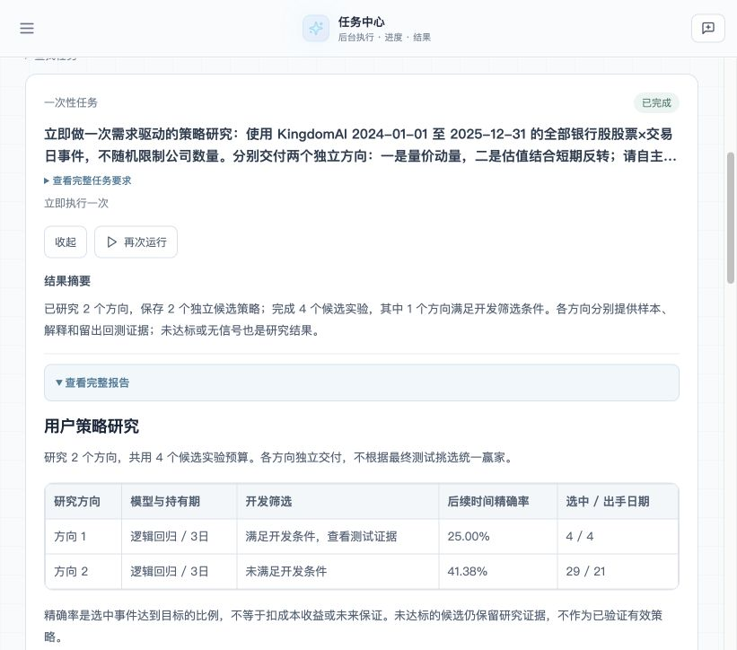

# 需求驱动的多方向策略研究：实现与验证

产品主线是用户表达选股想法、目标和限制，Agent 在现有能力内自主提出不同研究角度，各自形成可复用策略及证据。通用任务系统继续负责执行安排、归属、进度与结果；本次没有另建 ML 专属任务状态机。

实现和流程图见 [AutoML 文档](../../stock_automl.md)。所有默认公司池改为研究区间内符合范围的全池；明确配置 `max_symbols` 才按公司抽样。基础模型拟合行数预算、场景采样、训练/校准/阈值选择和测试是不同环节，报告分别给出数量。

用户进一步明确：训练是一次性任务，已有策略可以被日常定时推理任务重复使用，日常运行不训练。当前验证仅涵盖一次性训练和保存模型的程序复用；自然语言创建定时推理任务的适配入口尚未接入。

## 当前实现

- 一项自然语言需求可生成多个自然语言研究假设及可执行配置，按方向分享整个任务的候选预算；方向内择优，方向间并列交付。
- 高精确率模式用开发期预测比较阈值、误选下跌、出手日期、月度表现与成本；允许低召回和没有信号的时期。最终模型拟合、概率校准与门槛选择分开，随后冻结到测试和预测复用。
- 产物包含各自的 `strategy.json`、实际模型、真实系数或树路径、LLM 解读、样本分割、回测与资格判定。未达标仍保留研究证据，所有方向都因执行错误失败时，任务不会冒充成功研究。
- CLI、授权后台工具和策略复用入口接通；恢复绑定冻结需求、范围、预算与实现快照，已完成方向不重训。
- 共享业务口径由规划、候选选择和语言评审读取，解释不依赖模型猜测采样器含义。

## 真实界面验收中发现并修复的问题

在本地前端 `22154`、隔离任务服务 `22153` 实际输入一段自然语言，要求使用 2024—2025 年全部银行股，分别研究量价动量和估值结合短期反转，3 日持有期分类，65% 精确率目标、最多 3 只/日、10 个信号/5 个日期、共同 4 次实验以及 20% 时间/公司留出。使用真实 KingdomAI 只读行情和配置的真实 LLM；认证身份和任务存储为本地测试 fixture，不是生产登录或部署验收。

第一次运行 `run_084deda0853e4cfdb8b4d0ee7d185765` 在规划阶段失败。LLM 错误认为浅树不受支持，并加入用户未要求的能力限制。修复能力说明，保留失败记录，没有把该次记作训练成功。

第二次运行 `run_1d89dfdc898e4b8b99af69b11dfdc7ea` 完成了 2+2 次实验，两个方向均选出深度 3 的决策树。数据为 42 家银行、485 个交易日、20,370 条日行情；3 日标签有效样本 19,362 条。两个方向分别拟合 3,555/994 行、校准 924/372 行、选门槛 1,510/366 行，其余差异来自场景条件和时间隔离。两个方向都未达开发要求，报告明确未达标。两份真实树解释进入了 LLM；27 个产物下载 HTTP 200 且哈希一致；预测复用的分数和 selected 与冻结规则一致。

第二次仍发现设计和评审把 sampler 名称解释成未实现的公式，反转方向错误地说成“近5日最低30%”。因此该次仅通过执行链路验收，语义保真不通过。随后将真实 sampler 条件、无隐式回退、固定标签与日期划分写成共享业务说明，并在三个 LLM 环节共同使用。旧报告和失败证据保留，不就地改写成正确结果。

第三次运行 `run_dd3649a1c0674c0cb72005bf6319ca81` 在规划配置转换时遇到 `TypeError`（数值与 `None` 比较），尚未进入训练。该次独立记录为失败，不把前一次结果当作第三次验收。随后通过捕获真实模型原文定位到 `optimize_threshold=true` 时 `probability_threshold=null` 覆盖系统默认。修复仅作用于自然语言配置补丁：非空类型的 null 继承系统事实，合法可空参数保留 null；显式机器配置不被静默修复。原始失败 JSON 重放通过，65% 目标和全部非空约束保留。

## 修复后完整验收与用户口径

第四次运行 `run_4e14beb462ca40b1b2553d2e055e056f` 在相同自然语言要求下完成，仍使用42家银行、485日、20,370行行情与2+2次候选预算；两方向各选出逻辑回归，分别拟合3,555/994行、校准924/372行、门槛选择1,510/366行。真实校准系数进入推理模式的LLM评审，采样定义与保存的日期口径复核通过；27份产物均下载成功且哈希一致。

方向一符合开发条件，但原公司/新公司后续时段精确率只有25%/0%；方向二未满足开发条件，后续精确率41.38%/38.10%。这些结果没有证明可用于日常选股。候选和特征由每次LLM规划选择，各次不是只改变一个因素的效果对照实验；重复历史窗口也不是新的独立验证。

复用检查显式禁止所有相关 `fit/fit_transform`，`predict_strategy`仍成功执行；分数与selected逐项匹配保存的模型和门槛，模型文件哈希前后不变。本次最后一个历史交易日，两方向均未选中股票。该结果证明一次训练后的模型可以直接推理，不需要再次训练；它没有证明尚未接入的自然语言定时推理用户路径。

聚合证据见[验收数据](ui-checks.json)，代码绑定见[实现文件哈希](implementation.json)。运行时为基线commit上的未提交工作区，不能仅用基线commit认定执行版本；研究资产另保存完整引擎实现指纹。本目录不保存原始行情、逐行预测、模型二进制、数据库目录或凭据。

| 最终检查 | 结果 |
|---|---|
| `OMP_NUM_THREADS=1 OPENBLAS_NUM_THREADS=1 .venv-automl/bin/python -m pytest tests/automl tests/test_backtest_core.py tests/test_scheduled_tasks.py tests/test_user_task_tools.py tests/test_user_task_runtime.py -q` | 216 passed；1条既有python_multipart弃用提示 |
| `cd frontend && npm test -- --reporter=dot` | 29文件、179项通过 |
| `cd frontend && npm run build` | TypeScript与Vite通过；既有chunk size提示 |
| CLI合成行情训练smoke | 完成，保存1个候选模型；不作实际股票效果证据 |

## 验证范围

上述历史窗口已在开发中使用，本次是工作流复验，不能作为从未揭盲的新投资效果证据。自动化测试覆盖独立预算、恢复、权限/路径边界、旧可选字段兼容、样本时点、独立市场日历、阈值冻结、测试数据不可影响选择、真实模型解释重构及推理复用。没有运行整仓所有测试、全市场百万样本训练性能或生产长稳/恢复验收。

目前不支持指定尾盘窗口预测隔夜高开、自由生成新因子公式、自动事后剪枝后重新验证或实盘交易。多方向策略资产与 Python 预测入口可用；普通用户在对话中逐条修订已保存策略的专门编辑流程尚未实现。
