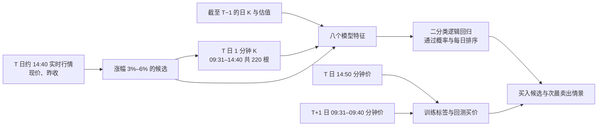

# 14:40 策略：特征来源与一分钟 K 扩样核查

## 结论和范围

现有策略以 **T 日 14:40 已完成的一分钟行情**和 **T−1 及更早的日线、估值**为特征，14:50 分钟价只是假设买价，T+1 早盘价格只用于标签和回测。补历史数据应使用代码中的 `kLineData` **1 分钟**接口（`eLineType=1`），保留原始返回的日期与分钟时刻。5 分钟数据曾用于试探接口覆盖范围，本轮不拿它替代特征或标签。

2026-10-08 后续翻页核查发现：接口抽查股票在 **08-05、08-06、08-24** 均可取得完整的 240 根一分钟 K；08-04 只剩约 60 根，7 月不可得。08-07 至 08-21 已补入全量表，08-05、08-06 和 08-24 的补录正在进行。数据库中的 08-24 原先只有早盘，不能据此说接口也缺下午数据。

## 时间线与依赖



| 字段或步骤 | 精确计算口径 | 历史依赖 | 最迟可用时点 |
| --- | --- | --- | --- |
| 14:40 涨幅 `signal_return` | 14:40 最新价 / T 日昨收参考价 − 1；3%–6% 入候选 | T 日 14:40 的 1 分钟收盘价；`kcrp_stock_price.preclose` **仅作历史上实时接口昨收的代理** | T 日 14:40 分钟完成后；实盘从实时行情取昨收 |
| 量比 `volume_ratio` | 09:31–14:40 的 220 根成交量之和 × 100 股/手，除以（T−5…T−1 日均成交股数 × 220/240） | T 日 1 分钟 `lVolume` 或库内 `volume`；`kcrp_stock_price.volume` | T 日 14:40 分钟完成后 |
| 截至 14:40 换手率 `turnover_so_far_pct` | 同一累计成交股数 / T−1 流通股本 × 100 | T 日 1 分钟成交量；`kcrp_stock_pricevaluate.float_share` | T 日 14:40 分钟完成后 |
| 流通市值 `float_mv_100m_cny` | T−1 `float_mv` / 1 亿 | `kcrp_stock_pricevaluate.float_mv` | T−1 数据可用后 |
| 五日量递增 `volume_4of5_increasing` | T−5…T−1 的 5 个日成交量中，存在**任意四个按时间严格递增的子序列**记 1，否则 0 | `kcrp_stock_price.volume` | T−1 收盘后 |
| 均线多头 `ma_bull_5_10_20` | T−1 的后复权收盘价 MA5 > MA10 > MA20 | `kcrp_stock_price.adjclose` | T−1 收盘后 |
| 14:40 高于均线 `price_above_all_ma` | 14:40 价高于三条均线；均线以 T 日昨收参考价 / T−1 后复权收盘价转换到盘中价格尺度 | T 日 14:40 价与昨收；T−1 及更早的后复权日 K | T 日 14:40 分钟完成后 |
| 日内一直高于均线 `all_intraday_lows_above_ma` | 09:31–14:40 每根 1 分钟 K 的最低价，取其最小值后仍高于上述三条均线 | T 日 1 分钟 `fLow` 或库内 `low_price`；历史均线 | T 日 14:40 分钟完成后 |

原始 5 日日成交量序列、MA5/10/20、截至 14:40 的最低价和累计成交量是中间量；**八因子模型**只读表中八个变量。四个连续变量直接输入，但逻辑回归拟合前用训练折的均值、标准差标准化；四个布尔变量用 0/1 原值。历史样本要求 T−1 起连续 20 个交易日数据完整，且这段时间没有 `adjpreclose / 前日 adjclose` 偏离 1 超过 1% 的价格基准断点；这些是样本完整性筛选，不是未来行情特征。代码依据：[样本构造](../../../scripts/build_automl_tail_standard.py)、[模型训练](../../../scripts/analyze_automl_tail_critical.py)。

标签为 **T+1 日 09:31–09:40 最高价 / T 日 14:50 假设买价 − 1**：严格大于 1% 记 `1`，严格小于 0.5% 记 `-1`，其余记 `0`。当前用于排序的二分类逻辑回归把 `0` 和 `1` 都算作“通过”，`-1` 算严重错误；`C=0.2`，按日期先用 10 个信号日训练，再以 5 个信号日为一折向前测试。现有资金回测按每天通过概率取前 2 只，**尚未实现低置信度日弃选**。14:50 价、T+1 价、T 日最终涨停状态及全天成交量均不进 14:40 特征。

## 接口实测与扩样试抓

现有代码入口是 `src/tools/stock_quote_tool.py:get_minute_kline`；HTTP 端点为 `.../json/hq_marketdata/kLineData`。请求体 `stReq` 包含：`stHeader.shtMarket`（深 0、沪 1、北 7）、六位 `sCode`、`eLineType=1`、向历史翻页的 `shtStartxh`、根数 `shtWantNum`。原始 `stRsp.vAnalyData` 给出 `sttDateTime.iDate/shtTime`、`fOpen/fHigh/fLow/fClose/lVolume`。现有展示封装把日期去掉且默认从最新 K 线取起，历史回测因此用[试抓脚本](../../../scripts/audit_automl_minute_api_backfill.py)读取原始日期并检查每根必需 K 线。

先以 T 日正式日线 `high >= preclose×1.03` 且 `low <= preclose×1.06` 做宽筛；这只是历史 API 请求量优化，日线最终高低价**不进入 14:40 候选判断、特征或模型**。逐股必须有 T 日 09:31–14:40 的 220 根、14:50 价和 T+1 日 09:31–09:40 的 10 根 1 分钟 K，才计入完整。三个日期的试抓结果如下：

| 信号日 | 日线宽筛请求 | 一分钟时间窗完整 | 真正 14:40 涨 3%–6% | 其中次晨最高价涨幅 >1% |
| --- | ---: | ---: | ---: | ---: |
| [08-07](./2026-08-07.json) | 1,341 | 1,341 | 528 | 360 |
| [08-19](./2026-08-19.json) | 408 | 408 | 55 | 29 |
| [08-21](./2026-08-21.json) | 938 | 937 | 304 | 181 |

08-21 的一只宽筛股票缺少所需交易日分钟记录，未被当作负样本。最后一列仅是**未经建模的各日候选基率**，不是模型准确率；这些原始候选尚未经过 ST/板块、复权断点、流通数据和 14:50 可买性筛选。08-07 与 08-19 的候选数量也说明单日市场环境差异很大。逐股试抓结果分别在本机忽略目录 `outputs/stock_automl/minute_api_backfill/<日期>.csv`。

交叉核对 2026-09-08 的 3 只股票：接口与 `full` 表对 14:40 价、14:50 价、截至 14:40 最低价、次晨开盘、前五/十分钟最高价和 09:40 价均相同；累计成交量 2 只相同，1 只接口少 6 手。每只库内参与核对的记录均为已完成、非回退的 240 根。本轮尚未对所有日期和板块做一致性验证，也没有历史时点的源数据版本档案；不能把这批试抓直接拼进原有折外收益。

## 实盘与下一步回测口径

实盘可在约 14:40 用**同一时点的实时行情**扫描涨幅 3%–6% 的股票，再只对候选请求 1 分钟 K，核实 220 根截至 14:40 的量与最低价；结合 T−1 日 K、流通股本和流通市值算八因子，再做模型评分。若分钟源此时尚未发布完整的 14:40 根，应等待或跳过该股；不能把 14:43 实时累计量、最低价混入标为“14:40”的特征。T 日实时昨收与历史日线 `preclose` 的单位、复权和截面仍需逐股对照。

08-07 至 08-21 已按全体股票补录并构造样本。固定模型可以直接给补充日期打分；如要评价逐段更新模型的方法，则须另作清楚标注的滚动测试。当前接口不能取得 7 月完整的 1 分钟 K；若 7 月必需，须提供更早的同口径历史源。

复现单日试抓（只读数据库和行情接口）：

```bash
python -m scripts.audit_automl_minute_api_backfill --signal-date 2026-08-19 --initial-offset 6900 --env-file /path/to/authorized/.env
```

`--initial-offset` 是当前接口“从最新向前数”的定位提示，时间推进后可能需调整；脚本只接纳完整的精确时间窗，缺失记录会单独标记。

## 全量表补录执行

用户已授权把可取得的 8 月历史 1 分钟 K 补入 `kingdomai.aiia_stock_realtime_minute_snapshot_full`。08-07 至 08-21 的 11 个交易日已完成首轮补录；后续更深翻页确认 **08-05、08-06、08-24** 可取得完整日，已启动续补。08-04 不完整，7 月没有当前接口可提供的完整一分钟记录，不制造这些日期的记录。补录脚本为 [`backfill_automl_august_minute_full.py`](../../../scripts/backfill_automl_august_minute_full.py)：按日线表中的股票全集逐股请求原始一分钟 K，按**首尾具体分钟**调整接口翻页，只将一个交易日 **240 根精确分钟记录全部具备**的日期写入；已有主键不覆盖，逐股提交并用本机 Git 忽略的 JSONL 日志续跑。日线存在但分钟不完整的日期会记录为 `partial` 并留待重试，不会把截断页面误写成完整交易日。运行期间遇到交易时段会暂停数据库写入。

2026-10-08 先完成 53 只股票试写并复查，共新增 **139,920** 条、每只 11 天各 240 根；随后按 4 个接口并发开始剩余股票的续跑补录。全体股票是否完成，以本机 `outputs/stock_automl/minute_full_backfill/journal_20260807_20260821.jsonl` 的状态和数据库逐日计数为准，不能把试写量当作最终覆盖量。复现或续跑命令：

```bash
python -m scripts.backfill_automl_august_minute_full --env-file /path/to/authorized/.env --workers 4 --execute
```

## 2026-10-08：历史翻页上限与 5 分钟 K 实测

`shtStartxh` 并非 6,500 的上限。以 `600519` 和 `000001` 为例，`eLineType=1`、`shtStartxh=9997`、`shtWantNum=1` 仍能返回 2026-08-04 10:53 左右的一根；`9998` 返回空。请求 `9500` 开始取 400 根可返回，取 499 或 500 根会返回空：**偏移量和请求根数的组合不能越过当前保留区间**，所以大偏移必须缩小 `shtWantNum`，不能把空结果理解成 `shtStartxh` 绝不能超过 6,500。

同一接口 `eLineType=2` 为 5 分钟 K。两只抽查股票各返回最多约 **2,000 根**，`shtStartxh=1999, shtWantNum=1` 为 2026-08-04 **10:55** 左右，`2000,1` 返回空。当前约 10,000 根 1 分钟和 2,000 根 5 分钟覆盖的**日历时间几乎相同**；5 分钟序列没有补出 8 月 4 日的开盘段，也没有补出完整 7 月。

5 分钟粒度能直接表达当前八因子所用边界：09:31–14:40 为 **44 根**完整 5 分钟 K，14:40 和 14:50 分别有收盘价；截至 14:40 的最低价取 44 根最低价之最小值；T+1 09:31–09:40 的最高价取 09:35、09:40 两根最高价的最大值。2026-09-29 信号日、10-08 次晨对 `600519`、`000001`、`300750`、`688981`、`002594`、`601857`、`600418`、`300059` 八只股票实测，上述 14:40/14:50 价格、日内最低价、次晨十分钟最高价均与 1 分钟结果相同；累计成交量差为 0–3 手。可将 5 分钟 K 作为**同口径分钟源的可行替代**，但对全池重建前仍需核对缺根、时间戳和成交量单位。

## 新浪 `stock_zh_a_minute` 接口核查

2026-10-08 按 [AKShare 接口文档](https://akshare.akfamily.xyz/data/stock/stock.html#id23)和其实现的 `CN_MarketDataService.getKLineData` 请求 `sh600519`、`sh600418`、`sz000001`，未复权、`datalen=1970`；三只的返回范围一致：

| `scale` | 根数 | 最早记录 | 对当前任务的含义 |
| --- | ---: | --- | --- |
| `1` | 1,970 | 2026-09-18 13:53 | 不补 8 月、7 月 1 分钟。 |
| `5` | 1,970 | 2026-08-04 14:55 | 8 月 4 日只剩尾盘；不补完整 7 月。 |
| `15` | 1,970 | 2026-04-03 14:45 | 覆盖 7 月，但没有精确 14:40/14:50 边界，也不能精确给出次晨前十分钟最高价。 |

请求 `scale=5,datalen=2000` 返回 `null`；不能假设把 `datalen` 提高即可翻出更早的 5 分钟历史。返回字段为 `day/open/high/low/close/volume/amount`。在 2026-09-29 的 14:40、14:50 和次日 09:35、09:40，抽查的三只股票与现有上证/深证 5 分钟源的边界价格大体一致；个别 5 分钟 K 的最高价、收盘价有分位级差异，成交量需注意新浪是**股**口径、现有源 `lVolume` 约为**手**口径。新浪 5 分钟可作交叉核对或同口径补缺，但本次实测未扩大到完整 7 月。若利用 15 分钟 K 研究 7 月，须另设计 14:30 决策或受控近似及新的标签边界，不能把 14:45 的 K 用于 14:40 决策。
