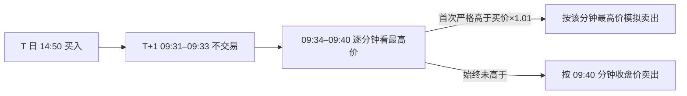

# 前三分钟不交易、随后逐分钟最高价触发的重算

## 明确纠正与结果

上一版说明把 **22 笔按 09:40 退出**误说成了“22 笔亏损”；实际旧规则下，34 笔买入中是 **19 笔盈利、14 笔亏损、1 笔持平**。本轮按用户重新明确的卖法重算，**不改模型、不改股票名单、不重训、不使用 15 分钟 K**。



达到条件时使用**首次达标的那一分钟最高价**，不是固定的 +1% 限价，也不挑全十分钟最高的一根。09:40 本身若首次达标，按该分钟最高价；否则按其收盘价。以下为 10 万元本金、第一名 60%/第二名 40%、实际交易单位、隔夜滚动复投的价格模拟。

| 模型与日期 | 信号日 / 入选 | 实际买入 | 新卖法期末资金 | 新卖法收益 | 旧卖法收益 |
| --- | ---: | ---: | ---: | ---: | ---: |
| 原固定七因子：全部训练外日期 | 21 日 / 42 只 | 34 | **96,314.51 元** | **−3.69%** | −3.30% |
| 原模型：两模型共同训练外日期 | 10 日 / 20 只 | 16 | 96,796.28 元 | −3.20% | −3.75% |
| 大盘形态分散训练的新模型：共同日期 | 10 日 / 20 只 | 19 | 98,649.70 元 | −1.35% | −3.15% |
| 新模型：全部自身训练外日期 | 21 日 / 42 只 | 41 | 90,032.94 元 | −9.97% | −10.95% |

共同日期的两模型结果可并排读；各自“全部训练外”的日期集合**不同**，不能直接用第一行和末行选优。新卖法没有把原模型的亏损变成盈利；新模型的共同日期也仍是亏损。

## 为什么“标签不错”仍可能亏

原模型全部训练外的 42 个前二名额，目标标签 **25 个强命中、9 个中性、8 个严重错误**。标签只要求次晨 **09:31–09:40 任一分钟最高价**曾超过买价 1%。按 10 万元与 60%/40% 的交易单位，实际买入其中 34 只，其中 22 只带强命中标签。把 34 笔实际买入按可交易观察窗口拆开：

先严格对齐原报告的**精确 1 分钟 K、七因子前二 24/40 与 8/40**：保存的 40 个标签用 14:50 买价与次晨十根分钟 K 最高价逐只重算，**40/40 分类一致**，原始涨幅与复算最大差 `4.68×10⁻⁹`。在同一批 40 只中，32 只按仓位实际买得起，标签和交易结果的交叉表如下：

| 原标签 | 共入选 | 实际买入后盈利 | 实际买入后亏损 | 仓位买不起 |
| --- | ---: | ---: | ---: | ---: |
| 强命中 `1`：前十分钟最高涨幅 >1% | **24** | 13 | **8** | 3 |
| 中性 `0`：最高涨幅 0.5%–1% | **8** | 3 | 3 | 2 |
| 严重错误 `−1`：最高涨幅 <0.5% | **8** | 1 | 4 | 3 |

因此 **8/40 严重错误**从来不等于“只有 8 笔会亏”；强命中的 8 笔也可能因达标时刻不可交易、之后价格回落而亏。反过来，最高价不足 +0.5% 也仍可能以小幅盈利卖出。10-08 的另外两只股票不在原表的 40 只里；它们使总名额变为 42、实际买入 34，新增一盈一平。[40 只逐股标签与盈亏对照](./exact_40_label_trade_reconciliation.csv)可直接筛选。

| 首次可卖条件 | 笔数 | 结果 |
| --- | ---: | --- |
| 09:34–09:40 曾达标 | 13 | 按首次达标分钟最高价卖；合计赚 **11,788.33 元** |
| 只在禁止交易的 09:31–09:33 曾达标 | 9 | 后续没再达标，按 09:40 退出 |
| 前十分钟始终未达标 | 12 | 按 09:40 退出 |

后两类共 21 笔，合计亏 **15,473.82 元**；34 笔净亏 **3,685.49 元**。新卖法下买入的 34 笔为 **18 盈、15 亏、1 平**。例如 **09-24 沪宁股份**次晨前十分钟最高价相对买价曾涨约 **3.48%**，但达标只发生在前三分钟；09:40 相对买价跌约 **3.67%**，这一笔亏 **2,162 元**。**09-22 克来机电**同样只在前三分钟达到约 +1.90%，09:40 跌约 4.20%，亏 **1,640 元**。这就是模型标签与本次交易窗口之间最主要的落差。

## 价格代理的边界与复现

一分钟 OHLC 的“最高价”证明当分钟曾有交易触及，却**无法证明我们能在看见该最高价后也按最高价卖出**。把首次达标分钟最高价直接当卖价，是偏乐观的上界情景；真实盯盘下单需逐笔成交或更细行情、下单延迟与排队信息。早于 09:34 的最高价和次日结果都未参与 T 日排名。历史 14:50 买价与次晨分钟线沿用已保存的精确一分钟底稿；10-09 分钟线来自原始 `kLineData` 一分钟接口。

[原模型全部逐笔](./old_all_trades.csv)、[原模型逐日资金](./old_all_daily.csv)、[共同日期旧模型逐笔](./old_common_trades.csv)、[共同日期新模型逐笔](./new_common_trades.csv)、[新模型全部训练外逐笔](./new_all_out_of_training_trades.csv)和[摘要/输入哈希](./summary.json)可复查。运行：

```bash
.venv/bin/python -m scripts.reprice_automl_first10_high_exit
.venv/bin/python -m pytest -q tests/automl/test_first10_high_exit.py
```
