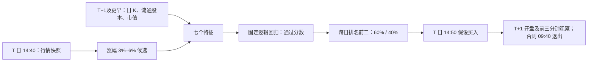

# 14:40 七因子模型：口径、使用与训练外资金回测

## 一页结论

固定模型用 **2026-08-25—09-21 的 20 个交易日、7,488 条精确 1 分钟股票日样本**训练一次。本报告不重训、不使用 7 月 15 分钟 K；只测试与训练日不重合的 **2026-08-05—08-24 中 14 日、09-22—09-30 中 6 日、10-08 中 1 日**。这些日期每天选前二名，共 21 日、42 个排序名额。

按 10 万元本金、第一名 60%/第二名 40%、14:50 分钟收盘价买入、次晨开盘及前三根 1 分钟收盘价首次**严格超过买价 1%**时按观察到的价格卖出，否则 09:40 分钟收盘价卖出，按普通 A 股整百股、科创板至少 200 股模拟：**实际买入 34 只，8 只买不起；期末 96,695.50 元，收益 −3.30%，逐日结算资金最大回撤 7.82%**。12 笔实际买入交易在前三分钟触发了卖出条件。42 个排名名额的次晨标签为 **25 个强命中、9 个中性、8 个严重错误**，其中 10-08 的两只已用 10-09 精确前十分钟最高价补标为 `1` 和 `0`。这是价格情景，不含真实下单、排队、滑点和手续费。

| 信号月份 | 信号日 | 月初资金 | 月末资金 | 该段收益 |
| --- | ---: | ---: | ---: | ---: |
| 8 月精确 1 分钟 | 14 | 100,000.00 | 99,571.88 | −0.43% |
| 9 月精确 1 分钟 | 6 | 99,571.88 | 96,009.50 | −3.58% |
| 10 月 8 日信号、10 月 9 日卖出 | 1 | 96,009.50 | 96,695.50 | +0.71% |

训练日与测试日**完全不重合**；8 月测试早于训练窗口，所以这是固定模型的历史留出检验，并非当时已经完成训练的前向实盘。模型结构与交易规则曾依据历史结果探索；这 21 天也不构成未经反复观察的独立未来验证。

## 基础思路与时间线



模型想排除次晨交易价值不足的候选。训练标签以 **T+1 日 09:31–09:40 的最高价 ÷ T 日 14:50 假设买价 − 1** 定义：`>1%` 为 `1`，`<0.5%` 为 `−1`，中间为 `0`。训练时把 `0`、`1` 合并为“通过”，把 `−1` 作为“严重错误”；因此模型分数是**非严重错误的未校准排序分数**，并不是“次晨超过 1% 的概率”，也不直接预测交易利润。每日直接取前二名，无最低分数门槛或空仓规则。

## 七个特征：计算与可用时间

| 特征 | 计算方式 | 可用数据 |
| --- | --- | --- |
| `signal_return` | 14:40 价格 ÷ 当时昨收 − 1；先用 3%–6% 筛候选 | T 日 14:40 快照；历史用完成的 14:40 一分钟 K |
| `volume_ratio` | 截至 14:40 的成交股数 ÷（前五日平均日成交股数 × 220/240） | T 日累计量；T−5 至 T−1 日成交量 |
| `turnover_so_far_pct` | 截至 14:40 的成交股数 ÷ T−1 流通股本 × 100 | T 日累计量；T−1 流通股本 |
| `float_mv_100m_cny` | T−1 流通市值 ÷ 1 亿元 | T−1 估值表 |
| `volume_4of5_increasing` | 前五日成交量中，存在任意四个按日期**严格递增**的子序列记 1，否则 0 | T−5 至 T−1 日 K |
| `ma_bull_5_10_20` | T−1 后复权收盘价 MA5 > MA10 > MA20 记 1 | T−20 至 T−1 日 K |
| `all_intraday_lows_above_ma` | 截至 14:40 的日内最低价高于三条均线记 1；均线换算至 T 日价格尺度 | T 日截至 14:40 的最低价及 T−1 历史日 K |

前四个连续值用训练集均值与标准差做 `z=(x−均值)/标准差`；后三个输入原始 0/1。曾有的“14:40 当前价格高于三条均线”与最后一项重复，现已删除。训练样本还要求此前连续 20 个交易日数据、流通数据完整，并排除历史复权价格基准明显断裂的记录。**T 日最终收盘价、14:50 买入价和次晨行情都不参与 14:40 特征或排序。**实盘可从 14:40 实时快照取得现价、昨收、累计量和日内低点；历史重建和卖出回测仍需对应时点的分钟数据。

## 模型结构与训练

模型是 `StandardScaler(四个连续特征) + LogisticRegression(C=0.2)`，其余三个二值特征不缩放。训练在 2026-08-25—09-21 的 20 个信号日上一次完成，目标为 `class != −1`；七因子模型文件冻结后用于所有下述测试日期。逻辑回归公式为：

`score = sigmoid(0.845884 + 0.053364 z(涨幅) − 0.177160 z(量比) − 0.068401 z(换手率) + 0.016327 z(流通市值) + 0.060883 四天量递增 − 0.131371 均线多头 + 0.140486 日内低点高于均线)`。

| 连续特征，依上式顺序 | 训练均值 | 训练标准差 |
| --- | ---: | ---: |
| 14:40 涨幅 | 0.040990 | 0.008244 |
| 量比 | 1.528231 | 0.806173 |
| 截至 14:40 换手率，% | 4.400397 | 4.088819 |
| 流通市值，亿元 | 155.854965 | 476.948791 |

系数是控制其他输入后的拟合方向，不代表因果。均线多头系数为负不等于“应选空头股”。模型哈希与原八因子重建核验见[冻结模型清单](../20261008_sina_15m_july/frozen_models_manifest.json)；本次加载版本一致，复算存档分数的最大误差为 0。

## 回测和交易执行口径

20 个既有精确折外日的前二名取自[存档排名](../20261008_sina_15m_july/exact_top5_two_models.csv)。10 月 8 日有 178 只[完整候选及精确特征](./20261008_exact_candidates.csv)，以**同一冻结七因子模型**重新评分，选出中国石油与中国石化；不沿用当天另一个八因子模型的排名。买价为各信号日 **14:50 完成的一分钟 K 收盘价**。此前 20 天的买价与次晨分钟线取自 `kingdomai.aiia_stock_realtime_minute_snapshot_full` 的精确、完成、非回退 1 分钟记录；10 月 9 日库内尚无一分钟记录，两只股票次晨 09:31–09:40 各十根由项目现有 `kLineData` 原始 **1 分钟接口**补取，并已保存选中股票的时点价格。10-08 的标签在模型排名完成后才用这些分钟线计算。全程没有使用 15 分钟 K。

每个信号日次晨卖完后，才将资金滚入下一信号日；训练窗口内不交易，期间资金保持现金。每次用期初权益的 60% 与 40% 固定分配，不把买不起的一侧资金挪给另一侧。普通 A 股按 100 股整数倍，688/689 股票首次至少 200 股、之后允许 1 股递增；8 个名额因对应预算不足而**不成交**。上午卖出按以下顺序取第一个观测到的价格：09:31 首根 K 的开盘价、09:31/09:32/09:33 三根 K 各自的收盘价；其中首次**严格大于**买价 ×1.01 就按该观察价卖出。若均未触发，按 09:40 分钟收盘价卖出。没有把一分钟最高价当成成交价；一分钟收盘价仍只是实际可成交价的代理。

本回测 42 个排名名额中实际买入 34 个，前三分钟实际触发 12 个。若以后改成实时挂 1% 限价、分钟内最高价触及即卖、允许不足整手或使用不同资金，这将是**另一套交易口径**，不能直接套用此收益。未计手续费、印花税、滑点、涨跌停委托限制及冲击成本，故 −3.30% 也不是实际账户净收益。

## 使用与复现

14:40 运行[行情扫描脚本](../../../scripts/benchmark_automl_1440_inference.py)可获取候选并评分；前提是实时行情覆盖全池且请求位于 14:40 时间窗。该脚本目前输出前五供人工查看，没有自动下单。其 2026-10-09 09:54 演练全流程约 4.14 秒，但那次不在 14:40，只验证性能，不给出当时可交易名单。

本报告可用[资金回测脚本](../../../scripts/backtest_automl_seven_factor_oos.py)复现。它需要上述本地已构建的精确候选 CSV 和授权数据库环境文件；10 月 9 日两只股票分钟线由原始接口读取。复现命令：

```bash
.venv/bin/python -m scripts.backtest_automl_seven_factor_oos --env-file /path/to/authorized/.env
.venv/bin/python -m pytest -q tests/automl/test_seven_factor_oos_cash.py
```

[逐日资金](./daily.csv)、[逐笔交易](./trades.csv)、[所用分钟价](./selected_1m_bars.csv)、[摘要与日期清单](./summary.json)给出核查底稿。后续如更改训练日、阈值、卖出时点、仓位或数据源，应分别生成新实验，不覆盖这份固定结果。
