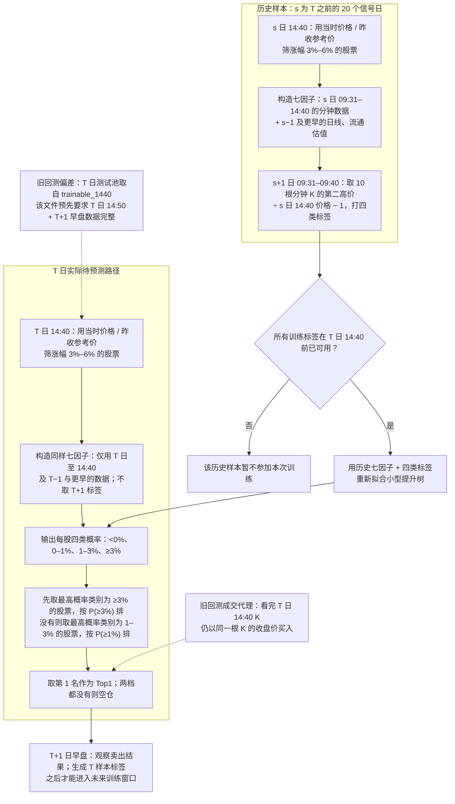

# 14:40 四分类滚动流程与时间可得性核查

口径：原 3%–6% 股票池、七因子、前 20 个信号日滚动训练、未加权小型提升树；延续原样本，不新增历史 ST 或涨停剔除。原构建器仍会按行情名称中的 `ST` 排除一部分股票，不能把“原样本”称为完全不筛 ST。当前四分类代码是**历史逐日回放**，尚无与之相同的实时 14:40 滚动训练和推理入口。

设今天的信号日为 **T**，历史训练样本的信号日为 **s**（只取 T 之前最近 20 个信号日）。图中的“14:40”指该分钟 K 已结束且已取得完整数据之后。

| 环节 | 已有代码所用数据 | 在 T 日 14:40 的判断 |
|---|---|---|
| 历史选样 | 每个 s 日 14:40 分钟价、s 日昨收参考价；涨幅 3%–6% | 价格值当时可知；回放从 s 日日线行取得昨收，须核对该行是否作为实时数据源存在 |
| 历史七因子 | s 日至 14:40 的 220 根分钟 K；s−1 日流通市值、流通股本及截至 s−1 的 20 日价格、5 日成交量 | 未见使用 s 日收盘价或未来价格计算七因子；历史复权数据和估值的当时版本、实际到达时间未留存 |
| 历史标签 | s+1 日 09:31–09:40 十根分钟 K 的第二高价 / s 日 14:40 价；四档为 <0%、0–1%、1–3%、≥3% | 对最近训练日 s=T−1，其标签在 T 日 09:40 后才产生，理论上可在 T 日 14:40 训练；数据库没有证明入库早于 14:40 的记录 |
| 训练 | 每个测试日仅用此前 20 个信号日；`fit` 只接收历史七因子与标签 | 日期切分正确；T 日标签没有进入 `fit` |
| T 日选样与特征 | 旧回测复用已带完整标签条件的 `trainable_1440`；另一个实时报价基准脚本能按当时行情筛股票，但加载的是其他冻结模型 | **旧回测测试池有未来完整性筛选**；尚无等价的四分类实时全流程 |
| T 日推理、Top1 | `predict_proba` 只接收 T 日七因子；先按预测类别 ≥3%、不足再顺延 1–3%，各档内按概率排序，可空仓 | 模型输入和排序本身未读 T+1 真实标签；测试池问题会影响其历史评估 |
| T 日买入价 | 回测用已用于选股和特征的 14:40 分钟收盘价 | **同一分钟收盘价成交不可保证**；需用得到完整 K 之后的下一可执行报价或成交价验证 |

## 已确认的偏差与边界

1. **测试池受到未来数据影响。** 四分类实验从 `exact_1440_to_close9_candidates.csv.gz` 读入全部测试行；该文件由四份 `trainable_1440.csv` 合并而来。原构建器写 `trainable_1440` 时要求 `label_complete`，后者要求 s 日 **14:50** 分钟价和 **s+1 日**早盘数据完整。14:50 并非本四分类标签所需，却仍成了原候选池的前置条件。当前重新构建的 3%–6% 宽池子集里，14,783 条七因子完整的股票日中有 59 条次晨数据不完整（后 20 个测试日中 39 条）；这个数字只证明问题确实存在，**不是**原 14,292 条底稿的精确漏选数，因为两次构建的其他入池规则也不同。缺次晨数据的股票可在评价时标为结果未知，但不能在 T 日 14:40 提前从推理池剔除。
2. **回测的买入成交有同根 K 偏差。** `entry_1440` 等于七因子使用的 14:40 收盘价。必须等该分钟结束、数据传到程序并完成训练与推理，才知道买谁；此时不能保证仍按刚看完的收盘价买到。旧 Top1 的 09:40 平均收益因此只是该价格代理下的历史数字，不能认作可直接执行的收益。
3. **时间戳证据尚不充分。** 历史分钟数据检验 `source_snapshot_time=bar_end_time` 和 `is_finalized`，但不检验真实入库/可读取时间；实时报价基准 API 也没有交易所行情时间戳。日线复权值及流通估值没有保存 T 当时的版本快照。因此可以说“字段按业务时间不取未来”，不能证明“14:40 实际已经全部可读”。
4. **模型代码仍是回顾性实验。** `experiment_automl_second_high_four_class.py` 完成逐日训练、打分；`audit_automl_four_class_decisions.py` 在这些分数上选 Top1/Top2。`benchmark_automl_1440_inference.py` 的实时入口加载另一套冻结的七因子模型，不能作为本四分类滚动模型已实盘运行的证据。

要做严格的 14:40 回测，应把“当时可见的候选和七因子”与“事后补齐的标签及卖出结果”分开保存：训练只取当时已成熟的历史标签；T 日推理池只由 T 日 14:40 及以前的数据决定；成交用信号形成后的可执行价格重新计算。这个修正不要求改变当前对 ST 的决定。

主要代码：[候选和特征构建](../../../scripts/build_automl_tail_standard.py)、[旧底稿来源](../../../scripts/build_automl_close9_target.py)、[四分类滚动训练](../../../scripts/experiment_automl_second_high_four_class.py)、[Top1 顺延规则](../../../scripts/audit_automl_four_class_decisions.py)、[实时基准入口](../../../scripts/benchmark_automl_1440_inference.py)。

## 模块边界与实时数据源（2026-10-10 核对）

主线可分为：**选训练样本 → 生成训练特征 → 生成标签 → 滚动训练 → 选 T 日待评估集合 → 生成 T 日特征并推理 → 选 Top1/Top2 → T+1 验证及回填**。训练样本和 T 日待评估集合应各自保存选样时点与来源，标签与结果只在事后追加。

原七因子在 **T 日无需查分钟 K 表**。批量实时行情接口提供当前价 `fNowPrice`、昨收参考价 `fClose`、截至当前累计成交量 `lVolume`、截至当前当日最低价 `fLow`；再连接 T−1 及更早的日线和 T−1 流通市值、流通股本，就能计算七因子。这里的“当天行情”必须是当时的**实时快照**，不能用收盘后才完整的 T 日日线代替。历史训练特征仍需历史信号日的分钟 K 复原 14:40 快照，标签需要每个信号日次晨的 10 根分钟 K。实时接口未给出交易所行情时间戳，批量请求跨数秒，需记录每批请求与返回时间，并在真正 14:40 运行时验证其对应时点及与历史分钟口径的一致性。

只读检查本库时，最近交易日 2026-10-09 各表记录数：`kcrp_stock_price` **5,573**、`kcrp_stock_pricevaluate` **5,652**、`kcrp_stock_moneyflow` **5,210**；`kcrp_stock_margintrade` **尚无 10-09**，最新 10-08 为 **4,454**。对 2026-09-01 至 10-08 共 22 个已能检查“下一交易日 14:40”的交易日，四表各日现存行的最晚 `create_time` 都早于下一交易日 14:40。这是近期到达时间的支持证据，不能保证未来每一天都如此，也不能把未覆盖的股票当成数值零。10-08 数据在 10-09 14:40 前已经创建的分别为日线 5,572、估值 5,652、资金流 5,209、两融 4,454；估值有 31 行、两融有 12 行的**现存版本**后来仍被更新，因此旧版本不能完全按当前表重放。

资金流和两融均**不是当前七因子的输入**。若以后加入它们，应分别核对 T−1 到达时间和股票覆盖；两融尤其不能预设每天在 T 日 14:40 前已经齐备。2026-10-09 的两融数据在本次 10-10 检查时还未入库，下一交易日是否赶得上 14:40 仍待实际确认。
