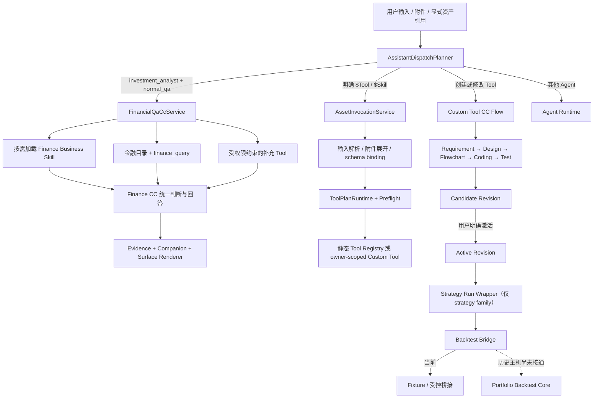

# Fin Agent 全体系串联审计（2026-08-02）

本文清点 Agent 主控、金融问答、Tool、自定义 Tool、Skill、策略运行与回测的真实连接状态。结论只区分已经实现、受控纵切面、仅协议/fixture 和尚未接通，不用“有类名或有页面”代替可用性证明。

## 1. 当前主线



主线符合 `SOFT → HARD → SOFT`：LLM 负责理解和业务方法选择；稳定协议只持有 Agent、turn mode、资产身份、revision、owner、运行输入和证据引用；最终回答和展示仍由 CC 与 Renderer 场景化完成。

## 2. 能力清点

| 体系 | 当前真实状态 | 可以依赖的能力 | 不能宣称的能力 |
|---|---|---|---|
| 顶层路由 | 已实现 | LLM 语义路由；`normal_qa / system_operation / tool_development`；专业 Agent 优先、兜底 Agent 最低优先级 | 不能把普通金融问题当显式系统操作 |
| Finance CC | 已实现 | 会话续接、warm pool、业务 Skill 按需选择、金融目录、结果 working set、进度事件、统一回答 | 生产多实例 session ownership 与配置发布尚未完成 |
| 金融查询 | 已实现 | subject/dataview 精准目录读取；单次 flow 多步骤；交易日解析；结果索引与证据；表格/K 线 Renderer | 不保证所有问题一次调用；不能用空值触发无依据的换 API 重试 |
| 静态 Tool | 已实现 | 当前 50 个有效 Definition 中 24 个 planner-visible；Active Registry、运行目标校验、Preflight | `tool_hub.json` 仍是兼容资料，不应成为第二权威状态 |
| 自定义 Tool | 已实现的开发纵切面 | Design/Coding/Test、candidate revision、owner scope、显式 activation、Tool profile | Action Tool 仅设计，不执行/发布；历史 revision 回放未接通 |
| 显式资产调用 | Tool 已接通，Skill 部分接通 | `$Tool` 模糊发现、附件/列表输入编排、并行 ToolPlan | `$Skill` 目前只覆盖 legacy compiled Skill，不覆盖 11 个 Finance Business Skill |
| Finance Business Skill | 已实现的方法层 | 11 个自然语言业务方法，CC-native 按需加载，Tool grant 交集 | 未纳入统一发布 revision；reference 尚无受控按需读取器 |
| Legacy Skill | 兼容层 | `stock_deep_dive`、`quant_factor_screening` 可由 SkillRunner 执行 | 不应继续扩张；与新业务 Skill 有能力重叠和权限模型差异 |
| Strategy Wrapper | 已实现 | `as_of`、lookback、single/batch/market scope、并发包装，不污染用户策略核心逻辑 | market scope 的历史 universe 目前不能直接用于可信回测 |
| 回测账本核心 | 已实现 | 日频长仓组合、D 收盘决策/D+1 开盘成交、现金/持仓/费用/滑点/指标/指纹 | 不是完整 A 股生产回测：公司行动、容量、历史状态、快照仍缺 |
| 买入并持有 | 真实数据纵切面 | 交易日历 + KingdomAI 日线，最多 10 股、最长 3 年 | 仍是同步入口，缺用户级运行治理 |
| 自定义策略回测 | 仅协议/fixture | ranked selection → Top-N 等权组合的桥接协议与测试 | 没有 owner+revision+point-in-time 历史执行主机，不能开放产品入口 |
| `/backtests` 页面 | 静态 DEMO | 展示 Event Study 产品概念 | 不是后端 Portfolio Simulation 的真实结果 |

## 3. 应当保持的权威边界

### 3.1 Tool

1. 静态 `*.tool.json` 与 Custom Tool manifest/revision 是资产事实。
2. Active Tool Registry 是由资产事实和可执行目标编译出的 planner snapshot。
3. `TOOL_REGISTRY` / Custom Tool Runtime 只负责定位真实 executor。
4. Preflight 在执行前校验 active、sync、owner 和输入契约。
5. `tool_hub.json` 只保留兼容检索说明，不能独立决定 active 状态。

本次实测 Active Registry 与 `$` Tool picker 都返回同一组 24 个静态可调用 Tool，当前没有可见性漂移；但两边仍各自读取文件并实现判断，后续应由同一个不可变 snapshot 供给。

### 3.2 Skill

- Finance Business Skill 是 CC 的业务方法，不是另一个回答 Agent；加载 Skill 后，Finance CC 仍持有会话、Tool 选择和最终回答。
- compiled Skill 才是可以独立提交异步执行的资产。
- 显式 `$业务Skill` 的合理语义是进入 Finance CC `normal_qa` 并强提示该方法，不应误入 legacy SkillRunner。
- 有副作用的 Tool 未来即使写进 Skill，也必须由系统权限交集阻止；不能仅相信 Skill 文本。

### 3.3 Strategy 与 Backtest

- 用户设计策略时只表达核心输入、判断和输出，不承担 single/batch/market、并发、`as_of` 和 lookback 的运行复杂度。
- Wrapper 负责运行口径；Backtest Adapter 负责把策略输出翻译为目标组合；账本核心只消费目标组合与市场数据。
- 回测必须同时固定 owner、asset revision、effective date、universe timeline 和 data snapshot。缺一项就只能称 fixture 验证，不能称历史回放。
- analytics/signal 的事件后收益评估与 strategy/portfolio target 的组合账本必须作为两种产品模式展示。

## 4. 本次确认并修复的主线问题

1. **重复运行追踪**：ToolPlan 外层与 `run_tool` 内层对同一次静态 Tool 调用各记录一次。现已由 ToolPlan 持有该路径的唯一 invocation lifecycle；直接 `run_tool` 仍保留原追踪。
2. **Thread 跨 owner 复用**：三个写路径此前接受已知 `thread_id` 后直接读取上下文和写 turn。`ensure_thread` 现在先校验 owner；missing 与 foreign ID 返回同一拒绝信息。
3. **Attachment 跨 owner 读取**：附件元数据虽保存 owner，但读取未校验。现在 chat 与显式资产调用使用 owner-scoped strict batch，混入缺失或 foreign attachment 会整体拒绝。
4. **Legacy Skill 空权限失效**：显式 `allowed_tools=[]` 过去会回退自动选择。现在只有 `None` 才委托 selector，空列表稳定表示 deny-all。
5. **会话语义被压空**：回答摘要过去只有“本轮已完成”，上下文又截成 10 字。现在 sync/stream 都保存约 360 字的确定性语义摘要，显式资产也能读取真实 `role/text` 历史。
6. **正式答案被日志截断**：Finance CC 返回对象过去复用了 2000 字日志副本。现在业务结果完整返回，仅 observability JSONL 保留有界副本。
7. **首轮重复语义调用**：不存在前文、附件引用或活动工作流时，ContextResolution 过去仍调用一次 LLM。现在直接保留原问题，只让顶层 LLM 判断 Agent 与 turn mode。
8. **冷 client 缺少工具进度**：Finance CC 首次创建 client 时过去把 Tool Runtime 绑定到空 event sink。现在 cold、prewarmed、reused 三条路径都在本轮开始时绑定真实进度通道。

这些修改都位于系统 HARD 边界，不改变金融业务、Tool 输入输出、Skill 方法或策略逻辑。

## 5. 尚未实施、已落盘的任务

- Backtest：见 [development_tasks/backtest_system.md](development_tasks/backtest_system.md)。
- Skill：见 [development_tasks/skill_system.md](development_tasks/skill_system.md)。
- Agent/Finance QA/多用户运行：见 [development_tasks/agent_runtime_and_financial_qa.md](development_tasks/agent_runtime_and_financial_qa.md)。

执行优先级不是按页面，而是按可信链路：

```text
所有权与权限
  → 不可变资产 snapshot / revision
  → point-in-time 历史主机
  → 动态 universe 与数据 snapshot
  → 用户级异步运行治理
  → 产品入口与 Renderer
```

## 6. 验证边界

- 本轮最终全量后端回归：`864 passed, 27 skipped`；新增主线窄测另行覆盖 owner、语义上下文、cold client 进度、完整回答和单次 Tool invocation。
- 本文的“真实实现”来自代码调用链和对应单元/集成测试，不代表生产容量验证。
- Finance Business Skill 的既有测试主要证明结构、入口和权限声明，不代表回答质量全部通过。
- 自定义策略回测的现有测试使用受控 runner/fixture；本文明确不把它当真实 Custom Tool 历史回放。
- 服务启动、真实数据库全链路和浏览器视觉回归应在代码回归通过后独立执行；不能用静态检查替代。
