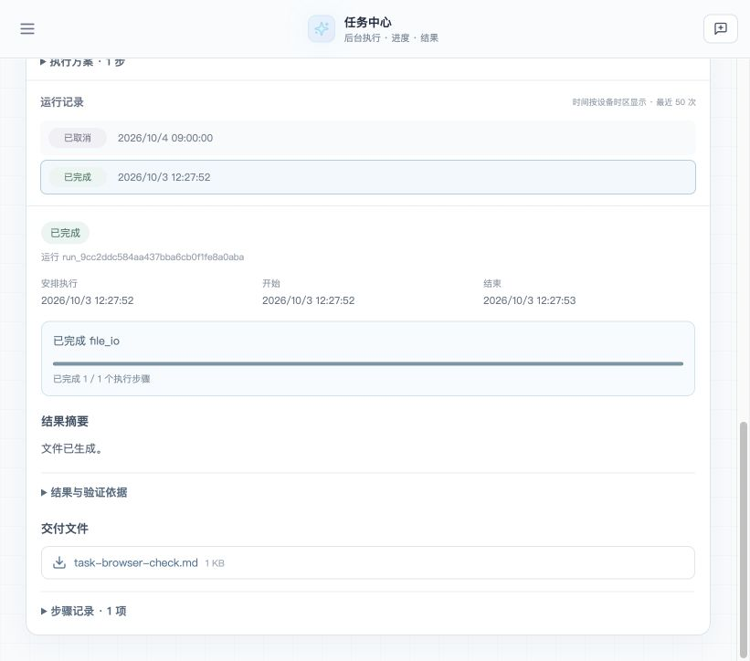

# 用户任务系统落地验收 · 2026-10-03

本轮把原有定时任务扩展为通用用户任务系统，并接入独立股票 AutoML。外层管理任务定义、运行、身份、依赖、预算、取消、恢复和结果；业务层负责研究口径、样本、训练、回测和解释。当前使用方式见 [运行文档](../../scheduled_task_runtime.md)，研究数值及口径见 [ML 验收](README_ML.md)。

## 完成的主线

- 自然语言提交任务，保存完整要求、可执行计划和预算；立即、预约一次、周期共用同一持久化队列。
- 独立 worker 监督子进程，支持运行取消、截止时间、租约 fencing、步骤检查点、失联恢复和派生进程清理。
- 可信聊天工具 `task_submit / task_get / task_list / task_cancel` 返回同一任务中心入口。
- 统一任务中心展示目标、安排、执行方案、进度、运行历史、摘要、指标、报告和文件；可停止某次运行、重新运行或暂停周期安排。
- AutoML 完成自然语言研究设计、实际分类/回归训练、开发折评估与回测、固定公司和未来时段盲测，以及大模型评审。未达标研究仍交付完整证据。

## 实际验证

验证采用隔离 SQLite、真实 spawn worker 和固定测试身份，不修改远端系统数据库。真实行情仅由 KingdomAI 读取；提交进仓库的是聚合指标、研究配置和评审，未提交行情面板、逐行预测、模型二进制或凭据。

| 范围 | 实际覆盖 | 证据 |
|---|---|---|
| 协议与执行 | 立即/预约/周期、幂等及冲突、跨 owner 拒绝、并发领取、租约过期、取消、超时、进程组清理、恢复、文件权限 | `tests/test_user_task_runtime.py`、`tests/test_scheduled_tasks.py`、`tests/test_user_task_tools.py` |
| 多步通用任务 | 写 Markdown → 引用文件 → 读取核对；每步结果及文件 HTTP 下载 | `scripts/eval_user_task_runtime.py` |
| 合成 ML | 自然语言与结构化输入，分类和回归均实际训练，公司及时间留出，报告下载 | `runtime_demo.json` |
| 真实 ML | 2024—2025 年、16 股、1/3/7 日、8 次候选实验、两轮/两折、留出回测及评审 | `runtime_kingdomai.json`、`kingdomai/` |
| 真实模型聊天工具桥 | 三轮提交 → 查询 pending → 取消 cancelled，300 秒预算、单任务单运行及跨 owner 隔离 | `chat_verification.json`、`chat_manifest.json` |
| 浏览器 | 自然语言预约次日 9 点、5 分钟预算、提交、取消、再次运行、实际生成及下载文件、深链接刷新恢复；读取 ML 汇总结果 | `ui_cancelled.jpg`、`ui_completed.jpg` |

浏览器使用 localhost 的显式评估身份，不能作为生产登录验收。聊天工具桥使用真实模型和正式工具处理器，但不是完整 HTTP/DSH 对话链。

最终相关回归 **269 项通过**，前端 **156 项通过**，TypeScript 与 Vite 构建通过。全仓运行实际为 **2364 passed / 11 failed / 27 skipped**：10 项已用改动前源码复现，另 1 项是下文的进程启动时序测试问题；修正测试后重跑上述 269 项全部通过，未再重跑整仓。完整统计、命令、源码及日志哈希见 [verification.json](verification.json)。



## 验证中修复的问题

1. 共享 LLM 客户端未识别现有 `LLM_KEY` 配置，导致自然语言任务编译失败：补齐兼容解析及回归。
2. 用户“最长 5 分钟”只写进解释文字、没有进入预算：在编译输出契约中明确可执行预算，真实复验持久化 300 秒。
3. 领域规划把“逻辑回归与 Ridge”只编译为 regression：明确算法族与目标任务的正交关系，复验两类任务均训练。
4. 文件工具原本接受任意本机路径：任务适配层将文件读写限制到当前 Run，增加跨任务、路径越界回归。
5. 子进程主进程退出后可能遗留派生进程：监督器在退出时清理整个进程组，并增加真实子进程验证。
6. 历史分钟信号单测依赖进程内 monkeypatch：在该测试注入真实 registry runner；真实 spawn 生命周期另由进程测试覆盖。
7. LLM 评审对少量信号措辞过强，并建议已经实施的处理：补充执行方法事实及解释口径，独立重做评审，保留原数值与前后报告。
8. 全仓运行时，两秒预算测试可能在子进程启动前正确触发超时，却错误地要求启动标记一定存在：测试改为观察到真实子进程启动后再使持久化 deadline 过期，核验终止和失败状态；不改变运行器。

## 复现

```bash
python -m pip install -r requirements-automl.txt
python scripts/eval_user_task_runtime.py --llm --kingdomai
python scripts/eval_user_task_chat.py --allow-bridge-fallback
```

`--llm/--kingdomai` 使用本机配置的真实模型服务；后者读取真实行情。默认不启动长期服务。若要在本地任务中心查看某次评估，可以启动明确隔离的评估服务：

```bash
python scripts/eval_user_task_runtime.py \
  --serve-existing outputs/task_runtime_eval/某次运行目录 \
  --serve 22153 --ui-origin http://127.0.0.1:22154
```

另一个终端在 `frontend/` 执行 `VITE_API_TARGET=http://127.0.0.1:22153 npm run dev -- --port 22154`，打开 `http://127.0.0.1:22154/?view=tasks`。此入口仅供本机评估；正式工作台继续使用正常 session。

## 尚未验收的边界

- **MySQL 发布 NOT_READY**：未执行生产 schema 变更、真实 MySQL 并发联调、容量/长稳、备份恢复或部署。SQL 与升级脚本已提供，生产操作遵守人工 Gate。
- **完整 DSH 对话 NOT_READY**：实际尝试被本机缺失 DeepSeek Harness SDK/源码阻断，见 `dsh_unavailable.json`。真实模型工具桥不能替代该入口验收。
- **全仓默认质量门未通过**：全仓存在已在改动前 HEAD 源码复现的失败；测试统计和失败分类另见 `verification.json`。不据此宣称全仓或生产质量门转绿。
- 运行器管理可信业务代码及进程生命周期，未实现恶意代码安全沙箱、每用户总 CPU/磁盘配额或远端副作用回滚。步骤恢复是至少一次语义，外部写工具需自行幂等。
- 上传文件/跨任务文件交接、外层动态循环分支、旧模型在新窗口的自动同口径比较尚未实现。旧 `/api/tasks` 异步 Skill 历史未迁移到新任务中心。
- 股票研究未发现满足全部筛选条件的模型。数值结果及局限必须结合阅读，不能从“任务已完成”推出存在可交易优势。

运行证据包含基线 commit 和修改中文件的 SHA-256；`verification.json` 记录最终实现提交、测试环境及覆盖范围。文档或截图不替代目标部署环境的验收。
