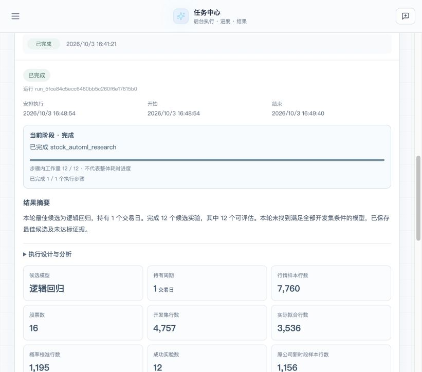

# 任务中心与 AutoML 前端验收 · 2026-10-03

本轮通过真实前端完成自然语言规划、创建任务、后台研究、再次运行和结果查看，并据此改进预览、进度与报告。两次运行都完成了 12 个候选实验；没有候选满足全部研究条件。执行完成与研究达标是两个不同结论。

入口：[交互原型源码](prototype.html)、[两次运行与验证来源](provenance.json)、[第一次检查](first-run-checks.json)、[第二次检查](second-run-checks.json)。本目录只保存聚合检查、报告示例、原型和截图，不包含行情面板、逐行预测、模型二进制、SQLite 或凭据。

## 实际走过的流程

本地前端连接隔离的任务服务与 SQLite，使用显式认证 fixture；行情从真实 KingdomAI 库只读获取，研究规划及评审调用真实 LLM，并非模型服务 mock。该入口没有验证生产登录、生产数据库写入或部署。

浏览器实际完成了：输入自然语言要求 → 生成并查看方案 → 创建执行 → 观察后台进度 → 打开完整报告 → 再次运行 → 切换历史记录 → 刷新后保留旧运行选择 → 切回第二次结果。长任务要求可以展开查看尾部约束。核对时刻的控制台 warn/error 列表为空；这不代表已记录初次完整加载全过程的控制台情况。

任务要求为 2024—2025 年日 K、16 家公司、1/3/7 个交易日持有期、分类与收益回归、逻辑回归/Ridge/决策树、最多 12 个候选、两轮及两个时间验证折。阈值、交易成本及运行预算随任务保存。第二次的 14 项关键约束逐项通过核对，完整研究配置和面板哈希也与第一次相同；候选由 LLM 规划，实际搜索清单可能不同，不能将相同输入等同于规划完全确定。本轮没有修改训练或候选选择算法，因此最佳候选从 3 日变为 1 日不能用作“报告修复改善或恶化模型”的对照实验。

| 实际运行 | 第一次：创建并开始 | 第二次：再次运行 |
|---|---|---|
| Task run | `run_e411b8894b02421bbc0b30913d9b18c9` | `run_5fce84c5ecc6460bb5c260f6e17615b0` |
| 后台运行耗时 | 88.38 秒 | 46.17 秒 |
| 候选结果 | 12/12 可评估，无完全达标模型 | 12/12 可评估，24 个验证折，无完全达标模型 |
| 最佳候选 | 3 日逻辑回归 | 1 日逻辑回归 |
| 原公司后续时段 | 3 个信号、2 条买卖成交记录；组合收益 0.45% | 0 信号、0 成交；组合收益 0% |
| 新公司后续时段 | 0 信号、0 成交 | 0 信号、0 成交 |
| 交付文件 | 10 个下载成功，记录 SHA-256 | 10 个 HTTP 200，大小与清单一致，记录 SHA-256 |
| 报告示例 | [原报告](first-run/report.md)、[原 LLM 评审](first-run/review.md)、[数值证据](first-run/report.json) | [报告](second-run/report.md)、[原 LLM 评审](second-run/review.md)、[数值证据](second-run/report.json) |

两次使用同一历史数据窗口，均覆盖 7,760 行、16 家公司及 485 个交易日。这是流程复验，不构成新的盲测证据。第二次提交到结束为 46.61 秒，其中排队约 0.44 秒；报告中的 `elapsed_seconds=16.75` 是保存数值报告之前的部分研究计时，不含随后 LLM 评审，也不等于用户体验的总耗时。

## 界面与流程改进

- 预览使用已有工具中文名称，保留完整自然语言约束；相同任务要求不再重复展示。长要求与详情标题默认两行概览，展开可读完整原文，确认按钮区域保持清晰可达。
- 创建后进入所选任务详情。列表使用中性的执行安排图标，真实运行状态与“周期安排已启用”分开表达。
- 展示当前阶段、步骤内工作量和外层执行步骤，不把候选完成比例包装为整体耗时百分比。完整报告前置，长篇限制可展开查看。
- 数值报告改为先给研究结论，再展示样本划分、预测损失、信号与组合回测。特别说明信号数不等于成交数、买卖记录不等于完整交易次数，以及零成交时的零收益不代表预测正确。
- 第二次观察到候选计数在轮次边界暂时滞后；随后补充每个候选结束时的进度更新及下一轮最新计数。该修复已通过受控回归，**没有为此再执行第三次真实训练**。

真实应用本轮只验证默认约 821px 宽度。下述窄屏检查属于独立交互原型，不能替代真实应用的移动端验收。

## 原型表达的完整过程

[prototype.html](prototype.html) 保存了本次可交互原型的原始片段：任务需求 → 研究设计 → 后台进度 → 模型训练 → 时间验证 → 解释与剪枝 → 冻结与留出 → 研究报告 → 历史与后续。

九个阶段表示用户查看过程的组织方式，不是新增的后台状态机。现有任务可以自动完成规划、训练、收益回归、验证、回测及 LLM 汇总；模型内部解释与剪枝已有离线审计，**尚未接入自动任务阶段**。原型对此已明确标注，后台阶段进度也是示意，而非实时训练。

原型中的示例指标来自先前 **7 日模型及离线解释/剪枝审计**，不是本次真实运行的 1 日或 3 日结果。切勿把原型显示的历史信号、收益或剪枝结果归入上述两次任务。

已点击九个阶段、切换线性模型解释、查看报告的三个标签，并验证“所有任务”入口与非 ML 通用任务结构按钮。外层视口 320/736/1024px、对应内部内容宽度 273/689/977px 时未出现页面横向溢出；桌面与窄屏分别使用阶段导航和下拉选择。

## 仍需复核的语言评审

机器生成的 `report.json`、开发评估和样本计数是数值事实依据。LLM 解释没有通过“全文无错误”的验收，原文保留，不以修改原报告掩盖问题。

第一次评审将 `+0.87%` 与 `-0.33%` 的 Brier 改善统称为“两片均为负”，存在直接的符号矛盾。第二次主要数字、最佳候选、零信号及未达标结论与证据一致，但仍有以下口径问题：

| 第二次原文问题 | 应采用的解释 |
|---|---|
| “重叠样本（同一交易日多个持有期信号）” | 单个候选固定一个持有期；应解释相邻日期样本的未来持有区间可能重叠。 |
| 用“部分候选信号数不足 15”解释“少量成交记录” | 信号数量和买卖成交记录数量是两个指标，需要分别陈述。 |
| “无法产生超越基准的收益”范围过宽 | 空仓 0% 低于原公司基准 5.80%，高于新公司基准 −1.12%；后一差异不能证明模型预测能力。 |

本轮保留这些问题及原始 SHA-256，没有针对每句话继续堆提示词或触发新训练。任务链路可以交付有效的否定性研究结果，但评审自然语言仍需结合数值证据复核。

## 验证范围与版本边界

两次真实运行的基线 HEAD 都是 `8d2c22adaeb8b99498170a19b398978609ff1078`，且均记录 `working_tree_dirty=true`。第一次使用报告修改前的实现；第二次已经包含报告展示修复，但**未包含随后完成的进度边界修复**。各次研究的实现哈希、面板哈希、版本及时间见 [provenance.json](provenance.json)。这两次运行不能宣称绑定最终提交后的整套实现。

| 检查 | 结果及作用域 |
|---|---|
| `OMP_NUM_THREADS=1 OPENBLAS_NUM_THREADS=1 .venv-automl/bin/python -m pytest tests/automl -q` | 56 passed，33.51 秒；范围为 `tests/automl/`，包含报告、模型审计、任务集成及进度边界测试。 |
| 在 `frontend/` 执行 `npm test -- --reporter=dot` | 27 个测试文件，163 项通过。 |
| 在 `frontend/` 执行 `npm run build` | `tsc -b` 与 Vite build 通过；仍有既有 chunk size 提示。 |

进度测试控制候选评估结果，覆盖全部成功、第 6 个候选失败、第 12 个候选失败；最终训练、检查点及报告保存仍实际执行。它验证计数边界，不替代第三次真实前端训练。此次未重新跑完整仓库测试，也未验证生产登录、MySQL 部署、并发容量、长稳或恢复；本记录不作生产就绪结论。
