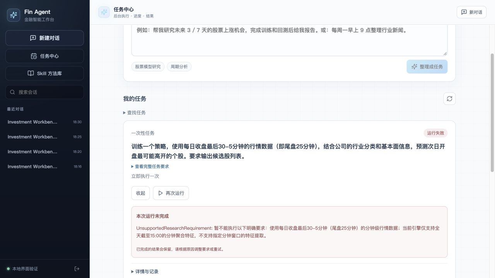

# 尾盘行情预测次日高开：真实界面验收

**业务验收未通过：当前引擎不能训练用户要求的指定分钟窗口与次日高开目标。** 本轮实际通过任务中心和完整主聊天界面提交用户原话、观察后台状态、查看执行输入、查询失败原因，并修复过程中暴露的需求传递问题。没有该策略的已训练模型、胜率或回测结果。

用户原话：

> 我希望你帮我训练一个策略，用每天收盘的最后30-5分钟的行情 以及公司的行业，基本面等信息 来找出第二天开盘最可能高开的个股

## 环境与范围

日期为2026-10-03。完整主聊天使用正式 React 页面、`/api/chat` 路由、真实 CC 模型、真实任务工具和独立 worker，前端22157、后端22156。仅身份、会话存储和个人 Skill 注册使用本地测试适配器；系统数据库禁用，任务保存到隔离 SQLite，标题生成省略。DSH SDK在本机不可用，DSH只有协议回归覆盖，不冒充真实DSH验收。

任务中心22154/22153是此前的隔离任务API环境，同样使用真实LLM规划和worker。首次任务曾尝试只读加载行情，但分钟特征不可用；后续能力拒绝发生在数据加载和训练之前。没有生产登录、生产写入或部署。基线为 `766aa2e`，运行时包含本轮未提交修改；各次实测对应不同修复阶段，不声明全部绑定最终干净提交。

## 发现与修复

| 实测问题 | 处理及证据 |
|---|---|
| “每天的行情”被误解成工作日16点定时执行，并自行加了全市场 | 任务编译提示区分数据频率与任务执行安排。原话复测变为一次性，原错误周期仅预览，未创建。 |
| 原领域规划把高开写进设计，却仍使用持有期收益标签 | 明确已有标签、分钟窗口和可用特征的能力边界；编译阶段启用模型推理。保持已有 unsupported_requirements 路径，训练前拒绝不支持要求。 |
| 主聊天把“训练策略”送进工具开发流程 | 两个入口提示按业务结果与可复用工具资产区分。错误回合被中断；随后原话真实进入 task_submit。 |
| 聊天擅自添加指标、算法、0.5%门槛，后来还把14:30写成14:00 | 系统将鉴权后的本轮原文传给任务工具，聊天调用不必重写 instruction；模型只补前文已确认的 context。旧直接调用兼容。最终任务输入指纹与原话完全一致。 |
| 失败原因隐藏在记录中 | 失败卡片直接显示原因，记录和完整报告仍折叠。 |

任务中心首次实际运行 `run_ee29707f62d548928b724df477f23d34` 于准备数据阶段失败，错误为分钟特征不可用。这次规划设计同时声称指定尾盘窗口与高开目标，却配置现有日频标签，属于错误规划，不能作为有效研究。修复后复跑 `run_b335bde0c9c44428a3c0fecdfbfeb05f` 在研究设计阶段拒绝指定窗口。

主聊天原话共测试四个新会话：第一轮误入开发并中断；第二轮实际提交但扩写要求；第三轮实际提交但改错窗口，随后通过真实 `task_get` 查询；第四轮使用系统原文传递，提交最终任务。没有新建周期任务。

最终任务 `sch_cf83365b9d3e4306ad3bb6450a31b20a`，运行 `run_9691163811fb4c1e8e3ef4c86a7d0d8b`，会话 `1791023377080`。开始 `10:29:56.349239Z`，结束 `10:30:16.176305Z`，状态 failed，阶段研究设计，完成0/1，产物0。保存的业务输入保留“最后30-5分钟（尾盘25分钟）”和“次日开盘最可能高开”；编译请求指纹与原话匹配。见[聚合检查](final-run-checks.json)。

## 策略仍缺少的真实能力

- 当前标签是 `open[t+h+1] / open[t+1] - 1`。h=1也不是用户要求的 `open[t+1] / close[t] - 1`。二者必须分别定义，不能只把自然语言目标改名。
- 当前分钟特征是全天截至15:00的波动率和条数，15:05可用；没有14:30–14:55窗口提取。若需要14:55产生选股信号，还必须避免使用当天15:00才完整可知的日K特征。
- 行业与市值、PE/PB已有有限接入；完整财务指标不能凭LLM说明变成已实现的数据能力。
- 高开预测的统计评估和尾盘买入、次日开盘卖出的交易回测需要不同收益定义。现有回测为次日开盘进场的持有期策略。

## 回归结果与未通过项

- 前端全量179项通过，TypeScript/Vite构建通过，保留既有大chunk提示。
- 后端任务、CC/DSH协议、展示、领域集成及路由专项195项通过；既有python_multipart弃用提示。命令：`OMP_NUM_THREADS=1 OPENBLAS_NUM_THREADS=1 .venv-automl/bin/python -m pytest tests/automl/test_task_integration.py tests/test_scheduled_tasks.py tests/test_financial_qa_presentation.py tests/test_financial_qa_cc_scenario.py tests/test_financial_qa_dsh_runtime.py tests/test_user_task_tools.py tests/test_user_task_runtime.py tests/test_custom_tool_dsh_runtime.py -q`。
- 原文传递协议测试覆盖旧输入、空参数聊天提交、补充上下文、live turn切换、权限拒绝、伪造运行上下文无效和超长拒绝且不截断。
- 真实模型对照：非推理模式错误接受单独高开标签；推理模式正确拒绝。一次推理正例曾错误拒绝2折验证，补清已有 folds 参数用途后，最终3例中正常持有期目标接受、高开标签拒绝、用户原话拒绝。保存[最终3例](planner-regression-final.json)，不将一次通过外推为永不误判。

**自然语言解释未通过完整验收。** 第三轮状态查询虽正确读取“未训练”，仍错误声称被改成14:00的要求完整保留，并推荐未实现的替代口径。第四轮原文传递已经修复，但聊天正文仍过长，列出尚未执行的特征和数据方法、预先承诺候选股输出；实际卡片随后显示失败。不能用这类文字证明数据已接入、模型已训练或结果有效。历史回答未篡改，本轮没有继续针对每句错误堆提示补丁。

本次修复提高需求保真和失败可见性，**没有实现新的高开预测策略**。要通过业务验收，需在独立AutoML模块实现窗口、事件标签、时点对齐及对应评估，再用真实行情从界面训练并验证留出结果。
