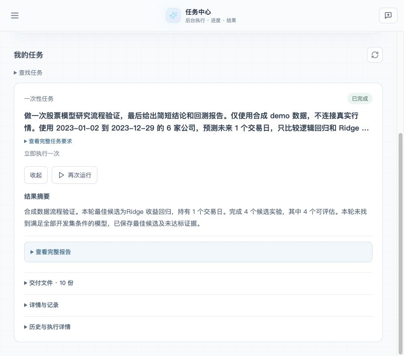

# 自然语言任务与简洁卡片验收 · 2026-10-03

任务交互收敛为：自然语言说明 → 预览卡片 → 确认执行或安排 → 进度 → 结果。任务中心和聊天使用同一个任务卡片组件，不增加任务状态或业务协议。此前的多阶段原型保留为历史设计，本次实际界面以本目录截图为准。

卡片默认显示执行类型、目的、安排、状态及当前可用操作。展开运行后，未完成时只显示当前阶段、一句进度及实际工作量；完成后先显示结果摘要。完整报告、交付文件、运行记录与历史均按需展开。周期安排暂停和停止本次运行是两个不同操作，周期表达显示为“每周一 09:00”等自然语言。

## 本地实测

使用现有隔离任务服务、SQLite 和显式测试身份，前端端口为 22154，任务服务端口为 22153。自然语言规划调用真实 LLM；本次模型流程使用合成 demo 数据，没有重新连接真实行情训练。基线提交为 `7c5ad90`，实测与回归时工作区包含本次未提交改动；本记录随本次实现提交，不声明这些运行是在干净提交上执行。

| 场景 | 实际结果 |
|---|---|
| 自然语言创建一次性任务 | 从真实前端输入要求、预览、确认，观察运行中进度并查看结果。 |
| 训练与回测 | 2023 年、6 家模拟公司、1 日目标、逻辑回归与 Ridge、4 个候选、2 个时间验证折，4/4 可评估，约 6.70 秒完成。最佳候选 Ridge 未满足全部开发集条件，卡片如实呈现否定结论。 |
| 预约一次 | 输入“明天上午9点”，预览并创建为北京时间 2026-10-04 09:00，运行状态为等待执行。 |
| 聊天卡片读取及停止 | 通过真实工具回执投影生成 Surface，在临时渲染页使用正式 BlockRenderer 与真实任务 API；卡片读到等待状态，点击“停止本次”后真实运行变为 cancelled，操作按钮消失。该临时页已移除。 |
| 周期任务 | “每周一上午9点”生成正确周期预览，下次为 2026-10-05 09:00；仅预览，没有创建周期任务。 |
| 搜索与移动端 | 无匹配时显示空结果提示；实际应用 375px 宽度下页面宽度与 scrollWidth 均为 375px，卡片与按钮正常换行。 |

一次性任务：`sch_6ae90e9444e94a6a9b013fd36a7ec0ad`，运行：`run_4e78634335644557a3ad7c27c2e3e43f`。开始 `2026-10-03T09:40:49.200195Z`，结束 `2026-10-03T09:40:55.897696Z`。

预约任务：`sch_2ce4ea122c054026b9074e89c58eb3fd`，运行：`run_43f1a57ae21242e18cec6c706398d0c9`，已于 `2026-10-03T09:45:18.146983Z` 取消。本轮没有留下新的待执行或周期测试任务。

更多实测截图：[运行中](running.jpg)、[周期预览](periodic-preview.jpg)、[手机预览](mobile-preview.jpg)、[聊天卡片等待](chat-pending.jpg)、[聊天卡片取消](chat-cancelled.jpg)。截图只含合成研究要求及测试任务状态；不保存凭据、数据库或模型文件。

## 回归与边界

- 前端完整测试：`npm test -- --reporter=dot`，29 个文件、179 项通过。
- 前端构建：`npm run build`，TypeScript 与 Vite 通过，仍有既有大 chunk 提示。
- 后端任务及会话专项：`.venv-automl/bin/python -m pytest tests/test_financial_qa_presentation.py tests/test_financial_qa_cc_scenario.py tests/test_user_task_tools.py tests/test_scheduled_tasks.py tests/test_user_task_runtime.py -q`，114 项通过，有既有 python_multipart 弃用提示。
- 聊天状态刷新测试覆盖运行终止后停止轮询、串行刷新、卸载取消、读取失败保留已知事实和任务/运行身份不匹配。
- 任务中心未进入最近 50 次记录的任务先显示“状态待查看”，展开后读取其历史，避免凭缺失数据推断状态；选中的更早运行会保留在历史选择中。

本轮没有在完整主聊天入口执行真实 LLM 到任务卡片的浏览器全链路；聊天部分的证据是回执/Surface 自动化测试与正式渲染组件连接真实任务 API 的交互测试。也未重新运行完整后端仓库测试，未验证生产登录、生产部署、并发容量、长稳和恢复，因此不作生产就绪结论。
