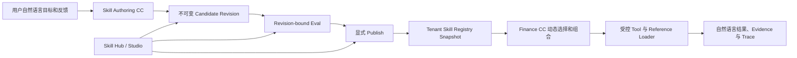

# Fin Agent Skill 体系：工作上下文、架构与核心目标

> 状态：当前工作基线与后续交接文档
>
> 更新日期：2026-08-19
>
> 对应基线提交：`a255a92`

## 1. 文档目的

Fin Agent 已将开发拆分为四个相对独立的方向：

1. 主框架：CC/Codex 串联、理解、问答、上下文和前后端交互；
2. Tool：自定义工具开发流程、工具能力和执行效率；
3. Skill：Skill 定义、创建、优化、测试、发布、管理及 Skill Studio；
4. 回测：回测体系和回测工具。

本文只承接第三项。它用于在切换任务或上下文后快速恢复 Skill 体系的共同认识，不重复记录完整调研过程，也不替代更详细的设计文档。

## 2. 核心目标

Skill 体系的产品目标是：

> 让普通用户只用自然语言描述一套专业方法，系统就能帮助其形成可审阅、可修改、可测试、可发布和可持续优化的 CC-native Skill；运行时由 Finance CC 按需选择和组合 Skill，并在真实 Tool、权限和证据边界内完成任务。

一个完整 Skill 可以包含：

- 作为语义主体的 `SKILL.md`；
- 零到少量按需读取的 `references/`；
- 系统解析出的 Tool 能力连接；
- 相关专业方法或并列 Skill 的发现提示；
- 由方法结构派生的工作程序图；
- 与具体 revision 绑定的测试、发布和运行证据。

用户不需要理解 Tool ID、MCP 名称、Skill 内部 ID、JSON Schema 或发布协议。

## 3. 总体原则

### 3.1 SOFT → HARD → SOFT

```text
用户目标、经验、案例和反馈（SOFT）
  → CC 理解并形成专业方法（SOFT）
  → 系统解析身份、revision、能力、权限和资源（HARD）
  → Finance CC 按当前问题动态执行（SOFT）
  → 自然语言结论、证据和场景化展示（SOFT）
```

系统只固化跨模块衔接所必需的事实，不把专业方法拆成大型 JSON，不为了展示增加状态枚举，也不要求模型重复输出系统已经保存的 owner、revision、hash 和发布状态。

### 3.2 新旧 Skill 完全隔离

- 新体系：`SKILL.md` 为主体，由 Finance CC 选择和执行，类型为 `business_method`。
- 旧体系：`skill.json + schema.json + SkillRunner`，仅保留历史兼容，类型为 `legacy_compiled`。
- 新 Studio、自然语言创建和未来发布都不得继续扩展 Legacy 执行器。

### 3.3 Finance CC 是唯一业务组合者

- Finance CC 可以在同一轮选择零个、一个或少量并列 Skill。
- Skill 不直接执行另一个 Skill，也不形成隐藏的父子调用链。
- 相关 Skill 只表示“可能有帮助的专业方法”，不表示运行依赖或权限授权。
- 若后续步骤必须精确消费前序结构化结果，应使用 Workflow、Tool Plan 或带 revision/evidence 的 Artifact 交接。

## 4. Skill、Tool、Reference 与 Workflow 的边界

| 能力 | 承载内容 | 执行责任 |
| --- | --- | --- |
| 普通问答 | 单一事实、概念解释、简单比较 | Finance CC 直接回答或调用少量 Tool |
| Skill | 可复用的专业判断方法、适用边界、证据要求和质量标准 | Finance CC 动态选择、跳过、重排和综合 |
| Reference | 较长框架、行业变体、模板、来源政策和专业资料 | 已加载 Skill 在必要时渐进读取 |
| Tool | 确定性查询、转换、计算或动作 | Runtime 按系统权限执行 |
| Workflow / Tool Plan | 固定顺序、严格依赖、机器结果交接 | 系统编排器执行 |
| Artifact | 可寻址、带 revision/as-of/evidence 的中间结果 | Agent 或 Workflow 跨阶段传递 |
| System Skill | Tool 需求、设计、Coding、测试等平台构建能力 | 系统操作主线使用 |

判断是否应该创建 Skill：

- 仅查询字段或执行公式：使用 Tool；
- 仅是一条短原则：写入现有 Skill；
- 长方法或行业变体：作为 Reference；
- 高频、边界清楚、可独立触发和评测的专业任务：晋级为 Skill；
- 有严格依赖和机器交接：使用 Workflow。

## 5. 三种资产视图

### 5.1 Authoring Candidate

用户和 CC 共同创建、修改的不可变候选 revision，包含：

- 完整 `SKILL.md`；
- 可选 Reference 资源；
- 自然语言能力意图；
- 可选工作程序纲要；
- 用户需求、反馈和变更摘要。

Candidate 不是 Active Skill。创建或修改 Candidate 不应获得运行权限，也不能影响线上会话。

### 5.2 Portable Bundle

用于审阅、导入导出和兼容 CC 的目录形式：

```text
skill-name/
├── SKILL.md
├── agents/openai.yaml       # 可选 UI 元数据
└── references/              # 按需存在
```

第一版用户 Skill 不允许携带任意 Python、Shell 或其他可执行脚本。确定性代码进入自定义 Tool 体系。

### 5.3 Published Runtime Snapshot

系统在显式发布时生成的不可变运行快照，保存或绑定：

- `skill_id / revision / content_hash`；
- 已解析 Tool 和相关能力引用；
- supplemental permission grants；
- Resource manifest、resource ID 和 hash；
- owner、visibility、active pointer 和审计；
- Registry revision 与会话固定的运行目录。

Runtime Snapshot 是执行和授权事实；Portable Bundle 是可移植表达，二者不能混为同一权威来源。

## 6. 两个平面



### 6.1 Authoring / Control Plane

负责自然语言创建、资源规划、能力发现、候选修订、测试、发布、回滚、归属、权限和审计。

### 6.2 Runtime Plane

负责会话固定 Snapshot、Skill 发现与加载、Reference 渐进读取、Tool 权限交集、working set、Evidence、Trace 和最终回答。

请求热路径不扫描 Skill 工作目录，不根据本机 `mtime` 判断版本，也不把 frontmatter 的 `allowed-tools` 当作真正系统授权。

## 7. 当前已实现的能力

### 7.1 CC-native Runtime

- `src/skills/finance-business/` 已有 11 个金融业务 Skill。
- `FinanceBusinessSkillCatalog` 在启动或显式 reload 时编译不可变、内容寻址、只读 Snapshot。
- Finance CC 的 Skill 子集、正文、Reference、revision 和 Tool grant 来自同一 turn snapshot。
- `read_finance_skill_reference` 要求父 Skill 已加载、路径精确、当前用户有权访问且 revision 一致。
- 新 `/api/skill-hub` 与 `/skills/studio` 展示 CC-native 方法；Legacy Studio 独立在 `/skills/legacy-studio`。

### 7.2 Candidate Authoring

- Studio 可以用自然语言创建私有 CC-native Candidate。
- 可以继续用自然语言反馈生成下一不可变 revision。
- Authoring 会读取当前已发布 Skill 和 Active Tool Registry，过滤未知能力。
- 系统生成稳定 ASCII `skill_id`、内容 hash、能力解析结果和 Mermaid 图。
- Candidate Store 使用 owner scope、不可变 revision 和 `base_revision_no` CAS。
- 新建 Candidate 保持 `current_revision_no = 0`、`published = false`，不会自动激活。

### 7.3 已验证范围

当前 focused regression：

```text
28 passed
```

覆盖 Candidate Authoring、Skill Hub 和 Finance Business Skill Catalog。它不代表真实 MySQL 写入、Candidate 运行、发布和激活已经端到端验证。

## 8. 当前尚未闭环的部分

现在是“两段可用能力尚未连通”：
```text
系统 Skill Runtime 已可用
          ╳ 尚未连通
用户 Skill Candidate Authoring 已可用
```

仍缺少：

- Chat 主线中的启发式 Skill 创建会话；
- Candidate 多文件 Reference 创建、编辑和保存；
- Candidate-bound 测试和 with/without Skill 对比；
- Publish Compiler 和原子 Active Pointer；
- 用户 Skill 进入授权 Registry Snapshot；
- 运行时 session pinning、回滚和历史追溯的完整闭环；
- workspace/public 分享和更完整的多租户策略；
- 跨实例发布事件、配额、限流和对象存储规模化能力；
- 真实数据库写入与全链路运行 smoke。

## 9. 已识别的核心问题

### 9.1 Authoring 仍暴露内部 ID

当前模型输出精确 `tool:<tool_name>` 和 `skill:<skill_id>`。目标应改为：模型表达稳定业务能力和相关方法语义，Compiler 解析真实 Tool/Skill ID、revision、availability 和 permission grant。

### 9.2 所有 Skill 被强制为 2–10 步单链

当前 schema 强制有序步骤，程序图也画成连续单链，容易把 Skill 固化成伪 Workflow。目标是让 `program_outline` 可选；原则型、检查表型 Skill 不必强行产生步骤。程序图只作解释性投影。

### 9.3 Related Skill 容易被误解为子 Skill 调用

目标语义应是 `related_method_candidates`：仅用于 Authoring 发现和 Runtime 检索提示，不自动加载、不自动扩权、不形成发布依赖。

### 9.4 Reference 数量不应成为模板

简单 Skill 可以没有 Reference，复杂 Skill 可以按需要拥有多份。验收重点是直接链接、读取条件、来源权限、重复和孤儿检测，以及真实专业增益、token、延迟和读取率，而不是固定数量。

### 9.5 Search 能力名称与覆盖范围可能不一致

`general_search` 不应直接被解释为开放 Web Search。能力目录需同时表达 capability、provider、coverage 和 availability；外部内容永远不能改变系统权限。

### 9.6 文档状态存在漂移

部分任务文档仍把已经实现的 Reference Loader 和 Candidate Authoring 标记为未实现。后续开发必须以代码、测试和真实运行证据为准，并同步维护“已实现 / 部分实现 / 未实现”矩阵。

## 10. Skill Authoring Contract v1.1 目标草案

模型只贡献本轮 SOFT 内容：

```text
skill_markdown
capability_intents[]          # 业务能力语义，不是 Tool ID
related_method_intents[]      # 相关专业方法语义，不是运行依赖
program_outline[]             # 可选的解释性程序纲要
resource_plan[]               # 可选 Reference 计划
change_summary
```

系统持有 HARD 事实：

```text
skill_id / owner / visibility
revision / base_revision / active_revision
resolved_tool_refs / resolved_skill_refs
effective_grants / unavailable_reasons
resource_id / path / hash / size / source / auth
content_hash / registry_revision
eval evidence / publish audit / rollback history
```

只有 `skill_id`、revision、权限、资源身份和真正需要 Trace 寻址的锚点进入机器协议。专业步骤标题、说明、读取条件和最终回答要求继续保留为自然语言。

## 11. Reference 目标规则

- Creator 先形成资源计划，再生成 Candidate。
- 简单方法默认只有 `SKILL.md`。
- 只有长方法、行业变体、模板、证据口径或反复复用资料才拆 Reference。
- 每个 Reference 必须由 `SKILL.md` 直接链接并说明何时读取。
- 禁止深层引用链和孤儿资源。
- Runtime 只允许已加载 Skill 读取当前 revision allowlist 内的资源。
- 系统硬校验 containment、身份、大小、hash、权限和脚本禁用。
- 专业质量、内容重复和是否值得拆分优先作为 warning 或 Eval，不用复杂字段阻断自然表达。

## 12. Eval 与发布原则

### 12.1 硬校验

只阻止会确定性破坏执行、安全、身份或数据的错误，例如：

- `SKILL.md` 无法解析或身份变化；
- owner、base revision 或权限不合法；
- Resource 越界、hash 不一致或携带禁用脚本；
- 未注册能力申请、越权 Tool 或 Snapshot 编译失败。

### 12.2 质量评测

至少覆盖：

- should trigger / should not trigger / 歧义；
- Candidate vs Active；
- with Skill vs without Skill；
- Tool 权限、必要证据和失败降级；
- Reference 是否被真正按需读取；
- 最终回答是否为空、事实是否正确、专业增益是否明显；
- latency、token、Tool 调用数和 Reference 读取率。

A/B 必须固定同一 provider、model、Tool 环境和数据时点，不能把模型差异误判为 Skill 增益。

### 12.3 发布

- Candidate 永远不自动激活。
- Publish 必须携带 `expected_active_revision` 并原子切换 Active Pointer。
- 新会话使用新 Snapshot；已有会话默认继续固定原 revision，除非用户明确选择更新。
- 回滚是重新指向已验证历史 revision，不修改历史内容。
- 个人 Skill 可带质量 warning 发布；系统和共享 Skill 使用更严格 Eval Gate，但运行协议相同。

## 13. 后续实施顺序

### P0：冻结 Contract 和修正文档状态

- 确认 Authoring Contract v1.1；
- 将内部 Tool/Skill ID 从模型语义输出降为 Compiler 结果；
- 将程序纲要改为可选；
- 更新已实现/未实现矩阵。

### P1：交互式 Authoring

- 接入 Chat `system_operation`；
- 先判断用户真正需要 Skill、Tool、Workflow 还是 Backtest；
- 只在会改变资产类型或核心方法时追问；
- Chat 与 Studio 操作同一 Candidate revision 流。

### P2：Candidate References

- 实现 `resource_plan → reference generation → immutable storage`；
- Studio 展示原始 `SKILL.md`、Reference、能力解析和派生程序图；
- 复用现有受控 Reference Loader 的权限与 revision 规则。

### P3：Candidate-bound Eval

- 固定 revision 执行触发、权限、结果和对比评测；
- 保存真实 final answer、Trace、Evidence、成本和延迟；
- 支持失败 Case 回灌下一 revision。

### P4：Publish 与 Runtime 闭环

- owner 校验、CAS Active Pointer、不可变包编译；
- 用户 Skill 进入授权 Registry Snapshot；
- session pinning、发布事件、回滚和历史追溯。

### P5：分享与规模化

- personal/workspace/public；
- 跨实例一致性、限流、配额、对象存储和孤立资源回收；
- 继续优化 Studio 交互，但不扩张核心业务协议。

## 14. 下一任务的建议起点

优先完成“Skill Authoring Contract v1.1 + Candidate References 的最小纵切面”，暂不先做复杂 Studio UI。

第一步应重新核对并统一以下文件：

- `docs/skill_system_v2_architecture.md`
- `docs/skill_authoring_candidate_v1.md`
- `docs/development_tasks/skill_system.md`
- `src/skills/skill-system/skills/skill-authoring/SKILL.md`
- `src/skills/skill-system/skills/skill-authoring/schema.json`
- `src/services/skill_authoring_service.py`
- `src/services/skill_candidate_store_service.py`
- `src/scenarios/financial_qa/business_skills.py`
- `src/scenarios/financial_qa/tools.py`
- `src/web/templates/skill_studio_v2.html`

实施时继续坚持：语义交给 SOFT，衔接交给 HARD；Skill 不变成 Mini-Agent，程序图不变成固定 DAG，模型建议不等于系统授权，Candidate 不等于已发布或运行成功。
